# [UHM](https://github.com/maravento) — UniFi Hotspot Manager

[](https://github.com/maravento/uhm)
[](https://github.com/maravento/uhm)
[](https://github.com/maravento/uhm/stargazers)
[](https://twitter.com/maraventostudio)

<!-- markdownlint-disable MD033 -->

<table>
  <tr>
    <td style="width: 50%; vertical-align: top;">
      <p>Many small and medium-sized businesses, as well as other environments, run networks based on Ubiquiti UniFi technology, including access points and switches. These installations may require DHCP services, traffic control, access policies, filtering and other network and security functions that are normally implemented with dedicated hardware. The cost of that hardware can make this option unviable in certain environments.</p>
      <p>One alternative is to use <strong>UniFi Network self-hosted</strong> on Linux. However, when it is used in <strong>Third-Party Gateway</strong> mode, additional services are still needed to handle certain network functions.</p>
      <p><strong>UHM</strong> provides part of this infrastructure, using <strong>UniFi Network self-hosted</strong> on Linux as its base and operating in <strong>Third-Party Gateway</strong> mode.</p>
      <p>Initial authentication remains the responsibility of the <strong>UniFi</strong> captive portal through vouchers. From that authentication onward, <strong>UHM</strong> provides functions such as DHCP, MAC and IP validation, ACLs and firewall rules through <code>iptables</code>/<code>ipset</code>, along with other functions related to access control and network management.</p>
      <p>Since it is based on Linux, this environment can also incorporate other services and tools, such as Squid, WPAD, Unbound, Suricata, Apache2 or Samba, according to the needs of each installation.</p>
      <p>If <a href="https://github.com/maravento/proxymon">Proxymon</a> is integrated, it can add monitoring and control of traffic and data usage, including mechanisms to set consumption limits on Internet connections with data plans.</p>
    </td>
    <td style="width: 50%; vertical-align: top;">
      <p>Muchas pequeñas y medianas empresas, así como otros entornos, utilizan redes basadas en tecnología Ubiquiti UniFi, incluidos puntos de acceso y switches. Estas instalaciones pueden requerir servicios de DHCP, control de tráfico, políticas de acceso, filtrado y otras funciones de red y seguridad que normalmente se implementan mediante hardware dedicado. El costo de ese hardware puede hacer que esta opción no resulte viable en determinados entornos.</p>
      <p>Una alternativa es utilizar <strong>UniFi Network self-hosted</strong> sobre Linux. Sin embargo, cuando se utiliza en modo <strong>Third-Party Gateway</strong>, todavía es necesario proporcionar servicios adicionales para gestionar determinadas funciones de la red.</p>
      <p><strong>UHM</strong> proporciona parte de esta infraestructura utilizando <strong>UniFi Network self-hosted</strong> sobre Linux como base y operando en modo <strong>Third-Party Gateway</strong>.</p>
      <p>La autenticación inicial continúa a cargo del portal cautivo de <strong>UniFi</strong> mediante vouchers. A partir de esa autenticación, <strong>UHM</strong> proporciona funciones como DHCP, validación de MAC e IP, ACL y reglas de firewall mediante <code>iptables</code>/<code>ipset</code>, además de otras funciones relacionadas con el control de acceso y la gestión de la red.</p>
      <p>Al estar basado en Linux, este entorno también puede incorporar otros servicios y herramientas, como Squid, WPAD, Unbound, Suricata, Apache2 o Samba, según las necesidades de cada instalación.</p>
      <p>Si se integra <a href="https://github.com/maravento/proxymon">Proxymon</a>, pueden añadirse funciones de monitorización y control del tráfico y del consumo de datos, incluidos mecanismos para establecer límites de consumo en conexiones a Internet con planes de datos.</p>
    </td>
  </tr>
</table>

### Architecture

📐 [Runtime Architecture Diagram](https://htmlpreview.github.io/?https://raw.githubusercontent.com/maravento/uhm/master/docs/uhm-architecture.html) — visual walkthrough of the UniFi/DHCP/firewall reload pipeline.

## UNIFI HARDWARE VS UHM

---

**UniFi gateway alone:**

| Stage | Description | Descripción |
|---|---|---|
| **Joins the SSID** | DHCP lease from the gateway | Lease DHCP del gateway |
| **Before redeeming a voucher** | Held at the captive portal by the AP. Tracked only as an unauthorized guest session | Retenido en el portal cautivo por el AP. Solo se rastrea como sesión de invitado no autorizada |
| **Redeems a valid voucher** | Marked authorized; keeps whatever IP it already had | Queda autorizado; conserva la IP que ya tenía |
| **While authorized** | Full access until the voucher expires | Acceso completo hasta que expire el voucher |
| **Voucher expires** | Back to the captive portal; must redeem another one | Vuelve al portal cautivo; debe canjear otro |
| **Never redeems a voucher** | Stays at the portal indefinitely, retrying forever and holding a DHCP lease the whole time | Se queda en el portal indefinidamente, reintentando por siempre y ocupando un lease DHCP todo ese tiempo |
| **Admin unauthorizes / deletes the voucher** | Client returns to the portal | El cliente vuelve al portal |
| **Corporate / infrastructure devices** | Need a separate SSID, VLAN or manual per-client authorization | Requieren un SSID aparte, una VLAN o autorización manual por cliente |
| **Durable record of voucher activity** | `stat/voucher` drops a voucher once it expires or its quota runs out | `stat/voucher` descarta un voucher cuando expira o se agota su cuota |
| **Hardware required** | UDM, UDM-Pro, Cloud Key or equivalent gateway | UDM, UDM-Pro, Cloud Key o gateway equivalente |

**Unifi Hotspot Manager - UHM:**

| Stage | Description | Descripción |
|---|---|---|
| **Joins the SSID** | DHCP lease from `pydhcpd`, taken from the block pool range (`SERV_INI_RANGE_BLOCK`-`SERV_END_RANGE_BLOCK`) | Lease DHCP de `pydhcpd`, tomado del rango del pool de bloqueo (`SERV_INI_RANGE_BLOCK`-`SERV_END_RANGE_BLOCK`) |
| **Before redeeming a voucher** | Written into `uhm-grace.txt` with a first-seen timestamp. The `macgrace` ipset limits it to the portal ports and DNS to the configured resolvers only | Se escribe en `uhm-grace.txt` con timestamp de primer contacto. El ipset `macgrace` lo limita a los puertos del portal y al DNS de los resolvers configurados |
| **Redeems a valid voucher** | Promoted to `uhm-auth.txt`, assigned a **fixed IP** in the hotspot range, lease released and client kicked so it reconnects on the new IP | Promovido a `uhm-auth.txt`, se le asigna una **IP fija** del rango hotspot, se libera su lease y se lo desasocia para que reconecte con la IP nueva |
| **While authorized** | Same, plus firewall enforcement via the `machotspot` ipset and optional Squid/proxy routing | Igual, más la aplicación de firewall vía el ipset `machotspot` y el enrutamiento opcional por Squid/proxy |
| **Voucher expires** | Removed from `uhm-auth.txt`, lease released, re-enters `uhm-grace.txt` with a **fresh** grace timer — same as a brand-new client | Se elimina de `uhm-auth.txt`, se libera su lease y vuelve a entrar a `uhm-grace.txt` con un temporizador de gracia **nuevo** — igual que un cliente recién llegado |
| **Never redeems a voucher** | After `BLOCKDHCP_GRACE_SECONDS` (default 24h) it moves permanently to `blockdhcp.txt` and `pydhcpd` **stops issuing it any lease at all** | Tras `BLOCKDHCP_GRACE_SECONDS` (default 24h) pasa permanentemente a `blockdhcp.txt` y `pydhcpd` **deja de entregarle lease alguno** |
| **Admin unauthorizes / deletes the voucher** | Removed from `uhm-auth.txt` and sent back through the grace cycle. The stale UniFi session it leaves behind cannot re-authorize it — only a new voucher can | Se elimina de `uhm-auth.txt` y vuelve al ciclo de gracia. La sesión residual que UniFi deja atrás no puede reautorizarlo: solo un voucher nuevo puede |
| **Corporate / infrastructure devices** | Listed in `mac-*.txt`: fixed address and no timer at the DHCP level, plus automatic `authorize-guest` in UniFi every cycle so the AP never holds them at the portal on a Guest/Hotspot LAN | Se listan en `mac-*.txt`: dirección fija y sin temporizador a nivel DHCP, más `authorize-guest` automático en UniFi cada ciclo para que el AP nunca los retenga en el portal en una WLAN Guest/Hotspot |
| **Durable record of voucher activity** | `/var/log/uhm.log` keeps the full history, and `uhmunifi.sh` cross-references it against the live controller | `/var/log/uhm.log` conserva el historial completo, y `uhmunifi.sh` lo cruza contra el controlador en vivo |
| **Hardware required** | One UniFi AP plus a Linux host running the self-hosted controller | Un AP UniFi más un host Linux corriendo el controlador self-hosted |

## REQUIREMENTS

---

**⚠️ WARNING:** Tested on Ubuntu 24.04/26.04 LTS. Use on other versions or distributions is at your own risk.

### Hardware

| Resource | Minimum |
|----------|---------|
| CPU | 2 cores |
| RAM | 4 GB |
| Disk | 8 GB |

> Approximate values, dominated by UniFi Network self-hosted -- can vary depending on version, number of managed devices, and environment. `UHM` itself (`uhmd.sh`/`uhmleases.sh`/`pydhcpd.py`) adds negligible overhead.
>
> Valores aproximados, dominados por UniFi Network self-hosted -- pueden variar según la versión, la cantidad de dispositivos gestionados y el entorno. `UHM` en sí (`uhmd.sh`/`uhmleases.sh`/`pydhcpd.py`) agrega una sobrecarga mínima.

### Software

| Component | Tested Version |
|-----------|-----------------|
| UniFi OS Server | 5.1.15 |
| UniFi Network (self-hosted) | 10.4.57 |
| `iptables` | 1.8.10 |
| `ipset` | 7.19 |
| `pydhcpd` | latest |

> `UHM` only verifies UniFi Network self-hosted / UniFi OS Server — it does not install either. If neither is installed yet, use [`unifisetup.sh`](https://raw.githubusercontent.com/maravento/vault/refs/heads/master/scripts/bash/unifisetup.sh) to install it first, then run `uhmsetup.sh`.
>
> `UHM` sólo verifica UniFi Network self-hosted / UniFi OS Server — no instala ninguno de los dos. Si aún no está instalado, use [`unifisetup.sh`](https://raw.githubusercontent.com/maravento/vault/refs/heads/master/scripts/bash/unifisetup.sh) para instalarlo primero, y luego ejecute `uhmsetup.sh`.

### Instance

<table>
  <tr>
    <td style="width: 50%; vertical-align: top;">
      <code>UHM</code> is designed to operate on a single guest network. Each installation supports exactly:
      <ul>
        <li>1 Network — for example, <code>Default</code>.</li>
        <li>1 ESSID — associated with that Network and with Hotspot mandatory.</li>
        <li>1 private IPv4 range — used by <code>pydhcp</code> and by the firewall and network control functions of <code>UHM</code>.</li>
      </ul>
      This is an architectural limitation, not a configuration option. Both <code>pydhcp</code>, which acts as the DHCP backend, and the network management of <code>UHM</code> are designed to work with a single Network and a single IPv4 subnet. <br>
      <br>
      The UniFi controller may contain other Networks, VLANs or ESSIDs. These can work normally, but they fall outside the scope of UHM and must be managed by independent infrastructure, including their DHCP, routing and firewall services. <br>
      <br>
      Therefore, <code>UHM</code> does not provide multi-network management. The same UniFi controller can contain the Network managed by <code>UHM</code> and other Networks managed by third parties. The distinction is that only one Network is part of the UHM deployment.
    </td>
    <td style="width: 50%; vertical-align: top;">
      <code>UHM</code> está diseñado para operar sobre una única red de invitados. Cada instalación soporta exactamente:
      <ul>
        <li>1 Network — por ejemplo, <code>Default</code>.</li>
        <li>1 ESSID — asociado a esa Network y con Hotspot obligatorio.</li>
        <li>1 rango IPv4 privado — utilizado por <code>pydhcp</code> y por las funciones de firewall y control de red de <code>UHM</code>.</li>
      </ul>
      Esta es una limitación arquitectónica, no una opción de configuración. Tanto <code>pydhcp</code>, que actúa como backend DHCP, como la gestión de red de <code>UHM</code> están diseñados para trabajar con una única Network y una única subred IPv4. <br>
      <br>
      El controlador UniFi puede contener otras Networks, VLANs o ESSIDs. Estas pueden funcionar normalmente, pero quedan fuera del alcance de UHM y deben ser gestionadas por infraestructura independiente, incluidos sus servicios de DHCP, routing y firewall. <br>
      <br>
      Por tanto, <code>UHM</code> no proporciona gestión multi-red. Un mismo controlador UniFi puede contener la Network gestionada por <code>UHM</code> y otras Networks gestionadas por terceros. La distinción es que solo una Network forma parte del despliegue de UHM.
    </td>
  </tr>
</table>

```text
                     UniFi Controller
                             |
               +-------------+--------------+
               |                            |
       Network: Default              Other Networks
      Third-Party Gateway           VLANs / Networks
               |                            |
            Hotspot                         |
               |                            |
          Guest ESSID                       |
               |                            |
               v                            v
     +-------------------+        +-------------------+
     |        UHM        |        |    Third-party    |
     |                   |        |  infrastructure   |
     |     1 Network     |        |                   |
     |      1 ESSID      |        |  DHCP / Routing   |
     |     1 Hotspot     |        |  Firewall / etc.  |
     |   1 IPv4 range    |        |                   |
     +-------------------+        +-------------------+
               |
               v
     ├── DHCP
     ├── Firewall
     ├── Guest management
     └── Optional:
         ├── Squid Proxy
         ├── Apache2
         ├── Suricata
         └── Unbound...
```

### Mandatory

| Component | Used by | Purpose | Propósito |
|-----------|---------|---------|-----------|
| **UniFi Network (self-hosted)** | `uhmd`, `uhmunifi.sh` | Captive portal SSID, vouchers, and the API Site must be **Third-Party Gateway**. Local admin account. See Instance above for the single-Network limitation | SSID de portal cautivo, vouchers, y el Site de la API debe ser **Third-Party Gateway**. Cuenta de admin local. Ver Instance arriba para la limitación de Network única |
| **pydhcp** | `uhmd` (verified at startup) | DHCP backend. Exactly one must be active | Backend DHCP. Exactamente uno debe estar activo |
| **iptables** + **ipset** | system administrator | Firewall enforcement of ACL files (must be configured manually) | Aplicación de firewall de los archivos ACL (debe configurarse manualmente) |
| **bash**, **curl**, **jq** | `uhmd`, `uhmunifi.sh`, `uhmleases.sh` | Script runtime, UniFi API, JSON parsing | Runtime de scripts, API de UniFi, parseo de JSON |
| **openssl** | `uhmsetup.sh` (install time only) | Computes `UNIFI_CERT_PIN` from the controller's TLS certificate | Calcula `UNIFI_CERT_PIN` a partir del certificado TLS del controlador |
| **python3** | `uhmleases.sh` (runtime), `uhmsetup.sh` (install time) | Range arithmetic: checks that `SERVER_IP` does not fall inside the block pool or the hotspot range, and that the hotspot range is inside the network and does not overlap pydhcp's pool | Aritmética de rangos: verifica que `SERVER_IP` no caiga dentro del pool de bloqueo ni del rango del hotspot, y que el rango del hotspot esté dentro de la red y no se solape con el pool de pydhcp |
| **mawk** (`awk`), **coreutils**, **grep** | all bash scripts in the project | Text/field parsing (MAC/IP/ACL lines, DHCP config, logs) | Parseo de texto/campos (líneas MAC/IP/ACL, config DHCP, logs) |
| **sed** | `uhmd.sh`, `uhmleases.sh`, `uhmwatch.sh`, `uhmunifi.sh` | In-place ACL/config file edits | Edición in-place de archivos ACL/config |
| **util-linux** (`flock`) | all bash scripts in the project | Per-script instance locking, prevents overlapping runs | Bloqueo de instancia por script, evita ejecuciones superpuestas |
| **iproute2** (`ip`) | `uhmsetup.sh` (install time only) | Detects network interfaces during the setup wizard | Detecta interfaces de red durante el wizard de instalación |
| **libc-bin** (`getent`) | `uhmleases.sh` | Checks that the `pydhcpd` user and group exist | Verifica que el usuario y grupo `pydhcpd` existan |
| **findutils** (`find`) | `uhmsetup.sh` | Clears the install directory on uninstall, preserving `bak/` | Vacía el directorio de instalación al desinstalar, conservando `bak/` |
| **procps** (`sysctl`) | `uhmiptables.sh` | Enables IPv4 forwarding | Habilita el forwarding IPv4 |
| **systemd** (`systemctl`) | `uhmd`, `uhmreload.sh`, `uhmwatch.sh`, `uhmleases.sh`, `uhmalert.sh`, `uhmtool.sh` | Manages/checks the `uhmd`/`pydhcpd`/UniFi services | Gestiona/verifica los servicios `uhmd`/`pydhcpd`/UniFi |
| **cron** | `uhmwatch.sh` (mandatory, installed automatically) | Runs the services watchdog every minute | Corre el vigilante de servicios cada minuto |
| **logrotate** | `uhmsetup.sh` (writes `/etc/logrotate.d/uhm`) | Rotates `/var/log/uhm.log` daily; without it the shared log grows without limit | Rota `/var/log/uhm.log` a diario; sin él el log compartido crece sin límite |

### Optional

| Component | When it's needed | Cuándo se necesita |
|-----------|-------------------|---------------------|
| **squid**, **apache2**, DHCP option 252 (WPAD) | Only if your network uses [proxymon](https://github.com/maravento/proxymon) (Squid-based filtering) — `apache2` hosts the WPAD/PAC file, and WPAD lets clients auto-discover the proxy. See that project for installation and configuration details. | Solo si su red usa [proxymon](https://github.com/maravento/proxymon) (filtrado basado en Squid) — `apache2` sirve el archivo WPAD/PAC, y WPAD permite que los clientes descubran el proxy automáticamente. Consulte ese proyecto para detalles de instalación y configuración. |
| **apache2**, **libapache2-mod-php** | Only if you install the web interface. Both are verified when the panel is accepted during install, and the panel is skipped with a message if either is missing. | Solo si instala la interfaz web. Ambos se verifican cuando se acepta el panel durante la instalación, y el panel se salta con un mensaje si falta alguno. |

```bash
# Required packages
sudo apt update
sudo apt install -y bash curl jq iptables ipset cron python3 openssl mawk coreutils util-linux iproute2 grep sed systemd libc-bin findutils procps

# DHCP backend — install pydhcp:
#   • pydhcp — https://github.com/maravento/pydhcp

# Optional
sudo apt install -y squid apache2 libapache2-mod-php
```

> Without UniFi reachable or without `pydhcpd` running (beyond their respective startup grace windows), `UHM` refuses to start. Without a working `uhmiptables.sh`, the daemon still starts and keeps classifying clients (grace/authorized/blocked) normally, but firewall enforcement is skipped with a log warning until it's configured. These are hard dependencies for full functionality.
>
> Sin UniFi alcanzable o sin `pydhcpd` corriendo (más allá de sus respectivas ventanas de gracia de arranque), `UHM` se niega a arrancar. Sin un `uhmiptables.sh` funcional, el daemon igual arranca y sigue clasificando clientes (gracia/autorizado/bloqueado) normalmente, pero se salta la aplicación del firewall con una advertencia en el log hasta que se configure. Son dependencias duras para la funcionalidad completa.

## SCOPE

---

<table>
  <tr>
    <td style="width: 50%; vertical-align: top;">
      <b>What UHM does</b>
      <ul>
        <li>Queries the UniFi controller API through a local account.</li>
        <li>Reads <code>UNIFI_TYPE</code> from <code>uhm.env</code>. During the installation, <code>uhmsetup.sh</code> auto-detects <code>unifi-os</code> or <code>classic</code> on ports <code>8443</code> and <code>11443</code> of this same host. If neither answers, the installation aborts. UHM requires the controller to be on this host and supports a single controller, so no URL is asked for by hand. <br>
          <code>uhmd.sh</code> supports both types:
          <ul>
            <li><code>unifi-os</code> — UDM, UDM-Pro, UDR and Cloud Key Gen2+: <code>/api/auth/login</code>, <code>TOKEN</code> cookie and CSRF taken from the JWT payload.</li>
            <li><code>classic</code> — self-hosted UniFi Network Application: <code>/api/login</code>, <code>unifises</code> cookie and CSRF taken from the response header.</li>
          </ul>
        </li>
        <li>Classifies the clients of the guest SSID into three states:
          <ul>
            <li>grace — timer running and no voucher;</li>
            <li>authorized — active voucher;</li>
            <li>blocked — grace period expired and no voucher.</li>
          </ul>
        </li>
        <li>Checks that <code>pydhcpd</code> is active at startup. If it is not available yet, it retries silently for <code>STARTUP_GRACE_SECONDS</code> before aborting. This is the same grace window used for the UniFi login.</li>
        <li>Queues the removals from <code>pydhcpd.leases</code> that correspond to managed MACs. <code>uhmleases.sh</code> consumes that queue during its safe stop → modify → start cycle of the DHCP service.</li>
        <li>Runs <code>UHM_RELOAD</code>, defined by the user, when the ACLs have actually changed, determined through an MD5 comparison, or when the periodic safety-net reload is due.</li>
        <li>Runs as a <code>systemd</code> service through <code>uhmd.service</code>, installed by <code>uhmsetup.sh</code>. The daemon performs its own safety-net reload every <code>RELOAD_SAFETY_INTERVAL_SECONDS</code> —one hour by default— so that the promotion from grace to blocked continues even on idle networks, with no external cron.</li>
        <li>Handles the MACs listed in <code>mac-*.txt</code> independently from the normal guest flow. The daemon never promotes them into <code>uhm-auth.txt</code> nor treats them as voucher sessions. It checks those lists directly on disk at the entry points of the guest flow, preventing a stale session or an authorization made outside the daemon from turning a managed MAC into a normal hotspot session. <br>
          <code>uhmleases.sh</code> handles only the fixed address and the DHCP bypass of those MACs during each reload. On a WLAN configured as Guest/Hotspot, that alone is not enough to skip the UniFi captive portal: the AP keeps the client at the portal according to its <code>authorized</code> state in <code>stat/sta</code>, regardless of the DHCP or firewall state. <br>
          For that reason, the daemon also uses UniFi's <code>authorize-guest</code> for any active managed MAC that shows up as unauthorized. That authorization is checked and renewed on every cycle, with a duration derived from <code>AUTHORIZED_LEASE_TIME / 60</code>, 30 days by default. This is the only operation through which UHM authorizes a managed MAC in UniFi, and it modifies neither <code>uhm-auth.txt</code> nor any local ACL.</li>
        <li>Uses the <code>logrotate</code> configuration in <code>/etc/logrotate.d/uhm</code>, created by <code>uhmsetup.sh</code> through <code>install_logrotate()</code>: daily rotation, 7 copies and compression. All the output is centralized in <code>/var/log/uhm.log</code>.</li>
        <li>Reads its configuration from <code>/etc/uhm/uhm.env</code>, generated by <code>uhmsetup.sh</code> with owner <code>root:root</code> and mode <code>600</code>. Since it holds the UniFi password, every component verifies those permissions before reading it. If it finds values other than <code>root:root</code> or <code>600</code>, it restores them to the state expected by <code>uhmsetup.sh</code> and logs a <code>WARNING</code>. The same mechanism applies to the ACL lists (<code>root:root</code>, <code>600</code>), to the scripts (<code>755</code>, and <code>750</code> for <code>uhmiptables.sh</code>) and to <code>/var/log/uhm.log</code> (<code>root:adm</code>, <code>640</code>).</li>
        <li>Validates the integrity of the installation before each run through <code>verify_installation()</code>.</li>
        <li>Obtains the client state exclusively through the UniFi API: <code>stat/sta</code>, <code>stat/guest</code> and <code>stat/voucher</code>. It does not use the UniFi web interface, which may show delays or different information without affecting the real state provided by the API.</li>
        <li>Detects new clients by reading <code>pydhcpd.leases</code> directly on every cycle, not through <code>stat/sta</code>. Normally, a new client is detected within one <code>POLL_INTERVAL</code> cycle.</li>
        <li>Requires <code>uhmreload.sh</code> and <code>uhmleases.sh</code>, both located in <code>core/</code>, to reconcile the ACLs and the leases. Without those components, UHM cannot work properly.</li>
        <li>Works with IPv4 only.</li>
        <li>Uses the UniFi controller installed on this same host. <code>discover_unifi_controller()</code> probes <code>https://CFG_SERVER_IP:8443</code> and <code>https://CFG_SERVER_IP:11443</code>, using the host's own LAN IP.</li>
      </ul>
      <b>Out of scope (not implemented)</b>
      <ul>
        <li>It does not support other DHCP backends. The only supported backend is <code>pydhcpd</code>; it does not support <code>dnsmasq</code>, <code>isc-dhcp-server</code> or other DHCP servers.</li>
        <li>It does not modify <code>iptables</code> or <code>ipset</code> directly. Those operations are delegated to <code>UHM_RELOAD</code>.</li>
        <li>It does not support IPv6.</li>
        <li>It does not support several guest ESSIDs at the same time. UHM supports exactly one guest ESSID bound to the captive portal. During the installation, <code>uhmsetup.sh</code> obtains the available SSIDs from the controller and, if it finds more than one, forces exactly one to be selected.</li>
        <li>It does not support a UniFi controller on a remote host. <code>discover_unifi_controller()</code> probes only the host itself and does not look for controllers at other addresses. It does not support more than one self-hosted UniFi installation on the same host either: UHM uses a single <code>UNIFI_CONTROLLER_URL</code> / <code>UNIFI_TYPE</code> pair in <code>uhm.env</code>. If <code>uhmsetup.sh</code> fails to detect the controller, the installation aborts and no manual URL is requested.</li>
        <li>It does not integrate with UniFi Teleport. Teleport is a feature of the UniFi gateway consoles, such as the UDM, and falls outside the scope of UHM, which operates against a self-hosted UniFi Network Application.</li>
      </ul>
    </td>
    <td style="width: 50%; vertical-align: top;">
      <b>Lo que UHM hace</b>
      <ul>
        <li>Consulta la API del controlador UniFi mediante una cuenta local.</li>
        <li>Lee <code>UNIFI_TYPE</code> desde <code>uhm.env</code>. Durante la instalación, <code>uhmsetup.sh</code> autodetecta <code>unifi-os</code> o <code>classic</code> en los puertos <code>8443</code> y <code>11443</code> de este mismo host. Si ninguno responde, la instalación se aborta. UHM requiere que el controlador esté en este host y admite un solo controlador, por lo que no se solicita una URL manualmente. <br>
          <code>uhmd.sh</code> admite ambos tipos:
          <ul>
            <li><code>unifi-os</code> — UDM, UDM-Pro, UDR y Cloud Key Gen2+: <code>/api/auth/login</code>, cookie <code>TOKEN</code> y CSRF obtenido del payload del JWT.</li>
            <li><code>classic</code> — UniFi Network Application autohospedado: <code>/api/login</code>, cookie <code>unifises</code> y CSRF obtenido del encabezado de la respuesta.</li>
          </ul>
        </li>
        <li>Clasifica los clientes del SSID de invitados en tres estados:
          <ul>
            <li>gracia — contador activo y sin voucher;</li>
            <li>autorizados — voucher activo;</li>
            <li>bloqueados — periodo de gracia expirado y sin voucher.</li>
          </ul>
        </li>
        <li>Verifica que <code>pydhcpd</code> esté activo al arrancar. Si todavía no está disponible, reintenta silenciosamente durante <code>STARTUP_GRACE_SECONDS</code> antes de abortar. Esta es la misma ventana de gracia utilizada para el inicio de sesión en UniFi.</li>
        <li>Encola las remociones de <code>pydhcpd.leases</code> correspondientes a las MAC gestionadas. <code>uhmleases.sh</code> consume esta cola durante su ciclo seguro de detener → modificar → arrancar el servicio DHCP.</li>
        <li>Ejecuta <code>UHM_RELOAD</code>, definido por el usuario, cuando las ACL realmente han cambiado, determinado mediante una comparación MD5, o cuando corresponde el reload periódico de seguridad.</li>
        <li>Funciona como servicio <code>systemd</code> mediante <code>uhmd.service</code>, instalado por <code>uhmsetup.sh</code>. El daemon realiza su propio reload de seguridad cada <code>RELOAD_SAFETY_INTERVAL_SECONDS</code> —una hora por defecto— para que la promoción de gracia a bloqueo continúe incluso en redes sin actividad, sin necesidad de un cron externo.</li>
        <li>Gestiona las MAC incluidas en <code>mac-*.txt</code> de forma independiente del flujo normal de invitados. El daemon nunca las promueve a <code>uhm-auth.txt</code> ni las trata como sesiones de voucher. Comprueba estas listas directamente en disco en los puntos de entrada del flujo de invitados, evitando que una sesión residual o una autorización realizada fuera del daemon convierta una MAC gestionada en una sesión normal del hotspot. <br>
          <code>uhmleases.sh</code> gestiona exclusivamente la dirección fija y el bypass de DHCP de estas MAC durante cada reload. En una WLAN configurada como Guest/Hotspot, esto no basta por sí solo para evitar el portal cautivo de UniFi: el AP mantiene al cliente en el portal según su estado <code>authorized</code> en <code>stat/sta</code>, independientemente del estado de DHCP o del firewall. <br>
          Por eso, el daemon también utiliza <code>authorize-guest</code> de UniFi para cualquier MAC gestionada activa que aparezca como no autorizada. Esta autorización se comprueba y renueva en cada ciclo, con una duración derivada de <code>AUTHORIZED_LEASE_TIME / 60</code>, 30 días por defecto. Esta es la única operación mediante la cual UHM autoriza una MAC gestionada en UniFi y no modifica <code>uhm-auth.txt</code> ni ninguna ACL local.</li>
        <li>Utiliza la configuración de <code>logrotate</code> en <code>/etc/logrotate.d/uhm</code>, creada por <code>uhmsetup.sh</code> mediante <code>install_logrotate()</code>: rotación diaria, 7 copias y compresión. Toda la salida se centraliza en <code>/var/log/uhm.log</code>.</li>
        <li>Lee su configuración desde <code>/etc/uhm/uhm.env</code>, generado por <code>uhmsetup.sh</code> con propietario <code>root:root</code> y modo <code>600</code>. Como contiene la contraseña de UniFi, cada componente verifica estos permisos antes de leerlo. Si encuentra valores distintos de <code>root:root</code> o <code>600</code>, los restablece al estado esperado por <code>uhmsetup.sh</code> y registra un <code>WARNING</code>. El mismo mecanismo se aplica a las listas ACL (<code>root:root</code>, <code>600</code>), a los scripts (<code>755</code>, y <code>750</code> para <code>uhmiptables.sh</code>) y a <code>/var/log/uhm.log</code> (<code>root:adm</code>, <code>640</code>).</li>
        <li>Valida la integridad de la instalación antes de cada ejecución mediante <code>verify_installation()</code>.</li>
        <li>Obtiene el estado de los clientes exclusivamente mediante la API de UniFi: <code>stat/sta</code>, <code>stat/guest</code> y <code>stat/voucher</code>. No utiliza la interfaz web de UniFi, que puede presentar retrasos o información diferente sin afectar el estado real proporcionado por la API.</li>
        <li>Detecta clientes nuevos leyendo directamente <code>pydhcpd.leases</code> en cada ciclo, no mediante <code>stat/sta</code>. Normalmente, un cliente nuevo se detecta dentro de un ciclo de <code>POLL_INTERVAL</code>.</li>
        <li>Requiere <code>uhmreload.sh</code> y <code>uhmleases.sh</code>, ambos ubicados en <code>core/</code>, para reconciliar las ACL y los leases. Sin estos componentes, UHM no puede funcionar correctamente.</li>
        <li>Trabaja únicamente con IPv4.</li>
        <li>Utiliza el controlador UniFi instalado en este mismo host. <code>discover_unifi_controller()</code> sondea <code>https://CFG_SERVER_IP:8443</code> y <code>https://CFG_SERVER_IP:11443</code>, utilizando la IP LAN del propio host.</li>
      </ul>
      <b>Fuera de alcance (no implementado)</b>
      <ul>
        <li>No soporta otros backends DHCP. El único backend soportado es <code>pydhcpd</code>; no admite <code>dnsmasq</code>, <code>isc-dhcp-server</code> ni otros servidores DHCP.</li>
        <li>No modifica <code>iptables</code> ni <code>ipset</code> directamente. Estas operaciones se delegan a <code>UHM_RELOAD</code>.</li>
        <li>No soporta IPv6.</li>
        <li>No soporta varios ESSID de invitados simultáneamente. UHM admite exactamente un ESSID de invitados vinculado al portal cautivo. Durante la instalación, <code>uhmsetup.sh</code> obtiene los SSID disponibles del controlador y, si encuentra más de uno, obliga a seleccionar exactamente uno.</li>
        <li>No soporta un controlador UniFi en un host remoto. <code>discover_unifi_controller()</code> solo sondea el propio host y no busca controladores en otras direcciones. Tampoco admite más de una instalación UniFi self-hosted en el mismo host: UHM utiliza un único par <code>UNIFI_CONTROLLER_URL</code> / <code>UNIFI_TYPE</code> en <code>uhm.env</code>. Si <code>uhmsetup.sh</code> no consigue detectar el controlador, la instalación se aborta y no se solicita una URL manual.</li>
        <li>No se integra con UniFi Teleport. Teleport es una función de las consolas gateway de UniFi, como UDM, y queda fuera del alcance de UHM, que opera contra UniFi Network Application self-hosted.</li>
      </ul>
    </td>
  </tr>
</table>

## REPOSITORY STRUCTURE

---

<table width="100%">
  <tr>
    <td style="width: 50%; vertical-align: top;">
      This is the structure of the repository after cloning it with <code>git clone ... && cd uhm</code>. <b>It does not correspond to the structure of the installation.</b> <br>
      <br>
      <code>uhmsetup.sh</code> and <code>tools/uhmiptables_example.txt</code> are files used only from the clone and <b>are never deployed to the installed system</b>. <br>
      <br>
      The remaining files under <code>core/</code> and <code>tools/</code> —except <code>tools/uhmiptables_example.txt</code>— are deployed by <code>uhmsetup.sh</code> into their respective subdirectories inside <code>/etc/uhm/</code>. <br>
      <br>
      In other words, the clone holds the files needed to perform the installation, while <code>/etc/uhm/</code> holds the files used by the running installation.
    </td>
    <td style="width: 50%; vertical-align: top;">
      La siguiente es la estructura del repositorio después de clonarlo con <code>git clone ... && cd uhm</code>. <b>No corresponde a la estructura de la instalación.</b> <br>
      <br>
      <code>uhmsetup.sh</code> y <code>tools/uhmiptables_example.txt</code> son archivos utilizados únicamente desde el clon y <b>nunca se despliegan en el sistema instalado</b>. <br>
      <br>
      El resto de los archivos ubicados bajo <code>core/</code> y <code>tools/</code> —excepto <code>tools/uhmiptables_example.txt</code>— son desplegados por <code>uhmsetup.sh</code> en sus respectivos subdirectorios dentro de <code>/etc/uhm/</code>. <br>
      <br>
      En otras palabras, el clon contiene los archivos necesarios para realizar la instalación, mientras que <code>/etc/uhm/</code> contiene los archivos que utiliza la instalación en funcionamiento.
    </td>
  </tr>
</table>

```
uhm/                      # as cloned -- see note above
├── acl/                     # UHM's own data files -- empty templates in the repo,
│                            # deployed once by uhmsetup.sh and never overwritten again
│   ├── uhm-auth.txt              # authenticated clients, each with a voucher (fixed hotspot IP)
│   ├── uhm-grace.txt             # clients still in the grace period, no voucher yet
│   └── uhm-queue.txt             # MACs queued for lease removal, drained on the next run
│
├── core/                    # the reload mechanism, plus uhmwatch -- UHM cannot
│                            # function correctly without any of these four
│   ├── uhmd.sh                   # main daemon: polls the UniFi API and manages ACLs (systemd)
│   ├── uhmleases.sh              # rebuilds pydhcpd.conf and manages DHCP leases/ACLs,
│   │                             # with UniFi Hotspot support built in
│   ├── uhmreload.sh              # wrapper uhmd calls after an ACL change -- runs
│   │                             # uhmleases.sh, then reloads the affected services
│   └── uhmwatch.sh               # mandatory watchdog for uhmd, pydhcpd and the UniFi
│                                 # backend -- installed automatically by uhmsetup.sh
│                                 # with its own cron entry; lives here, not in tools/,
│                                 # because it's mandatory
├── service/
│   └── uhmd.service              # systemd unit for uhmd
│
├── tools/                   # independent, optional utilities -- UHM runs
│                            # fine without any of these
│   ├── uhmalert.sh               # optional watcher that tails the log and pushes
│   │                             # notifications via ntfy.sh
│   ├── uhmiptables.sh            # minimal template (IPv4 forwarding + NAT) -- deployed
│   │                             # only if missing, never overwritten afterward
│   ├── uhmiptables_example.txt   # full reference ruleset (ipsets, iptables, redirects)
│   │                             # -- not deployed by uhmsetup.sh; copy it by hand over
│   │                             # tools/uhmiptables.sh and adapt it
│   ├── uhmtool.sh                # JSON backend for the web interface -- reads the log,
│   │                             # the ACL files and the UniFi API, and writes back an
│   │                             # ACL file after validating it
│   └── uhmunifi.sh               # audits UniFi clients and vouchers, and checks one
│                                 # MAC's live UniFi state
│
├── web/                     # web interface -- deployed to /var/www/uhm only when
│                            # the panel is accepted during install
│   ├── aclview/index.php         # ACL tab: editor for the ACL lists
│   ├── logview/index.php         # LogView tab: real-time viewer for uhmd
│   ├── toolview/index.php        # Tool tab: local ACL and UniFi reports
│   ├── api.php                   # single endpoint, calls uhmtool.sh through sudo
│   ├── index.html                # panel shell: three tabs, light and dark theme
│   ├── uhmweb.conf               # Apache vhost on port 4048
│   └── uhmweb.sudoers            # sudo rule that lets www-data reach uhmtool.sh
│
└── uhmsetup.sh              # installer / updater / uninstaller (interactive);
                             # run from here, never deployed to /etc/uhm/
```

### ACL / data files — path ownership

<table width="100%">
  <tr>
    <td style="width: 50%; vertical-align: top;">
      <code>UHM</code> integrates three independent components: <b>UniFi</b>, <code>pydhcp</code> and the <code>iptables</code>/<code>ipset</code> configuration defined by the administrator. Each one keeps its own ACLs and its own location. <br>
      <br>
      <code>UHM</code> reads and writes the ACLs in their respective locations and never moves, renames or relocates files belonging to another component.
    </td>
    <td style="width: 50%; vertical-align: top;">
      <code>UHM</code> integra tres componentes independientes: <b>UniFi</b>, <code>pydhcp</code> y la configuración de <code>iptables</code>/<code>ipset</code> definida por el administrador. Cada uno mantiene sus propias ACL y su propia ubicación. <br>
      <br>
      <code>UHM</code> lee y escribe las ACL en sus respectivas ubicaciones y nunca mueve, renombra ni reubica archivos que pertenecen a otro componente.
    </td>
  </tr>
</table>

```
/etc/uhm/acl/                # UHM's OWN data files (generated by this project;
                             # shipped as empty templates in the repo's acl/ folder,
                             # deployed once by uhmsetup.sh, never overwritten again)
├── uhm-auth.txt                  # voucher-authorized clients (fixed hotspot IP)
├── uhm-queue.txt                 # internal working file (uhmd.sh / uhmleases.sh only)
└── uhm-grace.txt                 # grace-period clients (no voucher yet)

/etc/acl/mac/                # pydhcp's namespace -- NOT generated by UHM
├── mac-limited.txt               # user-maintained; UHM only reads it
└── mac-unlimited.txt             # user-maintained; UHM only reads it

/etc/pydhcp/acl/             # pydhcp's own namespace -- NOT generated by UHM
└── blockdhcp.txt                 # permanently blocked MACs; pydhcp/pyleases.sh concept,
                                  # reused (not owned) by uhmleases.sh
```

<table width="100%">
  <tr>
    <td style="width: 50%; vertical-align: top;">
      <code>UHM</code> works with ACLs belonging to three independent components: UHM, <code>pydhcp</code> and the administrator's <code>iptables</code>/<code>ipset</code> configuration. <br>
      <br>
      The paths <code>ACL_MAC_PATH</code> (<code>/etc/acl/mac</code>) and <code>ACL_DHCP_PATH</code> (<code>/etc/pydhcp/acl</code>), as well as the variables naming the files they contain, are configurable in <code>uhm.env</code>. This lets <code>UHM</code> respect the paths the administrator already uses for <code>pydhcp</code> and <code>iptables</code>, without imposing its own. <br>
      <br>
      <code>uhm.env</code> is located directly in <code>/etc/uhm/</code>. It is not inside <code>/etc/uhm/acl/</code> because it is a configuration file, not a data list. <br>
      <br>
      The only ACL path that belongs to UHM is: <br>
      <code>/etc/uhm/acl/</code> <br>
      <br>
      That path is part of the installation and is kept or removed along with UHM, as applies during an update or an uninstall. <br>
      <br>
      <b>Variable names</b> <br>
      <br>
      The variables pointing at UHM's own three lists are named after the file they refer to and use the <code>UHM_</code> prefix:
      <ul>
        <li><code>UHM_MACAUTH</code></li>
        <li><code>UHM_GRACE</code></li>
        <li><code>UHM_QUEUE</code></li>
      </ul>
      The variables pointing at files belonging to other projects keep the <code>ACL_</code> prefix:
      <ul>
        <li><code>ACL_MAC_LIMITED</code></li>
        <li><code>ACL_MAC_UNLIMITED</code></li>
        <li><code>ACL_BLOCK_FILE</code></li>
        <li><code>ACL_MAC_PATH</code></li>
        <li><code>ACL_DHCP_PATH</code></li>
        <li><code>ACL_PATH</code></li>
      </ul>
      The prefix identifies who owns the file and therefore determines whether UHM may create it. <br>
      <br>
      <code>uhmd.sh</code> and <code>uhmleases.sh</code> can create UHM's own three lists empty when they do not exist. UHM never creates <code>blockdhcp.txt</code> nor any <code>mac-*.txt</code> file, because those files belong to other components. <br>
      <br>
      If <code>blockdhcp.txt</code> does not exist, <code>uhmd.sh</code> aborts and states that it must be created through <code>pysetup.sh</code>, the installer of <code>pydhcp</code>.
    </td>
    <td style="width: 50%; vertical-align: top;">
      <code>UHM</code> trabaja con ACL pertenecientes a tres componentes independientes: UHM, <code>pydhcp</code> y la configuración de <code>iptables</code>/<code>ipset</code> del administrador. <br>
      <br>
      Las rutas <code>ACL_MAC_PATH</code> (<code>/etc/acl/mac</code>) y <code>ACL_DHCP_PATH</code> (<code>/etc/pydhcp/acl</code>), así como las variables que indican los archivos que contienen, son configurables en <code>uhm.env</code>. Esto permite que <code>UHM</code> respete las rutas que el administrador ya utiliza para <code>pydhcp</code> e <code>iptables</code>, sin imponer rutas propias. <br>
      <br>
      <code>uhm.env</code> se encuentra directamente en <code>/etc/uhm/</code>. No está dentro de <code>/etc/uhm/acl/</code> porque es un archivo de configuración, no una lista de datos. <br>
      <br>
      La única ruta de ACL que pertenece a UHM es: <br>
      <code>/etc/uhm/acl/</code> <br>
      <br>
      Esta ruta forma parte de la instalación y se conserva o elimina junto con UHM, según corresponda durante una actualización o desinstalación. <br>
      <br>
      <b>Nombres de las variables</b> <br>
      <br>
      Las variables que apuntan a las tres listas propias de UHM se nombran según el archivo al que hacen referencia y utilizan el prefijo <code>UHM_</code>:
      <ul>
        <li><code>UHM_MACAUTH</code></li>
        <li><code>UHM_GRACE</code></li>
        <li><code>UHM_QUEUE</code></li>
      </ul>
      Las variables que apuntan a archivos pertenecientes a otros proyectos conservan el prefijo <code>ACL_</code>:
      <ul>
        <li><code>ACL_MAC_LIMITED</code></li>
        <li><code>ACL_MAC_UNLIMITED</code></li>
        <li><code>ACL_BLOCK_FILE</code></li>
        <li><code>ACL_MAC_PATH</code></li>
        <li><code>ACL_DHCP_PATH</code></li>
        <li><code>ACL_PATH</code></li>
      </ul>
      El prefijo identifica la propiedad del archivo y, por tanto, determina si UHM puede crearlo. <br>
      <br>
      <code>uhmd.sh</code> y <code>uhmleases.sh</code> pueden crear vacías las tres listas propias de UHM cuando no existen. En cambio, UHM nunca crea <code>blockdhcp.txt</code> ni ningún archivo <code>mac-*.txt</code>, porque esos archivos pertenecen a otros componentes. <br>
      <br>
      Si <code>blockdhcp.txt</code> no existe, <code>uhmd.sh</code> aborta e indica que debe ser creado mediante <code>pysetup.sh</code>, el instalador de <code>pydhcp</code>.
    </td>
  </tr>
</table>

### ACL priority order

| ACL | Priority Level | Description | Descripción |
|---|---|---|---|
| `mac-unlimited.txt` | 1 | List maintained by hand by the administrator. Designed for communications hardware, servers and other essential equipment, not subject to firewall restrictions. A malformed line aborts with `ERROR`. | Lista mantenida manualmente por el administrador. Está diseñada para hardware de comunicaciones, servidores y otros equipos esenciales, no sujetos a restricciones del firewall. Una línea malformada aborta con `ERROR`. |
| `mac-limited.txt` | 2 | List maintained by hand by the administrator. Designed for equipment joining the local network. May be subject to firewall, proxy and other restrictions. A malformed line aborts with `ERROR`. | Lista mantenida manualmente por el administrador. Está diseñada para los equipos que se integran a una red local. Puede estar sujeta a restricciones de firewall, proxy, etc. Una línea malformada aborta con `ERROR`. |
| `uhm-auth.txt` | 3 | List operated by the `UHM` daemon. Designed for clients that entered with a valid UniFi voucher. May be subject to firewall, proxy and other restrictions. A malformed line aborts with `ERROR`. | Lista operada por el demonio `UHM`. Está diseñada para los clientes que ingresan con voucher válido de UniFi. Puede estar sujeta a restricciones de firewall, proxy, etc. Una línea malformada aborta con `ERROR`. |
| `uhm-grace.txt` | 0 | List operated by the `UHM` daemon. Designed for clients seen on the network that have not entered a voucher yet, during their grace period. Authorizes nothing on its own. A malformed line is dropped with `INFO` and the reload continues. | Lista operada por el demonio `UHM`. Está diseñada para los clientes vistos en la red que aún no ingresan un voucher, durante su período de gracia. No autoriza nada por sí sola. Una línea malformada se elimina con `INFO` y el reload continúa. |
| `blockdhcp.txt` | 0 | List operated by the `pydhcp` daemon and written by `uhmleases.sh`. Designed for clients denied a DHCP lease outright. Authorizes nothing on its own. A malformed line is dropped with `INFO` and the reload continues. | Lista operada por el demonio `pydhcp` y escrita por `uhmleases.sh`. Está diseñada para los clientes a los que se les niega el lease DHCP por completo. No autoriza nada por sí sola. Una línea malformada se elimina con `INFO` y el reload continúa. |
| `uhm-queue.txt` | 0 | Internal working list operated by the `UHM` daemon. Designed to hold the MACs whose lease must be removed on the next reload; emptied once processed. Authorizes nothing on its own. A malformed line is dropped with `INFO` and the reload continues. | Lista de trabajo interna operada por el demonio `UHM`. Está diseñada para guardar las MAC cuyo lease hay que quitar en el siguiente reload; se vacía una vez procesada. No autoriza nada por sí sola. Una línea malformada se elimina con `INFO` y el reload continúa. |

> Lines starting with `#` are treated as deactivated and get blocked. Only applies to the ACLs with Priority Level 1, 2 and 3.
>
> Las líneas que comienzan con `#` se consideran desactivadas y serán bloqueadas. Solo aplica a las ACL con Priority Level 1, 2 y 3.

## UNIFI PRE-CONFIGURATION

---

<table>
  <tr>
    <td style="width: 50%; vertical-align: top;">
      Before running <code>uhmd</code>, in the UniFi Network controller:
      <ol>
        <li><b>Guest SSID</b>: enable Hotspot / Captive Portal.</li>
        <li><b>SSID name and admin password</b>: independently of what the UniFi controller itself accepts or rejects -- Ubiquiti publishes no allowed character set for either, and the SSID length limit is UniFi's own (1-32 bytes, 31 on some versions) -- this is what <code>UHM</code> can handle when it receives them through the API:
          <ul>
            <li><b>Key path:</b> <code>/etc/uhm/uhm.env</code></li>
            <li><b>Format:</b> <code>KEY=value</code> lines with no quoting. Letters, digits, accents, spaces between words (<code>PCR ALCALDIA</code>) and any punctuation are accepted, including <code>=</code>, <code>#</code>, <code>$</code>, <code>\</code> and quotes inside the text.</li>
            <li><b><code>uhm.env</code> condition:</b> the first and the last character of the value must be visible and other than a quote. A leading or trailing space, or a value wrapped in quotes, therefore makes the line malformed and every <code>UHM</code> script aborts on reading it.</li>
          </ul>
          <b>WARNING:</b> <code>UHM</code> neither creates nor modifies these values. The SSID and the administrator password must already exist in UniFi; <code>UHM</code> only obtains them through the controller API. The SSID is never typed during install -- it is read from the controller or picked from a menu -- and the administrator password is asked for in order to connect to the API.
        </li>
        <li><b>Landing Page</b>: select <i>Success Message</i> instead of a custom redirect URL — this is what allows iptables to capture the client's authentication chain. Do <b>not</b> enable <i>HTTPS Redirection Support</i>, <i>Encrypted URL</i>, <i>Secure Portal</i>, or <i>Domain</i> — the portal must be served over plain HTTP (e.g. <code>http://&lt;controller-ip&gt;:8880/guest/s/default/</code>).</li>
        <li>Do <b>not</b> use <i>Pre-Authorization Allowances</i> or <i>Post-Authorization Restrictions</i> — they interfere with iptables' redirect of the client's authentication flow.</li>
        <li><b>Administrator's choice</b>: <i>Client Device Isolation</i> blocks all device-to-device traffic on the SSID. That also blocks every discovery protocol clients use to find network printers and scanners, such as mDNS/Bonjour, WSD and SSDP. <br>
          Unicast to the device's IP keeps working. The symptom is therefore a printer that the "Add printer" wizard does not find, but that prints correctly when its IP is entered by hand. <br>
          Decide according to what the SSID must support:
          <ul>
            <li>Keep it enabled when clients only need internet access, with no Samba shares and no network printers. It is the safer default for a pure guest network.</li>
            <li>Disable it when clients must reach Samba shares or network printers, since otherwise they cannot see each other.</li>
          </ul>
          This setting is independent of the captive portal. The portal page isolates nothing; the isolation comes from this setting.</li>
        <li><b>Optional, best practice</b>: configure <i>UAPSD</i> according to the network's needs.
          <ul>
            <li>Advantages: reduces battery consumption on compatible Wi-Fi clients via WMM Power Save.</li>
            <li>Disadvantages: some clients may experience delays or issues with multicast/broadcast traffic during power-save mode, affecting discovery services like mDNS and SSDP.</li>
          </ul>
          Does not affect <code>UHM</code>'s MAC-based tracking.
        </li>
        <li><b>Optional, best practice</b>: enable <i>Proxy ARP</i> — improves wireless efficiency (the AP answers ARP/NDP requests on behalf of known clients instead of broadcasting them over the air). Does not affect <code>UHM</code>'s MAC-based tracking.</li>
        <li>Do <b>not</b> enable 2FA on the account — otherwise <code>uhmd</code> cannot authenticate against the UniFi API.</li>
        <li><b>Site name</b>: if your admin renamed the UniFi site from <code>default</code>, you must update <code>UNIFI_SITE</code> in <code>/etc/uhm/uhm.env</code> accordingly.</li>
        <li><b>If the controller host has two NICs</b> (WAN + LAN), set <code>system_ip</code> in <code>/var/lib/unifi/system.properties</code> to the LAN IP and restart UniFi.</li>
        <li><b>Wi-Fi 7 APs</b>: disable <i>MLO (Multi-Link Operation)</i> on the guest SSID. <br>
          IEEE 802.11be defines a Multi-Link Device (MLD) address separate from the MAC address of each physical link. <code>UHM</code> tracks and authorizes clients strictly by MAC, through DHCP static reservations, the UniFi API and iptables/ipset, so an MLO client could be seen inconsistently across those layers. <br>
          This is a characteristic of the Wi-Fi 7 standard, not a UniFi bug.</li>
        <li><b>If you use Squid Proxy with Proxymon</b>: there is no need to configure bandwidth or data limits on the vouchers issued by UniFi. Squid and <code>bandata</code> do that job more efficiently and with finer granularity. For more information visit <a href="https://github.com/maravento/proxymon#bandata">Proxymon: Bandata</a>.</li>
      </ol>
    </td>
    <td style="width: 50%; vertical-align: top;">
      Antes de ejecutar <code>uhmd</code>, en el controlador UniFi Network:
      <ol>
        <li><b>SSID de invitados</b>: habilitar Hotspot / Portal Cautivo.</li>
        <li><b>Nombre del SSID y contraseña del admin</b>: con independencia de lo que el propio controlador UniFi acepte o rechace -- Ubiquiti no publica un conjunto de caracteres permitido para ninguno de los dos, y el límite de longitud del SSID es de UniFi (1-32 bytes, 31 en algunas versiones) --, esto es lo que puede manejar <code>UHM</code> al recibirlos mediante la API:
          <ul>
            <li><b>Path de claves:</b> <code>/etc/uhm/uhm.env</code></li>
            <li><b>Formato:</b> líneas <code>CLAVE=valor</code> sin comillas. Se admiten letras, dígitos, tildes, espacios entre palabras (<code>PCR ALCALDIA</code>) y cualquier signo de puntuación, incluidos <code>=</code>, <code>#</code>, <code>$</code>, <code>\</code> y comillas dentro del texto.</li>
            <li><b>Condición de <code>uhm.env</code>:</b> el primer y el último carácter del valor deben ser visibles y distintos de una comilla. Por tanto, un espacio al inicio o al final, o un valor envuelto en comillas, deja la línea mal formada y provoca que los scripts de <code>UHM</code> aborten al leerla.</li>
          </ul>
          <b>WARNING:</b> <code>UHM</code> no crea ni modifica estos valores. El SSID y la contraseña del administrador deben existir previamente en UniFi; <code>UHM</code> únicamente los obtiene mediante la API del controlador. El SSID no se introduce durante la instalación -- se obtiene del controlador o se selecciona mediante un menú -- y la contraseña del administrador se solicita para realizar la conexión con la API.
        </li>
        <li><b>Landing Page</b>: seleccionar <i>Success Message</i> en lugar de una URL de redirección personalizada — esto es lo que le permite a iptables capturar la cadena de autenticación del cliente. <b>No</b> habilitar <i>HTTPS Redirection Support</i>, <i>Encrypted URL</i>, <i>Secure Portal</i> ni <i>Domain</i> — el portal debe servirse por HTTP plano (ej. <code>http://&lt;ip-controlador&gt;:8880/guest/s/default/</code>).</li>
        <li><b>No</b> usar <i>Pre-Authorization Allowances</i> ni <i>Post-Authorization Restrictions</i> — interfieren con la redirección de iptables del flujo de autenticación del cliente.</li>
        <li><b>Decisión del administrador</b>: <i>Client Device Isolation</i> bloquea todo el tráfico entre equipos del SSID. Con ello bloquea también todos los protocolos de descubrimiento que los clientes usan para encontrar impresoras y escáneres de red, como mDNS/Bonjour, WSD y SSDP. <br>
          El unicast a la IP del equipo sigue funcionando. Por eso el síntoma es una impresora que el asistente de "Agregar impresora" no encuentra, pero que imprime correctamente al introducir su IP a mano. <br>
          Decida según lo que el SSID deba soportar:
          <ul>
            <li>Manténgalo activo cuando los clientes solo necesiten acceso a internet, sin carpetas Samba ni impresoras de red. Es el valor por defecto más seguro para una red de invitados pura.</li>
            <li>Desactívelo cuando los clientes deban alcanzar carpetas Samba o impresoras de red, ya que de otro modo no pueden verse entre sí.</li>
          </ul>
          Este ajuste es independiente del portal cautivo. La página del portal no aísla nada; el aislamiento viene de este ajuste.</li>
        <li><b>Opcional, buena práctica</b>: configurar <i>UAPSD</i> según las necesidades de la red.
          <ul>
            <li>Ventajas: reduce el consumo de batería en clientes Wi-Fi compatibles mediante WMM Power Save.</li>
            <li>Desventajas: algunos clientes pueden presentar retrasos o problemas con tráfico multicast/broadcast durante el ahorro de energía, afectando servicios de descubrimiento como mDNS y SSDP.</li>
          </ul>
          No afecta el rastreo por MAC de <code>UHM</code>.
        </li>
        <li><b>Opcional, buena práctica</b>: activar <i>Proxy ARP</i> — mejora la eficiencia inalámbrica (el AP responde solicitudes ARP/NDP en nombre de clientes conocidos en vez de difundirlas por el aire). No afecta el rastreo por MAC de <code>UHM</code>.</li>
        <li><b>No</b> activar 2FA en la cuenta — de lo contrario <code>uhmd</code> no podrá autenticarse contra la API de UniFi.</li>
        <li><b>Nombre del sitio</b>: si el admin renombró el sitio UniFi desde <code>default</code>, debe actualizar <code>UNIFI_SITE</code> en <code>/etc/uhm/uhm.env</code>.</li>
        <li><b>Si el host del controlador tiene dos NICs</b> (WAN + LAN), defina <code>system_ip</code> en <code>/var/lib/unifi/system.properties</code> con la IP LAN y reinicie UniFi.</li>
        <li><b>APs Wi-Fi 7</b>: desactivar <i>MLO (Multi-Link Operation)</i> en el SSID de invitados. <br>
          El estándar IEEE 802.11be define una dirección Multi-Link Device (MLD) distinta de la MAC de cada enlace físico. <code>UHM</code> rastrea y autoriza clientes estrictamente por MAC, mediante reservas DHCP estáticas, la API de UniFi e iptables/ipset, así que un cliente MLO podría verse de forma inconsistente entre esas capas. <br>
          Es una característica del estándar Wi-Fi 7, no un bug de UniFi.</li>
        <li><b>Si usa Squid Proxy con Proxymon</b>: no es necesario configurar límites de ancho de banda o de datos en los vouchers expedidos por UniFi. Squid y <code>bandata</code> hacen ese trabajo de forma más eficiente y granular. Para mayor información visite <a href="https://github.com/maravento/proxymon#bandata">Proxymon: Bandata</a>.</li>
      </ol>
    </td>
  </tr>
</table>

### 2FA and Remote Access

---

<p align="center">
  <a href="https://github.com/maravento/uhm">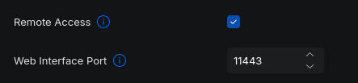</a>
</p>
<p align="center"><i>Remote Access via unifi.ui.com</i></p>
<p align="center"><i>Acceso remoto vía unifi.ui.com</i></p>

<table>
  <tr>
    <td style="width: 50%; vertical-align: top;">
      UHM can coexist with UniFi Remote Access. <br>
      <br>
      Remote Access can be enabled on a locally-administered self-hosted UniFi Network Server, by default Admin plus password, managed by UHM. The UniFi console is then available both locally and from <a href="https://unifi.ui.com">https://unifi.ui.com</a>, by default email plus password plus MFA Login Authentication, with no conflict for UHM. <br>
      <br>
      Enabling 2FA OTP, generated by an authenticator app, does break UHM's authentication against the UniFi API.
    </td>
    <td style="width: 50%; vertical-align: top;">
      UHM puede coexistir con UniFi Remote Access. <br>
      <br>
      Remote Access puede habilitarse en un UniFi Network self-hosted con administración local, por defecto Admin más contraseña, gestionado por UHM. La consola UniFi queda disponible tanto localmente como desde <a href="https://unifi.ui.com">https://unifi.ui.com</a>, por defecto correo más contraseña más MFA Login Authentication, sin conflicto con UHM. <br>
      <br>
      Activar 2FA OTP, generado por una aplicación autenticadora, sí rompe la autenticación de UHM contra la API de UniFi.
    </td>
  </tr>
</table>

> UHM also coexists without conflict with Multi-Site Management enabled on the same console.
>
> UHM también coexiste sin conflicto con Multi-Site Management activado en la misma consola.

## SETUP

---

### Install

<table>
  <tr>
    <td style="width: 50%; vertical-align: top;">
      Clone the repository with <code>git clone</code> and run <code>uhmsetup.sh</code>. <br>
      <br>
      The installer takes care of:
      <ul>
        <li>Verifying the required dependencies.</li>
        <li>Detecting the DHCP backend.</li>
        <li>Deploying the UHM files.</li>
        <li>Running the interactive wizard to configure:
          <ul>
            <li>WAN interface.</li>
            <li>Hotspot IP range, given as two full addresses.</li>
            <li>UniFi credentials.</li>
            <li>UniFi controller, auto-detected through the API.</li>
            <li>Guest SSID, auto-detected through the API.</li>
            <li>Optional managed MAC lists.</li>
          </ul>
        </li>
        <li>Configuring <code>logrotate</code>.</li>
        <li>Registering the <code>systemd</code> service.</li>
        <li>Removing any stale <code>@hourly</code> cron entry from earlier installations, since the daemon handles its own safety-net reload.</li>
        <li>Installing <code>uhmwatch</code>, a mandatory component.</li>
      </ul>
      Network values are not requested during the installation. <code>uhmsetup.sh</code> takes them from <code>/etc/pydhcp/pydhcp.env</code>. <br>
      <br>
      UHM supports a single UniFi controller and a single guest SSID. Both are auto-detected through the UniFi API. How each one is resolved is explained below. <br>
      <br>
      At the end of the installation there are two independent yes/no prompts, both defaulting to No:
      <ul>
        <li><code>uhmalert</code> — optional component that can be installed straight from the installer.</li>
        <li>Web interface — optional component. If <code>apache2</code> or <code>libapache2-mod-php</code> is not installed, a message is shown and the web interface is skipped.</li>
      </ul>
      Before running the installer, make sure every item in Requirements is met, especially the Mandatory dependencies. UHM does not install any dependency automatically. <br>
      <br>
      In addition, <code>pydhcp</code> must be installed and running, and <code>/etc/pydhcp/pydhcp.env</code> must exist and hold the required values. UHM uses that file to obtain the network configuration instead of asking for it again during the installation.
    </td>
    <td style="width: 50%; vertical-align: top;">
      Clone el repositorio con <code>git clone</code> y ejecute <code>uhmsetup.sh</code>. <br>
      <br>
      El instalador se encarga de:
      <ul>
        <li>Verificar las dependencias requeridas.</li>
        <li>Detectar el backend DHCP.</li>
        <li>Desplegar los archivos de UHM.</li>
        <li>Ejecutar el wizard interactivo para configurar:
          <ul>
            <li>Interfaz WAN.</li>
            <li>Rango IP del hotspot, indicando las dos direcciones completas.</li>
            <li>Credenciales de UniFi.</li>
            <li>Controlador UniFi, autodetectado mediante la API.</li>
            <li>SSID de invitados, autodetectado mediante la API.</li>
            <li>Listas opcionales de MAC gestionadas.</li>
          </ul>
        </li>
        <li>Configurar <code>logrotate</code>.</li>
        <li>Registrar el servicio <code>systemd</code>.</li>
        <li>Eliminar cualquier entrada de cron <code>@hourly</code> residual de instalaciones anteriores, cuando el daemon ya se encarga de su propio reload de seguridad.</li>
        <li>Instalar <code>uhmwatch</code>, que es un componente obligatorio.</li>
      </ul>
      Los valores de red no se solicitan durante la instalación. <code>uhmsetup.sh</code> los obtiene de <code>/etc/pydhcp/pydhcp.env</code>. <br>
      <br>
      UHM admite un solo controlador UniFi y un solo SSID de invitados. Ambos se autodetectan mediante la API de UniFi. El detalle de cómo se determina cada uno se explica más abajo. <br>
      <br>
      Al final de la instalación se realizan dos preguntas independientes de tipo sí/no, ambas con No como opción predeterminada:
      <ul>
        <li><code>uhmalert</code> — componente opcional que puede instalarse directamente desde el instalador.</li>
        <li>Interfaz web — componente opcional. Si <code>apache2</code> o <code>libapache2-mod-php</code> no están instalados, se muestra un mensaje y la instalación de la interfaz web se omite.</li>
      </ul>
      Antes de ejecutar el instalador, asegúrese de cumplir todos los requisitos indicados en Requirements, especialmente las dependencias Mandatory. UHM no instala automáticamente ninguna dependencia. <br>
      <br>
      Además, <code>pydhcp</code> debe estar instalado y funcionando, y <code>/etc/pydhcp/pydhcp.env</code> debe existir y contener los valores necesarios. UHM utiliza ese archivo para obtener la configuración de red en lugar de solicitarla nuevamente durante la instalación.
    </td>
  </tr>
</table>

```bash
git clone --depth=1 https://github.com/maravento/uhm.git
cd uhm
sudo bash uhmsetup.sh
```

<table>
  <tr>
    <td style="width: 50%; vertical-align: top;">
      The installer checks the required APT dependencies:
      <code>curl</code>, <code>jq</code>, <code>iptables</code>, <code>ipset</code>, <code>python3</code>, <code>openssl</code>, <code>mawk</code>, <code>coreutils</code>, <code>util-linux</code>, <code>iproute2</code>, <code>cron</code>, <code>grep</code>, <code>sed</code>, <code>systemd</code>, <code>libc-bin</code>, <code>findutils</code>, <code>procps</code> and <code>logrotate</code>. <br>
      <br>
      If any of them is missing, the installation aborts. No dependency is installed automatically. The installation also aborts if <code>pydhcp</code> is not active. <br>
      <br>
      <code>uhm.env</code> holds only UHM's own variables. The network configuration of <code>pydhcp</code> stays in <code>pydhcp.env</code>. Every UHM component reads <code>pydhcp.env</code> first and <code>uhm.env</code> afterwards. This way any change made in <code>pydhcp.env</code> reaches UHM without reinstalling it, and the same variable is never stored in both files. <br>
      <br>
      The installer deploys:
      <ul>
        <li><code>uhmd.sh</code>, <code>uhmreload.sh</code> and <code>uhmleases.sh</code> to <code>/etc/uhm/core/</code>.</li>
        <li><code>uhmwatch.sh</code>, which is mandatory, also to <code>/etc/uhm/core/</code>.</li>
        <li>The optional tools to <code>/etc/uhm/tools/</code>.</li>
        <li><code>uhmd.service</code> to <code>/etc/systemd/system/</code>.</li>
      </ul>
      It then enables and starts the service with <code>systemctl enable</code> and <code>systemctl restart uhmd</code>. <br>
      <br>
      No UHM file is copied to <code>/etc/pydhcp</code>.
    </td>
    <td style="width: 50%; vertical-align: top;">
      El instalador verifica las dependencias APT requeridas:
      <code>curl</code>, <code>jq</code>, <code>iptables</code>, <code>ipset</code>, <code>python3</code>, <code>openssl</code>, <code>mawk</code>, <code>coreutils</code>, <code>util-linux</code>, <code>iproute2</code>, <code>cron</code>, <code>grep</code>, <code>sed</code>, <code>systemd</code>, <code>libc-bin</code>, <code>findutils</code>, <code>procps</code> y <code>logrotate</code>. <br>
      <br>
      Si falta alguna, la instalación se aborta. Ninguna dependencia se instala automáticamente. También se aborta la instalación si <code>pydhcp</code> no está activo. <br>
      <br>
      <code>uhm.env</code> contiene únicamente las variables propias de UHM. La configuración de red de <code>pydhcp</code> permanece en <code>pydhcp.env</code>. Cada componente de UHM consulta primero <code>pydhcp.env</code> y después <code>uhm.env</code>. De esta forma, cualquier cambio realizado en <code>pydhcp.env</code> queda disponible para UHM sin necesidad de reinstalarlo, y una misma variable no se almacena en ambos archivos. <br>
      <br>
      El instalador despliega:
      <ul>
        <li><code>uhmd.sh</code>, <code>uhmreload.sh</code> y <code>uhmleases.sh</code> en <code>/etc/uhm/core/</code>.</li>
        <li><code>uhmwatch.sh</code>, que es obligatorio, también en <code>/etc/uhm/core/</code>.</li>
        <li>Las herramientas opcionales en <code>/etc/uhm/tools/</code>.</li>
        <li><code>uhmd.service</code> en <code>/etc/systemd/system/</code>.</li>
      </ul>
      Después habilita e inicia el servicio mediante <code>systemctl enable</code> y <code>systemctl restart uhmd</code>. <br>
      <br>
      No se copian archivos de UHM a <code>/etc/pydhcp</code>.
    </td>
  </tr>
  <tr>
    <td style="width: 50%; vertical-align: top;">
      <b>systemd service</b> <br>
      <br>
      <code>uhmd.service</code> runs UHM's main loop. The daemon performs a check every <code>POLL_INTERVAL</code> seconds, whose default value is 20 and is set in <code>uhm.env</code>. <br>
      <br>
      No crontab entry is registered. The daemon itself runs the safety-net reload when it applies.
    </td>
    <td style="width: 50%; vertical-align: top;">
      <b>Servicio systemd</b> <br>
      <br>
      <code>uhmd.service</code> ejecuta el ciclo principal de UHM. El daemon realiza una comprobación cada <code>POLL_INTERVAL</code> segundos, cuyo valor predeterminado es 20 y se configura en <code>uhm.env</code>. <br>
      <br>
      No se registra ninguna entrada de crontab. El propio daemon ejecuta internamente el reload de seguridad cuando corresponde.
    </td>
  </tr>
  <tr>
    <td style="width: 50%; vertical-align: top;">
      <b>Controller and SSID resolution</b> <br>
      <br>
      UHM supports exactly one UniFi controller and one guest SSID. For that reason, neither of them is entered by hand as free text. <br>
      <br>
      <b>UniFi controller</b> <br>
      <br>
      The installer uses <code>SERVER_IP</code>, taken from <code>pydhcp.env</code> and corresponding to the host's own LAN IP, to probe ports <code>8443</code> and <code>11443</code> with the UniFi credentials entered during the installation. <br>
      <br>
      If it finds the controller, it uses that connection directly. If it does not find it, the installation aborts. In that case, check the credentials and confirm that the UniFi controller is running on this same host before running the installation again. <br>
      <br>
      <b>Guest SSID</b> <br>
      <br>
      Once authenticated against the controller, the installer obtains the configured SSIDs through <code>rest/wlanconf</code>.
      <ul>
        <li>If there is a single SSID, it selects it automatically.</li>
        <li>If there are several, it shows a numbered menu so the administrator selects the one belonging to the captive portal.</li>
        <li>If there is no SSID at all, the installation aborts.</li>
      </ul>
      The SSID is not entered as free text. This prevents typing errors and guarantees that the value used by UHM matches exactly the one configured in UniFi.
    </td>
    <td style="width: 50%; vertical-align: top;">
      <b>Resolución del controlador y del SSID</b> <br>
      <br>
      UHM admite exactamente un controlador UniFi y un SSID de invitados. Por esta razón, ninguno de los dos se introduce manualmente como texto libre. <br>
      <br>
      <b>Controlador UniFi</b> <br>
      <br>
      El instalador utiliza <code>SERVER_IP</code>, obtenido de <code>pydhcp.env</code> y correspondiente a la IP LAN del propio host, para probar los puertos <code>8443</code> y <code>11443</code> con las credenciales de UniFi introducidas durante la instalación. <br>
      <br>
      Si encuentra el controlador, utiliza esa conexión directamente. Si no lo encuentra, la instalación se aborta. En ese caso, revise las credenciales y confirme que el controlador UniFi esté ejecutándose en este mismo host antes de volver a ejecutar la instalación. <br>
      <br>
      <b>SSID de invitados</b> <br>
      <br>
      Una vez autenticado en el controlador, el instalador obtiene los SSID configurados mediante <code>rest/wlanconf</code>.
      <ul>
        <li>Si existe un solo SSID, lo selecciona automáticamente.</li>
        <li>Si existen varios, muestra un menú numerado para que el administrador seleccione el SSID correspondiente al portal cautivo.</li>
        <li>Si no existe ningún SSID, la instalación se aborta.</li>
      </ul>
      El SSID no se introduce como texto libre. Esto evita errores de escritura y garantiza que el valor utilizado por UHM coincida exactamente con el configurado en UniFi.
    </td>
  </tr>
  <tr>
    <td style="width: 50%; vertical-align: top;">
      <b>Purpose of the daemon</b> <br>
      <br>
      The daemon keeps the ACL lists up to date and guarantees that the reload chain stays active even when no client is connected. <br>
      <br>
      On every cycle, <code>uhmd.sh</code> checks how much time has passed since the last reload. If more than <code>RELOAD_SAFETY_INTERVAL_SECONDS</code> have elapsed —3600 seconds by default, that is, one hour— it forces a reload even if no ACL has changed. <br>
      <br>
      This periodic reload lets the grace entries that have expired move to <code>blockdhcp.txt</code> even on an idle network, where no new client would normally trigger a reload. <br>
      <br>
      <code>uhmd.sh</code> is the only component that invokes <code>uhmreload.sh</code>. There is no external cron entry to run the reload. Therefore, there are no two independent callers that could compete for the instance lock of <code>uhmreload.sh</code>.
    </td>
    <td style="width: 50%; vertical-align: top;">
      <b>Propósito del daemon</b> <br>
      <br>
      El daemon mantiene actualizadas las listas ACL y garantiza que la cadena de reload continúe activa incluso cuando no hay clientes conectados. <br>
      <br>
      En cada ciclo, <code>uhmd.sh</code> comprueba cuánto tiempo ha pasado desde el último reload. Si han transcurrido más de <code>RELOAD_SAFETY_INTERVAL_SECONDS</code> —3600 segundos por defecto, es decir, una hora— fuerza un reload aunque ninguna ACL haya cambiado. <br>
      <br>
      Este reload periódico permite que las entradas de gracia que hayan expirado pasen a <code>blockdhcp.txt</code> incluso en una red sin actividad, donde ningún cliente nuevo provocaría normalmente un reload. <br>
      <br>
      <code>uhmd.sh</code> es el único componente que invoca <code>uhmreload.sh</code>. No existe ninguna entrada de cron externa para ejecutar el reload. Por tanto, no hay dos invocadores independientes que puedan competir por el lock de instancia de <code>uhmreload.sh</code>.
    </td>
  </tr>
</table>

<table>
  <tr>
    <td style="width: 50%; vertical-align: top;">
      Verify the daemon status with:
    </td>
    <td style="width: 50%; vertical-align: top;">
      Verifique el estado del daemon con:
    </td>
  </tr>
</table>

```bash
systemctl status uhmd
journalctl -u uhmd -f
```

### Update

<table>
  <tr>
    <td style="width: 50%; vertical-align: top;">
      The update replaces only the program files. It never modifies the existing configuration or the ACL data. <br>
      <br>
      Files that are updated:
      <ul>
        <li>The whole content of <code>core/</code>:
          <ul>
            <li><code>uhmd.sh</code></li>
            <li><code>uhmreload.sh</code></li>
            <li><code>uhmleases.sh</code></li>
            <li><code>uhmwatch.sh</code></li>
          </ul>
        </li>
        <li><code>service/uhmd.service</code></li>
        <li>All the scripts in <code>tools/</code>:
          <ul>
            <li><code>uhmunifi.sh</code></li>
            <li><code>uhmalert.sh</code></li>
            <li><code>uhmtool.sh</code></li>
          </ul>
        </li>
      </ul>
      <code>tools/uhmiptables_example.txt</code> is only a reference example and is never deployed. <br>
      <code>tools/uhmiptables.sh</code> is deployed only when it does not exist in the installation. <br>
      <br>
      Files and data that are not overwritten:
      <ul>
        <li><code>uhm.env</code></li>
        <li><code>/etc/uhm/acl/</code>:
          <ul>
            <li><code>uhm-auth.txt</code></li>
            <li><code>uhm-queue.txt</code></li>
            <li><code>uhm-grace.txt</code></li>
          </ul>
        </li>
        <li><code>tools/uhmiptables.sh</code>, if it already exists.</li>
        <li>The <code>logrotate</code> configuration.</li>
      </ul>
      These files hold the administrator's configuration or custom data and stay exactly as they are. <br>
      <br>
      If the ACL files or the <code>logrotate</code> configuration are missing during an update, they are recreated empty and a <code>WARNING</code> is shown. If <code>uhmiptables.sh</code> is missing, it is deployed again from the minimal template. <br>
      <br>
      <code>uhm.env</code> gets a special treatment: with <code>--update</code> it is not created, not verified and not repaired. If it is missing, that situation is only detected during a fresh installation, without <code>--update</code>. <br>
      <br>
      <b>Services during the update</b> <br>
      <br>
      Before replacing the files, <code>uhmd.service</code> and <code>uhmalert.service</code> are stopped, if they are installed and active. At the end, only the services that were active before the update are started again. <br>
      <br>
      The cron entry used by <code>uhmwatch</code> is removed during that same window and registered again at the end. <code>uhmwatch</code> is not a <code>systemd</code> service. <br>
      <br>
      Nothing that was stopped or disabled before the update is started as a result of it. <br>
      <br>
      <code>pydhcpd</code> is neither stopped nor modified. <code>pydhcp</code> is an independent project and stopping it would interrupt the DHCP service of the whole LAN, not only the hotspot's. <br>
      <br>
      <b>uhmreload cron</b> <br>
      <br>
      The update removes any stale <code>@hourly</code> cron entry used to run <code>uhmreload.sh</code>. That external execution is no longer needed because the daemon performs the safety-net reload internally. <br>
      <br>
      <b>Backup beforehand</b> <br>
      <br>
      Before overwriting any file, the update runs <code>uhmbk.sh</code>. <br>
      <br>
      The backup writes a full ZIP of <code>/etc/uhm</code> to: <br>
      <code>/etc/bak/uhm/uhmbk_&lt;YYYYMMDD_HHMM&gt;.zip</code> <br>
      <br>
      If <code>uhmbk.sh</code> is not installed, a warning is shown and the update continues.
    </td>
    <td style="width: 50%; vertical-align: top;">
      La actualización reemplaza únicamente los archivos del programa. Nunca modifica la configuración ni los datos ACL existentes. <br>
      <br>
      Archivos que se actualizan:
      <ul>
        <li>Todo el contenido de <code>core/</code>:
          <ul>
            <li><code>uhmd.sh</code></li>
            <li><code>uhmreload.sh</code></li>
            <li><code>uhmleases.sh</code></li>
            <li><code>uhmwatch.sh</code></li>
          </ul>
        </li>
        <li><code>service/uhmd.service</code></li>
        <li>Todos los scripts de <code>tools/</code>:
          <ul>
            <li><code>uhmunifi.sh</code></li>
            <li><code>uhmalert.sh</code></li>
            <li><code>uhmtool.sh</code></li>
          </ul>
        </li>
      </ul>
      <code>tools/uhmiptables_example.txt</code> es únicamente un ejemplo de referencia y nunca se despliega. <br>
      <code>tools/uhmiptables.sh</code> solo se despliega cuando no existe en la instalación. <br>
      <br>
      Archivos y datos que no se sobrescriben:
      <ul>
        <li><code>uhm.env</code></li>
        <li><code>/etc/uhm/acl/</code>:
          <ul>
            <li><code>uhm-auth.txt</code></li>
            <li><code>uhm-queue.txt</code></li>
            <li><code>uhm-grace.txt</code></li>
          </ul>
        </li>
        <li><code>tools/uhmiptables.sh</code>, si ya existe.</li>
        <li>La configuración de <code>logrotate</code>.</li>
      </ul>
      Estos archivos contienen configuración o datos personalizados del administrador y permanecen exactamente como están. <br>
      <br>
      Si durante una actualización faltan los archivos ACL o la configuración de <code>logrotate</code>, se recrean vacíos y se muestra un <code>WARNING</code>. Si falta <code>uhmiptables.sh</code>, se vuelve a desplegar desde la plantilla mínima. <br>
      <br>
      <code>uhm.env</code> tiene un tratamiento especial: con <code>--update</code> no se crea, no se verifica y no se repara. Si falta, esta situación solo se detecta durante una instalación nueva, sin <code>--update</code>. <br>
      <br>
      <b>Servicios durante la actualización</b> <br>
      <br>
      Antes de reemplazar los archivos, se detienen <code>uhmd.service</code> y <code>uhmalert.service</code>, si están instalados y activos. Al finalizar, se vuelven a iniciar únicamente los servicios que estaban activos antes de la actualización. <br>
      <br>
      La entrada de cron utilizada por <code>uhmwatch</code> se elimina durante esta misma ventana y se vuelve a registrar al finalizar. <code>uhmwatch</code> no es un servicio <code>systemd</code>. <br>
      <br>
      Nada que estuviera detenido o deshabilitado antes de la actualización se inicia como consecuencia de ella. <br>
      <br>
      <code>pydhcpd</code> no se detiene ni se modifica. <code>pydhcp</code> es un proyecto independiente y detenerlo interrumpiría el servicio DHCP de toda la LAN, no únicamente el del hotspot. <br>
      <br>
      <b>Cron de uhmreload</b> <br>
      <br>
      La actualización elimina cualquier entrada de cron <code>@hourly</code> residual utilizada para ejecutar <code>uhmreload.sh</code>. Esa ejecución externa ya no es necesaria porque el daemon realiza internamente el reload de seguridad. <br>
      <br>
      <b>Respaldo previo</b> <br>
      <br>
      Antes de sobrescribir cualquier archivo, la actualización ejecuta <code>uhmbk.sh</code>. <br>
      <br>
      El respaldo genera un archivo ZIP completo de <code>/etc/uhm</code> en: <br>
      <code>/etc/bak/uhm/uhmbk_&lt;AAAAMMDD_HHMM&gt;.zip</code> <br>
      <br>
      Si <code>uhmbk.sh</code> no está instalado, se muestra un aviso y la actualización continúa.
    </td>
  </tr>
</table>

```bash
cd uhm
sudo bash uhmsetup.sh --update
```

### Remove

<table>
  <tr>
    <td style="width: 50%; vertical-align: top;">
      The installer also allows UHM to be uninstalled. <br>
      <br>
      Before starting, it shows a detailed warning with everything that will be removed and asks for <b>a single confirmation</b>. If the administrator confirms the uninstall, the operation runs to the end without further questions. That initial confirmation authorizes the complete removal of UHM. <br>
      <br>
      The uninstall removes every file, service, configuration and other component belonging to UHM. <br>
      <br>
      The APT dependencies used by UHM (<code>curl</code>, <code>jq</code>, <code>iptables</code>, <code>ipset</code>, etc.) are <b>not</b> uninstalled. <br>
      <br>
      The firewall rules and the ipsets created for UHM are <b>not</b> removed automatically either. They must be cleaned by hand, following the instructions included at the end of the removal summary.
    </td>
    <td style="width: 50%; vertical-align: top;">
      El instalador también permite desinstalar UHM. <br>
      <br>
      Antes de comenzar, muestra una advertencia detallada con todo lo que será eliminado y solicita <b>una única confirmación</b>. Si el administrador confirma la desinstalación, la operación continúa hasta el final sin realizar nuevas preguntas. La confirmación inicial autoriza la eliminación completa de UHM. <br>
      <br>
      La desinstalación elimina todos los archivos, servicios, configuraciones y demás componentes propios de UHM. <br>
      <br>
      Las dependencias APT utilizadas por UHM (<code>curl</code>, <code>jq</code>, <code>iptables</code>, <code>ipset</code>, etc.) <b>no se desinstalan</b>. <br>
      <br>
      Las reglas de firewall y los ipsets creados para UHM <b>tampoco se eliminan automáticamente</b>. Deben limpiarse manualmente siguiendo las instrucciones incluidas al final del resumen de remoción.
    </td>
  </tr>
</table>

```bash
cd uhm
sudo bash uhmsetup.sh --remove
```

##### Uninstaller actions

| # | Description (two confirmations up front, then unconditional) | Descripción (dos confirmaciones al inicio, luego incondicional) |
|---|-----------------------------------------------------------|---------------------------------------------------------------|
| 1 | Stop and disable `uhmd.service` and remove `/etc/systemd/system/uhmd.service` | Detiene y deshabilita `uhmd.service` y elimina `/etc/systemd/system/uhmd.service` |
| 2 | Remove the `@hourly` cron entry for `/etc/uhm/core/uhmreload.sh` (or the pre-restructure `/etc/uhm/tools/uhmreload.sh` path, if upgrading from an older install) | Elimina la entrada de cron `@hourly` para `/etc/uhm/core/uhmreload.sh` (o la ruta previa a la reestructuración `/etc/uhm/tools/uhmreload.sh`, si se actualiza desde una instalación anterior) |
| 3 | Remove the `uhmwatch` cron entry, and stop/disable/remove `uhmalert.service` if installed | Elimina la entrada de cron de `uhmwatch`, y detiene/deshabilita/elimina `uhmalert.service` si está instalado |
| 4 | Remove the web interface: `/var/www/uhm`, its vhost, its sudo rule and its `Listen` directives, if installed | Elimina la interfaz web: `/var/www/uhm`, su vhost, su regla de sudo y sus directivas `Listen`, si está instalada |
| 5 | Remove `/etc/logrotate.d/uhm` | Elimina `/etc/logrotate.d/uhm` |
| 6 | Remove `/etc/uhm/` and **all its contents** including `uhm.env`, ACL files and your `uhmiptables.sh` | Elimina `/etc/uhm/` y **todo su contenido**, incluyendo `uhm.env`, archivos ACL y su `uhmiptables.sh` |
| 7 | Remove `/var/log/uhm.log`, rotated archives, `/var/log/uhmunifi.log`, `/var/log/uhmleases-failure.trace` and `/var/log/uhmiptables-failure.trace` | Elimina `/var/log/uhm.log`, los archivos rotados, `/var/log/uhmunifi.log`, `/var/log/uhmleases-failure.trace` y `/var/log/uhmiptables-failure.trace` |

### Files

| Path | Description | Descripción |
|---|---|---|
| `/etc/uhm/core/uhmd.sh` | Main daemon | Daemon principal |
| `/etc/systemd/system/uhmd.service` | Systemd service unit | Unidad de servicio systemd |
| `/etc/uhm/core/uhmreload.sh` | Reload wrapper | Wrapper de reload |
| `/etc/uhm/core/uhmleases.sh` | Hotspot-aware DHCP leases manager | Gestor de leases DHCP con hotspot |
| `/etc/uhm/tools/uhmunifi.sh` | Audit tool | Herramienta de auditoría |
| `/etc/uhm/uhm.env` | Configuration (IPs, credentials, ports) | Configuración |
| `/etc/uhm/acl/uhm-grace.txt` | Grace-period clients (no voucher yet) | Clientes en período de gracia |
| `/etc/uhm/acl/uhm-auth.txt` | Authorized clients (active voucher) | Autorizados |
| `/etc/uhm/acl/uhm-queue.txt` | Lease removal queue — path set by the `UHM_QUEUE` config variable; internal working file for `uhmd.sh`/`uhmleases.sh`, not an ACL — do not edit its contents manually | Cola de remociones de leases — la ruta la fija la variable de configuración `UHM_QUEUE`; archivo de trabajo interno de `uhmd.sh`/`uhmleases.sh`, no es una ACL — no debe editarse su contenido manualmente |
| `/var/log/uhm.log` | Log file (unified) | Archivo de log (unificado) |
| `/etc/logrotate.d/uhm` | Logrotate config | Config de logrotate |
| `/etc/uhm/core/uhmwatch.sh` | Services watchdog (mandatory) | Vigilante de servicios (obligatorio) |
| `/run/uhmwatch/` | Watchdog recovery-attempt timestamps — cleared on reboot, not persistent | Marcas de tiempo de intentos de recuperación del vigilante — se limpian en cada reinicio, no persisten |
| `/etc/uhm/tools/uhmtool.sh` | JSON backend for the web interface | Backend JSON de la interfaz web |
| `/var/www/uhm/` | Web interface (optional) | Interfaz web (opcional) |
| `/etc/apache2/sites-available/uhmweb.conf` | Apache vhost on port 4048 (optional) | Vhost de Apache en el puerto 4048 (opcional) |
| `/etc/sudoers.d/uhmweb` | Sudo rule for `www-data` (optional) | Regla de sudo para `www-data` (opcional) |

### Backups

<table width="100%">
  <tr>
    <td style="width: 50%; vertical-align: top;">
      UHM uses two kinds of backup, with different purposes and rules. <br>
      <br>
      <b>Project backup</b> <br>
      <br>
      It is a full copy of the UHM installation, intended for the administrator. It is stored in <code>/etc/bak/uhm</code>, its name carries a timestamp and up to 3 copies are kept. <br>
      <br>
      Only <code>uhmbk.sh</code> creates project backups. <br>
      <br>
      <b>Routine-operation backup</b> <br>
      <br>
      It is a copy of one specific file that a script makes right before modifying it. Its purpose is to allow that change to be undone if needed. <br>
      <br>
      It is stored next to the original file, with the <code>.bak</code> extension: <br>
      <code>&lt;file&gt;.bak</code> <br>
      <br>
      Only one copy is kept. Every new run overwrites the previous copy. <br>
      <br>
      The difference between both kinds of backup is <b>not given by the number of copies nor by how long they are kept</b>, but by <b>what is backed up and why the backup is made</b>: the project backup copies the whole installation for the administrator; the routine-operation backup copies one specific file as a safety measure before modifying it.
    </td>
    <td style="width: 50%; vertical-align: top;">
      UHM utiliza dos tipos de respaldo, con propósitos y reglas diferentes. <br>
      <br>
      <b>Respaldo de proyecto</b> <br>
      <br>
      Es una copia completa de la instalación de UHM, destinada al administrador. Se guarda en <code>/etc/bak/uhm</code>, incluye una marca de tiempo en el nombre y se conservan hasta 3 copias. <br>
      <br>
      Solo <code>uhmbk.sh</code> genera respaldos de proyecto. <br>
      <br>
      <b>Respaldo de operación rutinaria</b> <br>
      <br>
      Es una copia de un archivo concreto que un script realiza inmediatamente antes de modificarlo. Su finalidad es permitir deshacer ese cambio si fuera necesario. <br>
      <br>
      Se guarda junto al archivo original, con la extensión <code>.bak</code>: <br>
      <code>&lt;archivo&gt;.bak</code> <br>
      <br>
      Solo se conserva una copia. Cada nueva ejecución sobrescribe la copia anterior. <br>
      <br>
      La diferencia entre ambos tipos de respaldo <b>no está determinada por el número de copias ni por el tiempo que se conservan</b>, sino por <b>qué se respalda y para qué se realiza el respaldo</b>: el respaldo de proyecto copia la instalación completa para el administrador; el respaldo de operación rutinaria copia un archivo específico como medida de seguridad antes de modificarlo.
    </td>
  </tr>
</table>

| Path | Kind | Written by | Escrito por |
|---|---|---|---|
| `/etc/bak/uhm/uhmbk_<TIMESTAMP>.zip` | Project, up to 3 | `uhmbk.sh`, archiving `/etc/uhm` and `uhm`'s own systemd/Apache/logrotate files | `uhmbk.sh`, archivando `/etc/uhm` y los archivos propios de `uhm` en systemd/Apache/logrotate |
| `/etc/pydhcp/core/pydhcpd.conf.bak` | Routine, 1 copy | `uhmleases.sh`, before regenerating the config; restored automatically if `pydhcpd` then fails to start | `uhmleases.sh`, antes de regenerar la configuración; se restaura sola si `pydhcpd` no arranca después |

> `uhmbk.sh` ships with `uhm` and only archives `uhm`'s own files. `pydhcp`'s configuration has its own separate backup tool, `pydhcp/tools/pybk.sh`, writing to `/etc/bak/pydhcp`.
>
> `uhmbk.sh` viene con `uhm` y solo archiva los archivos propios de `uhm`. La configuración de `pydhcp` tiene su propia herramienta de respaldo separada, `pydhcp/tools/pybk.sh`, que escribe en `/etc/bak/pydhcp`.

### Config Reference (uhm.env)

| Variable | Description | Descripción |
|----------|--------------|-------------|
| _(WAN interface)_ | Not a `uhm.env` key. `uhmsetup.sh` asks for it during setup and replaces the `eth0` placeholder directly in `tools/uhmiptables.sh` (and `tools/uhmiptables_example.txt` once copied over it) with `sed -i`, the only place it is used | No es una clave de `uhm.env`. `uhmsetup.sh` la pregunta durante la instalación y reemplaza el placeholder `eth0` directamente en `tools/uhmiptables.sh` (y en `tools/uhmiptables_example.txt` una vez copiado sobre él) con `sed -i`, el único lugar donde se usa |
| `INTERFACESv4` | pydhcp's own value -- the LAN interface `pydhcpd` listens on, read from `/etc/pydhcp/pydhcp.env` at runtime; read by `tools/uhmiptables_example.txt` as its `$lan`; the minimal template does not use it | Valor propio de pydhcp -- la interfaz LAN en la que escucha `pydhcpd`, leída desde `/etc/pydhcp/pydhcp.env` en cada ejecución; usada por `tools/uhmiptables_example.txt` como su `$lan`; la plantilla mínima no la usa |
| `SERVER_IP` | This machine's IP on the LAN, read from `/etc/pydhcp/pydhcp.env` at runtime (also the DHCP server IP; used by `uhmleases.sh` and `uhmiptables.sh`) | IP de esta máquina en la LAN, leída desde `/etc/pydhcp/pydhcp.env` en cada ejecución (también la IP del servidor DHCP; usado por `uhmleases.sh` y `uhmiptables.sh`) |
| `UHM_INI_RANGE`, `UHM_END_RANGE` | First and last address of the fixed-IP range handed to voucher-authorized guests, as two complete IPv4 addresses -- same shape as pydhcp's own `SERV_INI_RANGE_BLOCK`/`SERV_END_RANGE_BLOCK`, so no netmask is assumed | Primera y última dirección del rango de IP fijas que se entrega a los invitados autorizados por voucher, como dos direcciones IPv4 completas -- misma forma que el propio `SERV_INI_RANGE_BLOCK`/`SERV_END_RANGE_BLOCK` de pydhcp, así que no se asume ninguna máscara |
| `UHM_ESSID` | Guest SSID name; must match UniFi exactly | Nombre del SSID de invitados; debe coincidir exactamente con UniFi |
| `UNIFI_CONTROLLER_URL` | e.g. `https://192.168.1.1:8443` | ej. `https://192.168.1.1:8443` |
| `UNIFI_USERNAME`, `UNIFI_PASSWORD` | Local UniFi admin | Admin local de UniFi |
| `UNIFI_SITE` | Defaults to `default`; update if the site was renamed | Por defecto `default`; actualizar si el sitio fue renombrado |
| `UNIFI_TYPE` | Either `unifi-os` or `classic` — sets the API path, login endpoint, session cookie name, and CSRF extraction method used by `uhmd.sh` | `unifi-os` o `classic` — define la ruta de la API, el endpoint de login, el nombre de la cookie de sesión y el método de extracción de CSRF que usa `uhmd.sh` |
| `UNIFI_CERT_PIN` | SHA-256 pin of the controller's TLS public key (format `sha256//<base64>`), computed by `uhmsetup.sh` at install time. Used by `uhmd.sh` with `curl --pinnedpubkey` to detect a swapped certificate; empty if `openssl` failed during setup, in which case the connection falls back to unpinned `-k` | Pin SHA-256 de la clave pública TLS del controlador (formato `sha256//<base64>`), calculado por `uhmsetup.sh` durante la instalación. Usado por `uhmd.sh` con `curl --pinnedpubkey` para detectar un certificado reemplazado; vacío si `openssl` falló durante la instalación, en cuyo caso la conexión cae a `-k` sin pin |
| `UHM_RELOAD` | Path to `uhmreload.sh` | Ruta a `uhmreload.sh` |
| `UHM_LEASES` | Path to `uhmleases.sh`, invoked by `uhmreload.sh` as its first step (default `/etc/uhm/core/uhmleases.sh`) | Ruta a `uhmleases.sh`, invocado por `uhmreload.sh` como su primer paso (default `/etc/uhm/core/uhmleases.sh`) |
| `UHM_IPTABLES` | Path to the administrator's firewall script, invoked by `uhmreload.sh` as its second step (default `/etc/uhm/tools/uhmiptables.sh`) | Ruta al script de firewall del administrador, invocado por `uhmreload.sh` como su segundo paso (default `/etc/uhm/tools/uhmiptables.sh`) |
| `UHM_LEASES_TIMEOUT_SECONDS` | Max seconds `uhmreload.sh` waits for `uhmleases.sh` before killing it (default `120`) | Segundos máximos que `uhmreload.sh` espera a `uhmleases.sh` antes de matarlo (default `120`) |
| `UHM_IPTABLES_TIMEOUT_SECONDS` | Max seconds `uhmreload.sh` waits for `uhmiptables.sh` before killing it (default `60`) | Segundos máximos que `uhmreload.sh` espera a `uhmiptables.sh` antes de matarlo (default `60`) |
| `SERV_MASK` | Network mask, read from `pydhcp.env` at runtime | Máscara de red, leída desde `pydhcp.env` en cada ejecución |
| `SERV_SUBNET` | Network address, read from `pydhcp.env` at runtime | Dirección de red, leída desde `pydhcp.env` en cada ejecución |
| `SERV_BROADCAST` | Broadcast address, read from `pydhcp.env` at runtime | Dirección de broadcast, leída desde `pydhcp.env` en cada ejecución |
| `SERV_DNS` | DNS servers for clients, read from `pydhcp.env` at runtime | Servidores DNS para clientes, leída desde `pydhcp.env` en cada ejecución |
| `SERV_INI_RANGE_BLOCK`, `SERV_END_RANGE_BLOCK` | DHCP pool range for new/unknown clients, read from `pydhcp.env` at runtime | Rango del pool DHCP para clientes nuevos/desconocidos, leída desde `pydhcp.env` en cada ejecución |
| `ACL_PATH` | Base ACL directory, read from `pydhcp.env` at runtime | Directorio base de ACL, leída desde `pydhcp.env` en cada ejecución |
| `ACL_MAC_PATH` | Managed MAC lists directory, read from `pydhcp.env` at runtime | Directorio de listas de MAC gestionadas, leída desde `pydhcp.env` en cada ejecución |
| `ACL_DHCP_PATH` | DHCP-related ACL files directory, read from `pydhcp.env` at runtime | Directorio de archivos ACL relacionados con DHCP, leída desde `pydhcp.env` en cada ejecución |
| `UHM_PATH` | UHM installation/data directory (default `/etc/uhm`) | Directorio de instalación/datos de UHM (default `/etc/uhm`) |
| `ACL_MAC_LIMITED` | Managed proxy MAC list, read from `pydhcp.env` at runtime | Lista de MAC gestionadas forzadas por proxy, leída desde `pydhcp.env` en cada ejecución |
| `ACL_MAC_UNLIMITED` | Managed unrestricted MAC list, read from `pydhcp.env` at runtime | Lista de MAC gestionadas sin restricciones, leída desde `pydhcp.env` en cada ejecución |
| `UHM_MACAUTH` | Active hotspot-authorized MAC list -- UHM's own (default `/etc/uhm/acl/uhm-auth.txt`) | Lista de MAC autorizadas activas del hotspot -- propia de UHM (default `/etc/uhm/acl/uhm-auth.txt`) |
| `ACL_BLOCK_FILE` | Permanently blocked MAC list, read from `pydhcp.env` at runtime | Lista de MAC bloqueadas permanentemente, leída desde `pydhcp.env` en cada ejecución |
| `PYDHCPD_LEASES` | pydhcpd's own leases file path, read from `pydhcp.env` at runtime; read by `uhmd.sh` and `uhmleases.sh` (default `/etc/pydhcp/core/pydhcpd.leases`) | Ruta del archivo de leases de pydhcpd, leída desde `pydhcp.env` en cada ejecución; usada por `uhmd.sh` y `uhmleases.sh` (default `/etc/pydhcp/core/pydhcpd.leases`) |
| `UHM_GRACE` | Grace-period MAC list -- UHM's own (default `/etc/uhm/acl/uhm-grace.txt`) | Lista de MAC en período de gracia -- propia de UHM (default `/etc/uhm/acl/uhm-grace.txt`) |
| `UHM_QUEUE` | Path to the internal lease-removal queue file, an UHM working file (not an ACL) consumed by `uhmd.sh` and `uhmleases.sh` (default `/etc/uhm/acl/uhm-queue.txt`) | Ruta del archivo interno de cola de remoción de leases, un archivo de trabajo de UHM (no una ACL) consumido por `uhmd.sh` y `uhmleases.sh` (default `/etc/uhm/acl/uhm-queue.txt`) |
| `POLL_INTERVAL` | Daemon cycle interval in seconds (default `20`) | Intervalo del ciclo del daemon en segundos (default `20`) |
| `RELOAD_SAFETY_INTERVAL_SECONDS` | Force a reload even without an ACL change after this many seconds (default `3600` = 1h, minimum 3x `UHM_LEASES_TIMEOUT_SECONDS` + `UHM_IPTABLES_TIMEOUT_SECONDS` and never below `600`; `uhmd` aborts below that) | Fuerza un reload aunque no haya cambio de ACL tras esta cantidad de segundos (default `3600` = 1h, mínimo 3x `UHM_LEASES_TIMEOUT_SECONDS` + `UHM_IPTABLES_TIMEOUT_SECONDS` y nunca menos de `600`; `uhmd` aborta por debajo) |
| `STARTUP_GRACE_SECONDS` | Grace window (seconds) for `uhmd.sh`'s initial UniFi login retry and its wait for `pydhcpd` to come up (default `120`). Also read by `uhmwatch.sh` to give its own functional login check (`uosserver.service`/`unifi.service`) the same exemption during this window; `uhmalert.sh` has its own separate key, `UHM_ALERT_QUIET_PERIOD_SECONDS` | Ventana de gracia (segundos) para el reintento inicial de login a UniFi de `uhmd.sh` y su espera a que `pydhcpd` arranque (default `120`). También la lee `uhmwatch.sh` para darle a su propio chequeo funcional de login (`uosserver.service`/`unifi.service`) la misma excepción durante esta ventana; `uhmalert.sh` tiene su propia clave separada, `UHM_ALERT_QUIET_PERIOD_SECONDS` |
| `UHM_ALERT_QUIET_PERIOD_SECONDS` | Grace window (seconds) for suppressing `uhmalert.sh` connectivity alerts right after `uhmd.service` starts (default `120`) | Ventana de gracia (segundos) para suprimir alertas de conectividad de `uhmalert.sh` justo después de que arranca `uhmd.service` (default `120`) |
| `RECOVERY_COOLDOWN_SECONDS` | Minimum seconds `uhmwatch.sh` (mandatory) waits between recovery attempts on the same service after one fails to fix it -- prevents hammering a persistently broken service (e.g. controller genuinely down) with a restart every single cron tick (default `600` = 10 min) | Segundos mínimos que `uhmwatch.sh` (obligatorio) espera entre intentos de recuperación sobre el mismo servicio después de que uno no lo arregla -- evita machacar con un restart en cada corrida de cron a un servicio persistentemente roto (ej. el controlador realmente caído) (default `600` = 10 min) |
| `CLEANUP_INTERVAL` | pydhcp's own value -- DHCP pool lease time in seconds, read from `pydhcp.env` at runtime (default `60`) | Valor propio de pydhcp -- tiempo de lease del pool DHCP en segundos, leída desde `pydhcp.env` en cada ejecución (default `60`) |
| `AUTHORIZED_LEASE_TIME` | pydhcp's own value -- DHCP lease time for authorized clients in seconds, read from `pydhcp.env` at runtime (default `2592000` = 30 days) | Valor propio de pydhcp -- tiempo de lease DHCP para clientes autorizados en segundos, leída desde `pydhcp.env` en cada ejecución (default `2592000` = 30 días) |
| `QUARANTINE_DURATION` | pydhcp's own value -- seconds an IP is held out of the pool after a DHCPDECLINE or `ping-check` conflict, read from `pydhcp.env` at runtime; written into `pydhcpd.conf` as `abandon-lease-time` (default `60`) | Valor propio de pydhcp -- segundos que una IP se aparta del pool tras un DHCPDECLINE o un conflicto de `ping-check`, leída desde `pydhcp.env` en cada ejecución; escrito en `pydhcpd.conf` como `abandon-lease-time` (default `60`) |
| `BLOCKDHCP_GRACE_SECONDS` | Grace period before unknown MACs are blocked (default `86400` = 24h). When this timer expires the MAC does not move to `blockdhcp.txt` right away: expiry changes no file, so it is applied on the next reload -- either an ACL change or `RELOAD_SAFETY_INTERVAL_SECONDS` (default 3600) since the last one | Período de gracia antes de bloquear MACs desconocidas (default `86400` = 24h). Al expirar este contador la MAC no pasa directo a `blockdhcp.txt`: la expiración no cambia ningún archivo, así que se aplica en el siguiente reload -- un cambio en las ACL o `RELOAD_SAFETY_INTERVAL_SECONDS` (default 3600) desde el anterior |
| `WPAD_ENABLED` | pydhcp's own value -- `true` to enable WPAD/PAC via DHCP option 252, requires Apache2 serving `wpad.pac` on `WPAD_PORT`, read from `pydhcp.env` at runtime (default `false`) | Valor propio de pydhcp -- `true` para habilitar WPAD/PAC vía la opción DHCP 252, requiere Apache2 sirviendo `wpad.pac` en `WPAD_PORT`, leída desde `pydhcp.env` en cada ejecución (default `false`) |
| `WPAD_PORT` | pydhcp's own value -- TCP port of the Apache VirtualHost serving `wpad.pac`, read from `pydhcp.env` at runtime (default `18100`). The full example firewall reads it too, for the rules that allow PAC access per ACL group | Valor propio de pydhcp -- puerto TCP del VirtualHost de Apache que sirve `wpad.pac`, leída desde `pydhcp.env` en cada ejecución (default `18100`). Si lo cambia, El ejemplo completo del firewall también la lee, para las reglas que permiten el acceso al PAC por grupo ACL |
| `PING_CHECK_ENABLED` | pydhcp's own value -- `false` to disable pydhcpd ping-check before OFFER, set if ICMP is blocked, read from `pydhcp.env` at runtime (default `true`) | Valor propio de pydhcp -- `false` para deshabilitar el ping-check de pydhcpd antes del OFFER, usar si ICMP está bloqueado, leída desde `pydhcp.env` en cada ejecución (default `true`) |
| `PING_TIMEOUT_SECONDS` | pydhcp's own value -- seconds to wait for the ICMP reply before giving up and sending the OFFER, read from `pydhcp.env` at runtime; written into `pydhcpd.conf` as `ping-timeout` (default `1`) | Valor propio de pydhcp -- segundos a esperar la respuesta ICMP antes de desistir y enviar el OFFER, leída desde `pydhcp.env` en cada ejecución; escrito en `pydhcpd.conf` como `ping-timeout` (default `1`) |
| `UHM_NTFY_TOPIC` | ntfy.sh topic used by `uhmalert.sh` (optional component). Auto-generated by `uhmalert.sh install`; absent if uhmalert is not installed | Topic de ntfy.sh que usa `uhmalert.sh` (componente opcional). Lo autogenera `uhmalert.sh install`; ausente si uhmalert no está instalado |
| `UHM_API_FAIL_THRESHOLD` | Consecutive failing cycles `uhmalert.sh` requires before alerting (default `3`). Written by `uhmalert.sh install` | Ciclos fallidos consecutivos que `uhmalert.sh` exige antes de alertar (default `3`). Lo escribe `uhmalert.sh install` |

> Every variable above that isn't strictly required (network/UniFi credentials) falls back to the default shown if missing from `uhm.env` — scripts never fail silently or use an undocumented value.
>
> Toda variable de arriba que no sea estrictamente requerida (red/credenciales UniFi) usa el default mostrado si falta en `uhm.env` — los scripts nunca fallan en silencio ni usan un valor no documentado.

<table>
  <tr>
    <td style="width: 50%; vertical-align: top;">
      <b>Example <code>/etc/pydhcp/pydhcp.env</code></b> (written by pydhcp's own <code>pysetup.sh</code>). UHM reads these values from here at runtime and never copies them:
    </td>
    <td style="width: 50%; vertical-align: top;">
      <b>Ejemplo de <code>/etc/pydhcp/pydhcp.env</code></b> (lo escribe el propio <code>pysetup.sh</code> de pydhcp). UHM lee estos valores de aquí en cada ejecución y nunca los copia:
    </td>
  </tr>
</table>

```bash
# =============================================================================
# PYDHCP
# /etc/pydhcp/pydhcp.env
# =============================================================================
# -- Daemon defaults (pydhcpd.py / init.d/pydhcpd / pywebmin.sh) --------------
DHCPDv4_CONF=/etc/pydhcp/core/pydhcpd.conf
DHCPDv4_BIN=/usr/bin/python3
DHCPDv4_SCRIPT=/etc/pydhcp/core/pydhcpd.py
PYDHCPD_LEASES=/etc/pydhcp/core/pydhcpd.leases
INTERFACESv4=eth1
DAEMON_USER=pydhcpd
DAEMON_GROUP=pydhcpd
# -- Network values (chosen by the administrator during install) --------------
SERVER_IP=192.168.0.10
SERV_SUBNET=192.168.0.0
SERV_BROADCAST=192.168.0.255
SERV_MASK=255.255.255.0
SERV_INI_RANGE_BLOCK=192.168.0.230
SERV_END_RANGE_BLOCK=192.168.0.239
SERV_DNS=8.8.8.8,1.1.1.1
# -- ACL paths, administrator's own lists (edited by hand) --------------------
ACL_PATH=/etc/acl
ACL_MAC_PATH=/etc/acl/mac
ACL_MAC_LIMITED=/etc/acl/mac/mac-limited.txt
ACL_MAC_UNLIMITED=/etc/acl/mac/mac-unlimited.txt
# -- ACL paths, pydhcp's own list (written by pyleases.sh) --------------------
ACL_DHCP_PATH=/etc/pydhcp/acl
ACL_BLOCK_FILE=/etc/pydhcp/acl/blockdhcp.txt
# -- Lease timers (pyleases.sh -> pydhcpd.conf pool/subnet directives) --------
CLEANUP_INTERVAL=60
AUTHORIZED_LEASE_TIME=2592000
QUARANTINE_DURATION=60
# -- Optional features (pyleases.sh -> pydhcpd.conf wpad/ping-check) ----------
WPAD_ENABLED=false
WPAD_PORT=18100
PING_CHECK_ENABLED=true
PING_TIMEOUT_SECONDS=1
# -- pydhcp-only features (no isc-dhcp-server equivalent) ---------------------
PING_CACHE_TTL_SECONDS=120
RATE_LIMIT_WINDOW_SECONDS=60
RATE_LIMIT_MAX=5
RESERVATION_TTL_SECONDS=30
# =============================================================================

```

<table width="100%">
  <tr>
    <td style="width: 50%; vertical-align: top;">
      <b>Example <code>/etc/uhm/uhm.env</code></b> (as written by <code>uhmsetup.sh</code>). Holds only UHM's own keys; pydhcp's values stay in the file above. <code>uhmalert.sh install</code> appends the last block.
    </td>
    <td style="width: 50%; vertical-align: top;">
      <b>Ejemplo de <code>/etc/uhm/uhm.env</code></b> (como lo escribe <code>uhmsetup.sh</code>). Contiene solo las claves propias de UHM; los valores de pydhcp se quedan en el archivo de arriba. <code>uhmalert.sh install</code> agrega el último bloque.
    </td>
  </tr>
</table>

```bash
# =============================================================================
# UHM
# /etc/uhm/uhm.env
# =============================================================================
# -- UniFi keys ---------------------------------------------------------------
# Guest SSID
UHM_ESSID=EXAMPLE_SSID
# Unifi Access
UNIFI_CONTROLLER_URL=https://192.168.0.10:11443
UNIFI_USERNAME=admin
UNIFI_PASSWORD=mypass
UNIFI_SITE=default
# Unifi type (classic or unifi-os)
UNIFI_TYPE=unifi-os
# Cert
UNIFI_CERT_PIN=sha256//AbCdEfGhIjKlMnOpQrStUvWxYz0123456789ABCDE=
# -- Hotspot keys -------------------------------------------------------------
# Hotspot Range
UHM_INI_RANGE=192.168.0.180
UHM_END_RANGE=192.168.0.220
# Daemon timers (UHM's own)
POLL_INTERVAL=20
STARTUP_GRACE_SECONDS=120
RELOAD_SAFETY_INTERVAL_SECONDS=3600
BLOCKDHCP_GRACE_SECONDS=86400
RECOVERY_COOLDOWN_SECONDS=600
# -- Scripts ------------------------------------------------------------------
UHM_RELOAD=/etc/uhm/core/uhmreload.sh
UHM_LEASES=/etc/uhm/core/uhmleases.sh
UHM_IPTABLES=/etc/uhm/tools/uhmiptables.sh
# Timeouts (uhmd -> uhmreload -> uhmleases.sh/uhmiptables.sh)
UHM_LEASES_TIMEOUT_SECONDS=120
UHM_IPTABLES_TIMEOUT_SECONDS=60
# -- ACLs (UHM's own; read by uhmd.sh / uhmleases.sh) -------------------------
UHM_PATH=/etc/uhm
UHM_GRACE=/etc/uhm/acl/uhm-grace.txt
UHM_MACAUTH=/etc/uhm/acl/uhm-auth.txt
UHM_QUEUE=/etc/uhm/acl/uhm-queue.txt
# =============================================================================

# =============================================================================
# UHM ALERT
# =============================================================================
UHM_NTFY_TOPIC=uhm-alert-x7k2m9qv
UHM_API_FAIL_THRESHOLD=3
UHM_ALERT_QUIET_PERIOD_SECONDS=120
# =============================================================================
```

> New keys added later (e.g. by `uhmalert.sh install`, or a backfill from `pyleases.sh`/`pysetup.sh` on an older install) arrive as a complete block — its own `# =====...=====` opening and closing lines included — appended right after the last delimiter already in the file, so the file always ends on a delimiter.
>
> Las claves que se agregan después (por ejemplo con `uhmalert.sh install`, o un relleno de `pyleases.sh`/`pysetup.sh` en una instalación anterior) llegan como un bloque completo — con sus propias líneas `# =====...=====` de apertura y cierre — añadido justo después del último delimitador que ya haya en el archivo, de modo que el archivo siempre termina en un delimitador.

### Web Interface

<table width="100%">
  <tr>
    <td style="width: 50%; vertical-align: top;">
      The UHM web interface is an Apache VirtualHost listening on port <code>4048</code>. It is an optional component and is offered as a yes/no prompt during the installation. <br>
      <br>
      It is deployed to: <br>
      <code>/var/www/uhm</code> <br>
      <br>
      The interface has three tabs:
      <ul>
        <li>LogView</li>
        <li>ACLView</li>
        <li>ToolView</li>
      </ul>
      Apache runs the interface as the <code>www-data</code> user. This user neither reads nor writes root-owned files directly. <br>
      <br>
      The answers shown by the interface are obtained through <code>tools/uhmtool.sh</code>, which runs with the required privileges through the <code>sudo</code> rule defined in: <br>
      <code>/etc/sudoers.d/uhmweb</code> <br>
      <br>
      Access to the interface is restricted to localhost and to the LAN IP range.
    </td>
    <td style="width: 50%; vertical-align: top;">
      La interfaz web de UHM es un VirtualHost de Apache que escucha en el puerto <code>4048</code>. Es un componente opcional y se ofrece como una pregunta de tipo sí/no durante la instalación. <br>
      <br>
      Se despliega en: <br>
      <code>/var/www/uhm</code> <br>
      <br>
      La interfaz tiene tres pestañas:
      <ul>
        <li>LogView</li>
        <li>ACLView</li>
        <li>ToolView</li>
      </ul>
      Apache ejecuta la interfaz como el usuario <code>www-data</code>. Este usuario no lee ni escribe directamente archivos propiedad de <code>root</code>. <br>
      <br>
      Las respuestas mostradas por la interfaz se obtienen mediante <code>tools/uhmtool.sh</code>, que se ejecuta con los permisos necesarios a través de la regla de <code>sudo</code> definida en: <br>
      <code>/etc/sudoers.d/uhmweb</code> <br>
      <br>
      El acceso a la interfaz está restringido a localhost y al rango IP de la LAN.
    </td>
  </tr>
</table>

<p align="center">
  <a href="https://github.com/maravento/uhm">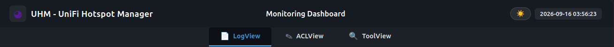</a>
</p>
<p align="center"><i>Panel header and tab bar</i></p>

<table width="100%">
  <tr>
    <td style="width: 50%; vertical-align: top;">
      There are two ways to reach each view: <code>http://localhost:4048/?tab=logview</code>, <code>?tab=aclview</code> or <code>?tab=toolview</code> open the panel on that tab, with the tab bar; <code>http://localhost:4048/logview/</code>, <code>/aclview/</code> and <code>/toolview/</code> open that module on its own, without the tab bar. Both forms are valid.
    </td>
    <td style="width: 50%; vertical-align: top;">
      Hay dos maneras de llegar a cada vista: <code>http://localhost:4048/?tab=logview</code>, <code>?tab=aclview</code> o <code>?tab=toolview</code> abren el panel en esa pestaña, con la barra de pestañas; <code>http://localhost:4048/logview/</code>, <code>/aclview/</code> y <code>/toolview/</code> abren ese módulo solo, sin la barra. Ambas formas son válidas.
    </td>
  </tr>
</table>

<table>
  <tr>
    <td style="width: 50%; vertical-align: top;">
      <strong>Important</strong>
      <ul>
        <li>Requires <code>apache2</code> and <code>libapache2-mod-php</code>. No other service may be listening on the port.</li>
        <li>The web panel listens on port <code>4048</code>, registered by <a href="https://www.iana.org/assignments/service-names-port-numbers/service-names-port-numbers.txt">IANA</a> as Unassigned.</li>
        <li>The vhost ships with <code>192.168.0.0/24</code> as a safe default, replaced at install time with the real LAN range read from <code>pydhcp.env</code>. Access it at <code>http://&lt;SERVER_IP&gt;:4048/</code></li>
      </ul>
    </td>
    <td style="width: 50%; vertical-align: top;">
      <strong>Importante</strong>
      <ul>
        <li>Requiere <code>apache2</code> y <code>libapache2-mod-php</code>. Ningún otro servicio puede estar escuchando en el puerto.</li>
        <li>El panel web escucha en el puerto <code>4048</code>, registrado por <a href="https://www.iana.org/assignments/service-names-port-numbers/service-names-port-numbers.txt">IANA</a> como Sin asignar.</li>
        <li>El vhost trae <code>192.168.0.0/24</code> como valor por defecto seguro, reemplazado en la instalación por el rango real de la LAN leído de <code>pydhcp.env</code>. Se accede en <code>http://&lt;SERVER_IP&gt;:4048/</code></li>
      </ul>
    </td>
  </tr>
</table>

##### LogView

<p align="center">
  <a href="https://github.com/maravento/uhm">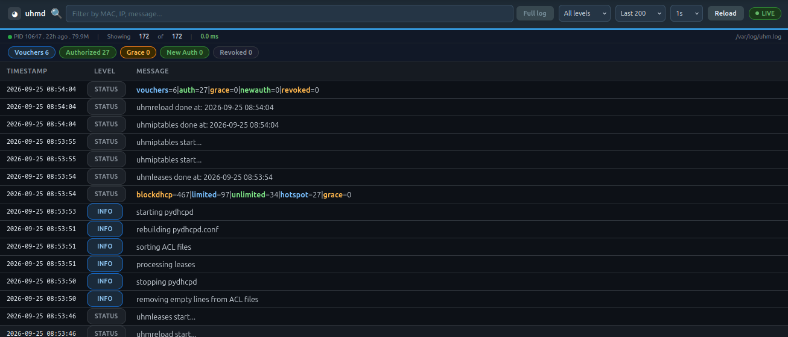</a>
</p>
<p align="center"><i>LogView — real-time viewer for uhmd</i></p>

<table width="100%">
  <tr>
    <td style="width: 50%; vertical-align: top;">
      Replaces <code>tail -f</code> for monitoring <code>/var/log/uhm.log</code>. It uses AJAX byte-offset polling — reading only new bytes since the last position — so it never stalls on log rotation.
    </td>
    <td style="width: 50%; vertical-align: top;">
      Reemplaza a <code>tail -f</code> para monitorear <code>/var/log/uhm.log</code>. Usa polling AJAX por byte offset — leyendo solo los bytes nuevos desde la última posición — así nunca se atasca con la rotación de logs.
    </td>
  </tr>
</table>

| Feature | Description | Descripción |
|---------|--------------|-------------|
| **Live polling** | AJAX polling by byte offset (1s–30s configurable). Never stalls on log rotation. | Polling AJAX por byte offset (1s–30s configurable). No se atasca con la rotación de logs. |
| **Level badges** | Color-coded badges, one distinctive color per level: INFO (`#d1ecf1`/`#0c5460`), WARNING (`#fff3cd`/`#856404`), ERROR (`#f8d7da`/`#721c24`), FIX (`#d4edda`/`#155724`), ALERT (`#e2d9f3`/`#432874`), STATUS (`#e2e3e5`/`#383d41`). | Badges con color, un color distintivo por nivel: INFO (`#d1ecf1`/`#0c5460`), WARNING (`#fff3cd`/`#856404`), ERROR (`#f8d7da`/`#721c24`), FIX (`#d4edda`/`#155724`), ALERT (`#e2d9f3`/`#432874`), STATUS (`#e2e3e5`/`#383d41`). |
| **Cycle stats bar** | Parses the last stats line and shows Vouchers, Authorized, Grace, New Auth, Revoked as pills. | Parsea la última línea de stats y muestra Vouchers, Authorized, Grace, New Auth, Revoked como pills. |
| **Service status** | Shows PID, uptime, and memory from `systemctl status uhmd`. | Muestra PID, uptime y memoria desde `systemctl status uhmd`. |

###### Controls

<p align="center">
  <a href="https://github.com/maravento/uhm"></a>
</p>
<p align="center"><i>LogView toolbar — search box, Full log, filters, interval, Reload and LIVE indicator</i></p>

| Control | Description | Descripción |
|---------|-------------|-------------|
|  <br> **Dark / Light mode** | Toggle with moon/sun button in the panel header. Preference saved in `localStorage` and shared by the three tabs. | Alternancia con botón luna/sol en la cabecera del panel. Preferencia guardada en `localStorage` y compartida por las tres pestañas. |
|  **Search box** | Live filter on the rows already loaded. Plain substring match, case-insensitive. | Filtro en vivo sobre las filas ya cargadas. Coincidencia de subcadena literal, sin distinguir mayúsculas/minúsculas. |
|  <br> **Full log / Live mode** | Displays the complete log file. In **Live mode**, the viewer polls the tail of the log. Type a term in the search box and the button turns blue; press it to search the whole file via `grep -Fia`, with results highlighted inline. The button then turns orange and reads **Live mode**; press it again to return to the log view. With an empty search box, the search action stays grey and disabled. | Muestra el archivo de log completo. En **Live mode**, el visor consulta el final del log. Escriba un término en la caja de búsqueda y el botón se pone azul; púlselo para buscar en el archivo completo mediante `grep -Fia`, con resultados resaltados inline. El botón pasa a naranja y dice **Live mode**; púlselo otra vez para volver a la vista del log. Con la caja de búsqueda vacía, la acción de búsqueda permanece gris e inactiva. |
| 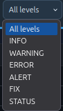  **Level** | Filters by log level: All levels, INFO, WARNING, ERROR, ALERT, FIX, STATUS. Default: All levels. | Filtra por nivel de log: All levels, INFO, WARNING, ERROR, ALERT, FIX, STATUS. Por defecto: All levels. |
| 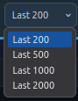 **Last** | Number of lines read from the end of the log: 200, 500, 1000 or 2000. Default: 200. | Cantidad de líneas leídas desde el final del log: 200, 500, 1000 o 2000. Por defecto: 200. |
| 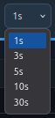 **Interval** | Polling interval for new bytes: 1s, 3s, 5s, 10s or 30s. Default: 1s. | Intervalo de sondeo de bytes nuevos: 1s, 3s, 5s, 10s o 30s. Por defecto: 1s. |
|  **Reload** | Discards what is on screen and reads the log again. | Descarta lo que hay en pantalla y vuelve a leer el log. |
|  **LIVE / PAUSED** | Click to pause the polling and click again to resume. Paused freezes the view; no line is lost. | Se pulsa para pausar el polling y se pulsa otra vez para reanudar. En pausa la vista se congela; no se pierde ninguna línea. |

##### ACLView

<p align="center">
  <a href="https://github.com/maravento/uhm">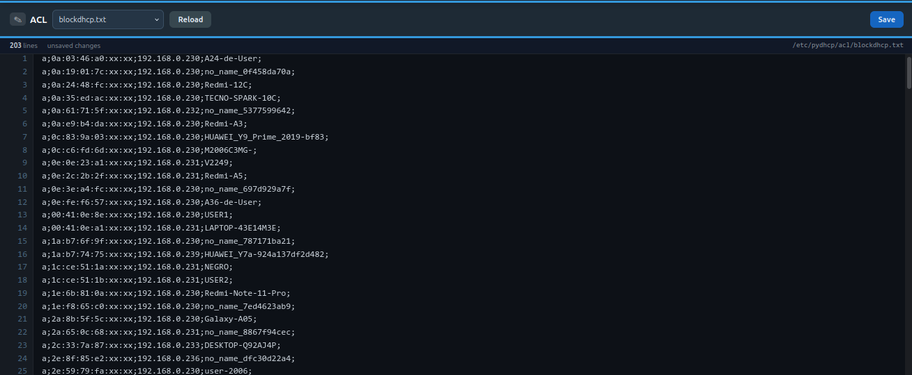</a>
</p>
<p align="center"><i>ACLView — editor for the ACL lists</i></p>

<table width="100%">
  <tr>
    <td style="width: 50%; vertical-align: top;">
      Editor for the ACL lists. <br>
      <br>
      The selector offers the four files declared in <code>uhm.env</code> and <code>pydhcp.env</code> —<code>uhm-auth</code>, <code>uhm-grace</code>, <code>uhm-queue</code> and <code>blockdhcp</code>— plus every <code>mac-*.txt</code> found in <code>ACL_MAC_PATH</code>. No other path is reachable. <br>
      <br>
      Each line is validated against the exact format its own file requires, the same one <code>uhmleases.sh</code> enforces. A single malformed line rejects the whole save and reports its line number, so a list that would abort the daemon's reload chain never reaches the disk. <br>
      <br>
      The previous content is kept as <code>&lt;file&gt;.bak</code>.
    </td>
    <td style="width: 50%; vertical-align: top;">
      Editor de las listas ACL. <br>
      <br>
      El selector ofrece los cuatro archivos declarados en <code>uhm.env</code> y <code>pydhcp.env</code> —<code>uhm-auth</code>, <code>uhm-grace</code>, <code>uhm-queue</code> y <code>blockdhcp</code>— más todos los <code>mac-*.txt</code> encontrados en <code>ACL_MAC_PATH</code>. Ninguna otra ruta es alcanzable. <br>
      <br>
      Cada línea se valida contra el formato exacto que exige su propio archivo, el mismo que impone <code>uhmleases.sh</code>. Una sola línea malformada rechaza el guardado completo e informa su número de línea, de modo que una lista que abortaría la cadena de reload del daemon nunca llega al disco. <br>
      <br>
      El contenido anterior se conserva como <code>&lt;archivo&gt;.bak</code>.
    </td>
  </tr>
</table>

##### ToolView

<p align="center">
  <a href="https://github.com/maravento/uhm">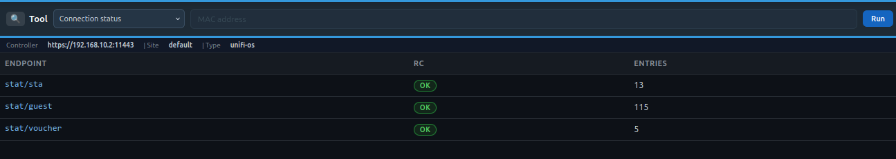</a>
</p>
<p align="center"><i>ToolView — local ACL and UniFi reports</i></p>

<table width="100%">
  <tr>
    <td style="width: 50%; vertical-align: top;">
      All reports are read-only and generated by <code>tools/uhmtool.sh</code>. <br>
      <br>
      <b>Local ACL</b> — The <b>Check MAC</b>, <b>Grace period</b>, <b>Consistency check</b> and <b>Search by IP or hostname</b> options read the local DHCP and ACL files: <code>uhm-auth.txt</code>, <code>uhm-grace.txt</code>, <code>blockdhcp.txt</code>, <code>mac-*.txt</code> and <code>pydhcpd.leases</code>. <br>
      <br>
      <b>UniFi</b> — The <b>Connection status</b>, <b>Authorized</b>, <b>Vouchers</b>, <b>Guest sessions</b> and <b>Unauthorized</b> options query the UniFi controller directly. <br>
      <br>
      To check the live state of a specific MAC from the terminal —including ESSID, authorization, <code>is_guest</code>, IP, hostname and voucher code— use the <b>Check MAC</b> option of <code>uhmunifi.sh</code>. <br>
      <br>
      Operations that modify information, such as deleting or revoking vouchers, are performed from <code>uhmunifi.sh</code> in the terminal. This panel is for consultation only and makes no changes.
    </td>
    <td style="width: 50%; vertical-align: top;">
      Todos los reportes son de solo lectura y se generan mediante <code>tools/uhmtool.sh</code>. <br>
      <br>
      <b>ACL local</b> — Las opciones <b>Check MAC</b>, <b>Grace period</b>, <b>Consistency check</b> y <b>Search by IP or hostname</b> consultan los archivos locales de DHCP y ACL: <code>uhm-auth.txt</code>, <code>uhm-grace.txt</code>, <code>blockdhcp.txt</code>, <code>mac-*.txt</code> y <code>pydhcpd.leases</code>. <br>
      <br>
      <b>UniFi</b> — Las opciones <b>Connection status</b>, <b>Authorized</b>, <b>Vouchers</b>, <b>Guest sessions</b> y <b>Unauthorized</b> consultan directamente el controlador UniFi. <br>
      <br>
      Para consultar desde la terminal el estado en vivo de una MAC específica —incluidos ESSID, autorización, <code>is_guest</code>, IP, hostname y código de voucher— use la opción <b>Check MAC</b> de <code>uhmunifi.sh</code>. <br>
      <br>
      Las operaciones que modifican información, como borrar o revocar vouchers, se realizan desde <code>uhmunifi.sh</code> en la terminal. Este panel es exclusivamente de consulta y no realiza cambios.
    </td>
  </tr>
</table>

<p align="center">
  <a href="https://github.com/maravento/uhm">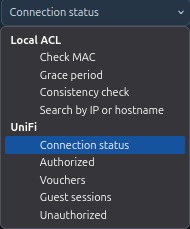</a>
</p>
<p align="center"><i>Report selector</i></p>

### Reconfigure

<table>
  <tr>
    <td style="width: 50%; vertical-align: top;">
      To reconfigure, edit <code>/etc/uhm/uhm.env</code> directly. To start over from scratch, uninstall first with <code>uhmsetup.sh --remove</code>, then re-run the installer -- deleting only the config file is not enough, the installer refuses to run again while the deployed scripts are still present.
    </td>
    <td style="width: 50%; vertical-align: top;">
      Para reconfigurar, edite <code>/etc/uhm/uhm.env</code> directamente. Para empezar de cero, desinstale primero con <code>uhmsetup.sh --remove</code> y luego vuelva a ejecutar el instalador -- borrar solo el archivo de config no basta, el instalador se niega a correr de nuevo mientras los scripts desplegados sigan presentes.
    </td>
  </tr>
</table>

```bash
# Edit any value (credentials, interfaces, range, ports, SSID, etc.)
sudo nano /etc/uhm/uhm.env

# Or: force a fresh interactive setup
cd uhm && sudo bash uhmsetup.sh --remove
sudo bash uhmsetup.sh
```

<table>
  <tr>
    <td style="width: 50%; vertical-align: top;">
      (For full uninstall, see the Remove section above.)
    </td>
    <td style="width: 50%; vertical-align: top;">
      (Para desinstalar por completo, vea la sección Remove más arriba.)
    </td>
  </tr>
</table>

## HOW IT WORKS

---

### Daemon Cycle

<table>
  <tr>
    <td style="width: 50%; vertical-align: top;">
      The daemon executes a full cycle every <code>POLL_INTERVAL</code> seconds (default 20, configured in <code>uhm.env</code>). Each cycle executes ten steps. Two independent mechanisms run inside the same cycle without being numbered steps -- see Independent Mechanisms below.
      <ol>
        <li><b>malformed</b> — before any other step opens an ACL list, each list is checked against its own line format. <br>
          In <code>uhm-grace.txt</code>, <code>blockdhcp.txt</code> and the lease removal queue, a bad line is deleted and the cycle continues. Those lists authorize nothing. <br>
          In <code>uhm-auth.txt</code> a bad line is only reported with a <code>WARNING</code> and left in place. Deleting it would revoke a guest's access with no record beyond its disappearance, so it is left for <code>uhmleases.sh</code> to abort on. <br>
          <code>mac-*.txt</code> is never touched in this step.</li>
        <li><b>vouchers</b> — loads the full voucher list from UniFi (<code>stat/voucher</code>) into an in-memory cache shared by the sessions step.</li>
        <li><b>snapshot</b> — captures md5 baselines of the ACL files before any modification. Taken before <b>dedup</b> so that step's <code>blockdhcp.txt</code> changes are detected as a real ACL change by the reload step below.</li>
        <li><b>dedup</b> — consistency check between <code>uhm-auth.txt</code> and <code>blockdhcp.txt</code> only. It removes from <code>blockdhcp.txt</code> any MAC that also appears in <code>uhm-auth.txt</code>. It also repairs malformed lines of <code>blockdhcp.txt</code> when the MAC, the IP and the hostname can still be recovered, for example when the trailing <code>;</code> is missing. <br>
          A line that cannot be recovered, because a required field is empty after parsing, is discarded and a WARNING is logged, instead of being written back malformed. Neither <code>blockdhcp.txt</code> nor <code>uhm-grace.txt</code> authorize anything, so discarding a broken entry only means that the MAC is treated as new again on its next lease. <br>
          This step never reads the content of <code>mac-*.txt</code>. See Managed MAC lists below.</li>
        <li><b>sort</b> — sorts and deduplicates <code>uhm-auth.txt</code> by IP.</li>
        <li><b>expire</b> — for each entry of <code>uhm-auth.txt</code> whose <code>END_TIME_EPOCH</code> is in the past, the step releases it: it queues a lease removal for <code>uhmleases.sh</code> and removes the entry from the file. <br>
          It applies whether the entry is active (<code>a;</code>) or deactivated (<code>#a;</code>). Unlike <code>mac-*.txt</code>, an entry of <code>uhm-auth.txt</code> is tied to a voucher's lifecycle and always has an expiry. Commenting it out does not pause that clock. <br>
          The MAC is not preserved anywhere else. On reconnecting it is treated as a new client and returns to <code>uhm-grace.txt</code> with a fresh grace timer.</li>
        <li><b>new leases</b> — scans <code>pydhcpd.leases</code> directly. Any MAC that is not yet in <code>uhm-auth.txt</code>, <code>blockdhcp.txt</code>, <code>uhm-grace.txt</code> or a <code>mac-*.txt</code>, checked live against disk through <code>is_managed_mac</code>, is written into <code>uhm-grace.txt</code> with a first-seen timestamp. <br>
          No fixed IP of the hotspot range is assigned and no lease removal is queued. The client keeps the pool lease it already had. <br>
          This is the step that makes new clients visible. Writing <code>uhm-grace.txt</code> is what triggers the reload step below.</li>
        <li><b>sessions</b> — queries <code>stat/guest</code> and filters by <code>end &gt; now</code>, because the <code>expired==false</code> flag is unreliable in UniFi, and by <code>authorized_by == "voucher"</code>. <br>
          That second filter is what keeps this list a voucher list. <code>stat/guest</code> reports every guest authorization whatever its origin, and UniFi records that origin on each session: <code>voucher</code> for a redeemed voucher, and <code>api</code> for an <code>authorize-guest</code> call to <code>cmd/stamgr</code>, made by this daemon's own <code>authorize_managed_macs</code>, by the UniFi UI or by any external integration. <br>
          An <code>api</code> grant is backed by no voucher and expires on the duration that grant chose, so it must never be promoted. The flag is stored on the session itself, so it remains valid even after UniFi purges the voucher on quota exhaustion. <br>
          For each qualifying client that is not yet in <code>uhm-auth.txt</code>, this step assigns the next free IP of the hotspot range with hostname <code>guest{N}-{voucher_code}</code>. <br>
          Two cases are skipped:
          <ul>
            <li>Any MAC listed in <code>mac-*.txt</code>, active or commented, checked live against disk. This guards against a stale guest authorization, or one granted outside the daemon, for a managed device.</li>
            <li>A MAC revoked in an earlier cycle, while its <code>stat/guest</code> session is still the same one it had when it was revoked. Redeeming a voucher is the only way into <code>uhm-auth.txt</code>, and a session UniFi already invalidated must not reopen that door on its own.</li>
          </ul>
        </li>
        <li><b>revoke</b> — queries <code>stat/sta</code>. For each MAC of <code>uhm-auth.txt</code> that UniFi reports with <code>authorized=false</code>, it removes the entry from <code>uhm-auth.txt</code>, queues a lease removal and records the session's <code>end_time</code>, so that the sessions step above does not re-authorize it from that same session. <br>
          The record is dropped as soon as <code>stat/sta</code> stops reporting that MAC as <code>authorized=false</code>. Re-authorizing the client from the UniFi UI therefore takes effect on the next cycle. A genuinely new voucher carries a different <code>end_time</code> and is honoured immediately.</li>
        <li><b>reload</b> — compares the md5 of the ACLs against the baseline, including <code>uhm-grace.txt</code>, or takes a <code>mac-*.txt</code> change flagged by the independent watcher on the previous cycle. See Independent Mechanisms. <br>
          If something changed, or if more than <code>RELOAD_SAFETY_INTERVAL_SECONDS</code> have passed since the last reload, one hour by default, it invokes <code>UHM_RELOAD</code> and waits for it to finish without a time limit of its own. <code>uhmreload.sh</code> bounds each of its own steps separately. See uhmreload. A single invocation covers both triggers when they coincide. <br>
          The safety-net path is what promotes expired grace entries to <code>blockdhcp.txt</code> on idle networks, where no new client would trigger a reload. <br>
          If nothing is due, nothing is logged. The daemon stays silent on cycles without changes, by design. See the LOGS section below.</li>
        <li><b>kick</b> — for each MAC newly promoted to <code>uhm-auth.txt</code> this cycle that's still connected (checked against <code>stat/sta</code>), force a disassociation via <code>kick-sta</code> so the client reconnects immediately with its new fixed IP instead of racing its stale pool lease. Also skips any <code>mac-*.txt</code> MAC, as defense-in-depth (structurally unreachable here, since step 7 already excludes them).</li>
      </ol>
    </td>
    <td style="width: 50%; vertical-align: top;">
      El daemon ejecuta un ciclo completo cada <code>POLL_INTERVAL</code> segundos (default 20, configurado en <code>uhm.env</code>). Cada ciclo ejecuta diez pasos. Dos mecanismos independientes corren dentro del mismo ciclo sin ser pasos numerados -- ver Independent Mechanisms más abajo.
      <ol>
        <li><b>malformed</b> — antes de que cualquier otro paso abra una lista ACL, cada lista se comprueba contra su propio formato de línea. <br>
          En <code>uhm-grace.txt</code>, <code>blockdhcp.txt</code> y la cola de remoción de leases, una línea mala se elimina y el ciclo continúa. Esas listas no autorizan nada. <br>
          En <code>uhm-auth.txt</code> una línea mala solo se reporta con un <code>WARNING</code> y se deja en su lugar. Borrarla quitaría el acceso a un invitado sin más constancia que su desaparición, así que se deja para que <code>uhmleases.sh</code> aborte. <br>
          <code>mac-*.txt</code> no se toca en este paso.</li>
        <li><b>vouchers</b> — carga la lista completa de vouchers desde UniFi (<code>stat/voucher</code>) en una caché en memoria compartida por el paso sessions.</li>
        <li><b>snapshot</b> — captura md5 baseline de los archivos ACL antes de cualquier modificación. Se toma antes de <b>dedup</b> para que los cambios de ese paso en <code>blockdhcp.txt</code> sean detectados como un cambio real de ACL por el paso de reload.</li>
        <li><b>dedup</b> — chequeo de consistencia solo entre <code>uhm-auth.txt</code> y <code>blockdhcp.txt</code>. Elimina de <code>blockdhcp.txt</code> cualquier MAC que también aparezca en <code>uhm-auth.txt</code>. También repara líneas malformadas de <code>blockdhcp.txt</code> cuando la MAC, la IP y el hostname todavía se pueden recuperar, por ejemplo cuando falta el <code>;</code> final. <br>
          Una línea que no se puede recuperar, porque un campo obligatorio queda vacío tras el parseo, se descarta y se registra un WARNING, en vez de reescribirse malformada. Ni <code>blockdhcp.txt</code> ni <code>uhm-grace.txt</code> autorizan nada, así que descartar una entrada rota solo significa que esa MAC vuelve a tratarse como nueva en su próximo lease. <br>
          Este paso nunca lee el contenido de <code>mac-*.txt</code>. Ver Listas de MAC gestionadas más abajo.</li>
        <li><b>sort</b> — ordena y deduplica <code>uhm-auth.txt</code> por IP.</li>
        <li><b>expire</b> — para cada entrada de <code>uhm-auth.txt</code> cuyo <code>END_TIME_EPOCH</code> ya pasó, el paso la libera: encola una remoción de lease para <code>uhmleases.sh</code> y elimina la entrada del archivo. <br>
          Aplica tanto si la entrada está activa (<code>a;</code>) como desactivada (<code>#a;</code>). A diferencia de <code>mac-*.txt</code>, una entrada de <code>uhm-auth.txt</code> está atada al ciclo de vida de un voucher y siempre tiene vencimiento. Comentarla no detiene ese reloj. <br>
          La MAC no se conserva en ninguna otra ubicación. Al reconectarse se trata como un cliente nuevo y vuelve a <code>uhm-grace.txt</code> con un contador de gracia nuevo.</li>
        <li><b>clientes nuevos</b> — escanea <code>pydhcpd.leases</code> directamente. Cualquier MAC que aún no esté en <code>uhm-auth.txt</code>, <code>blockdhcp.txt</code>, <code>uhm-grace.txt</code> ni en un <code>mac-*.txt</code>, verificada en vivo contra el disco mediante <code>is_managed_mac</code>, se escribe en <code>uhm-grace.txt</code> con una marca de primer contacto. <br>
          No se asigna IP fija del rango del hotspot ni se encola remoción de lease. El cliente conserva el lease de pool que ya tenía. <br>
          Este es el paso que hace visibles a los clientes nuevos. Escribir <code>uhm-grace.txt</code> es lo que dispara el paso de reload más abajo.</li>
        <li><b>sessions</b> — consulta <code>stat/guest</code> y filtra por <code>end &gt; now</code>, porque el flag <code>expired==false</code> no es confiable en UniFi, y por <code>authorized_by == "voucher"</code>. <br>
          Ese segundo filtro es lo que mantiene esta lista como lista de vouchers. <code>stat/guest</code> reporta toda autorización de invitado sea cual sea su origen, y UniFi registra ese origen en cada sesión: <code>voucher</code> para un voucher canjeado, y <code>api</code> para una llamada <code>authorize-guest</code> a <code>cmd/stamgr</code>, hecha por el propio <code>authorize_managed_macs</code> de este daemon, por la UI de UniFi o por cualquier integración externa. <br>
          Una concesión <code>api</code> no está respaldada por ningún voucher y expira según la duración que eligiera esa concesión, así que nunca debe promoverse. El flag se guarda en la propia sesión, por lo que sigue siendo válido incluso después de que UniFi purgue el voucher al agotarse su cuota. <br>
          Para cada cliente que califique y no esté aún en <code>uhm-auth.txt</code>, este paso asigna la siguiente IP libre del rango del hotspot con hostname <code>guest{N}-{codigo_voucher}</code>. <br>
          Se omiten dos casos:
          <ul>
            <li>Cualquier MAC listada en <code>mac-*.txt</code>, activa o comentada, comprobada en vivo contra el disco. Esto protege frente a una autorización de invitado residual, o concedida fuera del daemon, para un dispositivo gestionado.</li>
            <li>Una MAC revocada en un ciclo anterior, mientras su sesión de <code>stat/guest</code> siga siendo la misma que tenía al ser revocada. Canjear un voucher es la única entrada a <code>uhm-auth.txt</code>, y una sesión que UniFi ya invalidó no debe reabrir esa puerta por su cuenta.</li>
          </ul>
        </li>
        <li><b>revoke</b> — consulta <code>stat/sta</code>. Para cada MAC de <code>uhm-auth.txt</code> que UniFi reporta con <code>authorized=false</code>, elimina la entrada de <code>uhm-auth.txt</code>, encola una remoción de lease y registra el <code>end_time</code> de la sesión, para que el paso sessions de arriba no la reautorice desde esa misma sesión. <br>
          El registro se descarta apenas <code>stat/sta</code> deja de reportar esa MAC como <code>authorized=false</code>. Por eso, reautorizar al cliente desde la UI de UniFi surte efecto en el ciclo siguiente. Un voucher realmente nuevo trae otro <code>end_time</code> y se respeta de inmediato.</li>
        <li><b>reload</b> — compara el md5 de las ACL contra la baseline, incluyendo <code>uhm-grace.txt</code>, o toma un cambio en <code>mac-*.txt</code> marcado por el watcher independiente en el ciclo anterior. Ver Independent Mechanisms. <br>
          Si algo cambió, o si pasó más de <code>RELOAD_SAFETY_INTERVAL_SECONDS</code> desde el último reload, una hora por defecto, invoca <code>UHM_RELOAD</code> y espera a que termine sin un límite de tiempo propio. <code>uhmreload.sh</code> acota cada uno de sus pasos por separado. Ver uhmreload. Una sola invocación cubre ambos disparadores cuando coinciden. <br>
          El camino de seguridad es el que promueve entradas de gracia expiradas a <code>blockdhcp.txt</code> en redes inactivas, donde ningún cliente nuevo dispararía un reload. <br>
          Si no hay nada pendiente, no se registra nada. El daemon permanece en silencio en los ciclos sin cambios, por diseño. Ver la sección LOGS más abajo.</li>
        <li><b>kick</b> — para cada MAC recién promovida a <code>uhm-auth.txt</code> en este ciclo que siga conectada (verificado contra <code>stat/sta</code>), fuerza una desasociación vía <code>kick-sta</code> para que el cliente se reconecte de inmediato con su nueva IP fija en vez de competir con su lease de pool ya vencido. También salta cualquier MAC de <code>mac-*.txt</code>, como defensa adicional (estructuralmente inalcanzable aquí, ya que el paso 7 ya las excluye).</li>
      </ol>
    </td>
  </tr>
</table>

### Independent Mechanisms

<table>
  <tr>
    <td style="width: 50%; vertical-align: top;">
      <b>mac-*.txt change watcher</b> (independent, not a numbered step): every cycle, right after <b>snapshot</b>, fingerprints all <code>mac-*.txt</code> files with a combined md5 (existence + content, no MAC/status parsing) and compares it to the previous cycle's. If it changed, the reload isn't triggered immediately — it's flagged for the <b>reload</b> step to pick up next cycle, so it never causes a second, separate <code>uhmreload.sh</code> invocation in the same run as one already triggered by the ACL files above.
      <br><br>
      This is why an edit always produces <b>two</b> log lines, one cycle apart, not one — they mark two different moments, not a duplicate:
      <code>2026-07-23 22:01:28 INFO: mac-*.txt changed, reload next cycle</code><br>
      <code>2026-07-23 22:01:31 INFO: mac-*.txt changed, reloading now</code><br>
      <code>2026-07-23 22:01:31 INFO: invoking /etc/uhm/core/uhmreload.sh</code>
      <br><br>
      The first line is the watcher noticing the change (this cycle); the second is the reload step actually acting on it (next cycle), immediately followed by the actual invocation. Seeing only the first without a follow-up second line one cycle later would itself be a sign something is wrong.
      <br><br>
      <b>authorize_managed_macs</b> <br>
      <br>
      It is an independent mechanism, not a numbered step. It runs right after <b>revoke</b>, reusing the same <code>stat/sta</code> already fetched on that cycle. <br>
      <br>
      For each active MAC of <code>mac-*.txt</code> that <code>stat/sta</code> currently reports as <code>authorized=false</code>, it calls UniFi's <code>authorize-guest</code>. The duration is derived from <code>AUTHORIZED_LEASE_TIME / 60</code>, that is, the same lease time pydhcp already gives those devices, 30 days by default. <br>
      <br>
      This exists because on a WLAN configured as Guest/Hotspot the AP keeps a client at the captive portal according to its own per-client <code>authorized</code> flag in UniFi. That happens regardless of the fixed-address DHCP bypass of <code>pydhcpd</code> and of the firewall rules of <code>uhmiptables.sh</code>. It was confirmed with direct queries to <code>stat/sta</code> showing <code>is_guest=true</code> and <code>authorized=false</code> for a <code>mac-*.txt</code> device with an otherwise correct fixed IP. <br>
      <br>
      It only touches UniFi's own state, never <code>uhm-auth.txt</code> nor any local ACL. It is self-repairing by design: it keeps no separate "already authorized" cache, so it authorizes the device again on its own if the UniFi state ever decays.
    </td>
    <td style="width: 50%; vertical-align: top;">
      <b>Watcher de cambios en mac-*.txt</b> (independiente, no es un paso numerado): cada ciclo, justo después de <b>snapshot</b>, calcula una huella md5 combinada de todos los <code>mac-*.txt</code> (existencia + contenido, sin parsear MAC/estado) y la compara con la del ciclo anterior. Si cambió, el reload no se dispara de inmediato — queda marcado para que el paso <b>reload</b> lo recoja en el siguiente ciclo, de modo que nunca provoca una segunda invocación separada de <code>uhmreload.sh</code> en la misma corrida que otra ya disparada por los archivos ACL de arriba.
      <br><br>
      Por eso una edición siempre produce <b>dos</b> líneas de log, separadas por un ciclo, no una — marcan dos momentos distintos, no una duplicación:
      <code>2026-07-23 22:01:28 INFO: mac-*.txt changed, reload next cycle</code><br>
      <code>2026-07-23 22:01:31 INFO: mac-*.txt changed, reloading now</code><br>
      <code>2026-07-23 22:01:31 INFO: invoking /etc/uhm/core/uhmreload.sh</code>
      <br><br>
      La primera línea es el watcher notando el cambio (este ciclo); la segunda es el paso de reload actuando sobre él (ciclo siguiente), seguida de inmediato por la invocación real. Ver solo la primera sin una segunda línea de seguimiento un ciclo después sería en sí misma una señal de que algo anda mal.
      <br><br>
      <b>authorize_managed_macs</b> <br>
      <br>
      Es un mecanismo independiente, no un paso numerado. Se ejecuta justo después de <b>revoke</b>, reutilizando el mismo <code>stat/sta</code> ya obtenido en ese ciclo. <br>
      <br>
      Para cada MAC activa de <code>mac-*.txt</code> que <code>stat/sta</code> reporta como <code>authorized=false</code>, llama a <code>authorize-guest</code> de UniFi. La duración se deriva de <code>AUTHORIZED_LEASE_TIME / 60</code>, es decir, el mismo lease time que pydhcp ya da a esos dispositivos, 30 días por defecto. <br>
      <br>
      Esto existe porque en una WLAN configurada como Guest/Hotspot el AP mantiene al cliente en el portal cautivo según su propio flag <code>authorized</code> por cliente en UniFi. Ocurre con independencia del bypass DHCP de dirección fija de <code>pydhcpd</code> y de las reglas de firewall de <code>uhmiptables.sh</code>. Se confirmó con consultas directas a <code>stat/sta</code> que mostraban <code>is_guest=true</code> y <code>authorized=false</code> para un dispositivo de <code>mac-*.txt</code> con una IP fija por lo demás correcta. <br>
      <br>
      Solo toca el estado propio de UniFi, nunca <code>uhm-auth.txt</code> ni ninguna ACL local. Es autorreparable por diseño: no mantiene una caché aparte de "ya autorizado", así que vuelve a autorizar el dispositivo por su cuenta si el estado de UniFi decae.
    </td>
  </tr>
</table>

### Client Flow

<table>
  <tr>
    <td style="width: 50%; vertical-align: top;">
      <b>Client flow</b> <br>
      <br>
      A new client connecting to the SSID receives a DHCP lease from <code>pydhcpd</code>'s pool. <br>
      <br>
      On the new-clients step, which runs on every <code>POLL_INTERVAL</code> cycle, <code>uhmd</code> reads <code>pydhcpd.leases</code> directly and writes the MAC into <code>uhm-grace.txt</code> along with a timestamp. That write is what triggers the reload. The reload runs <code>uhmleases.sh</code>, which performs the classification, the expiration and the blocking. <br>
      <br>
      From there, the MAC can follow two paths:
      <ul>
        <li>If the client enters a voucher, <code>uhmd</code> promotes it to <code>uhm-auth.txt</code> and assigns it a fixed IP from the hotspot range.</li>
        <li>If <code>BLOCKDHCP_GRACE_SECONDS</code> elapse without a voucher, the MAC moves to <code>blockdhcp.txt</code>. Reconnections during that period do not reset the timer.</li>
      </ul>
      When a voucher expires, the MAC is removed from <code>uhm-auth.txt</code>. It is not kept in any other location. On reconnecting it is treated as a new client and goes back to <code>uhm-grace.txt</code> with a fresh grace timer. <br>
      <br>
      <code>blockdhcp.txt</code> has two exits: removing the entry by hand, or adding the MAC to a <code>mac-*.txt</code> file.
      <br><br>
      <br><br>
      <b>Record format</b> <br>
      <br>
      <code>a;MAC;IP;HOSTNAME;END_TIME_EPOCH;</code> in <code>uhm-auth.txt</code>. <br>
      <code>a;MAC;IP;HOSTNAME;FIRST_SEEN_EPOCH;</code> in <code>uhm-grace.txt</code>. <br>
      <br>
      The leading <code>a</code> means "active" and marks a well-formed entry. Any other leading character makes the line malformed. <br>
      <br>
      There is no opposite value. To deactivate an entry, comment out the whole line by adding <code>#</code> at the beginning. Do not edit the <code>a</code> itself. <br>
      <br>
      In <code>uhm-auth.txt</code>, commenting out a line only changes its treatment at the DHCP level: the client goes from a fixed address to the <code>blockdhcp</code> class, the same as a commented entry in <code>mac-*.txt</code>. <br>
      <br>
      Commenting out a line does not pause <code>END_TIME_EPOCH</code>. The expire step removes the line once the voucher's time is up, whether the line is active or commented.
      <br><br>
      <b>Malformed <code>uhm-grace.txt</code> lines</b>: <code>uhmleases.sh</code>'s <code>expire_grace_entries()</code> discards, rather than keeps, any line with a bad status/MAC/epoch field. This is intentional: the only writer of this file always writes a valid entry, so a dropped MAC is simply re-added correctly on its next DHCP lease renewal — keeping a malformed line instead would block that self-repair, since the file's own MAC-match check would treat it as already tracked and never write a fresh, valid entry for it.
      <br><br>
      <b>Auth resilience</b>: the CSRF token is extracted from the UniFi OS JWT payload (<code>csrfToken</code> field, <code>unifi-os</code>) or from the response header (<code>classic</code>) after login, and persisted to <code>/run/uhmd_session</code> so it survives across <code>$(...)</code> subshell boundaries. On HTTP 401 from any API call, the daemon re-authenticates once and retries automatically.
      <br><br>
      <b>Re-authorizing a client from the UniFi UI</b> <br>
      <br>
      After a client has been revoked, that is, after UniFi reported it as <code>authorized=false</code>, re-authorizing it from the UniFi UI takes one extra cycle to take effect. That is one <code>POLL_INTERVAL</code>, 20 seconds with the default value. <br>
      <br>
      This is not a delay in UniFi. It is the order of the daemon's own cycle. The sessions step (7) runs before <code>stat/sta</code> is queried for the revoke step (8). The record that blocks the re-authorization is therefore cleared only after sessions has already run, and the client is picked up on the following cycle. <br>
      <br>
      That order is deliberate and is documented in <code>run_cycle</code>. Querying <code>stat/sta</code> earlier would let a stale reading undo a voucher redeemed moments before. <br>
      <br>
      Redeeming a new voucher is not affected. It carries a different <code>end_time</code> and is honoured on the very next cycle.
    </td>
    <td style="width: 50%; vertical-align: top;">
      <b>Flujo del cliente</b> <br>
      <br>
      Un cliente nuevo que se conecta al SSID recibe un lease DHCP del pool de <code>pydhcpd</code>. <br>
      <br>
      En el paso de clientes nuevos, que se ejecuta en cada ciclo de <code>POLL_INTERVAL</code>, <code>uhmd</code> lee directamente <code>pydhcpd.leases</code> y escribe la MAC en <code>uhm-grace.txt</code> junto con una marca de tiempo. Esa escritura es la que dispara el reload. El reload ejecuta <code>uhmleases.sh</code>, que realiza la clasificación, la expiración y el bloqueo. <br>
      <br>
      A partir de ahí, la MAC puede seguir dos caminos:
      <ul>
        <li>Si el cliente introduce un voucher, <code>uhmd</code> la promueve a <code>uhm-auth.txt</code> y le asigna una IP fija del rango del hotspot.</li>
        <li>Si transcurre <code>BLOCKDHCP_GRACE_SECONDS</code> sin voucher, la MAC pasa a <code>blockdhcp.txt</code>. Las reconexiones durante ese periodo no reinician el contador.</li>
      </ul>
      Cuando un voucher expira, la MAC se elimina de <code>uhm-auth.txt</code>. No se conserva en ninguna otra ubicación. Al reconectarse se trata como un cliente nuevo y vuelve a <code>uhm-grace.txt</code> con un contador de gracia nuevo. <br>
      <br>
      <code>blockdhcp.txt</code> tiene dos salidas: eliminar la entrada manualmente, o incorporar la MAC a un archivo <code>mac-*.txt</code>.
      <br><br>
      <br><br>
      <b>Formato de registro</b> <br>
      <br>
      <code>a;MAC;IP;HOSTNAME;END_TIME_EPOCH;</code> en <code>uhm-auth.txt</code>. <br>
      <code>a;MAC;IP;HOSTNAME;FIRST_SEEN_EPOCH;</code> en <code>uhm-grace.txt</code>. <br>
      <br>
      La <code>a</code> inicial significa "active" y marca una entrada bien formada. Cualquier otro carácter inicial hace que la línea esté malformada. <br>
      <br>
      No existe un valor opuesto. Para desactivar una entrada, comente la línea completa agregando <code>#</code> al inicio. No edite la <code>a</code>. <br>
      <br>
      En <code>uhm-auth.txt</code>, comentar una línea solo cambia su tratamiento a nivel DHCP: el cliente pasa de dirección fija a la clase <code>blockdhcp</code>, igual que una entrada comentada de <code>mac-*.txt</code>. <br>
      <br>
      Comentar una línea no detiene <code>END_TIME_EPOCH</code>. El paso expire elimina la línea una vez cumplido el tiempo del voucher, esté activa o comentada.
      <br><br>
      <b>Líneas malformadas en <code>uhm-grace.txt</code></b>: <code>expire_grace_entries()</code> de <code>uhmleases.sh</code> descarta, en vez de conservar, cualquier línea con status/MAC/epoch inválido. Es intencional: el único proceso que escribe este archivo siempre escribe una entrada válida, así que una MAC descartada simplemente se vuelve a agregar correctamente en su siguiente renovación de lease DHCP — conservar la línea malformada en cambio bloquearía esa autoreparación, porque el chequeo de coincidencia por MAC del archivo la trataría como ya rastreada y nunca escribiría una entrada nueva y válida para ella.
      <br><br>
      <b>Resiliencia de auth</b>: el token CSRF se extrae del payload JWT de UniFi OS (campo <code>csrfToken</code>, <code>unifi-os</code>) o del header de respuesta (<code>classic</code>) tras el login, y se persiste en <code>/run/uhmd_session</code> para que sobreviva el límite de subshells <code>$(...)</code>. Ante HTTP 401 de cualquier llamada API, el daemon re-autentica una vez y reintenta automáticamente.
      <br><br>
      <b>Reautorizar un cliente desde la UI de UniFi</b> <br>
      <br>
      Después de que un cliente ha sido revocado, es decir, después de que UniFi lo reportó como <code>authorized=false</code>, reautorizarlo desde la UI de UniFi tarda un ciclo extra en surtir efecto. Ese ciclo es un <code>POLL_INTERVAL</code>, 20 segundos con el valor por defecto. <br>
      <br>
      No es una demora de UniFi. Es el orden del propio ciclo del daemon. El paso sessions (7) se ejecuta antes de que se consulte <code>stat/sta</code> para el paso revoke (8). Por eso el registro que bloquea la reautorización solo se descarta cuando sessions ya se ejecutó, y el cliente se recoge en el ciclo siguiente. <br>
      <br>
      Ese orden es deliberado y está documentado en <code>run_cycle</code>. Consultar <code>stat/sta</code> antes permitiría que una lectura obsoleta deshiciera un voucher canjeado instantes atrás. <br>
      <br>
      Canjear un voucher nuevo no se ve afectado. Trae otro <code>end_time</code> y se respeta en el ciclo inmediatamente siguiente.
    </td>
  </tr>
</table>

### Firewall Rules (user-provided)

<table>
  <tr>
    <td style="width: 50%; vertical-align: top;">
      The firewall is managed independently by the administrator via <code>/etc/uhm/tools/uhmiptables.sh</code> (see Scope), invoked by <code>uhmreload.sh</code> after every ACL change. The script flushes and rebuilds all ipsets and iptables rules from scratch on each run. Variables are loaded exclusively from <code>uhm.env</code> — no hardcoded network-specific values (interfaces, IPs, DNS). The UniFi ports listed below are fixed protocol requirements, not environment-specific, and are intentionally hardcoded.
      <br><br>
      The exact ipsets, rule order, and redirects are defined in <a href="tools/uhmiptables_example.txt"><code>tools/uhmiptables_example.txt</code></a> — read that file directly rather than a copy here, since it changes independently of this document and a duplicated excerpt would inevitably drift out of sync with the real rules.
      <br><br>
      <b>Note:</b> <code>uhmiptables.sh</code> is invoked automatically by <code>uhmreload.sh</code> — never run it manually during normal operation. The script flushes ALL iptables rules and ipsets on every run. Variables (<code>$lan</code>, <code>$wan</code>, <code>$localnet</code>, <code>$netmask</code>, <code>$serverip</code>, <code>$cpd_tcp</code>, <code>$SERV_DNS</code>) are loaded at runtime exclusively from <code>uhm.env</code>.
      <br><br>
      <b>Minimal template</b> <br>
      <br>
      <code>uhmsetup.sh</code> deploys <code>tools/uhmiptables.sh</code> as a minimal but fully working template. It enables IPv4 forwarding and adds a NAT MASQUERADE rule on the WAN interface. Ubuntu does not do either by default, and without them LAN clients get a lease but reach nothing. <br>
      <br>
      Its rules live in a dedicated <code>UHM_NAT</code> chain, flushed and rebuilt on every run so they never pile up. Nothing outside that chain is touched, so a firewall managed by other means stays intact. <br>
      <br>
      The template does not redirect to a proxy, does not filter ports, does not bind MAC to IP and does not build any ipset. For that, copy <code>tools/uhmiptables_example.txt</code> over this file and adapt it. <br>
      <br>
      The file is deployed only when it is missing and is never overwritten afterwards, since it becomes the administrator's own file once customized. <br>
      <br>
      Client classification into grace, authorized and blocked is done by <code>uhmd</code>. Blocked MACs are denied a lease by <code>pydhcpd</code>. The captive portal is enforced by UniFi's own per-client <code>authorized</code> flag. The three keep working independently of this file. <br>
      <br>
      If the file is missing, <code>uhmreload.sh</code> logs a warning and continues instead of treating it as a reload failure. See <code>uhmreload</code> in the CORE section for how the failure of this script, and of <code>uhmleases.sh</code>, is handled.
    </td>
    <td style="width: 50%; vertical-align: top;">
      El firewall es gestionado independientemente por el administrador vía <code>/etc/uhm/tools/uhmiptables.sh</code> (ver Scope), invocado por <code>uhmreload.sh</code> tras cada cambio de ACL. El script vacía y reconstruye todos los ipsets y reglas iptables desde cero en cada ejecución. Las variables se cargan exclusivamente desde <code>uhm.env</code> — sin valores hardcodeados específicos del entorno (interfaces, IPs, DNS). Los puertos de UniFi listados abajo son requisitos fijos de protocolo, no específicos del entorno, y están hardcodeados intencionalmente.
      <br><br>
      Los ipsets exactos, el orden de reglas y las redirecciones están definidos en <a href="tools/uhmiptables_example.txt"><code>tools/uhmiptables_example.txt</code></a> — consulte ese archivo directamente en vez de una copia aquí, ya que cambia independientemente de este documento y un extracto duplicado inevitablemente quedaría desincronizado de las reglas reales.
      <br><br>
      <b>Nota:</b> <code>uhmiptables.sh</code> es invocado automáticamente por <code>uhmreload.sh</code> — nunca ejecutarlo manualmente durante operación normal. El script vacía TODAS las reglas iptables e ipsets en cada ejecución. Las variables (<code>$lan</code>, <code>$wan</code>, <code>$localnet</code>, <code>$netmask</code>, <code>$serverip</code>, <code>$cpd_tcp</code>, <code>$SERV_DNS</code>) se cargan en tiempo de ejecución exclusivamente desde <code>uhm.env</code>.
      <br><br>
      <b>Plantilla mínima</b> <br>
      <br>
      <code>uhmsetup.sh</code> despliega <code>tools/uhmiptables.sh</code> como una plantilla mínima pero plenamente funcional. Habilita el reenvío IPv4 y añade una regla NAT MASQUERADE en la interfaz WAN. Ubuntu no hace ninguna de las dos cosas por defecto, y sin ellas los clientes LAN obtienen lease pero no alcanzan nada. <br>
      <br>
      Sus reglas viven en una cadena dedicada <code>UHM_NAT</code>, vaciada y reconstruida en cada ejecución para que nunca se acumulen. Nada fuera de esa cadena se toca, así que un firewall gestionado por otra vía queda intacto. <br>
      <br>
      La plantilla no redirige al proxy, no filtra puertos, no ata MAC a IP y no construye ningún ipset. Para eso, copie <code>tools/uhmiptables_example.txt</code> sobre este archivo y adáptelo. <br>
      <br>
      El archivo se despliega solo cuando falta y nunca se sobrescribe después, ya que pasa a ser propiedad del administrador una vez personalizado. <br>
      <br>
      La clasificación de clientes en gracia, autorizados y bloqueados la hace <code>uhmd</code>. A las MAC bloqueadas <code>pydhcpd</code> les niega el lease. El portal cautivo lo aplica el propio flag <code>authorized</code> por cliente de UniFi. Las tres cosas siguen funcionando con independencia de este archivo. <br>
      <br>
      Si el archivo falta, <code>uhmreload.sh</code> registra un warning y continúa en vez de tratarlo como fallo de reload. Ver <code>uhmreload</code> en la sección CORE para saber cómo se maneja el fallo de este script y el de <code>uhmleases.sh</code>.
    </td>
  </tr>
</table>

> **⚠️ WARNING:** Keep large blocklists out of this script. Use `iptables` for this project's own purposes, such as allowing or denying traffic by MAC/IP and port, as well as the captive-portal redirects. Do not use `iptables` to manage large lists of domains, IP addresses, reputation or content. For that kind of filtering, specialized tools are recommended, such as `Fail2ban`, `Unbound`, `Squid`, `Suricata`, among others. Bear in mind that `uhmiptables.sh` runs in full on every *reload*, and every *reload* stops and starts `pydhcpd`. Large lists can slow those cycles down and increase the risk of collisions while they run.

> **⚠️ WARNING:** Mantenga las listas de bloqueo grandes fuera de este script. Use `iptables` para las funciones propias de este proyecto, como permitir o denegar tráfico por MAC/IP y puerto, así como las redirecciones del portal cautivo. No utilice `iptables` para gestionar grandes listas de dominios, direcciones IP, reputación o contenido. Para este tipo de filtrado se recomienda utilizar herramientas especializadas, como `Fail2ban`, `Unbound`, `Squid`, `Suricata`, entre otras. Tenga en cuenta que `uhmiptables.sh` se ejecuta completamente en cada *reload*, y cada *reload* detiene y vuelve a iniciar `pydhcpd`. La presencia de listas grandes puede ralentizar estos ciclos y aumentar el riesgo de colisiones durante su ejecución.

**Required UniFi ports (hardcoded in `uhmiptables.sh`):**

| Port | Proto | Direction | Purpose | Propósito |
|---|---|---|---|---|
| 8080 | TCP | LAN → controller | AP-to-controller communication | Comunicación AP-controlador |
| 8880 | TCP | LAN → controller | Captive portal HTTP | Portal cautivo HTTP |
| 8881 | TCP | LAN → controller | Captive portal HTTP alternate | Portal cautivo HTTP alternativo |
| 8882 | TCP | LAN → controller | Captive portal HTTP alternate | Portal cautivo HTTP alternativo |
| 8843 | — | not opened | Captive portal HTTPS -- **not used**: `UHM` only serves the captive portal over plain HTTP, never HTTPS (see UNIFI PRE-CONFIGURATION above) | No usado: `UHM` sirve el portal cautivo solo por HTTP plano, nunca HTTPS (ver UNIFI PRE-CONFIGURATION arriba) |
| 6789 | TCP | LAN → controller | UniFi speed test / throughput measurement | Prueba de velocidad UniFi / medición de throughput |
| 10001 | UDP | LAN ↔ APs | Device discovery | Descubrimiento de dispositivos |
| 3478 | UDP | LAN → WAN | STUN for APs behind NAT | STUN para APs detrás de NAT |
| 123 | UDP | LAN → WAN | NTP time sync | Sincronización NTP |

> For the full list of UniFi required ports see: [help.ui.com/hc/en-us/articles/218506997](https://help.ui.com/hc/en-us/articles/218506997-Required-Ports-Reference)
>
> Para la lista completa de puertos requeridos por UniFi, consulte: [help.ui.com/hc/en-us/articles/218506997](https://help.ui.com/hc/en-us/articles/218506997-Required-Ports-Reference)

## CORE

---

<table width="100%">
  <tr>
    <td style="width: 50%; vertical-align: top;">
      <code>core/</code> holds the reload mechanism itself. See Scope. <br>
      <br>
      <code>uhmd.sh</code> and <code>uhmd.service</code> run the daemon. <code>uhmreload.sh</code> is the wrapper the daemon invokes on every ACL change. <code>uhmleases.sh</code> is the actual reconciliation of ACLs and leases, called by <code>uhmreload.sh</code>. <br>
      <br>
      <code>tools/</code>, the next section, holds independent and optional utilities. <code>uhmiptables.sh</code> is the only exception living under <code>tools/</code>: it is needed to enforce the firewall, but its absence does not prevent <code>uhmd</code> from starting or from classifying clients correctly. See Failure handling under <code>uhmreload</code> below.
    </td>
    <td style="width: 50%; vertical-align: top;">
      <code>core/</code> contiene el mecanismo de reload en sí. Ver Scope. <br>
      <br>
      <code>uhmd.sh</code> y <code>uhmd.service</code> ejecutan el daemon. <code>uhmreload.sh</code> es el wrapper que el daemon invoca en cada cambio de ACL. <code>uhmleases.sh</code> es la reconciliación real de ACL y leases, llamada por <code>uhmreload.sh</code>. <br>
      <br>
      <code>tools/</code>, la sección siguiente, contiene utilidades independientes y opcionales. <code>uhmiptables.sh</code> es la única excepción que vive bajo <code>tools/</code>: es necesario para aplicar el firewall, pero su ausencia no impide que <code>uhmd</code> arranque ni que clasifique clientes correctamente. Ver Failure handling bajo <code>uhmreload</code> más abajo.
    </td>
  </tr>
</table>

### uhmd

<table>
  <tr>
    <td style="width: 50%; vertical-align: top;">
      <code>uhmd.sh</code> is the persistent systemd daemon — the entry point of the whole mechanism. It runs a full management cycle every <code>POLL_INTERVAL</code> seconds (default 20), polling the UniFi controller and reconciling ACL files. See Daemon Cycle above for the full 11-step breakdown.
      <br><br>
      Installed at <code>/etc/uhm/core/uhmd.sh</code>.
    </td>
    <td style="width: 50%; vertical-align: top;">
      <code>uhmd.sh</code> es el daemon systemd persistente — el punto de entrada de todo el mecanismo. Ejecuta un ciclo de gestión completo cada <code>POLL_INTERVAL</code> segundos (default 20), consultando el controlador UniFi y reconciliando los archivos ACL. Ver Daemon Cycle arriba para el detalle completo de los 11 pasos.
      <br><br>
      Instalado en <code>/etc/uhm/core/uhmd.sh</code>.
    </td>
  </tr>
</table>

#### Startup sequence (server or controller reboot)

<table>
  <tr>
    <td style="width: 50%; vertical-align: top;">
      Right after a host reboot, the login endpoint typically answers before the UniFi controller's data endpoints (<code>stat/voucher</code>, <code>stat/guest</code>, <code>stat/sta</code>) finish initializing. A login success does <b>not</b> by itself mean the backend is fully usable yet — the log shows both milestones separately:
    </td>
    <td style="width: 50%; vertical-align: top;">
      Justo después de un reinicio del host, el endpoint de login típicamente responde antes de que los endpoints de datos del controlador UniFi (<code>stat/voucher</code>, <code>stat/guest</code>, <code>stat/sta</code>) terminen de inicializar. Que el login tenga éxito <b>no</b> significa por sí solo que el backend ya esté completamente operativo — el log muestra ambos hitos por separado:
    </td>
  </tr>
</table>

```text
2026-07-12 21:41:10 INFO: UniFi login failed (HTTP 000) in grace -- skip
2026-07-12 21:41:20 INFO: UniFi login failed (HTTP 000) in grace -- skip
2026-07-12 21:41:30 INFO: UniFi login failed (HTTP 000) in grace -- skip
2026-07-12 21:41:50 INFO: UniFi login OK
2026-07-12 21:41:51 INFO: Could not load vouchers (rc=empty) -- skip
2026-07-12 21:41:56 INFO: sessions step, stat/guest unavailable -- skip
2026-07-12 21:41:56 INFO: revoke step, stat/sta unavailable -- skip
2026-07-12 21:42:11 INFO: Could not load vouchers (rc=empty) -- skip
2026-07-12 21:42:16 INFO: sessions step, stat/guest unavailable -- skip
2026-07-12 21:42:16 INFO: revoke step, stat/sta unavailable -- skip
2026-07-12 21:42:31 INFO: UniFi backend ready (voucher/guest/sta OK)
```

> Both parts are expected and self-resolving. The login retries are `uhmd.sh` waiting out `STARTUP_GRACE_SECONDS` while UniFi OS itself is still coming up. The couple of data-endpoint failures right after a successful login happen because UniFi OS brings its auth endpoint up slightly before the rest of its API is ready to serve — a few seconds of lag, not a real failure. `UniFi backend ready` logs exactly once, on the transition from any of `stat/voucher`/`stat/guest`/`stat/sta` failing to all three succeeding together — the single line to watch for "the daemon is now fully operational" instead of inferring it from the absence of further warnings.
>
> Ambas partes son esperadas y se resuelven solas. Los reintentos de login son `uhmd.sh` esperando a que termine `STARTUP_GRACE_SECONDS` mientras UniFi OS todavía está iniciando. Los fallos en los endpoints de datos justo después de un login exitoso ocurren porque UniFi OS activa su endpoint de autenticación un poco antes de que el resto de su API esté lista para responder — unos segundos de retraso, no un fallo real. `UniFi backend ready` se registra exactamente una vez, en la transición de cualquiera de `stat/voucher`/`stat/guest`/`stat/sta` fallando a los tres respondiendo juntos — la línea a observar para saber "el daemon ya está completamente operativo" en vez de inferirlo por la ausencia de más advertencias.

#### Managed MAC lists are optional

<table>
  <tr>
    <td style="width: 50%; vertical-align: top;">
      <code>mac-*.txt</code> files are entirely optional. <code>uhmsetup.sh</code> only creates the empty <code>/etc/acl/mac</code> directory; it never creates any <code>mac-*.txt</code> file itself. <code>uhmleases.sh</code> does create <code>mac-limited.txt</code> and <code>mac-unlimited.txt</code> (empty) on its first run if they're missing, but an admin who never writes an actual entry into either is running a fully supported configuration: with no managed MACs, every client goes through the normal guest flow (grace → voucher → captive portal), with no exceptions. Nothing in <code>uhmd.sh</code> or <code>uhmleases.sh</code> requires a non-empty <code>mac-*.txt</code> to function — every place that reads them (a glob with <code>nullglob</code>, or a fixed path already guaranteed to exist) degrades cleanly to "nothing is managed" when they're empty or absent.
    </td>
    <td style="width: 50%; vertical-align: top;">
      Los archivos <code>mac-*.txt</code> son totalmente opcionales. <code>uhmsetup.sh</code> solo crea el directorio vacío <code>/etc/acl/mac</code>; nunca crea ningún archivo <code>mac-*.txt</code> por sí mismo. <code>uhmleases.sh</code> sí crea <code>mac-limited.txt</code> y <code>mac-unlimited.txt</code> (vacíos) en su primera ejecución si faltan, pero un administrador que nunca escribe una entrada real en ninguno de los dos está corriendo una configuración totalmente soportada: sin MACs gestionadas, todo cliente pasa por el flujo normal de invitados (gracia → voucher → portal cautivo), sin excepciones. Nada en <code>uhmd.sh</code> ni <code>uhmleases.sh</code> requiere que un <code>mac-*.txt</code> tenga contenido para funcionar — cada lugar que los lee (un glob con <code>nullglob</code>, o una ruta fija ya garantizada existente) degrada limpiamente a "nada está gestionado" cuando están vacíos o ausentes.
    </td>
  </tr>
</table>

<table>
  <tr>
    <td style="width: 50%; vertical-align: top;">
      <b>Recommendation:</b> infrastructure equipment that gets its DHCP lease from the same <code>pydhcpd</code> instance as the guest network (APs, switches, and similar communications gear on the same subnet) should be listed in <code>mac-unlimited.txt</code>. Without an entry, such a device is indistinguishable from any unknown guest client: it enters <code>uhm-grace.txt</code> on first lease, and once <code>BLOCKDHCP_GRACE_SECONDS</code> elapses without a voucher — which infrastructure gear has no way to redeem, since it never opens the captive portal itself — <code>uhmleases.sh</code> moves it to <code>blockdhcp.txt</code>, and <code>pydhcpd</code> denies it any further lease. That is a verified mechanism, not a guess; whether losing DHCP renewal actually degrades that specific device (reboot loop, lost management access, etc.) depends on the device itself and is outside what this project's code can determine — the safe default is simply not to let infrastructure gear go through the same unknown-client path guests do.
    </td>
    <td style="width: 50%; vertical-align: top;">
      <b>Recomendación:</b> el equipo de infraestructura que obtiene su lease DHCP del mismo <code>pydhcpd</code> que la red de invitados (APs, switches y equipos de comunicaciones similares en la misma subred) debería estar listado en <code>mac-unlimited.txt</code>. Sin una entrada, ese dispositivo es indistinguible de cualquier cliente invitado desconocido: entra a <code>uhm-grace.txt</code> en su primer lease, y una vez que pasa <code>BLOCKDHCP_GRACE_SECONDS</code> sin voucher — que el equipo de infraestructura no tiene forma de canjear, ya que nunca abre el portal cautivo por sí mismo — <code>uhmleases.sh</code> lo mueve a <code>blockdhcp.txt</code>, y <code>pydhcpd</code> le niega cualquier lease posterior. Ese es un mecanismo verificado, no una suposición; si perder la renovación DHCP realmente degrada a ese dispositivo en particular (bucle de reinicio, pérdida de acceso de gestión, etc.) depende del propio equipo y queda fuera de lo que el código de este proyecto puede determinar — lo seguro por defecto es simplemente no dejar que el equipo de infraestructura pase por el mismo camino de cliente desconocido que los invitados.
    </td>
  </tr>
</table>

#### Managed MAC list edits (mac-*.txt)

<table>
  <tr>
    <td style="width: 50%; vertical-align: top;">
      Editing any <code>mac-*.txt</code> file — adding, removing, commenting (<code>#a;…</code>) or uncommenting (<code>a;…</code>) a line, changing an IP/hostname — is detected by the independent watcher described in Daemon Cycle (a combined md5 of the whole <code>mac-*.txt</code> set, compared across cycles). It never parses which MAC changed or what changed about it — only that the set as a whole differs from the previous cycle. The change is flagged in the cycle it's detected, and the reload itself fires on the <b>next</b> cycle:
    </td>
    <td style="width: 50%; vertical-align: top;">
      Editar cualquier archivo <code>mac-*.txt</code> — agregar, quitar, comentar (<code>#a;…</code>) o descomentar (<code>a;…</code>) una línea, cambiar una IP/hostname — es detectado por el watcher independiente descrito en Daemon Cycle (un md5 combinado de todo el conjunto <code>mac-*.txt</code>, comparado entre ciclos). Nunca parsea qué MAC cambió ni qué cambió en ella — solo que el conjunto completo difiere del ciclo anterior. El cambio se marca en el ciclo donde se detecta, y el reload en sí se dispara en el ciclo <b>siguiente</b>:
    </td>
  </tr>
</table>

```text
2026-07-23 14:13:45 INFO: mac-*.txt changed, reload next cycle
2026-07-23 14:14:05 INFO: mac-*.txt changed, reloading now
2026-07-23 14:14:05 INFO: invoking /etc/uhm/core/uhmreload.sh
```

<table>
  <tr>
    <td style="width: 50%; vertical-align: top;">
      Whatever the edit actually was (block/reactivate/add/remove/IP change), <code>uhmleases.sh</code> is what interprets it on that reload: an active (<code>a;</code>) line gets a fixed-address DHCP entry; a commented (<code>#a;</code>) line joins the same <code>blockdhcp</code> deny class as <code>blockdhcp.txt</code>, so <code>pydhcpd</code> denies it a lease outright.
    </td>
    <td style="width: 50%; vertical-align: top;">
      Sea cual sea la edición real (bloqueo/reactivación/alta/baja/cambio de IP), <code>uhmleases.sh</code> es quien la interpreta en ese reload: una línea activa (<code>a;</code>) recibe una entrada DHCP de dirección fija; una línea comentada (<code>#a;</code>) entra en la misma clase de denegación <code>blockdhcp</code> que <code>blockdhcp.txt</code>, así que <code>pydhcpd</code> le niega el lease directamente.
    </td>
  </tr>
</table>

### uhmd.service

<table>
  <tr>
    <td style="width: 50%; vertical-align: top;">
      Systemd unit for <code>uhmd.sh</code>. <code>Restart=always</code> with <code>RestartSec=10</code> restarts the daemon on any crash; <code>StartLimitIntervalSec=300</code> / <code>StartLimitBurst=10</code> (in <code>[Unit]</code>) cap it at 10 restarts per 5 minutes before systemd marks it <code>start-limit-hit</code> and stops trying — a general crash-loop guard, not specific to any one failure mode. <code>After=network.target pydhcpd.service</code> / <code>Wants=pydhcpd.service</code> order startup after the DHCP backend, though <code>uhmd.sh</code> still tolerates <code>pydhcpd</code> coming up late via its own startup grace (see Daemon Cycle).
      <br><br>
      Installed at <code>/etc/systemd/system/uhmd.service</code>, deployed from the repo's <code>service/uhmd.service</code>.
      <br><br>
      <b>Note — sandboxing</b>: <code>PrivateTmp=yes</code>, <code>ProtectHome=read-only</code>, <code>ProtectControlGroups=yes</code>, <code>ProtectClock=yes</code>, <code>ProtectHostname=yes</code>, <code>ProtectKernelLogs=yes</code>, <code>LockPersonality=yes</code>, <code>RestrictRealtime=yes</code> and <code>RestrictSUIDSGID=yes</code> are applied — none of them intersect any path or syscall this daemon or its reload chain actually uses (<code>PrivateTmp</code> gives <code>uhmreload.sh</code>'s trace files and <code>uhmleases.sh</code>'s <code>mktemp</code> calls an isolated <code>/tmp</code>, with no downside since nothing outside the reload chain needs to see them). One more common hardening directive is intentionally <b>not</b> set, because it would break real functionality: <code>ProtectSystem=strict</code> would make <code>/etc</code> read-only, but <code>uhmleases.sh</code> rewrites <code>/etc/pydhcp/core/pydhcpd.conf</code> and <code>pydhcpd.leases</code> on every reload, and the admin-supplied <code>uhmiptables.sh</code> is arbitrary code that may need to write anywhere on the system (persistent ipset/iptables rule files, etc.) — a static <code>ReadWritePaths</code> allowlist can't be correct in general for a script the admin fully controls.
    </td>
    <td style="width: 50%; vertical-align: top;">
      Unit systemd para <code>uhmd.sh</code>. <code>Restart=always</code> con <code>RestartSec=10</code> reinicia el daemon ante cualquier caída; <code>StartLimitIntervalSec=300</code> / <code>StartLimitBurst=10</code> (en <code>[Unit]</code>) lo limitan a 10 reinicios cada 5 minutos antes de que systemd lo marque <code>start-limit-hit</code> y deje de intentarlo — una protección general contra crash-loops, no específica de un solo modo de fallo. <code>After=network.target pydhcpd.service</code> / <code>Wants=pydhcpd.service</code> ordenan el arranque después del backend DHCP, aunque <code>uhmd.sh</code> igual tolera que <code>pydhcpd</code> arranque tarde gracias a su propio período de gracia al inicio (ver Daemon Cycle).
      <br><br>
      Instalado en <code>/etc/systemd/system/uhmd.service</code>, desplegado desde <code>service/uhmd.service</code> del repositorio.
      <br><br>
      <b>Nota — sandboxing</b>: se aplican <code>PrivateTmp=yes</code>, <code>ProtectHome=read-only</code>, <code>ProtectControlGroups=yes</code>, <code>ProtectClock=yes</code>, <code>ProtectHostname=yes</code>, <code>ProtectKernelLogs=yes</code>, <code>LockPersonality=yes</code>, <code>RestrictRealtime=yes</code> y <code>RestrictSUIDSGID=yes</code> — ninguna interseca con ninguna ruta o syscall que el daemon o su cadena de reload usen realmente (<code>PrivateTmp</code> le da a los trace files de <code>uhmreload.sh</code> y a los <code>mktemp</code> de <code>uhmleases.sh</code> un <code>/tmp</code> aislado, sin ninguna desventaja ya que nada fuera de la cadena de reload necesita verlos). Una directiva de hardening común se deja intencionalmente <b>fuera</b>, porque rompería funcionalidad real: <code>ProtectSystem=strict</code> dejaría <code>/etc</code> de solo lectura, pero <code>uhmleases.sh</code> reescribe <code>/etc/pydhcp/core/pydhcpd.conf</code> y <code>pydhcpd.leases</code> en cada reload, y el <code>uhmiptables.sh</code> que provee el administrador es código arbitrario que puede necesitar escribir en cualquier parte del sistema (archivos de persistencia de ipset/iptables, etc.) — una whitelist estática de <code>ReadWritePaths</code> no puede ser correcta en general para un script que el administrador controla por completo.
    </td>
  </tr>
</table>

### uhmreload

<table>
  <tr>
    <td style="width: 50%; vertical-align: top;">
      <code>uhmreload.sh</code> is the reload wrapper — invoked by <code>uhmd</code> after every ACL change, or on its own safety-net cadence (<code>RELOAD_SAFETY_INTERVAL_SECONDS</code>, default 1h) even without a diff, so idle networks still get grace→block promotion and firewall self-healing. It can also be run manually for troubleshooting, but only while <code>uhmd.service</code> is active -- it aborts otherwise. It runs <code>uhmleases.sh</code> (lease/ACL rebuild) and then <code>uhmiptables.sh</code> (firewall rules), in that order — but the two are <b>not</b> treated the same on failure (see table below).
      <br><br>
      This asymmetry reflects what each script actually is: <code>uhmleases.sh</code> is the core ACL/lease reconciliation step — nothing downstream can be trusted without it. <code>uhmiptables.sh</code> only enforces at the firewall level, and ships as a minimal working template (see Firewall Rules) that a normal install always has in place. Only its absence is tolerated, with a warning; a genuine execution failure of <code>uhmiptables.sh</code> still aborts.
      <br><br>
      Installed at <code>/etc/uhm/core/uhmreload.sh</code>.
    </td>
    <td style="width: 50%; vertical-align: top;">
      <code>uhmreload.sh</code> es el wrapper de reload — invocado por <code>uhmd</code> tras cada cambio de ACL, o en su propia cadencia de respaldo (<code>RELOAD_SAFETY_INTERVAL_SECONDS</code>, default 1h) incluso sin diff, para que las redes inactivas sigan teniendo la promoción gracia→bloqueo y la auto-reparación del firewall. También puede ejecutarse manualmente para diagnóstico, pero solo mientras <code>uhmd.service</code> esté activo -- de lo contrario aborta. Ejecuta <code>uhmleases.sh</code> (reconstrucción de leases/ACL) y luego <code>uhmiptables.sh</code> (reglas de firewall), en ese orden — pero los dos <b>no</b> reciben el mismo trato ante un fallo (ver tabla abajo).
      <br><br>
      Esta asimetría refleja lo que cada script realmente es: <code>uhmleases.sh</code> es el paso central de reconciliación de ACLs/leases — nada aguas abajo es confiable sin él. <code>uhmiptables.sh</code> solo aplica a nivel de firewall, y se despliega como una plantilla mínima funcional (ver Firewall Rules) que toda instalación normal tiene en su sitio. Solo su ausencia se tolera, con una advertencia; un fallo real de ejecución de <code>uhmiptables.sh</code> sigue abortando.
      <br><br>
      Instalado en <code>/etc/uhm/core/uhmreload.sh</code>.
    </td>
  </tr>
</table>

#### Reload triggers

Two separate triggers invoke `uhmreload.sh`, each logged differently so the reason is clear from the log alone: / Dos disparadores distintos invocan `uhmreload.sh`, cada uno con un log diferente para que la razón sea clara solo con leerlo:

| Trigger | Log line | Description | Descripción |
|--------|-----------|--------------|---------------|
| Cycle | `2026-07-23 22:01:31 INFO: invoking /etc/uhm/core/uhmreload.sh` | The normal case: an ACL file actually changed (or `RELOAD_SAFETY_INTERVAL_SECONDS` elapsed), detected in `check_and_reload_if_changed()` every `POLL_INTERVAL` | El caso normal: una ACL realmente cambió (o venció `RELOAD_SAFETY_INTERVAL_SECONDS`), detectado en `check_and_reload_if_changed()` en cada `POLL_INTERVAL` |
| Startup | `2026-08-11 07:53:05 INFO: Startup -- invoking uhmreload (ACLs + firewall)` | On every `uhmd.sh` start, regardless of ACL state: iptables/ipset rules don't survive a reboot even if the ACL files themselves didn't change, so this one fires unconditionally instead of waiting for a diff | En cada inicio de `uhmd.sh`, sin importar el estado de las ACLs: las reglas de iptables/ipset no sobreviven un reboot aunque los archivos ACL no hayan cambiado, así que esta se dispara sin condición en vez de esperar un diff |

#### Failure handling

| Script | Condition | Description | Descripción |
|--------|-----------|--------------|---------------|
| `uhmleases.sh` | Missing | Abort reload (`ERROR` + exit 1) | Aborta el reload (`ERROR` + exit 1) |
| `uhmleases.sh` | Fails during execution | Abort reload (`ERROR` + exit 1) | Aborta el reload (`ERROR` + exit 1) |
| `uhmiptables.sh` | Missing | Warn and continue -- reload still counts as done | Avisa y continúa -- el reload igual cuenta como hecho |
| `uhmiptables.sh` | Fails during execution | Abort reload (`ERROR` + exit 1) | Aborta el reload (`ERROR` + exit 1) |

#### Per-step timeouts

<table width="100%">
  <tr>
    <td style="width: 50%; vertical-align: top;">
      <code>uhmd.sh</code> waits for <code>uhmreload.sh</code> with no time limit of its own. <code>uhmreload.sh</code> bounds each step individually instead: <code>UHM_LEASES_TIMEOUT_SECONDS</code> (default 120) and <code>UHM_IPTABLES_TIMEOUT_SECONDS</code> (default 60), both adjustable in <code>uhm.env</code>. A step that exceeds its limit is killed, its trace saved to <code>/var/log/<step>-failure.trace</code>, and the reload aborts the same way as any other failure. This is a single fixed-name file per step (<code>uhmleases-failure.trace</code>, <code>uhmiptables-failure.trace</code>), overwritten on every new failure of that step -- not one file per attempt, so it never accumulates. A successful run leaves the previous trace (if any) untouched; the file only reflects the most recent failure.
    </td>
    <td style="width: 50%; vertical-align: top;">
      <code>uhmd.sh</code> espera a <code>uhmreload.sh</code> sin ningún límite de tiempo propio. <code>uhmreload.sh</code> acota cada paso por separado: <code>UHM_LEASES_TIMEOUT_SECONDS</code> (default 120) y <code>UHM_IPTABLES_TIMEOUT_SECONDS</code> (default 60), ambos ajustables en <code>uhm.env</code>. Un paso que excede su límite se mata, su trace se guarda en <code>/var/log/<paso>-failure.trace</code>, y el reload aborta igual que cualquier otro fallo. Es un único archivo de nombre fijo por paso (<code>uhmleases-failure.trace</code>, <code>uhmiptables-failure.trace</code>), sobrescrito en cada nueva falla de ese paso — no un archivo por intento, así que nunca se acumula. Una corrida exitosa deja el trace anterior (si existe) intacto; el archivo solo refleja la falla más reciente.
    </td>
  </tr>
</table>

### uhmleases

<table>
  <tr>
    <td style="width: 50%; vertical-align: top;">
      <b>uhmleases.sh</b> is a <b>reimplementation</b> of the <code>pyleases.sh</code> shipped by default with <a href="https://github.com/maravento/pydhcp">pydhcp</a>, with built-in UniFi Hotspot integration. The original version manages DHCP leases and ACLs but has no awareness of the UniFi captive portal. This version adds the <i>UniFi Hotspot Integration</i> module: uhmleases reads <code>/etc/uhm/acl/uhm-auth.txt</code> and <code>/etc/uhm/acl/uhm-grace.txt</code> as authoritative classification lists during lease processing, applies a grace period for unseen MACs (<code>BLOCKDHCP_GRACE_SECONDS</code>, default 24h), and synchronizes hotspot-related ACL entries.
      <br><br>
      The script runs from <code>/etc/uhm/core/uhmleases.sh</code> and detects the existence of <code>/etc/pydhcp</code> (required). Configuration is read exclusively from <code>/etc/uhm/uhm.env</code> (generated and managed by <code>uhmsetup.sh</code>). To reconfigure, edit <code>uhm.env</code> directly or re-run <code>uhmsetup.sh</code>.
      <br><br>
    </td>
    <td style="width: 50%; vertical-align: top;">
      <b>uhmleases.sh</b> es una <b>reimplementación</b> del <code>pyleases.sh</code> que viene por defecto con <a href="https://github.com/maravento/pydhcp">pydhcp</a>, con integración UniFi Hotspot incorporada. La versión original gestiona leases DHCP y ACLs pero no sabe nada del portal cautivo de UniFi. Esta versión añade el módulo <i>UniFi Hotspot Integration</i>: uhmleases lee <code>/etc/uhm/acl/uhm-auth.txt</code> y <code>/etc/uhm/acl/uhm-grace.txt</code> como listas autoritativas de clasificación durante el procesamiento de leases, aplica un período de gracia para MACs nuevas (<code>BLOCKDHCP_GRACE_SECONDS</code>, default 24h), y sincroniza entradas ACL relacionadas con el hotspot.
      <br><br>
      El script se ejecuta desde <code>/etc/uhm/core/uhmleases.sh</code> y detecta la existencia de <code>/etc/pydhcp</code> (requerido). La configuración se lee exclusivamente desde <code>/etc/uhm/uhm.env</code> (generado y gestionado por <code>uhmsetup.sh</code>). Para reconfigurar, edite <code>uhm.env</code> directamente o vuelva a correr <code>uhmsetup.sh</code>.
      <br><br>
    </td>
  </tr>
</table>

> **⚠️ WARNING:** `uhmleases.sh` and `pyleases.sh` both fully rebuild the same `/etc/pydhcp/core/pydhcpd.conf` from ACL sources on every run. They are **mutually exclusive** on the same installation — running both (e.g. one from cron, the other via `uhmreload.sh`) makes each overwrite the other's rebuild, silently discarding whichever directives the other one doesn't know about (the UniFi Hotspot ACL entries from `uhmleases.sh`, or any change made through `pyleases.sh`). If you install `UHM`, use `uhmleases.sh` exclusively and do not run `pyleases.sh` on the same host. **Classes and pools:** the `pydhcpd` daemon supports several `pool { }` blocks and any number of `class`/`subclass` declarations, exactly as `isc-dhcp-server` does. `uhmleases.sh`, by design, only ever writes what this project documents: one pool with `deny members of "blockdhcp";`, plus the `fixed-address` reservations from the ACL lists. Any extra class or pool added by hand to `pydhcpd.conf` is discarded on the next run. This is not a hard limit: `uhmleases.sh` is a plain shell script, so anyone who needs extra classes or pools can edit the block that writes `pydhcpd.conf` and emit them there — the daemon will honour whatever the file ends up containing. Keep your own copy of any such change: `uhmsetup.sh --update` replaces the script with the shipped version, and although `uhmbk.sh` saves the previous one inside `/etc/bak/uhm/uhmbk_&lt;YYYYMMDD_HHMM&gt;.zip`, the edit has to be reapplied by hand after every update.
>
> **⚠️ WARNING:** `uhmleases.sh` y `pyleases.sh` reconstruyen completamente el mismo `/etc/pydhcp/core/pydhcpd.conf` a partir de fuentes ACL en cada ejecución. Son **mutuamente excluyentes** en la misma instalación — correr ambos (por ejemplo uno desde cron y el otro vía `uhmreload.sh`) hace que cada uno sobrescriba la reconstrucción del otro, descartando en silencio las directivas que el otro no conoce (las entradas ACL de UniFi Hotspot de `uhmleases.sh`, o cualquier cambio hecho mediante `pyleases.sh`). Si instala `UHM`, use exclusivamente `uhmleases.sh` y no ejecute `pyleases.sh` en el mismo host. **Clases y pools:** el demonio `pydhcpd` soporta varios bloques `pool { }` y cualquier cantidad de declaraciones `class`/`subclass`, igual que `isc-dhcp-server`. `uhmleases.sh`, por diseño, solo escribe lo que este proyecto documenta: un pool con `deny members of "blockdhcp";`, más las reservas `fixed-address` de las listas ACL. Cualquier clase o pool agregado a mano a `pydhcpd.conf` se descarta en la siguiente ejecución. No es una camisa de fuerza: `uhmleases.sh` es un script de shell corriente, así que quien necesite clases o pools adicionales puede editar el bloque que escribe `pydhcpd.conf` y emitirlos ahí — el demonio va a respetar lo que el archivo termine conteniendo. Guarde su propia copia de ese cambio: `uhmsetup.sh --update` reemplaza el script por la versión del repositorio y, aunque `uhmbk.sh` respalda el anterior dentro de `/etc/bak/uhm/uhmbk_&lt;AAAAMMDD_HHMM&gt;.zip`, la edición hay que volver a aplicarla a mano tras cada actualización.

**ACL sources consumed by uhmleases:**

| Path | Role | Rol |
|---|---|---|
| `/etc/acl/mac/mac-limited.txt` | Authorized — forced through Squid | Autorizados — forzados por Squid |
| `/etc/acl/mac/mac-unlimited.txt` | Authorized — bypass restrictions | Autorizados — sin restricciones |
| `/etc/pydhcp/acl/blockdhcp.txt` | Blocked clients | Clientes bloqueados |
| `/etc/uhm/acl/uhm-grace.txt` | Grace-period clients | Período de gracia |
| `/etc/uhm/acl/uhm-auth.txt` | Hotspot — voucher active | Hotspot — voucher activo |

**Entry format:**

```text
Standard      : a;MAC;IP;HOSTNAME;
Hotspot       : a;MAC;IP;HOSTNAME;END_TIME_EPOCH;
Grace         : a;MAC;IP;HOSTNAME;FIRST_SEEN_EPOCH;
```

#### Entry format notation

| Notation | Meaning | Significado |
|----------|---------|-------------|
| Leading `a` | Marks a well-formed, active entry -- any other leading character is treated as malformed (see ACL priority order). There is no opposite value (no `i`/`d`/etc.) | Marca una entrada activa y bien formada -- cualquier otro carácter inicial se trata como malformado (ver ACL priority order). No existe un valor opuesto (no hay `i`/`d`/etc.) |
| Leading `#` (comment out) | Deactivates an entry -- comment out the whole line (e.g. `#a;MAC;IP;HOSTNAME;`) instead of changing the `a` itself. Only valid in `mac-*.txt` and `uhm-auth.txt`, the only two lists that ever produce a fixed-address `host { }` block in `pydhcpd.conf`; a commented entry there loses its fixed address and joins the same `blockdhcp` deny class as `blockdhcp.txt`. In `uhm-auth.txt`, this only affects DHCP-level treatment -- it does NOT exempt the entry from expiring by `END_TIME_EPOCH` (see `clean_expired_macs`); `mac-*.txt` has no such field, so there's nothing to expire there | Desactiva una entrada -- comenta la línea completa (p.ej. `#a;MAC;IP;HOSTNAME;`) en vez de cambiar la `a` misma. Solo es válido en `mac-*.txt` y `uhm-auth.txt`, las únicas dos listas que producen un bloque `host { }` de dirección fija en `pydhcpd.conf`; una entrada comentada ahí pierde su dirección fija y entra en la misma clase de denegación `blockdhcp` que `blockdhcp.txt`. En `uhm-auth.txt`, esto solo afecta el tratamiento a nivel DHCP -- NO exime a la entrada de vencer por `END_TIME_EPOCH` (ver `clean_expired_macs`); `mac-*.txt` no tiene ese campo, así que ahí no hay nada que vencer |
| `#` in `blockdhcp.txt`, `uhm-grace.txt`, lease removal queue | Not supported -- these lists have no active/inactive concept (`blockdhcp.txt` is already a terminal deny state, `uhm-grace.txt` is purely temporary/self-expiring, and the lease removal queue is a working list with no `a;`/`#a;` syntax at all). A `#`-prefixed line in any of them is treated as malformed and dropped from the file, same as any other invalid line | No soportado -- estas listas no tienen concepto de activo/inactivo (`blockdhcp.txt` ya es un estado terminal de denegación, `uhm-grace.txt` es puramente temporal y autoexpira, y la cola de remoción de leases es una lista de trabajo sin sintaxis `a;`/`#a;` en absoluto). Una línea con `#` en cualquiera de ellas se trata como malformada y se elimina del archivo, igual que cualquier otra línea inválida |

> **⚠️ WARNING -- hand-editing an authorization list.** `mac-*.txt` and `uhm-auth.txt` are the two lists that grant access, and they are the only two where a malformed line **aborts the reload** instead of being dropped. That is deliberate: silently deleting a line there would revoke a device's access — or a paying guest's — with nothing on record but its disappearance. A typo while commenting or uncommenting an entry stops `uhmleases.sh` with an `ERROR` naming the file and the line number, `pydhcpd.conf` is not rebuilt, and the firewall keeps the previous state until you fix it. Check the log after editing either file by hand: `tail -f /var/log/uhm.log`. The remaining lists (`blockdhcp.txt`, `uhm-grace.txt`, the lease removal queue) are derived and transient — they authorize nothing, so a bad line there is dropped and the run continues.

> **⚠️ ADVERTENCIA -- editar a mano una lista de autorización.** `mac-*.txt` y `uhm-auth.txt` son las dos listas que conceden acceso, y las dos únicas donde una línea malformada **aborta el reload** en vez de eliminarse. Es deliberado: borrar en silencio una línea ahí le quitaría el acceso a un dispositivo — o a un invitado que pagó su voucher — sin más constancia que su desaparición. Un error de tecleo al comentar o descomentar una entrada detiene `uhmleases.sh` con un `ERROR` que nombra el archivo y el número de línea, `pydhcpd.conf` no se reconstruye, y el firewall conserva el estado anterior hasta que usted lo corrija. Revise el log después de editar a mano cualquiera de esos dos archivos: `tail -f /var/log/uhm.log`. Las demás listas (`blockdhcp.txt`, `uhm-grace.txt`, la cola de remoción de leases) son derivadas y transitorias — no autorizan nada, así que una línea mala ahí se elimina y la corrida sigue.

#### Malformed lines and duplicates

<table width="100%">
  <tr>
    <td style="width: 50%; vertical-align: top;">
      Both are covered per list in ACL priority order -- which list aborts the reload and which one drops the line and continues, and which side loses a duplicate. Not repeated here. Apart from that check, <code>uhmd.sh</code> makes its own pass every cycle, far more often than a reload:
    </td>
    <td style="width: 50%; vertical-align: top;">
      Ambos están cubiertos por lista en ACL priority order -- qué lista aborta el reload y cuál descarta la línea y continúa, y qué lado pierde un duplicado. No se repite aquí. Aparte de esa verificación, <code>uhmd.sh</code> hace su propia pasada en cada ciclo, mucho más frecuente que un reload:
    </td>
  </tr>
</table>

| File | Description | Descripción |
|---|---|---|
| `blockdhcp.txt` | The `dedup` step recovers a line if MAC/IP/hostname can still be parsed out validly (e.g. a missing trailing `;`); otherwise it discards it rather than writing it back broken. | El paso `dedup` recupera la línea si aún se pueden extraer MAC, IP y hostname válidos (ej. falta el `;` final); si no, la descarta en vez de reescribirla rota. |
| `uhm-auth.txt` | The `expire` step releases a line with a malformed `END_TIME_EPOCH` like an expired one. With no readable expiry the entry cannot be sustained, and keeping it would hold a hotspot IP forever if the client never reassociates. It repairs itself: a client whose voucher is still valid is promoted again next cycle, with an `END_TIME_EPOCH` from UniFi. | El paso `expire` libera una línea con `END_TIME_EPOCH` malformado igual que una vencida. Sin vencimiento legible la entrada no se puede sostener, y conservarla retendría una IP del hotspot para siempre si el cliente no vuelve a asociarse. Se autorrepara: un cliente cuyo voucher sigue vigente vuelve a promoverse en el ciclo siguiente, con un `END_TIME_EPOCH` que viene de UniFi. |
| `mac-*.txt`, `uhm-queue.txt` | Never rewritten by `uhmd.sh`. | `uhmd.sh` nunca las reescribe. |

#### Why uhmleases.sh stops/starts pydhcpd instead of reloading it

| Aspect | Description | Descripción |
|--------|--------------|-------------|
| Reason for stop/start | Stopping guarantees exclusive access to the leases file while it's rewritten, avoiding a race with a lease the daemon might be persisting at that instant | Detenerlo garantiza acceso exclusivo al archivo de leases mientras se reescribe, evitando una carrera con un lease que el daemon pudiera estar persistiendo en ese instante |
| Trade-off | Brief DHCP downtime on every ACL change, accepted for write safety | Breve corte de DHCP en cada cambio de ACL, aceptado a cambio de seguridad en la escritura |

**Install (already covered in the Install section above):**

```bash
# uhmleases.sh is deployed automatically by uhmsetup.sh to /etc/uhm/core/
# Configuration is read from /etc/uhm/uhm.env (managed by uhmsetup.sh)
# No manual setup required — run uhmsetup.sh to configure everything
```

**Configuration variables (in `uhm.env`):**

| Variable | Default | Description | Descripción |
|----------|---------|-------------|-------------|
| `SERVER_IP` | *(from pydhcp.env)* | DHCP server IP address | Dirección IP del servidor DHCP |
| `SERV_SUBNET` | *(from pydhcp.env)* | Network subnet | Subred de red |
| `SERV_BROADCAST` | *(from pydhcp.env)* | Broadcast address | Dirección de broadcast |
| `SERV_MASK` | *(from pydhcp.env)* | Netmask | Máscara de red |
| `SERV_INI_RANGE_BLOCK` | *(from pydhcp.env)* | Start of block pool IP range | Inicio del rango de IP del pool de bloqueo |
| `SERV_END_RANGE_BLOCK` | *(from pydhcp.env)* | End of block pool IP range | Fin del rango de IP del pool de bloqueo |
| `SERV_DNS` | *(from pydhcp.env)* | DNS servers (comma-separated) | Servidores DNS (separados por coma) |
| `ACL_PATH` | *(from pydhcp.env)* | Base path for ACL directories | Ruta base para los directorios ACL |
| `ACL_MAC_PATH` | *(from pydhcp.env)* | MAC-based ACL directory | Directorio ACL basado en MAC |
| `ACL_DHCP_PATH` | *(from pydhcp.env)* | DHCP ACL directory | Directorio ACL de DHCP |
| `UHM_PATH` | /etc/uhm | Hotspot working directory | Directorio de trabajo del hotspot |
| `ACL_MAC_LIMITED` | *(from pydhcp.env)* | Proxy-forced clients | Clientes forzados por proxy |
| `ACL_MAC_UNLIMITED` | *(from pydhcp.env)* | Unrestricted clients | Clientes sin restricciones |
| `UHM_MACAUTH` | /etc/uhm/acl/uhm-auth.txt | Hotspot authorized -- UHM's own | Autorizados del hotspot -- propia de UHM |
| `ACL_BLOCK_FILE` | *(from pydhcp.env)* | Blocked clients | Clientes bloqueados |
| `UHM_GRACE` | /etc/uhm/acl/uhm-grace.txt | Grace period clients -- UHM's own | Clientes en período de gracia -- propia de UHM |
| `BLOCKDHCP_GRACE_SECONDS` | 86400 | Grace period duration (seconds, 24h). On expiry the MAC moves to `blockdhcp.txt` on the next reload, not at the instant the timer runs out | Duración del período de gracia (segundos, 24h). Al expirar, la MAC pasa a `blockdhcp.txt` en el siguiente reload, no en el instante en que vence el contador |
| *(derived)* | `AUTHORIZED_LEASE_TIME` / 60 | `authorize-guest` duration in minutes for `mac-*.txt` MACs UniFi reports unauthorized -- taken from pydhcp's own lease time, not a separate UHM value | Duración de `authorize-guest` en minutos para MACs de `mac-*.txt` que UniFi reporta sin autorizar -- tomada del propio lease time de pydhcp, no es un valor aparte de UHM |
| `CLEANUP_INTERVAL` | *(from pydhcp.env)* | Cleanup frequency and pool lease time (seconds) | Frecuencia de limpieza y tiempo de lease del pool (segundos) |
| `AUTHORIZED_LEASE_TIME` | *(from pydhcp.env)* | Lease duration for authorized clients (30 days) | Duración del lease para clientes autorizados (30 días) |
| `QUARANTINE_DURATION` | *(from pydhcp.env)* | Seconds an IP is held out of the pool after a DHCPDECLINE or a `ping-check` conflict, written into `pydhcpd.conf` as `abandon-lease-time` (default `60`) | Segundos que una IP se aparta del pool tras un DHCPDECLINE o un conflicto de `ping-check`, escrito en `pydhcpd.conf` como `abandon-lease-time` (default `60`) |
| `WPAD_ENABLED` | *(from pydhcp.env)* | Enable WPAD/PAC via DHCP option 252. Only takes effect if the PAC URL actually answers HTTP `200` (see WPAD/PAC in Operational Details) | Habilitar WPAD/PAC vía la opción DHCP 252. Solo tiene efecto si la URL del PAC responde realmente HTTP `200` (ver WPAD/PAC en Operational Details) |
| `WPAD_PORT` | *(from pydhcp.env)* | TCP port of the Apache VirtualHost serving `wpad.pac` (default `18100`). Keep it in sync with the PAC port hardcoded in `uhmiptables.sh` | Puerto TCP del VirtualHost de Apache que sirve `wpad.pac` (default `18100`). Manténgalo sincronizado con el puerto del PAC que `uhmiptables.sh` lleva fijo |
| `PING_CHECK_ENABLED` | *(from pydhcp.env)* | Ping IP before OFFER to detect conflicts. Set to `false` in environments with strict ICMP firewall rules | Hacer ping a la IP antes del OFFER para detectar conflictos. Configurar en `false` en entornos con reglas de firewall ICMP estrictas |
| `PING_TIMEOUT_SECONDS` | *(from pydhcp.env)* | Seconds to wait for the ICMP reply before giving up and sending the OFFER, written into `pydhcpd.conf` as `ping-timeout` (default `1`) | Segundos a esperar la respuesta ICMP antes de desistir y enviar el OFFER, escrito en `pydhcpd.conf` como `ping-timeout` (default `1`) |

> Variables marked (from pydhcp.env) live in `/etc/pydhcp/pydhcp.env` and are read from there at runtime -- they are never copied into `uhm.env`, so a change in that file reaches uhm without a re-install. `uhmsetup.sh` never asks for them. Most other variables have sensible defaults and can be modified directly in `uhm.env`, but the ACL paths, the lease file and `BLOCKDHCP_GRACE_SECONDS` have none: `uhmtool.sh` aborts if any of them is missing.
>
> Las variables marcadas como (from pydhcp.env) viven en `/etc/pydhcp/pydhcp.env` y se leen de ahí en cada ejecución -- nunca se copian a `uhm.env`, así que un cambio en ese archivo llega a uhm sin reinstalar. `uhmsetup.sh` nunca las pregunta. La mayoría de las demás tienen valores predeterminados sensatos y pueden modificarse directamente en `uhm.env`, pero las rutas de ACL, el archivo de concesiones y `BLOCKDHCP_GRACE_SECONDS` no los tienen: `uhmtool.sh` aborta si falta alguna.

##### Supported directives

| Directive | Description | Descripción |
|-----------|-------------|-------------|
| `authoritative;` | Server sends NAK to clients with foreign leases | El servidor envía NAK a clientes con leases ajenos |
| `cleanup-interval N;` | How often (seconds) expired leases are removed from memory (controlled via `CLEANUP_INTERVAL` in `uhm.env`) | Frecuencia (segundos) con que se eliminan leases expirados de memoria (controlado via `CLEANUP_INTERVAL` en `uhm.env`) |
| `abandon-lease-time N;` | Seconds an IP is held out of the pool after a DHCPDECLINE or `ping-check` conflict (controlled via `QUARANTINE_DURATION` in `uhm.env`) | Segundos que una IP se aparta del pool tras un DHCPDECLINE o un conflicto de `ping-check` (controlado via `QUARANTINE_DURATION` en `uhm.env`) |
| `server-identifier IP;` | IP the server uses to identify itself in DHCP replies | IP con la que el servidor se identifica en las respuestas DHCP |
| `deny duplicates;` | Reject requests from a MAC that already holds a lease | Rechaza solicitudes de una MAC que ya tiene un lease |
| `deny declines;` | Ignore DHCPDECLINE messages | Ignora mensajes DHCPDECLINE |
| `ping-check true\|false;` | Ping IP before OFFER to detect conflicts (controlled via `PING_CHECK_ENABLED` in `uhm.env`) | Ping a la IP antes del OFFER para detectar conflictos (controlado via `PING_CHECK_ENABLED` en `uhm.env`) |
| `ping-timeout N;` | Seconds to wait for the ICMP reply before giving up and sending the OFFER (controlled via `PING_TIMEOUT_SECONDS` in `uhm.env`); default `1` | Segundos a esperar la respuesta ICMP antes de desistir y enviar el OFFER (controlado via `PING_TIMEOUT_SECONDS` en `uhm.env`); default `1` |
| `option wpad ...;` | WPAD/PAC proxy auto-configuration (controlled via `WPAD_ENABLED` in `uhm.env`) | Autoconfiguración de proxy WPAD/PAC (controlado via `WPAD_ENABLED` en `uhm.env`) |
| `subnet ... { pool { ... } }` | Subnet declaration with dynamic block pool | Declaración de subred con pool de bloqueo dinámico |
| `host NAME { hardware ethernet MAC; fixed-address IP; }` | Static host reservation from ACL files | Reserva estática de host desde archivos ACL |
| `class "blockdhcp" { ... }` / `subclass "blockdhcp" ...` | MAC-based DHCP block list | Lista de bloqueo DHCP por MAC |
| `min-lease-time`, `default-lease-time`, `max-lease-time` | Lease duration controls | Control de duración de leases |
| `option routers`, `option broadcast-address`, `option domain-name-servers` | Standard DHCP options | Opciones DHCP estándar |

##### ⚠️ WARNING

|  |  |
|---|---|
| `uhmleases.sh` fully rebuilds `/etc/pydhcp/core/pydhcpd.conf` on every run from its ACL files and `uhm.env`. Any manual edits to `pydhcpd.conf` — including custom lease times, pools, or directives — will be lost. If you manage `pydhcpd.conf` manually, do not use `uhmleases.sh`. | `uhmleases.sh` reconstruye completamente `/etc/pydhcp/core/pydhcpd.conf` en cada ejecución a partir de sus archivos ACL y `uhm.env`. Cualquier edición manual a `pydhcpd.conf` — incluyendo lease times, pools o directivas personalizadas — se perderá. Si gestiona `pydhcpd.conf` manualmente, no utilice `uhmleases.sh`. |
| **Deactivating a managed MAC**: commenting out a line in a `mac-*.txt` file (prefixing it with `#`) keeps it in place, IP included, but gives it the exact same treatment as a `blockdhcp.txt` entry — `uhmleases.sh` adds it to the `"blockdhcp"` DHCP class in `pydhcpd.conf`, so `pydhcpd` denies it a lease outright. It never physically enters `blockdhcp.txt`. | **Desactivar una MAC gestionada**: comentar una línea en un archivo `mac-*.txt` (agregando `#` al inicio) la deja en su lugar, con su IP incluida, pero recibe exactamente el mismo tratamiento que una entrada de `blockdhcp.txt` — `uhmleases.sh` la agrega a la clase DHCP `"blockdhcp"` en `pydhcpd.conf`, así que `pydhcpd` le niega la lease directamente. Nunca entra físicamente a `blockdhcp.txt`. |

##### Duplicate guard (`check_duplicate`)

| Aspect | Description | Descripción |
|---|---|---|
| Scope | `check_duplicate()` is the single guard against duplicate ACL entries in `uhmleases.sh` — no other function detects or removes one. | `check_duplicate()` es la única guarda contra entradas ACL duplicadas en `uhmleases.sh` — ninguna otra función detecta ni elimina una. |
| When it runs | Twice: right after normalization, to catch a hand-edited file before anything touches it, and again at the very end of the run, to catch a mistake made by the script's own processing in between. | Dos veces: justo después de la normalización, para atrapar un archivo editado a mano antes de que nada lo toque, y otra vez al final de la corrida, para atrapar un error del propio procesamiento del script. |
| Which list wins | See ACL priority order. | Ver ACL priority order. |
| Comparison | On the value alone — a commented (`#a;`) line counts the same as an active one. | Solo por el valor — una línea comentada (`#a;`) cuenta igual que una activa. |

```text
2026-07-18 20:32:50 ERROR: duplicate IP 192.168.0.198
2026-07-18 20:32:50 ERROR: mac-*.txt duplicate entry -- abort
```

```text
2026-08-25 10:00:00 INFO: dup MAC 'aa:bb:cc:dd:ee:01' removed from blockdhcp.txt
```

##### IP range guard (`check_mac_ip_ranges`)

<table>
  <tr>
    <td style="width: 50%; vertical-align: top;">
      A separate guard, unrelated to duplicate detection and never merged into <code>check_duplicate()</code> — each function has a single purpose. Called alongside <code>check_duplicate()</code>, at the same two points (beginning and end of the script). Checks that no <code>mac-*.txt</code> IP falls inside a range reserved for something else. <code>uhm.env</code> only defines two IP ranges — <code>UHM_INI_RANGE</code>/<code>UHM_END_RANGE</code> (for <code>uhm-auth.txt</code>) and <code>SERV_INI_RANGE_BLOCK</code>/<code>SERV_END_RANGE_BLOCK</code> (the pydhcp pool used by <code>uhm-grace.txt</code>/<code>blockdhcp.txt</code>). <code>mac-*.txt</code> files are administrator-created and administrator-addressed — nothing in <code>uhm.env</code> reserves a range for them, so an IP picked by hand can land outside the LAN subnet, on the network/broadcast address, on <code>SERVER_IP</code> itself, or inside either of the other two ranges. This is always a misconfiguration, whether or not a guest currently holds that exact IP -- reported with a precise <code>ERROR:</code> line, then <code>exit 1</code>.
      <br><br>
      If neither guard finds a problem on the first pass, the script proceeds into <code>is_pydhcp()</code> (the stop→modify→start pydhcpd cycle) as usual.
    </td>
    <td style="width: 50%; vertical-align: top;">
      Una guardia separada, sin relación con la detección de duplicados y nunca fusionada dentro de <code>check_duplicate()</code> — cada función cumple un solo propósito. Se llama junto a <code>check_duplicate()</code>, en los mismos dos puntos (comienzo y final del script). Verifica que ninguna IP de <code>mac-*.txt</code> caiga dentro de un rango reservado para otra cosa. <code>uhm.env</code> solo define dos rangos de IP — <code>UHM_INI_RANGE</code>/<code>UHM_END_RANGE</code> (para <code>uhm-auth.txt</code>) y <code>SERV_INI_RANGE_BLOCK</code>/<code>SERV_END_RANGE_BLOCK</code> (el pool de pydhcp usado por <code>uhm-grace.txt</code>/<code>blockdhcp.txt</code>). Los archivos <code>mac-*.txt</code> son creados y direccionados por el administrador — nada en <code>uhm.env</code> les reserva un rango, así que una IP elegida a mano puede caer fuera de la subred LAN, en la dirección de red/broadcast, sobre el propio <code>SERVER_IP</code>, o dentro de cualquiera de los otros dos rangos. Esto siempre es un error de configuración, sin importar si en ese momento un guest tiene o no esa IP exacta — se reporta con una línea <code>ERROR:</code> puntual, luego <code>exit 1</code>.
      <br><br>
      Si ninguna de las dos guardias encuentra un problema en la primera pasada, el script continúa directo a <code>is_pydhcp()</code> (el ciclo detener→modificar→arrancar de pydhcpd) normalmente.
    </td>
  </tr>
</table>

```text
2026-07-18 20:32:50 ERROR: aa:bb:cc:dd:ee:01: IP inside hotspot range
2026-07-18 20:32:50 ERROR: mac-*.txt IP conflict -- abort
```

```text
2026-07-18 20:32:50 ERROR: aa:bb:cc:dd:ee:02: IP inside blockdhcp pool
2026-07-18 20:32:50 ERROR: mac-*.txt IP conflict -- abort
```

## TOOLS

---

<table width="100%">
  <tr>
    <td style="width: 50%; vertical-align: top;">
      Independent, optional utilities.
    </td>
    <td style="width: 50%; vertical-align: top;">
      Utilidades independientes y opcionales.
    </td>
  </tr>
</table>

### uhmunifi

<table>
  <tr>
    <td style="width: 50%; vertical-align: top;">
      <b>uhmunifi.sh</b> — Authenticates directly against the UniFi controller. It uses UniFi OS (<code>/api/auth/login</code>) by default and, when <code>UNIFI_TYPE=classic</code>, Classic controllers (<code>/api/login</code>). <br>
      <br>
      It queries three UniFi datasets:
      <ul>
        <li><code>stat/sta</code>: clients currently connected.</li>
        <li><code>stat/guest</code>: guests with a redeemed voucher.</li>
        <li><code>stat/voucher</code>: full voucher inventory.</li>
      </ul>
      The script presents a menu with Check MAC and an Actions submenu, which contains six actions. The actions are detailed in the tables below. <br>
      <br>
      It logs to <code>/var/log/uhmunifi.log</code> only the summary of each login and query, plus every action performed. Check MAC runs from the terminal on demand only; it produces no continuous logging. <br>
      <br>
      It reads the credentials and other parameters from <code>/etc/uhm/uhm.env</code>. <br>
      <br>
      Required variables:
      <ul>
        <li><code>UNIFI_CONTROLLER_URL</code></li>
        <li><code>UNIFI_USERNAME</code></li>
        <li><code>UNIFI_PASSWORD</code></li>
        <li><code>UHM_ESSID</code></li>
      </ul>
      Optional variable:
      <ul>
        <li><code>UNIFI_SITE</code> — defaults to <code>default</code>.</li>
      </ul>
    </td>
    <td style="width: 50%; vertical-align: top;">
      <b>uhmunifi.sh</b> — Se autentica directamente contra el controlador UniFi. Por defecto utiliza UniFi OS (<code>/api/auth/login</code>) y, cuando <code>UNIFI_TYPE=classic</code>, utiliza controladores Classic (<code>/api/login</code>). <br>
      <br>
      Consulta tres conjuntos de datos de UniFi:
      <ul>
        <li><code>stat/sta</code>: clientes conectados actualmente.</li>
        <li><code>stat/guest</code>: invitados con un voucher canjeado.</li>
        <li><code>stat/voucher</code>: inventario completo de vouchers.</li>
      </ul>
      El script presenta un menú con Check MAC y un submenú Actions, que contiene seis acciones. Las acciones se detallan en las tablas siguientes. <br>
      <br>
      Registra en <code>/var/log/uhmunifi.log</code> únicamente el resumen de cada inicio de sesión y consulta, así como cada acción ejecutada. Check MAC se ejecuta únicamente desde la terminal y bajo demanda; no genera registros continuos. <br>
      <br>
      Lee las credenciales y demás parámetros de <code>/etc/uhm/uhm.env</code>. <br>
      <br>
      Variables requeridas:
      <ul>
        <li><code>UNIFI_CONTROLLER_URL</code></li>
        <li><code>UNIFI_USERNAME</code></li>
        <li><code>UNIFI_PASSWORD</code></li>
        <li><code>UHM_ESSID</code></li>
      </ul>
      Variable opcional:
      <ul>
        <li><code>UNIFI_SITE</code> — por defecto, <code>default</code>.</li>
      </ul>
    </td>
  </tr>
</table>

##### Check MAC details

<table>
  <tr>
    <td style="width: 50%; vertical-align: top;">
      Check MAC asks UniFi directly for the current state of a MAC. It shows:
      <ul>
        <li><code>essid</code></li>
        <li><code>authorized</code></li>
        <li><code>is_guest</code></li>
        <li><code>ip</code></li>
        <li><code>hostname</code></li>
        <li><code>voucher_code</code>, when present, taken from <code>stat/guest</code>.</li>
      </ul>
      This query reflects the state UniFi currently holds for that client. It does not use the local ACL or DHCP files. <br>
      <br>
      The local files are queried separately through the Local ACL reports of <code>uhmtool.sh</code>, so Check MAC and Local ACL represent different sources of information.
    </td>
    <td style="width: 50%; vertical-align: top;">
      Check MAC consulta directamente a UniFi el estado actual de una MAC. Muestra:
      <ul>
        <li><code>essid</code></li>
        <li><code>authorized</code></li>
        <li><code>is_guest</code></li>
        <li><code>ip</code></li>
        <li><code>hostname</code></li>
        <li><code>voucher_code</code>, cuando existe, obtenido de <code>stat/guest</code>.</li>
      </ul>
      Esta consulta refleja el estado que UniFi tiene actualmente para ese cliente. No utiliza los archivos locales de ACL o DHCP. <br>
      <br>
      Los archivos locales se consultan por separado mediante los reportes Local ACL de <code>uhmtool.sh</code>, por lo que Check MAC y Local ACL representan fuentes de información diferentes.
    </td>
  </tr>
</table>

##### Action details

| Action | Description | Descripción |
|---|---|---|
| **[1] Delete unused vouchers** | Removes vouchers with `used=0` (never activated). Safe — no sessions to clean. | Elimina vouchers con `used=0` (nunca activados). Seguro — no hay sesiones que limpiar. |
| **[2] Forget clients no voucher** | Forgets guests who connected to portal but never submitted a voucher. Only affects clients not currently on the SSID, with no voucher record, and not a `mac-*.txt` device. | Olvida invitados que se conectaron al portal pero nunca ingresaron un voucher. Solo afecta clientes no conectados actualmente al SSID, sin registro de voucher, y que no sean un dispositivo de `mac-*.txt`. |
| **[3] Delete expired vouchers** | Deletes vouchers past `end_time`, then unauthorizes active sessions and forgets all client history linked to them. | Elimina vouchers cuya `end_time` ya pasó, luego desautoriza sesiones activas y olvida todo el historial de clientes vinculados. |
| **[4] Revoke by voucher code** | Surgical revocation: delete voucher (if exists), unauthorize active sessions, forget all client history for that code. Addresses an observed UniFi inconsistency: when a voucher is manually deleted from the UniFi UI, `stat/guest` still retains session records with that `voucher_code`, allowing affected clients to reconnect without re-entering a code. Cleans everything regardless of whether the voucher still exists in `stat/voucher` or not. | Revocación quirúrgica: elimina el voucher (si existe), desautoriza sesiones activas, olvida todo el historial de clientes para ese código. Aborda una inconsistencia observada en UniFi: cuando se elimina manualmente un voucher desde la UI de UniFi, `stat/guest` retiene registros de sesión con ese `voucher_code`, permitiendo que los clientes afectados se reconecten sin volver a ingresar un código. Limpia todo independientemente de si el voucher aún existe en `stat/voucher` o no. |
| **[5] Forget sessions (!)** | Unauthorizes and forgets every active `stat/guest` session whose `authorized_by` is not `voucher` and is not a `mac-*.txt` device (the UNKNOWN category from ToolView's Guest sessions report). Independent of whether the entry ever reached `uhm-auth.txt`. | Desautoriza y olvida toda sesión activa de `stat/guest` cuyo `authorized_by` no sea `voucher` y no sea un dispositivo de `mac-*.txt` (la categoría UNKNOWN del reporte Guest sessions de ToolView). Independiente de si la entrada llegó a `uhm-auth.txt`. |
| **[6] Purge everything** | DESTROYS all vouchers, disconnects all active guests, erases all client history -- excluding `mac-*.txt` devices, always. Requires typing `YES` to confirm. Cannot be undone. | DESTRUYE todos los vouchers, desconecta todos los invitados activos, borra todo el historial de clientes -- excluyendo siempre los dispositivos de `mac-*.txt`. Requiere escribir `YES` para confirmar. No se puede deshacer. |

```bash
sudo bash /etc/uhm/tools/uhmunifi.sh
```

| Description | Descripción |
|---|---|
| Startup (login + fetch), then a short top-level menu: | Arranque (login + fetch), luego un menú principal corto: |

```text
2026-07-30 15:04:01 uhmunifi start...

============================================================================
AVAILABLE OPTIONS
============================================================================
[1] Check MAC
[2] Actions
[q] Quit

 Select option [q]:
```

<b>[1] Check MAC</b>

```text
 Select option [q]: 1

 Enter MAC address (XX:XX:XX:XX:XX:XX, empty to cancel): 02:00:00:aa:bb:03

connected
  essid=hotspot-example
  authorized=true
  is_guest=true
  ip=192.168.20.103
  hostname=guest3-0000000002
  voucher_code=0000000002
```

<b>[2] Actions</b>

```text
 Select option [q]: 2

============================================================================
ACTIONS
============================================================================
[1] Delete unused vouchers    - never activated
[2] Forget clients no voucher - never used, not connected now
[3] Delete expired vouchers   - remove + forget clients
[4] Revoke by voucher code    - invalidate one voucher
[5] Forget sessions (!)       - unauthorize + forget non-voucher
[6] Purge everything          - DELETE all vouchers + history
[b] Back

 Select option [b]:
```

| Description | Descripción |
|---|---|
| None of the six actions above ever touch a `mac-*.txt` MAC -- only the VOUCHER/UNKNOWN categories from ToolView's Guest sessions report are ever eligible. | Ninguna de las seis acciones de arriba toca jamás una MAC de `mac-*.txt` -- solo las categorías VOUCHER/UNKNOWN del reporte Guest sessions de ToolView son elegibles. |

### uhmalert

<table>
  <tr>
    <td style="width: 50%; vertical-align: top;">
      <b>uhmalert.sh</b> is an <b>optional</b>, standalone alert watcher. It tails <code>/var/log/uhm.log</code> in real time and sends a push notification via <a href="https://ntfy.sh">ntfy.sh</a> on three kinds of events: (1) loss of connectivity to the UniFi controller, after <code>UHM_API_FAIL_THRESHOLD</code> consecutive cycles (default 3), followed by a recovery notice once it's back; (2) any other <code>ERROR</code> or <code>WARNING</code> line in the shared log (from <code>uhmd.sh</code> or the <code>uhmreload.sh</code>/<code>uhmleases.sh</code>/<code>uhmiptables.sh</code> chain) — fires immediately, no threshold; and (3) any <code>FIX:</code> line, written only by <code>uhmwatch.sh</code> (installed by default) when it successfully recovers a service — closes out the corresponding <code>WARNING</code> alert with confirmation it was resolved.
      <br><br>
      Runs as its own systemd service (<code>uhmalert.service</code>), independent of <code>uhmd.sh</code> — it never reads or modifies the daemon or its source, only tails the log file it already writes. <code>uhmd.sh</code> stays byte-identical to upstream whether <code>uhmalert</code> is installed or not, and the daemon runs the same with or without it.
    </td>
    <td style="width: 50%; vertical-align: top;">
      <b>uhmalert.sh</b> es un vigilante de alertas <b>opcional</b> e independiente. Sigue <code>/var/log/uhm.log</code> en tiempo real y envia una notificacion push via <a href="https://ntfy.sh">ntfy.sh</a> ante tres tipos de eventos: (1) perdida de conectividad con el controlador UniFi, tras <code>UHM_API_FAIL_THRESHOLD</code> ciclos consecutivos (default 3), seguido de un aviso de recuperacion cuando vuelve; (2) cualquier otra linea <code>ERROR</code> o <code>WARNING</code> en el log compartido (de <code>uhmd.sh</code> o la cadena <code>uhmreload.sh</code>/<code>uhmleases.sh</code>/<code>uhmiptables.sh</code>) -- dispara de inmediato, sin umbral; y (3) cualquier linea <code>FIX:</code>, escrita solo por <code>uhmwatch.sh</code> (instalado por defecto) cuando recupera un servicio con éxito -- cierra la alerta <code>WARNING</code> correspondiente confirmando que se resolvió.
      <br><br>
      Corre como su propio servicio systemd (<code>uhmalert.service</code>), independiente de <code>uhmd.sh</code> -- nunca lee ni modifica el daemon ni su codigo fuente, solo sigue el archivo de log que ya escribe. <code>uhmd.sh</code> se mantiene identico al original este o no instalado <code>uhmalert</code>, y el daemon funciona igual con o sin el.
    </td>
  </tr>
</table>

<p align="center">
  <a href="https://github.com/maravento/uhm">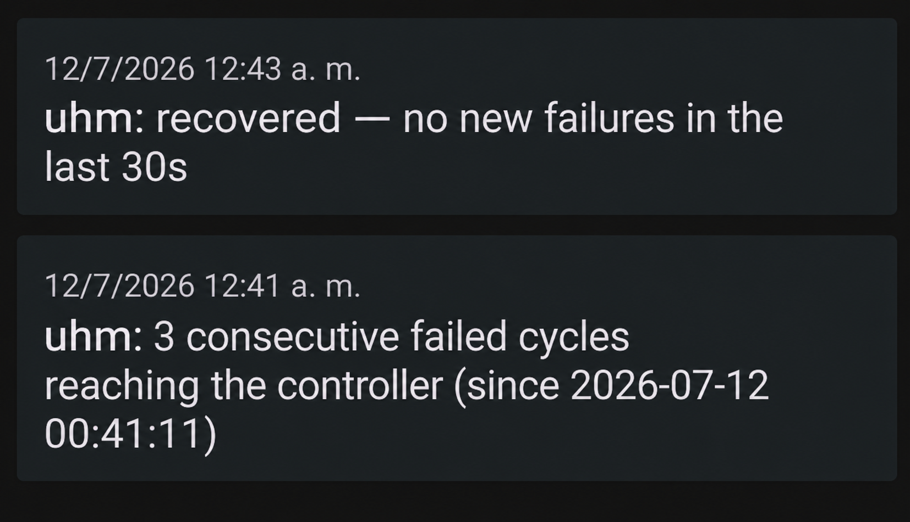</a>
</p>
<p align="center"><i>Push notifications via ntfy.sh — See Real Example</i></p>
<p align="center"><i>Notificaciones push vía ntfy.sh — Ver sección Real Example</i></p>

**Install:**

```bash
sudo /etc/uhm/tools/uhmalert.sh install
```

```text
==================================
Installing uhmalert (UHM alert)
==================================

Added UHM_NTFY_TOPIC, UHM_API_FAIL_THRESHOLD and
UHM_ALERT_QUIET_PERIOD_SECONDS to /etc/uhm/uhm.env
Deploying script to /etc/uhm/tools/uhmalert.sh...
Writing systemd unit (/etc/systemd/system/uhmalert.service)...

Installed and started. Check with: systemctl status uhmalert

==================================
 ntfy topic: uhm-alert-x7k2m9qv
==================================
Install the free 'ntfy' app (Android/iOS) and subscribe to the
topic above to start receiving alerts on this device.
```

**Uninstall:**

```bash
sudo /etc/uhm/tools/uhmalert.sh uninstall
```

<table>
  <tr>
    <td style="width: 50%; vertical-align: top;">
      <b>Detection logic:</b> Successful <code>uhmd</code> cycles are silent (no log output), so there is no positive "cycle OK" line to anchor on. Instead, <code>uhmalert.sh</code> anchors on <code>"Could not load vouchers"</code> -- a line <code>load_all_vouchers()</code> logs exactly once per cycle when the controller is unreachable. Two such lines less than <code>GAP_LIMIT</code> apart count as consecutive failing cycles; a larger gap means cycles succeeded silently in between, and the streak resets (the same <code>GAP_LIMIT</code> is also the read timeout used to detect recovery). <code>GAP_LIMIT = POLL_INTERVAL + 3*API_MAX_TIME + MARGIN</code> (default <code>20 + 3*30 + 10 = 120s</code>) -- the <code>3*API_MAX_TIME</code> term covers the worst case of a failed cycle still making up to three 30s-capped API calls (vouchers, guest, sta) before it ends.
      <br><br>
      Any other line starting with <code>ERROR:</code> or <code>WARNING:</code> fires immediately, no threshold -- the log already classifies severity (<code>"TIMESTAMP LEVEL: message"</code>), shared by <code>uhmd.sh</code> and the <code>uhmreload.sh</code>/<code>uhmleases.sh</code>/<code>uhmiptables.sh</code> chain. Excludes lines already covered by the connectivity streak above (so it still waits for the threshold, not the first failure) and <code>"cycle lock held unexpectedly"</code> (expected, not a bug).
      <br><br>
      <b>Startup grace:</b> <code>uhmalert.sh</code> itself starts at boot (systemd). If the connectivity threshold is reached while <code>uhmd.service</code> has been active for less than <code>UHM_ALERT_QUIET_PERIOD_SECONDS</code>, the alert is suppressed — UniFi Network/UniFi OS can take a while to come back up after a reboot, and the daemon's very first cycles fail before the controller is even ready to answer. Checked against <code>uhmd</code>'s own start time (via systemd), not <code>uhmalert</code>'s — so this applies correctly whether the whole machine rebooted or just <code>uhmd</code> restarted on its own. A real outage later on still alerts at the normal threshold, unaffected.
      <br><br>
      This only covers the <code>run_cycle</code> connectivity streak. The daemon's own <em>initial</em> login (before the first cycle even runs) is handled separately inside <code>uhmd.sh</code> itself, using its own <code>STARTUP_GRACE_SECONDS</code> window — a distinct key from <code>uhmalert.sh</code>'s (same default value, 120, but tuning one never silently affects the other) — see the "Daemon Cycle" section below. Startup login retries log at <code>INFO</code>, not <code>ERROR</code>, so they never reach this catch-all in the first place.
      <br><br>
      <b>Recovery notice guard:</b> a "recovered" notice fires only if <code>uhmd.service</code> is still active when the <code>GAP_LIMIT</code> silence window elapses. Silence has two indistinguishable causes — cycles actually recovered, or the daemon stopped writing to the log entirely (manual stop, crash, start-limit-hit) — and without this check the second case would still send a false "recovered" notice while the controller could still be down and the daemon not even running.
    </td>
    <td style="width: 50%; vertical-align: top;">
      <b>Lógica de detección:</b> Los ciclos exitosos de <code>uhmd</code> son silenciosos (sin salida en el log), por lo que no hay una linea positiva de "ciclo OK" en la cual anclarse. En cambio, <code>uhmalert.sh</code> se ancla en <code>"Could not load vouchers"</code> -- una linea que <code>load_all_vouchers()</code> registra exactamente una vez por ciclo cuando el controlador es inalcanzable. Dos de esas lineas separadas por menos de <code>GAP_LIMIT</code> cuentan como ciclos fallidos consecutivos; un salto mayor implica que hubo ciclos exitosos silenciosos en el medio, y la racha se reinicia (el mismo <code>GAP_LIMIT</code> es también el timeout de lectura usado para detectar la recuperación). <code>GAP_LIMIT = POLL_INTERVAL + 3*API_MAX_TIME + MARGIN</code> (default <code>20 + 3*30 + 10 = 120s</code>) -- el término <code>3*API_MAX_TIME</code> cubre el peor caso de un ciclo fallido que aún así hace hasta tres llamadas API con límite de 30s (vouchers, guest, sta) antes de terminar.
      <br><br>
      Cualquier otra linea que empiece con <code>ERROR:</code> o <code>WARNING:</code> dispara de inmediato, sin umbral -- el log ya clasifica la severidad (<code>"TIMESTAMP NIVEL: mensaje"</code>), compartido entre <code>uhmd.sh</code> y la cadena <code>uhmreload.sh</code>/<code>uhmleases.sh</code>/<code>uhmiptables.sh</code>. Excluye las lineas ya cubiertas por la racha de conectividad de arriba (para que siga esperando el umbral, no el primer fallo) y <code>"cycle lock held unexpectedly"</code> (esperado, no es un bug).
      <br><br>
      <b>Gracia de arranque:</b> <code>uhmalert.sh</code> arranca junto con el sistema (systemd). Si el umbral de conectividad se cumple mientras <code>uhmd.service</code> lleva menos de <code>UHM_ALERT_QUIET_PERIOD_SECONDS</code> activo, la alerta se suprime -- UniFi Network/UniFi OS puede tardar en volver a estar disponible tras un reinicio, y los primeros ciclos del daemon fallan antes de que el controlador siquiera esté listo para responder. Se verifica contra el propio inicio de <code>uhmd</code> (vía systemd), no el de <code>uhmalert</code> -- asi aplica correctamente ya sea que se haya reiniciado el equipo completo o solo <code>uhmd</code> por su cuenta. Un fallo real más adelante sigue alertando con el umbral normal, sin verse afectado.
      <br><br>
      Esto solo cubre la racha de conectividad de <code>run_cycle</code>. El login <em>inicial</em> del daemon (antes de que corra el primer ciclo) se maneja aparte, dentro del propio <code>uhmd.sh</code>, usando su propia ventana <code>STARTUP_GRACE_SECONDS</code> -- una clave distinta a la de <code>uhmalert.sh</code> (mismo valor por defecto, 120, pero ajustar una nunca afecta a la otra en silencio) -- ver la sección "Daemon Cycle" más abajo. Los reintentos de login de arranque quedan en nivel <code>INFO</code>, no <code>ERROR</code>, así que nunca llegan a este catch-all.
      <br><br>
      <b>Verificación antes del aviso de recuperación:</b> un aviso de "recovered" solo se envía si <code>uhmd.service</code> sigue activo cuando se cumple la ventana de silencio <code>GAP_LIMIT</code>. El silencio tiene dos causas indistinguibles -- los ciclos realmente se recuperaron, o el daemon dejó de escribir en el log por completo (detención manual, crash, start-limit-hit) -- y sin este chequeo el segundo caso igual mandaría un falso "recovered" mientras el controlador podría seguir caído y el daemon ni siquiera estar corriendo.
    </td>
  </tr>
</table>

#### Real Example

<table>
  <tr>
    <td style="width: 50%; vertical-align: top;">
      A brief controller outage (restart/update) triggers exactly the sequence shown in the screenshot above. The daemon degrades gracefully on every failed cycle — <code>sessions step ... -- skip</code>/<code>revoke step ... -- skip</code> — instead of acting on partial data, alerts once the 3-cycle threshold is hit, and re-authenticates automatically once the controller is reachable again:
    </td>
    <td style="width: 50%; vertical-align: top;">
      Una caída breve del controlador (reinicio/actualización) dispara exactamente la secuencia del pantallazo de arriba. El daemon se degrada de forma segura en cada ciclo fallido — <code>sessions step ... -- skip</code>/<code>revoke step ... -- skip</code> — en vez de actuar con datos parciales, alerta al llegar al umbral de 3 ciclos, y se re-autentica solo apenas el controlador vuelve a responder:
    </td>
  </tr>
</table>

```text
2026-07-12 00:40:26 INFO: API GET stat/voucher -> HTTP 502 -- skip
2026-07-12 00:40:26 INFO: Could not load vouchers (rc=empty) -- skip
2026-07-12 00:40:28 INFO: API GET stat/guest -> HTTP 000 -- skip
2026-07-12 00:40:28 INFO: sessions step, stat/guest unavailable -- skip
2026-07-12 00:40:29 INFO: API GET stat/sta -> HTTP 000 -- skip
2026-07-12 00:40:29 INFO: revoke step, stat/sta unavailable -- skip
[... cycles keep failing every ~POLL_INTERVAL, same pattern ...]
2026-07-12 00:41:11 INFO: Could not load vouchers (rc=empty) -- skip
2026-07-12 00:41:11 ALERT: 3 consecutive cycle failures -- sent
2026-07-12 00:41:11 ALERT: latest at 2026-07-12 00:41:11
[... failures continue while the controller is still down ...]
2026-07-12 00:42:43 INFO: session expired, re-authenticating
2026-07-12 00:42:43 INFO: UniFi login OK
2026-07-12 00:43:13 ALERT: recovery notice (no new failures) -- sent
```

<table>
  <tr>
    <td style="width: 50%; vertical-align: top;">
      The first <code>HTTP 502</code> (proxy up, backend not yet) followed immediately by <code>HTTP 000</code> on every subsequent request (connection itself unreachable) is the fingerprint of a UniFi OS controller restart, not a network/firewall problem on the <code>UHM</code> side — worth checking the controller's own system log for that window if it happens outside a planned update.
      <br><br>
      A <b>server reboot</b> shows a different, unrelated-looking pattern instead — quiet <code>INFO</code>-level login retries while UniFi OS is still booting, followed by a login success, followed by a few data-endpoint failures before the backend settles — with no alert firing, since <code>uhmalert.sh</code> is also inside its own startup grace window at that point. See uhmd above for that log sequence in full.
    </td>
    <td style="width: 50%; vertical-align: top;">
      El primer <code>HTTP 502</code> (proxy activo, backend aún no) seguido de inmediato por <code>HTTP 000</code> en cada petición posterior (la conexión misma es inalcanzable) es la firma de un reinicio del controlador UniFi OS, no un problema de red/firewall del lado de <code>UHM</code> — vale la pena revisar el log propio del sistema del controlador en esa ventana si ocurre fuera de una actualización planificada.
      <br><br>
      Un <b>reinicio del servidor</b> muestra un patrón distinto y aparentemente no relacionado — reintentos de login silenciosos en nivel <code>INFO</code> mientras UniFi OS todavía está arrancando, seguidos de un login exitoso, seguidos de algunos fallos en los endpoints de datos antes de que el backend se asiente — sin que se dispare ninguna alerta, ya que <code>uhmalert.sh</code> también está dentro de su propia ventana de gracia de arranque en ese momento. Ver uhmd arriba para esa secuencia de log completa.
    </td>
  </tr>
</table>

**Configuration variables (in `uhm.env`, written automatically by `install`):**

| Variable | Default | Description | Descripción |
|----------|---------|-------------|-------------|
| `UHM_NTFY_TOPIC` | *(auto-generated)* | ntfy.sh topic name, e.g. `uhm-alert-x7k2m9qv`. Treat as a shared secret — anyone who knows it can publish to it. Never overwritten by a re-install. | Nombre del topic de ntfy.sh, ej. `uhm-alert-x7k2m9qv`. Trátelo como un secreto compartido — cualquiera que lo conozca puede publicar en él. Nunca se sobrescribe en una reinstalación. |
| `UHM_API_FAIL_THRESHOLD` | 3 | Consecutive failing cycles required before sending an alert | Ciclos fallidos consecutivos requeridos antes de enviar una alerta |
| `UHM_ALERT_QUIET_PERIOD_SECONDS` | 120 | Suppresses the connectivity alert while `uhmd.service` has been active for less than this long — UniFi Network/UniFi OS can take a while to come back up after a reboot, and this host often boots alongside it. Written to `uhm.env` by `uhmalert.sh install`. Separate from `uhmd.sh`'s own `STARTUP_GRACE_SECONDS` (same default, different key, tuning one never affects the other). This is an estimate, not a measured value: tune it to how long *your* UniFi Network/UniFi OS instance actually takes to come back up after a restart. Only the startup window is affected — a real outage later in the day still alerts at the normal threshold, undiminished. | Suprime la alerta de conectividad mientras `uhmd.service` ha estado activo por menos de este tiempo — UniFi Network/UniFi OS puede tardar en volver tras un reinicio, y este host suele arrancar junto con él. Escrito en `uhm.env` por `uhmalert.sh install`. Separada de la propia `STARTUP_GRACE_SECONDS` de `uhmd.sh` (mismo default, clave distinta, ajustar una nunca afecta a la otra). Esto es una estimación, no un valor medido: ajústelo a lo que realmente tarda *su* instancia de UniFi Network/UniFi OS en volver tras un reinicio. Solo afecta la ventana de arranque — un corte real más tarde en el día sigue alertando en el umbral normal, sin disminución. |

> `POLL_INTERVAL` is read from the same `uhm.env` used by `uhmd.sh` (falls back to 20 if unset) — no separate configuration needed.
>
> `POLL_INTERVAL` se lee del mismo `uhm.env` que usa `uhmd.sh` (default 20 si no esta definido) -- no requiere configuracion aparte.

### uhmwatch

<table>
  <tr>
    <td style="width: 50%; vertical-align: top;">
      <b>uhmwatch.sh</b> is a <b>mandatory</b>, standalone services watchdog — installed automatically by <code>uhmsetup.sh</code>, not offered as a yes/no prompt like <code>uhmalert</code> or the web interface. Every unit it watches already has its own systemd <code>Restart=</code> policy, but that alone gives up permanently once its <code>StartLimitBurst</code> is exhausted, with no further attempt and no alert of its own (see below). <code>uhmwatch</code> is the last line of defense against that — it runs every minute, independent of whatever state systemd itself gave up in, so <code>UHM</code>'s essential services don't stay down indefinitely just because systemd stopped trying. Checks every service <code>UHM</code> depends on, restarting whichever is down: <code>uhmd.service</code> (always), <code>uhmalert.service</code> (only if installed), <code>pydhcpd.service</code> (always -- external dependency UHM cannot function without, watched here since pydhcp's own <code>Restart=on-failure</code> gives up silently after its burst with no alerting of its own), and the UniFi backend (<code>uosserver.service</code> for <code>UNIFI_TYPE=unifi-os</code>, or <code>unifi.service</code> for <code>classic</code>). Each check is fully independent — one check's failure never skips or blocks the others in the same run. Each recovery attempt runs <code>systemctl reset-failed</code> right before <code>start</code>/<code>restart</code> — every unit already carries its own <code>Restart=</code> policy with a <code>StartLimitBurst</code>, and once that burst is exhausted systemd stops trying on its own and stays quiet about it, which would otherwise make this watchdog's own restart attempt fail silently right when it's needed most. To avoid then hammering a persistently broken service every single minute, each restart attempt (successful or not) is timestamped per-service under <code>/run/uhmwatch/</code> (cleared on reboot), and a new attempt is skipped — logged only, not acted on — until <code>RECOVERY_COOLDOWN_SECONDS</code> (default 600s / 10 min) has passed since the last one.
      <br><br>
      Standalone — never reads or modifies <code>uhmd.sh</code>, only manages services via <code>systemctl</code>. Writes to the same shared <code>/var/log/uhm.log</code> as the rest of <code>UHM</code> (no separate log file or logrotate of its own). Silent on a healthy run — nothing is logged unless a check finds a problem or takes a fix action.
      <br><br>
      The <code>pydhcpd.service</code> check specifically skips its "OFFLINE" verdict (no WARNING, no restart) if <code>uhmleases.sh</code> currently holds the same cycle lock <code>uhmd.sh</code> uses (<code>/var/lock/uhmd-cycle.lock</code>) — a normal reload stops/reconfigures/starts <code>pydhcpd</code> itself for a few seconds, and a cron tick landing in that window would otherwise "fix" a service that isn't actually broken, restarting it out from under <code>uhmleases.sh</code>'s own pending restart and aborting that reload.
    </td>
    <td style="width: 50%; vertical-align: top;">
      <b>uhmwatch.sh</b> es un vigilante de servicios <b>obligatorio</b> e independiente — se instala automáticamente con <code>uhmsetup.sh</code>, no se ofrece como pregunta sí/no como <code>uhmalert</code> o la interfaz web. Cada unidad que vigila ya tiene su propia política <code>Restart=</code> de systemd, pero eso solo se rinde para siempre en cuanto agota su <code>StartLimitBurst</code>, sin más intentos y sin aviso propio (ver más abajo). <code>uhmwatch</code> es la última línea de defensa contra eso — corre cada minuto, independiente del estado en que systemd se haya rendido, para que los servicios esenciales de <code>UHM</code> no queden caídos indefinidamente solo porque systemd dejó de intentarlo. Verifica cada servicio del que depende <code>UHM</code>, reiniciando el que esté caído: <code>uhmd.service</code> (siempre), <code>uhmalert.service</code> (solo si está instalado), <code>pydhcpd.service</code> (siempre -- dependencia externa sin la cual UHM no puede funcionar, vigilada acá porque el propio <code>Restart=on-failure</code> de pydhcp se rinde en silencio tras agotar su cupo, sin ningún aviso propio), y el backend de UniFi (<code>uosserver.service</code> para <code>UNIFI_TYPE=unifi-os</code>, o <code>unifi.service</code> para <code>classic</code>). Cada chequeo es completamente independiente — el fallo de uno nunca salta ni bloquea a los demás en la misma corrida. Cada intento de recuperación corre <code>systemctl reset-failed</code> justo antes de <code>start</code>/<code>restart</code> — cada unidad ya trae su propia política <code>Restart=</code> con un <code>StartLimitBurst</code>, y una vez agotado ese cupo systemd deja de reintentar por su cuenta y no avisa — lo que de otro modo haría fallar en silencio el intento de este vigilante justo cuando más se lo necesita. Para no machacar después con un restart cada minuto a un servicio persistentemente roto, cada intento de recuperación (exitoso o no) queda con marca de tiempo por servicio bajo <code>/run/uhmwatch/</code> (se limpia en cada reinicio), y un nuevo intento se salta -- solo se loguea, no se actúa -- hasta que pasen <code>RECOVERY_COOLDOWN_SECONDS</code> (default 600s / 10 min) desde el último.
      <br><br>
      Independiente — nunca lee ni modifica <code>uhmd.sh</code>, solo gestiona servicios vía <code>systemctl</code>. Escribe al mismo <code>/var/log/uhm.log</code> compartido con el resto de <code>UHM</code> (sin log ni logrotate propio). Silencioso en una corrida sana — no registra nada salvo que un chequeo encuentre un problema o tome una acción de reparación.
      <br><br>
      El chequeo de <code>pydhcpd.service</code> específicamente se salta el veredicto "OFFLINE" (sin WARNING, sin restart) si <code>uhmleases.sh</code> tiene tomado en ese momento el mismo lock de ciclo que usa <code>uhmd.sh</code> (<code>/var/lock/uhmd-cycle.lock</code>) — un reload normal detiene/reconfigura/arranca <code>pydhcpd</code> él mismo durante unos segundos, y una corrida de cron que caiga en esa ventana de otro modo "arreglaría" un servicio que no está realmente roto, reiniciándolo por debajo del restart que <code>uhmleases.sh</code> ya tenía pendiente y abortando ese reload.
    </td>
  </tr>
</table>

**Install:**

```bash
sudo /etc/uhm/core/uhmwatch.sh install
```

```text
==================================
Installing uhmwatch (UHM services watchdog)
==================================

Deploying script to /etc/uhm/core/uhmwatch.sh...
Cron entry registered: * * * * * /etc/uhm/core/uhmwatch.sh

Installed. First run happens on the next minute mark.
  Check the log with: tail -f /var/log/uhm.log
```

`uhmwatch.sh` is silent on a healthy run -- nothing is logged unless a check finds a problem or takes a fix action. Example of what a detected-and-fixed failure looks like in `/var/log/uhm.log` / `uhmwatch.sh` es silencioso en una corrida sana -- no registra nada a menos que un chequeo encuentre un problema o tome una acción de arreglo. Ejemplo de cómo se ve una falla detectada y corregida en `/var/log/uhm.log`:

```text
2026-07-29 21:18:18 WARNING: uhmd OFFLINE -- alert
2026-07-29 21:18:18 FIX: uhmd restarted -- alert
```

If `uhmalert.sh` is also installed, both lines reach your phone as separate push notifications — `uhmalert.sh` alerts on any `WARNING:`/`ERROR:` line (the problem) as well as any `FIX:` line (confirmation it was resolved), from any of the services `uhmwatch.sh` manages, not just `uhmd`. `uhmwatch.sh` and `uhmalert.sh` are independent, but this is what having both installed together looks like in practice / Si `uhmalert.sh` también está instalado, ambas líneas te llegan al teléfono como notificaciones push separadas — `uhmalert.sh` alerta ante cualquier línea `WARNING:`/`ERROR:` (el problema) y también ante cualquier línea `FIX:` (confirmación de que se resolvió), de cualquiera de los servicios que gestiona `uhmwatch.sh`, no solo `uhmd`. `uhmwatch.sh` y `uhmalert.sh` son independientes, pero así se ve en la práctica tenerlos instalados juntos:

<p align="center">
  <a href="https://github.com/maravento/uhm">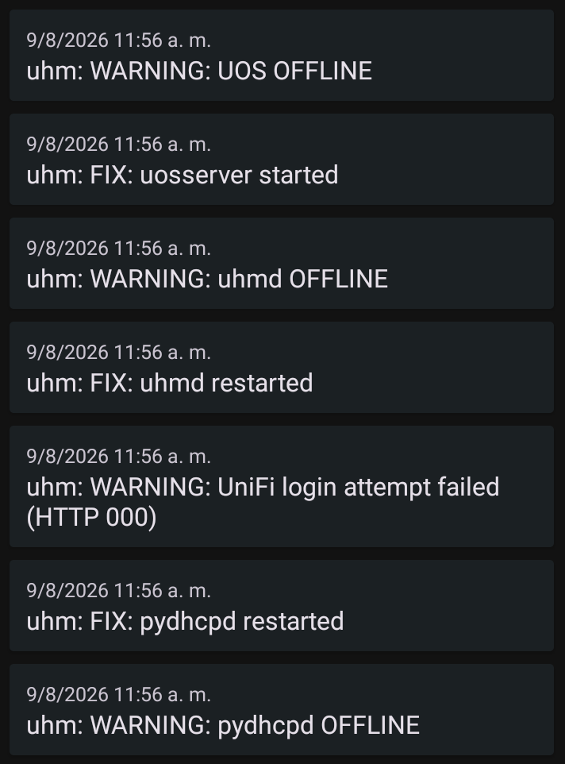</a>
</p>
<p align="center"><i>uhmwatch fixing a downed service, relayed to your phone by uhmalert</i></p>
<p align="center"><i>uhmwatch arreglando un servicio caído, retransmitido a tu teléfono por uhmalert</i></p>

> The notification app may not display messages in chronological order (it can group same-minute notifications arbitrarily). Since it's only a notification, the recommendation is to check `/var/log/uhm.log` for the actual event order.
>
> Es posible que la app de notificaciones no muestre los mensajes en orden cronológico (puede agrupar notificaciones del mismo minuto de forma arbitraria). Al ser solo una notificación, se recomienda revisar `/var/log/uhm.log` para ver el orden real de los eventos.

**Uninstall:**

```bash
sudo /etc/uhm/core/uhmwatch.sh uninstall
```

<table>
  <tr>
    <td style="width: 50%; vertical-align: top;">
      <b>UniFi backend check:</b> a plain <code>systemctl is-active</code> only proves the process is up, not that the application itself is healthy — the container's (or subprocess's) embedded MongoDB can fail to come up while the process keeps running, leaving every real API call broken. So once the service is confirmed active, <code>uhmwatch.sh</code> performs the same real login <code>uhmd.sh</code> itself relies on (<code>UNIFI_USERNAME</code>/<code>UNIFI_PASSWORD</code> from <code>uhm.env</code>, credentials via <code>jq</code> env and payload via <code>curl</code> stdin — never in argv). <code>HTTP 200</code> = healthy. <code>HTTP 000</code> (unreachable) or <code>5xx</code> (server error) = unresponsive, restarts the service. <code>HTTP 429</code> means the controller itself is rate-limiting login attempts — logged as a distinct warning, <b>no restart</b> (see <i>Controller lockout</i> below). Any other <code>4xx</code> means credentials rejected but service online — logged as a warning, <b>no restart</b>. Possible causes: wrong <code>UNIFI_USERNAME</code>/<code>UNIFI_PASSWORD</code> in <code>uhm.env</code>, or an account that is locked, expired, or has 2FA enabled (see <i>2FA and Remote Access</i> above). If <code>UNIFI_USERNAME</code>/<code>UNIFI_PASSWORD</code> aren't set, falls back to a process/port-only check instead of skipping it.
    </td>
    <td style="width: 50%; vertical-align: top;">
      <b>Chequeo del backend UniFi:</b> un simple <code>systemctl is-active</code> solo prueba que el proceso está arriba, no que la aplicación esté sana — el MongoDB embebido del contenedor (o subproceso) puede fallar al iniciar mientras el proceso sigue corriendo, dejando rota cualquier llamada real a la API. Por eso, una vez confirmado que el servicio está activo, <code>uhmwatch.sh</code> hace el mismo login real que usa <code>uhmd.sh</code> (<code>UNIFI_USERNAME</code>/<code>UNIFI_PASSWORD</code> de <code>uhm.env</code>, credenciales vía env de <code>jq</code> y payload vía stdin de <code>curl</code> — nunca en argv). <code>HTTP 200</code> = sano. <code>HTTP 000</code> (inalcanzable) o <code>5xx</code> (error de servidor) = no responde, reinicia el servicio. <code>HTTP 429</code> significa que el propio controlador está limitando la tasa de intentos de login — se registra como advertencia distinta, <b>sin reiniciar</b> (ver <i>Bloqueo del controlador</i> abajo). Cualquier otro <code>4xx</code> significa credenciales rechazadas pero servicio online — se registra como advertencia, <b>sin reiniciar</b>. Posibles causas: <code>UNIFI_USERNAME</code>/<code>UNIFI_PASSWORD</code> incorrecto en <code>uhm.env</code>, o cuenta bloqueada, caducada, o con 2FA activo (ver <i>2FA and Remote Access</i> arriba). Si <code>UNIFI_USERNAME</code>/<code>UNIFI_PASSWORD</code> no están configuradas, cae de vuelta a un chequeo de solo proceso/puerto en vez de omitirlo.
    </td>
  </tr>
</table>

**Wrong password / Contraseña incorrecta:**

```text
2026-07-15 17:21:03 WARNING: credentials rejected (HTTP 403)
2026-07-15 17:21:03 Check uhm.env - UOS itself is responding
```

**Controller lockout (HTTP 429) / Bloqueo del controlador (HTTP 429):**

```text
# from uhmd.sh, repeating every 10s during its own startup retry loop:
2026-07-31 23:57:13 INFO: UniFi login failed (HTTP 429) in grace -- skip
2026-07-31 23:57:23 INFO: UniFi login failed (HTTP 429) in grace -- skip
...
2026-07-31 23:59:04 INFO: UniFi login failed (HTTP 429) in grace -- skip
2026-07-31 23:59:04 ERROR: no UniFi login in 120s -- abort

# from uhmwatch.sh, on its next check:
2026-07-31 23:59:15 WARNING: rate limited (HTTP 429), not a credentials issue
2026-07-31 23:59:15 Stop uhmd+uhmwatch cron before restarting (see README)
```

<table>
  <tr>
    <td style="width: 50%; vertical-align: top;">
      <code>HTTP 429</code> means the controller is throttling login attempts -- it is not a wrong password, and restarting a service will not fix it, it can make it worse. It typically happens after several rapid failed login attempts in a short window (UniFi's own anti-brute-force protection), and it is self-sustaining: <code>uhmd.service</code> ships with <code>Restart=always</code>/<code>RestartSec=10</code>, and <code>uhmd.sh</code> itself retries login every 10s for up to <code>STARTUP_GRACE_SECONDS</code> (default 120s) before exiting -- if the controller is already rate-limiting, this loop keeps re-triggering the lockout indefinitely, and <code>uhmwatch.sh</code>'s own 1-minute restart of <code>uhmd.service</code> (if it finds it down) feeds the same loop.
      <br><br>
      <b>Recovery procedure:</b>
      <ol>
        <li>Stop everything that can attempt a login: <code>sudo systemctl stop uhmd</code>, then <code>sudo bash /etc/uhm/core/uhmwatch.sh uninstall</code> (removes the cron entry so it doesn't restart <code>uhmd</code> for you mid-recovery).</li>
        <li>Confirm it stays down: <code>sudo systemctl status uhmd</code> should show <code>inactive (dead)</code> and stay that way.</li>
        <li>Restart the controller (<code>sudo systemctl restart uosserver.service</code> for <code>unifi-os</code>, or <code>unifi.service</code> for <code>classic</code>).</li>
        <li>Wait -- give the controller a couple of minutes to fully come back up before trying anything against it again (<code>sleep 120</code>, or just wait and confirm via a manual browser login).</li>
        <li>Bring <code>uhmd</code> back up once: <code>sudo systemctl start uhmd</code>, and check <code>/var/log/uhm.log</code> for <code>UniFi login OK</code>.</li>
        <li>Once stable, reinstall the watchdog: <code>sudo bash /etc/uhm/core/uhmwatch.sh install</code>.</li>
      </ol>
    </td>
    <td style="width: 50%; vertical-align: top;">
      <code>HTTP 429</code> significa que el controlador está limitando la tasa de intentos de login -- no es una contraseña incorrecta, y reiniciar un servicio no lo arregla, puede empeorarlo. Suele ocurrir después de varios intentos fallidos rápidos en poco tiempo (protección anti-fuerza-bruta propia de UniFi), y es autosostenido: <code>uhmd.service</code> viene con <code>Restart=always</code>/<code>RestartSec=10</code>, y <code>uhmd.sh</code> reintenta el login cada 10s durante hasta <code>STARTUP_GRACE_SECONDS</code> (default 120s) antes de salir -- si el controlador ya está limitando la tasa, este loop sigue disparando el bloqueo indefinidamente, y el propio reinicio de <code>uhmd.service</code> que hace <code>uhmwatch.sh</code> cada minuto (si lo encuentra caído) alimenta el mismo loop.
      <br><br>
      <b>Procedimiento de recuperación:</b>
      <ol>
        <li>Detener todo lo que pueda intentar un login: <code>sudo systemctl stop uhmd</code>, luego <code>sudo bash /etc/uhm/core/uhmwatch.sh uninstall</code> (quita la entrada de cron para que no te reinicie <code>uhmd</code> a mitad de la recuperación).</li>
        <li>Confirmar que se queda detenido: <code>sudo systemctl status uhmd</code> debe mostrar <code>inactive (dead)</code> y quedarse así.</li>
        <li>Reiniciar el controlador (<code>sudo systemctl restart uosserver.service</code> para <code>unifi-os</code>, o <code>unifi.service</code> para <code>classic</code>).</li>
        <li>Esperar -- darle al controlador un par de minutos para terminar de arrancar antes de intentar algo contra él de nuevo (<code>sleep 120</code>, o simplemente esperar y confirmar con un login manual por navegador).</li>
        <li>Levantar <code>uhmd</code> una sola vez: <code>sudo systemctl start uhmd</code>, y revisar <code>/var/log/uhm.log</code> buscando <code>UniFi login OK</code>.</li>
        <li>Una vez estable, reinstalar el watchdog: <code>sudo bash /etc/uhm/core/uhmwatch.sh install</code>.</li>
      </ol>
    </td>
  </tr>
</table>

**Normal operation / Operación normal:**

```text
(nothing — a healthy run writes no log lines / nada — una corrida sana no escribe líneas de log)
```

## LOGS

---

<table>
  <tr>
    <td style="width: 50%; vertical-align: top;">
      <b>uhm.log</b> — All output from every component (<code>uhmd</code>, <code>uhmreload.sh</code>, <code>uhmleases.sh</code>, <code>uhmwatch.sh</code>, <code>uhmalert.sh</code>, <code>uhmiptables.sh</code>) is unified in <code>/var/log/uhm.log</code> and rotated via <code>/etc/logrotate.d/uhm</code> (daily, 7 rotations, compressed). The log follows one rule throughout: <b>stay silent on no-op cycles, log once when something actually changes, always log errors and warnings</b>. Idle cycles (no ACL change) produce zero lines. Every component classifies every line as <code>INFO:</code>, <code>WARNING:</code>, <code>ERROR:</code>, or (for <code>uhmalert.sh</code>) <code>ALERT:</code> — including continuation lines, since a message split across two physical lines to respect the 80-column limit always carries the same level on both. The LogView tab of the web interface groups the few genuinely level-less lines (the compact <code>field=value|field=value</code> counters, and each sub-script's own <code>"&lt;name&gt; start..."</code>/<code>"&lt;name&gt; done"</code> boundary markers) under a generic <code>STATUS</code> level. <code>uhmd</code>'s own <code>log()</code> also writes an 80-dash delimiter line as the very first line of any cycle that logs anything at all (idle cycles still produce none), so consecutive active cycles are visually separated in the file.
    </td>
    <td style="width: 50%; vertical-align: top;">
      <b>uhm.log</b> — Toda la salida de cada componente (<code>uhmd</code>, <code>uhmreload.sh</code>, <code>uhmleases.sh</code>, <code>uhmwatch.sh</code>, <code>uhmalert.sh</code>, <code>uhmiptables.sh</code>) se unifica en <code>/var/log/uhm.log</code> y se rota vía <code>/etc/logrotate.d/uhm</code> (diario, 7 rotaciones, comprimido). El log sigue una sola regla: <b>silencio en ciclos sin cambios, un registro cuando algo realmente cambia, y siempre errores y advertencias</b>. Los ciclos inactivos (sin cambio de ACL) no producen ninguna línea. Cada componente clasifica cada línea como <code>INFO:</code>, <code>WARNING:</code>, <code>ERROR:</code> o (en <code>uhmalert.sh</code>) <code>ALERT:</code> — incluidas las líneas de continuación, ya que un mensaje partido en dos líneas físicas por el límite de 80 columnas siempre lleva el mismo nivel en ambas. La pestaña LogView de la interfaz web agrupa las pocas líneas genuinamente sin nivel (los contadores compactos <code>campo=valor|campo=valor</code>, y las marcas de inicio/cierre <code>"&lt;nombre&gt; start..."</code>/<code>"&lt;nombre&gt; done"</code> de cada sub-script) bajo un nivel genérico <code>STATUS</code>. El propio <code>log()</code> de <code>uhmd</code> también escribe una línea separadora de 80 guiones como primera línea de cualquier ciclo que registre algo (los ciclos inactivos siguen sin producir ninguna), para separar visualmente ciclos activos consecutivos en el archivo.
    </td>
  </tr>
</table>

#### Log levels

| Level | Description | Descripción |
|---|---|---|
| `ERROR:` | Exclusively for a message that aborts the current flow -- the script or the calling function stops right there, nothing after it runs. Always paired with the `-- abort` suffix. | Exclusivo para un mensaje que aborta el flujo actual -- el script o la función que lo invoca se detiene ahí mismo, nada después corre. Siempre acompañado del sufijo `-- abort`. |
| `WARNING:` | Something is seriously wrong and needs the administrator's immediate attention, but execution does not abort. Paired with `-- alert` (a live condition needing supervision, e.g. a possible attack or resource saturation) or `-- fallback` (the administrator supplied a bad/out-of-range value in the config, and the script used a built-in default instead -- the value must be corrected). | Algo anda mal y requiere atención inmediata del administrador, pero la ejecución no aborta. Acompañado de `-- alert` (una condición en vivo que amerita supervisión, ej. un posible ataque o saturación de recursos) o `-- fallback` (el administrador puso un valor malo o fuera de rango en la configuración, y el script usó un valor por defecto en su lugar -- ese valor debe corregirse). |
| `INFO:` | Routine state changes and notifications -- everything else, including anything skipped or defaulted without needing administrator attention. Paired with `-- skip` (an action was discarded, for any reason) or `-- degraded` (a system/environment limitation -- not a bad config value -- left the script running without an optimization or protection it would normally have; nothing for the administrator to fix). | Cambios de estado rutinarios y notificaciones -- todo lo demás, incluyendo lo omitido o resuelto con un valor por defecto sin necesitar atención del administrador. Acompañado de `-- skip` (se descartó una acción, por cualquier razón) o `-- degraded` (una limitación del sistema/entorno -- no un valor malo de configuración -- dejó el script funcionando sin una optimización o protección que normalmente tendría; no hay nada que el administrador deba corregir). |
| `ALERT:` | `uhmalert.sh` only -- confirms a push notification was actually sent for an `ERROR:`/`WARNING:`/`FIX:` line it picked up. | Exclusivo de `uhmalert.sh` -- confirma que se envió una notificación push por una línea `ERROR:`/`WARNING:`/`FIX:` detectada. |
| `FIX:` | A prior problem (`ERROR:`/`WARNING:`) is now confirmed resolved -- e.g. a service `uhmwatch.sh` restarted came back healthy. | Un problema previo (`ERROR:`/`WARNING:`) ya se confirmó resuelto -- ej. un servicio que `uhmwatch.sh` reinició volvió a estar sano. |
| `STATUS` (no prefix) | Level-less lines: each script's own `"<name> start..."`/`"<name> done"` boundary markers, and the compact `field=value\|field=value` counters -- grouped under this generic label only by the LogView tab of the web interface, not written as `STATUS:` in the log itself. | Líneas sin nivel: las marcas de inicio/cierre `"<nombre> start..."`/`"<nombre> done"` de cada script, y los contadores compactos `campo=valor\|campo=valor` -- agrupadas bajo esta etiqueta genérica solo por la pestaña LogView de la interfaz web, no se escriben como `STATUS:` en el log real. |

> `uhmalert.sh` sends push notifications only for `ERROR:`/`WARNING:`/`FIX:` lines. For pydhcp's own log format and levels, see [pydhcp -- Log levels](../pydhcp/README.md#log-levels).
>
> `uhmalert.sh` envía notificaciones push solo para líneas `ERROR:`/`WARNING:`/`FIX:`.Para el formato y niveles de log propios de pydhcp, ver [pydhcp -- Log levels](../pydhcp/README.md#log-levels).

#### Message reference

| Level | What happens | Qué ocurre | Example |
|---|---|---|---|
| *(no level)* | Start/end markers and per-cycle totals | Marcas de inicio y fin, y totales por ciclo | `uhmleases start...` · `blockdhcp=67\|limited=105\|...` |
| `INFO:` | One line per state change | Una línea por cambio de estado | `new client X -> grace` · `Authorized X` · `kicked X` |
| `INFO: ... -- skip` | The step is skipped and retried next cycle | El paso se salta y se reintenta en el siguiente ciclo | `API GET stat/sta -> HTTP 000 -- skip` |
| `INFO:` | Logged once, when all three endpoints answer together | Se registra una vez, cuando los tres endpoints responden juntos | `UniFi backend ready (voucher/guest/sta OK)` |
| `WARNING: ... -- fallback` | The documented default is used | Se usa el valor por defecto documentado | `no CLEANUP_INTERVAL in pydhcp.env -- fallback` |
| `WARNING: ... -- alert` | Repaired automatically | Reparado automáticamente | `uhm.env perms fixed -- alert` |
| `WARNING: ... -- alert` | The MACs stay queued and are harmlessly reprocessed next cycle -- never a permissions issue (runs as root); check free space, a read-only mount, or the immutable attribute (`lsattr`, cleared with `chattr -i`) | Los MACs quedan en cola y se reprocesan sin efecto en el siguiente ciclo -- nunca es un problema de permisos (corre como root); revise espacio libre, montaje de solo lectura, o el atributo de inmodificable (`lsattr`, se quita con `chattr -i`) | `cannot empty uhm-queue.txt -- alert` |
| `WARNING: ... -- alert` | The previous config is restored; the next cycle retries | Se restaura la configuración anterior; el siguiente ciclo reintenta | `uhmreload failed (code 1), back off -- alert` |
| `WARNING: ... -- alert` | `uhmwatch.sh` found the service down | `uhmwatch.sh` encontró el servicio caído | `pydhcpd OFFLINE` · `uhmd restart FAILED -- alert` |
| `FIX:` | Closes out the `WARNING:` that reported it | Cierra el `WARNING:` que lo reportó | `pydhcpd restarted` |
| `ALERT:` | A push notification was sent or withheld | Se envió o se retuvo una notificación push | `sent -- WARNING: ...` · `dup alert suppressed` |
| `ERROR: ... -- abort` | The script stops before touching anything | El script se detiene antes de tocar nada | `missing dependency 'jq' -- abort` · `uhm.env not found -- abort` |
| `ERROR: ... -- abort` | Every offending entry is listed before aborting | Se listan todas las entradas implicadas antes de abortar | `mac-*.txt IP conflict -- abort` |

```text
--------------------------------------------------------------------------------
2026-07-01 06:47:35 INFO: new client 02:00:00:aa:bb:10 -> grace
2026-07-01 06:47:35 INFO: ip=192.168.0.231 hostname=no_name_fde07d34be
2026-07-01 06:47:35 INFO: added 1 new client(s) to uhm-grace
2026-07-01 06:47:35 INFO: uhm-grace.txt changed
2026-07-01 06:47:35 INFO: invoking /etc/uhm/core/uhmreload.sh
2026-07-01 06:47:35 uhmreload start...
2026-07-01 06:47:35 uhmleases start...
2026-07-01 06:47:36 INFO: 02:00:00:aa:bb:11 expired (age=43346s)
2026-07-01 06:47:36 INFO: add 02:00:00:aa:bb:11 to blockdhcp
2026-07-01 06:47:36 INFO: queued removal for 02:00:00:aa:bb:11
2026-07-01 06:47:40 blockdhcp=67|limited=105|unlimited=35|hotspot=17|grace=8
2026-07-01 06:47:40 uhmleases done at: 2026-07-01 06:47:40
2026-07-01 06:47:40 uhmiptables start...
2026-07-01 06:47:42 uhmiptables done at: 2026-07-01 06:47:42
2026-07-01 06:47:42 uhmreload done at: 2026-07-01 06:47:42
2026-07-01 06:47:42 vouchers=3|auth=17|grace=8|newauth=0|revoked=0
```

> When no client connects, no voucher is redeemed, and no grace entry expires, the log between two cycles is simply empty -- nothing is written.
>
> Cuando no hay cliente conectado, ningún voucher canjeado, ni ninguna entrada de gracia expirada, el log entre dos ciclos queda simplemente vacío: no se escribe nada.

<table>
  <tr>
    <td style="width: 50%; vertical-align: top;">
      <b>Reload failure and backoff</b>
    </td>
    <td style="width: 50%; vertical-align: top;">
      <b>Fallo de reload y backoff</b>
    </td>
  </tr>
  <tr>
    <td style="width: 50%; vertical-align: top;">
      A safety backoff against an error in some line of the scripts <code>uhmreload.sh</code> invokes (especially <code>uhmiptables.sh</code>, which is outside the scope of this project). If <code>UHM_RELOAD</code> (<code>uhmreload.sh</code>) fails or times out, <code>uhmd</code> logs the failure and switches to <b>"backing off to safety-net cadence"</b>: it will not retry on the next cycle (every <code>POLL_INTERVAL</code>) — it waits the full <code>RELOAD_SAFETY_INTERVAL_SECONDS</code> (default 3600s = 1h) before invoking the reload chain again, so a persistent failure does not spam the log or re-alert every cycle. The same backoff also fires if <code>UHM_RELOAD</code> is missing. Any line prefixed <code>WARNING:</code> or <code>ERROR:</code> in <code>uhm.log</code> is picked up by <code>uhmalert.sh</code> (see uhmalert), which forwards it as a push notification prefixed with <code>ALERT: sent -- </code> followed by the original line — that prefix is <code>uhmalert.sh</code> confirming it already notified you, not a separate problem.
    </td>
    <td style="width: 50%; vertical-align: top;">
      Un backoff de seguridad ante un error en alguna línea de los scripts que invoca <code>uhmreload.sh</code> (especialmente <code>uhmiptables.sh</code>, que está fuera del alcance de este proyecto). Si <code>UHM_RELOAD</code> (<code>uhmreload.sh</code>) falla o hace timeout, <code>uhmd</code> registra el fallo y pasa a <b>"backing off to safety-net cadence"</b>: no reintenta en el siguiente ciclo (cada <code>POLL_INTERVAL</code>) — espera el <code>RELOAD_SAFETY_INTERVAL_SECONDS</code> completo (default 3600s = 1h) antes de invocar de nuevo la cadena de reload, para que un fallo persistente no sature el log ni vuelva a alertar en cada ciclo. El mismo backoff también ocurre si <code>UHM_RELOAD</code> falta. Cualquier línea con prefijo <code>WARNING:</code> o <code>ERROR:</code> en <code>uhm.log</code> es detectada por <code>uhmalert.sh</code> (ver uhmalert), que la reenvía como notificación push con el prefijo <code>ALERT: sent -- </code> seguido de la línea original — ese prefijo es <code>uhmalert.sh</code> confirmando que ya te avisó, no un problema aparte.
    </td>
  </tr>
</table>

```text
2026-07-27 20:45:28 WARNING: uhmreload failed (code 1), back off -- alert
2026-07-27 20:45:29 ALERT: WARNING: uhmreload failed (code 1), back off -- sent
```

| Field | Type | Description | Descripción |
|---|---|---|---|
| `vouchers` | total | Vouchers currently in UniFi (`stat/voucher`) | Vouchers presentes en UniFi |
| `auth` | total | MACs in `uhm-auth.txt` at end of cycle | MACs en `uhm-auth.txt` al final del ciclo |
| `grace` | total | MACs in `uhm-grace.txt` at end of cycle | MACs en `uhm-grace.txt` al final del ciclo |
| `newauth` | delta | MACs processed by the sessions step this cycle: new promotions to `uhm-auth.txt` **and** voucher renewals of MACs already in it (only new promotions get kicked — see step 10) | MACs procesadas por el paso de sesiones en este ciclo: promociones nuevas a `uhm-auth.txt` **y** renovaciones de voucher de MACs ya presentes en él (solo las promociones nuevas reciben kick — ver paso 10) |
| `revoked` | delta | MACs removed from `uhm-auth.txt` this cycle (`authorized=false` in UniFi) | MACs eliminadas de `uhm-auth.txt` en este ciclo |

<table>
  <tr>
    <td style="width: 50%; vertical-align: top;">
      <b>uhmleases output</b> — Written to <code>/var/log/uhm.log</code> (unified log). Only real state changes on <code>uhm-grace.txt</code> are logged: a MAC added on first contact, one expired to <code>blockdhcp.txt</code> after <code>BLOCKDHCP_GRACE_SECONDS</code>, or one removed by <code>check_duplicate()</code> when found in another ACL list. Entries that are simply preserved during their grace period produce no output — nothing to log means nothing changed.
    </td>
    <td style="width: 50%; vertical-align: top;">
      <b>Salida de uhmleases</b> — Se escribe en <code>/var/log/uhm.log</code> (log unificado). Solo se registran cambios reales de estado sobre <code>uhm-grace.txt</code>: una MAC agregada al primer contacto, una expirada a <code>blockdhcp.txt</code> tras <code>BLOCKDHCP_GRACE_SECONDS</code>, o una removida por <code>check_duplicate()</code> al encontrarse en otra lista ACL. Las entradas que simplemente se preservan durante su período de gracia no producen ninguna salida — nada que registrar significa que nada cambió.
    </td>
  </tr>
</table>

```text
2026-07-01 06:47:36 INFO: 02:00:00:aa:bb:11 expired (age=43346s)
2026-07-01 06:47:36 INFO: add 02:00:00:aa:bb:11 to blockdhcp
2026-07-01 06:47:36 INFO: queued removal for 02:00:00:aa:bb:11
```

<table>
  <tr>
    <td style="width: 50%; vertical-align: top;">
      <b>UniFi controller access log</b>
    </td>
    <td style="width: 50%; vertical-align: top;">
      <b>Log de acceso del controlador UniFi</b>
    </td>
  </tr>
  <tr>
    <td style="width: 50%; vertical-align: top;">
      Separate from <code>/var/log/uhm.log</code>. UniFi OS Server runs inside a Podman container (<code>uosserver</code>), so its own portal access log lives at <code>/data/unifi/logs/access.log</code> <b>inside that container</b>, not on the host. Useful to confirm whether a client's captive-portal probe actually reached the AP's native redirect (look for <code>ap=</code>, <code>id=</code>, <code>ssid=</code> in the URL — their absence means the hit didn't come from the AP redirect). It's a binary-ish log file, so use <code>grep -a</code>.
    </td>
    <td style="width: 50%; vertical-align: top;">
      Distinto de <code>/var/log/uhm.log</code>. UniFi OS Server corre dentro de un contenedor Podman (<code>uosserver</code>), así que su propio log de acceso al portal vive en <code>/data/unifi/logs/access.log</code> <b>dentro de ese contenedor</b>, no en el host. Útil para confirmar si el sondeo de portal cautivo de un cliente realmente llegó al redirect nativo del AP (busque <code>ap=</code>, <code>id=</code>, <code>ssid=</code> en la URL — su ausencia significa que el hit no vino del redirect del AP). Es un archivo de log cuasi-binario, use <code>grep -a</code>.
    </td>
  </tr>
</table>

```bash
# Tail live, filtering only captive-portal hits (/guest/)
sudo -u uosserver podman exec uosserver tail -f /data/unifi/logs/access.log \
    | grep --line-buffered -a "/guest/"

# Example line this produces (302 = AP redirect worked, params present):
# [2026-07-04T15:02:33,854-05:00] [ 192.168.0.231 -> portal-82 ] GET 200 3ms \
#   /guest/s/default/?ap=02:00:00:aa:bb:12&id=02:00:00:aa:bb:13&t=1783195353&url=http://netcts.cdn-apple.com%2F&ssid=EXAMPLE_SSID

# Search the full history for a specific client MAC (not IP — IPs rotate every DHCP renewal)
sudo -u uosserver podman exec uosserver grep -a "id=02:00:00:aa:bb:13" /data/unifi/logs/access.log

# Confirm the portal itself is reachable and serving (run from the gateway host)
sudo -u uosserver podman exec uosserver curl -v http://192.168.0.10:8880/guest/s/default/
```

## IMPORTANT

---

| Note | Description | Descripción |
|------|-----|-----|
| **Synchronization** | `UHM` depends on correct synchronization between UniFi Network, the DHCP server, and the user-maintained firewall script. It is not guaranteed to work on every Linux system. | `UHM` depende de la correcta sincronización entre UniFi Network, el servidor DHCP y el script firewall que mantiene el usuario. No se garantiza su funcionamiento en todos los sistemas Linux. |
| **Lease queue** | The script queues lease removals for MACs it manages (via `uhm-queue.txt`). Actual removal is performed by `uhmleases.sh` during its safe DHCP stop→modify→start cycle. Leases for hotspot MACs are short-lived by design. `uhm-queue.txt`'s path comes from the `UHM_QUEUE` config variable; it is an internal working file consumed by both scripts, not an ACL — do not edit its contents manually. | El script encola remociones de leases para los MACs que gestiona (vía `uhm-queue.txt`). La remoción real la ejecuta `uhmleases.sh` durante su ciclo seguro de detener→modificar→arrancar DHCP. Los leases para MACs del hotspot son de corta vida por diseño. La ruta de `uhm-queue.txt` la fija la variable de configuración `UHM_QUEUE`; es un archivo de trabajo interno que consumen ambos scripts, no una ACL — no debe editarse su contenido manualmente. |
| **Firewall scope** | Both `uhm-grace.txt` and `uhm-auth.txt` clients must be reachable via your DHCP server. Only `uhm-auth.txt` clients should be granted full Internet by your firewall; grace-period clients (`macgrace` ipset) should only reach the captive portal ports. | Los clientes de `uhm-grace.txt` y `uhm-auth.txt` deben ser alcanzables por su servidor DHCP. Solo `uhm-auth.txt` debe tener Internet completo vía firewall; los clientes en período de gracia (ipset `macgrace`) solo deben llegar a los puertos del portal cautivo. |
| **Script header** | Read the script header before deploying — it documents the full flow and any newly added behavior. | Lea el header del script antes de desplegarlo — documenta el flujo completo y cualquier comportamiento recién añadido. |
| **Testing** | Always test in a non-production environment first. | Pruebe siempre en un entorno no productivo primero. |
| **WPAD/PAC** | `uhmleases.sh` generates `/etc/pydhcp/core/pydhcpd.conf` dynamically on every run. Set `WPAD_ENABLED=true` in `uhm.env` to enable WPAD/PAC via DHCP option 252, and `WPAD_PORT` to the port your Apache VirtualHost listens on (default `18100`). Prerequisites, to be in place **before** setting `true`: Apache2 installed, a VirtualHost listening on `WPAD_PORT` with that port declared in Apache's `ports.conf` as `Listen SERVER_IP:PORT`, and a valid `wpad.pac` in its document root. **Guard:** `uhmleases.sh` never trusts `WPAD_ENABLED=true` on its own — on every run it fetches `http://SERVER_IP:WPAD_PORT/wpad.pac` and writes the `option wpad` lines only on HTTP `200`; otherwise it logs a `WARNING`, leaves them commented out and continues. This prevents every WPAD-aware client on the LAN from stalling on an unreachable PAC URL, a fault that raises no server-side error and only shows up as "the network is slow" everywhere at once. Check it yourself with `curl -fsS --noproxy '*' --max-time 5 -o /dev/null "http://SERVER_IP:WPAD_PORT/wpad.pac"; echo $?` — `0` means it will be activated. | `uhmleases.sh` genera `/etc/pydhcp/core/pydhcpd.conf` dinámicamente en cada ejecución. Establezca `WPAD_ENABLED=true` en `uhm.env` para activar WPAD/PAC vía DHCP option 252, y `WPAD_PORT` al puerto en que escucha su VirtualHost de Apache (default `18100`). Requisitos, que deben estar listos **antes** de poner `true`: Apache2 instalado, un VirtualHost escuchando en `WPAD_PORT` con ese puerto declarado en el `ports.conf` de Apache como `Listen SERVER_IP:PORT`, y un `wpad.pac` válido en su document root. **Guarda:** `uhmleases.sh` nunca confía en `WPAD_ENABLED=true` por sí solo — en cada ejecución descarga `http://SERVER_IP:WPAD_PORT/wpad.pac` y escribe las líneas `option wpad` solo si obtiene HTTP `200`; si no, registra un `WARNING`, las deja comentadas y continúa. Esto evita que todos los clientes de la red que atienden WPAD se queden esperando una URL PAC inalcanzable, una avería que no genera ningún error en el servidor y que solo se manifiesta como "la red está lenta" en todas partes a la vez. Compruébelo con `curl -fsS --noproxy '*' --max-time 5 -o /dev/null "http://SERVER_IP:WPAD_PORT/wpad.pac"; echo $?` — un `0` significa que se activará. |
| **WPAD/PAC scope** | `pydhcpd` is ACL-agnostic — when `WPAD_ENABLED=true` it sends DHCP option 252 to every client, including `mac-unlimited`. Since unlimited devices must never go through the proxy, `uhmiptables.sh` blocks them from reaching port 18100 (the PAC file) at the firewall level; the PAC's own `; DIRECT` fallback makes the browser proceed without a proxy for them. | `pydhcpd` no distingue ACLs — cuando `WPAD_ENABLED=true` envía la opción DHCP 252 a todos los clientes, incluyendo `mac-unlimited`. Como los dispositivos unlimited nunca deben pasar por el proxy, `uhmiptables.sh` les bloquea el acceso al puerto 18100 (el archivo PAC) a nivel de firewall; el fallback `; DIRECT` del propio PAC hace que el navegador siga sin proxy para ellos. |
| **ping-check** | `ping-check true` is enabled by default in the `pydhcpd.conf` generated by `uhmleases.sh`, along with `ping-timeout` (default `1`s, controlled via `PING_TIMEOUT_SECONDS` in `uhm.env`). The daemon pings each IP before an OFFER to detect conflicts. In environments with strict ICMP firewall rules the ping will always time out silently and have no effect. Set `PING_CHECK_ENABLED=false` in `uhm.env` to disable it. | `ping-check true` está activado por defecto en el `pydhcpd.conf` generado por `uhmleases.sh`, junto con `ping-timeout` (default `1`s, controlado via `PING_TIMEOUT_SECONDS` en `uhm.env`). El demonio hace ping a cada IP antes del OFFER para detectar conflictos. En entornos con reglas de firewall estrictas que bloquean ICMP el ping siempre expirará sin efecto. Establezca `PING_CHECK_ENABLED=false` en `uhm.env` para desactivarlo. |
| **Preventive guards** | Checked unconditionally, every run, regardless of whether anything is actually wrong. Cheap when the scenario they guard against never happens (the normal case); their fallback behavior only activates *if* it does. Different in kind from reactive recovery (backup-config restore in `uhmleases`, the reload-failure backoff in `uhmd`) -- those only run *after* a failure is already detected, to recover from it. The guards below exist so a rare or unproven scenario degrades gracefully instead of cascading into a bigger failure (an aborted reload, a wrongly-promoted MAC, a silently corrupted ACL file). | Se revisan sin condición, en cada corrida, sin importar si realmente hay algo mal. No cuestan nada cuando el escenario que protegen nunca ocurre (el caso normal); su comportamiento de fallback solo se activa *si* ocurre. Son de otra naturaleza que la recuperación reactiva (restauración de config de respaldo en `uhmleases`, el backoff por fallo de reload en `uhmd`) -- esas solo corren *después* de que ya se detectó un fallo, para recuperarse de él. Las guardas de abajo existen para que un escenario raro o no comprobado degrade con gracia en vez de encadenar una falla mayor (un reload abortado, una MAC promovida por error, un archivo ACL corrompido en silencio). |
| **Voucher hostname length cap** | `process_sessions()` (`uhmd.sh`) checks whether `guestN-<voucher_code>` would exceed 63 chars (the limit `uhmleases.sh::_normalize_acl_file()` enforces on `uhm-auth.txt`) before writing it. `voucher_code` comes from UniFi's API with no length guarantee from our side -- no known UniFi version has ever been observed returning one long enough to trigger this (real codes are short and numeric), but nothing rules it out for good. If it ever happened without this guard, the oversized line would abort normalization for the *entire* `uhm-auth.txt` file, not just that one client. With the guard, the voucher code is simply omitted from that one hostname (kept as plain `guestN`) and a `WARNING` is logged -- everything else proceeds normally. | `process_sessions()` (`uhmd.sh`) revisa si `guestN-<voucher_code>` superaría los 63 caracteres (el límite que `uhmleases.sh::_normalize_acl_file()` exige en `uhm-auth.txt`) antes de escribirlo. `voucher_code` viene de la API de UniFi sin garantía de longitud de nuestro lado -- no se ha observado ninguna versión de UniFi que devuelva uno lo bastante largo como para disparar esto (los códigos reales son cortos y numéricos), pero nada lo descarta para siempre. Si pasara sin esta guarda, la línea de más de 63 caracteres abortaría la normalización de *todo* `uhm-auth.txt`, no solo la de ese cliente. Con la guarda, el código simplemente se omite de ese hostname puntual (queda como `guestN` plano) y se registra un `WARNING` -- todo lo demás sigue normal. |
| **`is_managed_mac()` live check** | Read fresh from disk on every call inside `process_sessions`/`kick_newly_authorized`/`process_new_leases` (`uhmd.sh`) -- guards against a stale or externally-granted UniFi guest session ever promoting a `mac-*.txt` device into `uhm-auth.txt`. In normal operation this never fires (managed devices don't go through the voucher flow at all); it only matters the day a residual session, a manual UniFi authorization, or a voucher redeemed before the device was added to `mac-*.txt` would otherwise slip through. | Se lee en vivo del disco en cada llamada dentro de `process_sessions`/`kick_newly_authorized`/`process_new_leases` (`uhmd.sh`) -- protege contra que una sesión de invitado de UniFi residual o concedida por fuera alguna vez promueva a un dispositivo de `mac-*.txt` a `uhm-auth.txt`. En operación normal nunca se activa (los dispositivos gestionados ni pasan por el flujo de voucher); solo importa el día que una sesión residual, una autorización manual en UniFi, o un voucher canjeado antes de agregar el dispositivo a `mac-*.txt` se colarían si no estuviera. |
| **`uhmwatch.sh` reload-in-progress check** | `_uhm_reload_in_progress()` probes `uhmd`'s cycle lock (non-blocking) before `check_pydhcpd()` declares the service OFFLINE. `uhmleases.sh` legitimately stops/reconfigures/starts `pydhcpd` for a few seconds on every real reload -- almost every cron tick (every minute) lands outside that window and never touches this guard's fallback path. It only matters the rare time a tick lands squarely inside it, where declaring OFFLINE and restarting would collide with `uhmleases.sh`'s own pending restart and abort that reload. | `_uhm_reload_in_progress()` prueba (sin bloquear) el lock de ciclo de `uhmd` antes de que `check_pydhcpd()` declare el servicio OFFLINE. `uhmleases.sh` legítimamente detiene/reconfigura/arranca `pydhcpd` por unos segundos en cada reload real -- casi todas las corridas de cron (cada minuto) caen fuera de esa ventana y nunca tocan el camino de fallback de esta guarda. Solo importa la rara vez que una corrida cae justo dentro, donde declarar OFFLINE y reiniciar chocaría con el restart que `uhmleases.sh` ya tenía pendiente y abortaría ese reload. |
| **`mac-*.txt` IP range conflict check** | `check_mac_ip_ranges()` (`uhmleases.sh`) validates, on every reload, that no admin-picked `mac-*.txt` IP falls inside `UHM_INI_RANGE`-`UHM_END_RANGE` or the block-pool range. Never fires as long as `mac-*.txt` IPs are chosen outside both ranges (the documented, expected setup); it only matters the day a typo or a copy-pasted IP lands inside one, where it aborts the reload with a specific `ERROR:` instead of silently corrupting DHCP behavior for both the conflicting device and whoever else was assigned that same range. | `check_mac_ip_ranges()` (`uhmleases.sh`) valida, en cada reload, que ninguna IP de `mac-*.txt` elegida por el admin caiga dentro de `UHM_INI_RANGE`-`UHM_END_RANGE` ni del rango del pool de bloqueo. Nunca se activa mientras las IPs de `mac-*.txt` se elijan fuera de ambos rangos (la configuración esperada y documentada); solo importa el día que un typo o una IP copiada y pegada caiga dentro de uno, donde aborta el reload con un `ERROR:` puntual en vez de corromper en silencio el comportamiento DHCP tanto del dispositivo en conflicto como de quien más tuviera asignado ese mismo rango. |
| **ACL file-swap count checks** | `clean_expired_macs()` (`uhmd.sh`) and `drain_lease_queue()` (`uhmleases.sh`) both count entries before and after rewriting a file, and refuse to commit the swap (keep the original, log an `ERROR`) if the counts don't reconcile with what was actually expired/removed. Never fires when the rewrite logic behaves as expected (the normal case, every cycle); it only matters the day a parsing edge case would otherwise silently drop entries during a file rewrite. | `clean_expired_macs()` (`uhmd.sh`) y `drain_lease_queue()` (`uhmleases.sh`) cuentan entradas antes y después de reescribir un archivo, y se niegan a confirmar el cambio (conservan el original, registran un `ERROR`) si los conteos no cuadran con lo que realmente se expiró/removió. Nunca se activa cuando la lógica de reescritura se comporta como se espera (el caso normal, en cada ciclo); solo importa el día que un caso límite de parseo, de no estar esto, descartaría entradas en silencio al reescribir un archivo. |

## LIMITATIONS

---

### Mobile Device

<table width="100%">
  <tr>
    <td style="width: 50%; vertical-align: top;">
      These are platform and device limitations, not defects in this project.
    </td>
    <td style="width: 50%; vertical-align: top;">
      Estas son limitaciones de plataforma y dispositivo, no defectos de este proyecto.
    </td>
  </tr>
</table>

| Limitation | Description | Limitación | Descripción |
|------------|------------|-----|-----|
| **WPAD not supported** | Android and iOS ignore DHCP option 252. The proxy must be configured manually on each device. | **WPAD no soportado** | Android e iOS ignoran la opción DHCP 252. El proxy debe configurarse manualmente en cada dispositivo. |
| **Captive portal probes** | Android probes `connectivitycheck.gstatic.com`; iOS probes `captive.apple.com`. If blocked or intercepted, the device reports *"connected without internet"* even when the proxy works. Whitelist these in Squid without auth. | **Sondas del portal cautivo** | Android sondea `connectivitycheck.gstatic.com`; iOS sondea `captive.apple.com`. Si están bloqueados o interceptados, el dispositivo reporta *"conectado sin internet"* aunque el proxy funcione. Agréguelos a la whitelist de Squid sin autenticación. |
| **App proxy bypass** | Most apps on Android and iOS bypass the system proxy and connect directly. Only browsers reliably honor a manual proxy. Without SSL bump, direct HTTPS traffic cannot be redirected. | **Apps que bypasean el proxy** | La mayoría de las apps en Android e iOS bypasean el proxy del sistema y se conectan directamente. Solo los navegadores respetan de forma confiable un proxy manual. Sin SSL bump, el tráfico HTTPS directo no puede ser redirigido. |
| **MAC randomization** | Android 10+ and iOS 14+ randomize the MAC per network by default. A randomized MAC will never match an ACL entry and will appear as unauthorized on every connection. Users must disable MAC randomization for the SSID before connecting. | **Aleatorización de MAC** | Android 10+ e iOS 14+ aleatorizan la MAC por red por defecto. Una MAC aleatorizada nunca coincidirá con una entrada ACL y aparecerá como no autorizada en cada conexión. El usuario debe deshabilitar la aleatorización de MAC para el SSID antes de conectarse. |

### Windows Connectivity

<table width="100%">
  <tr>
    <td style="width: 50%; vertical-align: top;">
      This behavior applies only to the optional proxy architecture described in <code>uhmiptables_example.txt</code> (iptables HTTP redirection to Squid, optionally using PAC via DHCP Option 252). It is not a defect in this project.
    </td>
    <td style="width: 50%; vertical-align: top;">
      Este comportamiento aplica únicamente a la arquitectura opcional con proxy descrita en <code>uhmiptables_example.txt</code> (redirección HTTP mediante iptables hacia Squid, opcionalmente usando PAC mediante la Opción 252 de DHCP). No es un defecto de este proyecto.
    </td>
  </tr>
</table>

| Limitation | Description | Limitación | Descripción |
|------------|------------|-------------|-------------|
| **Windows NCSI probe** | Windows periodically requests `http://www.msftconnecttest.com/connecttest.txt` to determine Internet connectivity. When HTTP traffic is transparently redirected to Squid (`REDIRECT 80 → 3128`), NCSI may receive an **HTTP 404** response after successful voucher authentication. This does not affect normal Internet access. | **Sonda NCSI de Windows** | Windows consulta periódicamente `http://www.msftconnecttest.com/connecttest.txt` para determinar la conectividad a Internet. Cuando el tráfico HTTP se redirige transparentemente hacia Squid (`REDIRECT 80 → 3128`), NCSI puede recibir una respuesta **HTTP 404** después de una autenticación exitosa mediante voucher. Esto no afecta el acceso normal a Internet. |

### Access Control

<table width="100%">
  <tr>
    <td style="width: 50%; vertical-align: top;">
      This is a structural limitation of MAC-based classification, not a code defect — see mitigation below.
    </td>
    <td style="width: 50%; vertical-align: top;">
      Esta es una limitación estructural de la clasificación basada en MAC, no un defecto de código — ver mitigación abajo.
    </td>
  </tr>
</table>

| Limitation | Description | Limitación | Descripción |
|------------|------------|-----|-----|
| **`mac-*.txt` IP range is administrator-defined, not a config variable** | `uhm.env` only defines two IP ranges: `UHM_INI_RANGE`/`UHM_END_RANGE` for `uhm-auth.txt`, and `SERV_INI_RANGE_BLOCK`/`SERV_END_RANGE_BLOCK` for the pydhcp pool (`uhm-grace.txt`/`blockdhcp.txt`). `mac-*.txt` files (`mac-limited.txt`, `mac-unlimited.txt`) don't exist by default — `uhmsetup.sh` only creates the `/etc/acl/mac` directory; the administrator creates these files and picks their IPs manually, with no dedicated range enforced by `uhm.env` itself. `uhmleases.sh`'s `check_mac_ip_ranges()` validates this on every run: any `mac-*.txt` IP landing inside either reserved range aborts the reload with a specific `ERROR:` log line — see uhmleases below for examples — but the safest practice is keeping every `mac-*.txt` IP outside both ranges from the start. | **El rango de IP de `mac-*.txt` es decisión del administrador, no una variable de configuración** | `uhm.env` solo define dos rangos de IP: `UHM_INI_RANGE`/`UHM_END_RANGE` para `uhm-auth.txt`, y `SERV_INI_RANGE_BLOCK`/`SERV_END_RANGE_BLOCK` para el pool de pydhcp (`uhm-grace.txt`/`blockdhcp.txt`). Los archivos `mac-*.txt` (`mac-limited.txt`, `mac-unlimited.txt`) no existen por defecto — `uhmsetup.sh` solo crea el directorio `/etc/acl/mac`; el administrador crea estos archivos y elige sus IPs manualmente, sin rango dedicado impuesto por `uhm.env`. `check_mac_ip_ranges()` en `uhmleases.sh` valida esto en cada corrida: cualquier IP de `mac-*.txt` que caiga dentro de alguno de los dos rangos reservados aborta el reload con una línea `ERROR:` puntual — ver uhmleases más abajo para ejemplos — pero lo más seguro es mantener siempre las IPs de `mac-*.txt` fuera de ambos rangos desde el principio. |
| **Indefinite MAC rotation bypasses grace→block promotion** | `uhm-grace.txt` classification is keyed exclusively by MAC address (see *MAC randomization* above). A client that presents a new MAC on each reconnection is treated as a brand-new client every time: it receives a fresh `BLOCKDHCP_GRACE_SECONDS` timer and never accumulates enough grace-period age to be promoted to `blockdhcp.txt`. `pydhcpd`'s own DHCP rate-limiting (keyed per-MAC) does not mitigate this — it throttles request volume from a single identity, not the number of distinct identities a client can present, so the pattern is unaffected by any per-MAC threshold. DHCP client-hostname (option 12) cannot serve as a secondary identity signal either: it is client-supplied, unauthenticated (trivially spoofable), and not always present in `pydhcpd.leases` to begin with. There is no way to correlate rotated MACs to the same physical device from `pydhcpd.leases` alone; that would require device fingerprinting at the AP/802.11 layer, outside the scope of a DHCP-lease-based tool. <br><br>**Impact is bounded by firewall scope, not eliminated**: the `macgrace` ipset only grants DNS resolution and captive-portal ports — the same access any new, first-time client already receives — so rotating a MAC indefinitely does not grant more network access than a single legitimate connection would, *provided* the `macgrace` DNS rule is restricted to the configured resolvers (`SERV_DNS`), as in the reference `uhmiptables_example.txt`. If that rule instead accepts DNS to any destination, grace-state clients gain an unrestricted DNS channel that can be used for DNS tunneling — combined with indefinite MAC rotation, this becomes a persistent internet bypass that never requires redeeming a voucher. The residual cost of MAC rotation even with the DNS rule restricted is operational, not a security bypass: `uhm-grace.txt`/`blockdhcp.txt` accumulate entries for MACs that are never reused, and each rotation consumes a DHCP pool lease. | **Rotación indefinida de MAC evade la promoción grace→block** | La clasificación en `uhm-grace.txt` se basa exclusivamente en la dirección MAC (ver *Aleatorización de MAC* arriba). Un cliente que presenta una MAC nueva en cada reconexión es tratado como cliente completamente nuevo cada vez: recibe un temporizador `BLOCKDHCP_GRACE_SECONDS` fresco y nunca acumula suficiente antigüedad en gracia como para ser promovido a `blockdhcp.txt`. El propio rate-limiting DHCP de `pydhcpd` (por MAC) no mitiga esto — limita el volumen de solicitudes de una sola identidad, no la cantidad de identidades distintas que un cliente puede presentar, así que el patrón no se ve afectado por ningún umbral por-MAC. El hostname DHCP (opción 12) tampoco puede servir como señal secundaria de identidad: lo provee el cliente, no está autenticado (trivialmente falsificable), y ni siquiera está siempre presente en `pydhcpd.leases`. No hay forma de correlacionar MACs rotadas con el mismo dispositivo físico solo desde `pydhcpd.leases`; eso requeriría fingerprinting de dispositivo a nivel de AP/802.11, fuera del alcance de una herramienta basada en leases DHCP. <br><br>**El impacto está acotado por el alcance del firewall, no eliminado**: el ipset `macgrace` solo otorga resolución DNS y los puertos del portal cautivo — el mismo acceso que ya recibe cualquier cliente nuevo de primera vez — así que rotar la MAC indefinidamente no otorga más acceso de red del que ya tendría una sola conexión legítima, *siempre que* la regla DNS de `macgrace` esté restringida a los resolvers configurados (`SERV_DNS`), como en el `uhmiptables_example.txt` de referencia. Si esa regla en cambio acepta DNS a cualquier destino, los clientes en estado grace ganan un canal DNS sin restricción utilizable para DNS tunneling — combinado con rotación indefinida de MAC, esto se convierte en un bypass de internet persistente que nunca requiere canjear un voucher. El costo residual de la rotación de MAC incluso con la regla DNS restringida es operativo, no un bypass de seguridad: `uhm-grace.txt`/`blockdhcp.txt` acumulan entradas de MACs que nunca se reutilizan, y cada rotación consume un lease del pool DHCP. |

### Voucher Lifecycle (UniFi API)

<table width="100%">
  <tr>
    <td style="width: 50%; vertical-align: top;">
      These are UniFi platform/API behaviors, not defects in this project.
    </td>
    <td style="width: 50%; vertical-align: top;">
      Estos son comportamientos de la plataforma/API de UniFi, no defectos de este proyecto.
    </td>
  </tr>
</table>

| Limitation | Description | Limitación | Descripción |
|------------|------------|-----|-----|
| **`stat/guest` doesn't distinguish deleted vs. quota-exhausted vouchers** | When a voucher is deleted manually from the UniFi UI, `stat/guest` still retains session records tagged with that `voucher_code`, indistinguishable from a voucher whose quota simply ran out. This lets affected clients reconnect without re-entering a code. Reported to Ubiquiti: [community.ui.com/31faff3e](https://community.ui.com/questions/stat-guest-does-not-distinguish-manually-deleted-vouchers-from-quota-exhausted-vouchers/31faff3e-bade-4219-aa66-da8b26b73813). Mitigated in `uhmunifi.sh` by **Revoke by voucher code** (action 4), which cleans `stat/guest`/`stat/sta` directly instead of relying on `stat/voucher` state. | **`stat/guest` no distingue vouchers eliminados de vouchers con cuota agotada** | Cuando un voucher se elimina manualmente desde la UI de UniFi, `stat/guest` sigue reteniendo registros de sesión con ese `voucher_code`, indistinguibles de un voucher cuya cuota simplemente se agotó. Esto permite que los clientes afectados se reconecten sin volver a ingresar un código. Reportado a Ubiquiti: [community.ui.com/31faff3e](https://community.ui.com/questions/stat-guest-does-not-distinguish-manually-deleted-vouchers-from-quota-exhausted-vouchers/31faff3e-bade-4219-aa66-da8b26b73813). Mitigado en `uhmunifi.sh` mediante **Revoke by voucher code** (acción 4), que limpia `stat/guest`/`stat/sta` directamente sin depender del estado de `stat/voucher`. |
| **`stat/voucher` has no historical record of expired vouchers** | UniFi does not retain a voucher in `stat/voucher` once it expires or its quota is fully consumed; the entry disappears entirely instead of being marked expired. Verified directly against a live controller: five vouchers confirmed issued and consumed via `/var/log/uhm.log` (`Authorized`/`Expired` lines) returned zero matches when queried by code against `stat/voucher` after expiry. As a result, `uhmunifi.sh`'s Vouchers section and **Delete expired vouchers** (action 3) can only ever act on what the controller still tracks at query time — they cannot produce a historical report of all vouchers ever issued. The only durable record of past voucher activity is `/var/log/uhm.log`. | **`stat/voucher` no tiene registro histórico de vouchers expirados** | UniFi no retiene un voucher en `stat/voucher` una vez que expira o su cuota se consume por completo; la entrada desaparece por completo en vez de marcarse como expirada. Verificado directamente contra un controlador en vivo: cinco vouchers confirmados como emitidos y consumidos vía `/var/log/uhm.log` (líneas `Authorized`/`Expired`) devolvieron cero coincidencias al consultarlos por código contra `stat/voucher` después de expirar. Como consecuencia, la sección Vouchers de `uhmunifi.sh` y **Delete expired vouchers** (acción 3) solo pueden actuar sobre lo que el controlador todavía rastrea al momento de la consulta — no pueden producir un reporte histórico de todos los vouchers emitidos alguna vez. El único registro duradero de actividad histórica de vouchers es `/var/log/uhm.log`. |
| **`kick-sta` can fail with HTTP 400 right after a successful authorization** | The voucher redemption itself always succeeds independently of this: the client is already promoted to `uhm-auth.txt` with its fixed hotspot IP in step 7 (sessions), well before `kick_newly_authorized()` runs in step 10. The `kick-sta` call is a best-effort convenience against the UniFi API (`cmd/stamgr`) to force the client to re-associate immediately with its new IP; if UniFi rejects that specific request with HTTP 400 (typically a race between the just-granted authorization and what `stat/sta` still reports for that MAC at that instant), the client simply keeps its old pool-range IP until its own DHCP renewal timer fires, and the client-facing symptom can be an HTTP 400/404 from UniFi's own captive-portal web layer while the browser tries to continue on the stale IP — a separate HTTP exchange from the `kick-sta` call, on a different endpoint, that just happens to surface around the same time. Nothing in this project's ACLs or firewall rules is at fault; both log lines are written by `kick_newly_authorized()` itself, not by `uhmleases.sh`/`uhmiptables.sh`. Example from `/var/log/uhm.log`: `WARNING: failed to kick` / `WARNING: 02:00:00:aa:bb:20 (HTTP 400)` followed by `WARNING: client may keep its stale IP` / `WARNING: until its own DHCP renewal` (each logged as two lines, per the 80-column limit on log messages). The current code only logs the HTTP status code, not UniFi's response body, so the controller's exact rejection reason isn't recoverable from `uhm.log` alone. | **`kick-sta` puede fallar con HTTP 400 justo después de una autorización exitosa** | La redención del voucher en sí siempre tiene éxito de forma independiente a esto: el cliente ya quedó promovido a `uhm-auth.txt` con su IP fija de hotspot en el paso 7 (sessions), mucho antes de que `kick_newly_authorized()` se ejecute en el paso 10. La llamada a `kick-sta` es un intento de conveniencia (best-effort) contra la API de UniFi (`cmd/stamgr`) para forzar al cliente a reasociarse de inmediato con su nueva IP; si UniFi rechaza esa petición puntual con HTTP 400 (típicamente una condición de carrera entre la autorización recién otorgada y lo que `stat/sta` todavía reporta para ese MAC en ese instante), el cliente simplemente conserva su IP vieja del rango de pool hasta que su propio temporizador de renovación DHCP se cumpla, y el síntoma visible para el cliente puede ser un HTTP 400/404 de la propia capa web del portal cautivo de UniFi mientras el navegador intenta continuar con la IP vieja — un intercambio HTTP distinto al de `kick-sta`, sobre un endpoint diferente, que solo coincide en el tiempo. No hay ninguna falla en las ACLs ni en las reglas de firewall de este proyecto; ambas líneas de log las escribe el propio `kick_newly_authorized()`, no `uhmleases.sh`/`uhmiptables.sh`. Ejemplo de `/var/log/uhm.log`: `WARNING: failed to kick` / `WARNING: 02:00:00:aa:bb:20 (HTTP 400)` seguido de `WARNING: client may keep its stale IP` / `WARNING: until its own DHCP renewal` (cada uno logueado en dos líneas, por el límite de 80 columnas en mensajes de log). El código actual solo registra el código HTTP, no el cuerpo de la respuesta de UniFi, así que el motivo exacto del rechazo del controlador no se puede recuperar solo con `uhm.log`. |

### MongoDB - UniFi Controller Database

<table width="100%">
  <tr>
    <td style="width: 50%; vertical-align: top;">
      Both <code>unifi-os</code> and <code>classic</code> run MongoDB embedded (container, or subprocess of <code>unifi.service</code> on port 27117). The standalone <code>mongod.service</code> in <code>classic</code> is <b>disabled by default</b>. The issue below only occurs if that instance is shared with another application.
    </td>
    <td style="width: 50%; vertical-align: top;">
      Tanto <code>unifi-os</code> como <code>classic</code> ejecutan MongoDB embebido (contenedor, o subproceso de <code>unifi.service</code> en el puerto 27117). La unidad independiente <code>mongod.service</code> de <code>classic</code> está <b>deshabilitada por defecto</b>. El problema descrito a continuación solo puede ocurrir si esa instancia se comparte con otra aplicación.
    </td>
  </tr>
</table>

| Issue | Description | Problema | Descripción |
|-------|----------|-------------|-------------|
| **MongoDB cannot write to its data directory** | Clients cannot reach the captive portal. MongoDB logs (`sudo journalctl -u mongod -f`) show `code=dumped`, `status=6/ABRT`, `code=exited`, or `status=14/n/a`, indicating that MongoDB cannot write to its data directory.<br><br>**Fix:**<br>`systemctl stop mongod`<br>`chown mongodb:mongodb /var/lib/mongodb/WiredTiger.turtle`<br>`chown mongodb:mongodb /var/lib/mongodb/WiredTiger.wt`<br>`chown -R mongodb:mongodb /var/lib/mongodb`<br>`systemctl start mongod`<br>Verify: `sudo systemctl status mongod` | **MongoDB no puede escribir en su directorio de datos** | Los clientes no pueden acceder al portal cautivo. Los registros de MongoDB (`sudo journalctl -u mongod -f`) muestran `code=dumped`, `status=6/ABRT`, `code=exited` o `status=14/n/a`, indicando que MongoDB no puede escribir en su directorio de datos.<br><br>**Solución:**<br>`systemctl stop mongod`<br>`chown mongodb:mongodb /var/lib/mongodb/WiredTiger.turtle`<br>`chown mongodb:mongodb /var/lib/mongodb/WiredTiger.wt`<br>`chown -R mongodb:mongodb /var/lib/mongodb`<br>`systemctl start mongod`<br>Verificar: `sudo systemctl status mongod` |

## ⚠️ WARNING: NETWORK ACCESS

---

<table>
  <tr>
    <td style="width: 50%; vertical-align: top;">
      This project is designed to run locally and be accessed over a LAN. It is not recommended to expose it to the internet, as it lacks the hardening required for public-facing deployments.
      If you choose to publish it despite this warning, it is strongly recommended to do so through an on-demand tunnel rather than opening ports directly. This approach lets you start and stop public access at will, without permanently exposing your server.
    </td>
    <td style="width: 50%; vertical-align: top;">
      Este proyecto está diseñado para ejecutarse localmente y ser accedido en red LAN. No se recomienda exponerlo a internet, ya que no cuenta con el endurecimiento necesario para despliegues públicos.
      Si decide publicarlo a pesar de esta advertencia, se recomienda hacerlo a través de un túnel bajo demanda en lugar de abrir puertos directamente. Este enfoque le permite iniciar y detener el acceso público a voluntad, sin exponer el servidor de forma permanente.
    </td>
  </tr>
</table>

**Optional tunnel:**
- [Cloudflare Tunnel with Zero Trust Recommended](https://raw.githubusercontent.com/maravento/vault/master/scripts/bash/cftunnel.sh)

## WORKTOOLS

---

- [Archify](https://github.com/tt-a1i/archify)
- [Apache HTTP Server](https://httpd.apache.org/) (optional, required by the web interface)
- [Maintenance Scripts (uhmalert, uhmiptables, uhmtool, uhmunifi)](https://github.com/maravento/uhm/tree/master/tools)

## NOTICE

---

<table width="100%">
  <tr>
    <td style="width: 50%; vertical-align: top;">
      <strong>This repository</strong>
      <ul>
        <li>May include third-party components.</li>
        <li>Does not accept Pull Requests. Changes must be proposed via Issues.</li>
      </ul>
    </td>
    <td style="width: 50%; vertical-align: top;">
      <strong>Este repositorio</strong>
      <ul>
        <li>Puede incluir componentes de terceros.</li>
        <li>No acepta Pull Requests. Los cambios deben proponerse mediante Issues.</li>
      </ul>
    </td>
  </tr>
</table>

## SPONSOR THIS PROJECT

---

[](https://paypal.me/maravento)

## PROJECT LICENSES

---

<table width="100%">
  <tr>
    <td style="width: 50%; vertical-align: top;">
      This project uses a dual-licensing model to balance software freedom with content protection:
    </td>
    <td style="width: 50%; vertical-align: top;">
      Este proyecto utiliza un modelo de licencia dual para equilibrar la libertad del software con la protección del contenido:
    </td>
  </tr>
</table>

| Content | Licensed Under |
|---|---|
|Scripts, Binaries, Infrastructure|[](LICENSE)|
|RAG, Workers, Specialized Modules, Docs|[](docs/LICENSE-CC-BY-NC-ND-4.0.md)|

## DISCLAIMER

---

THE SOFTWARE IS PROVIDED "AS IS", WITHOUT WARRANTY OF ANY KIND, EXPRESS OR IMPLIED, INCLUDING BUT NOT LIMITED TO THE WARRANTIES OF MERCHANTABILITY, FITNESS FOR A PARTICULAR PURPOSE AND NONINFRINGEMENT. IN NO EVENT SHALL THE AUTHORS OR COPYRIGHT HOLDERS BE LIABLE FOR ANY CLAIM, DAMAGES OR OTHER LIABILITY, WHETHER IN AN ACTION OF CONTRACT, TORT OR OTHERWISE, ARISING FROM, OUT OF OR IN CONNECTION WITH THE SOFTWARE OR THE USE OR OTHER DEALINGS IN THE SOFTWARE.
