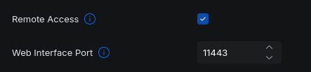
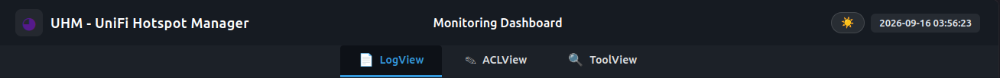
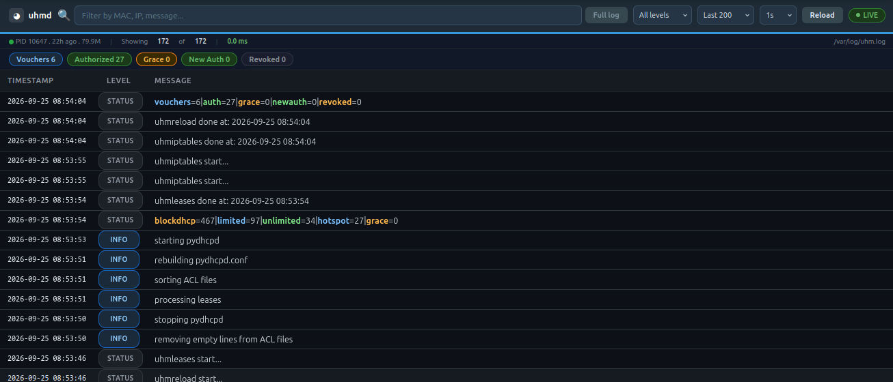
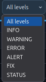
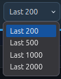
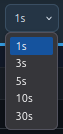
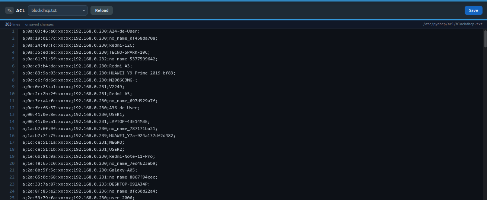
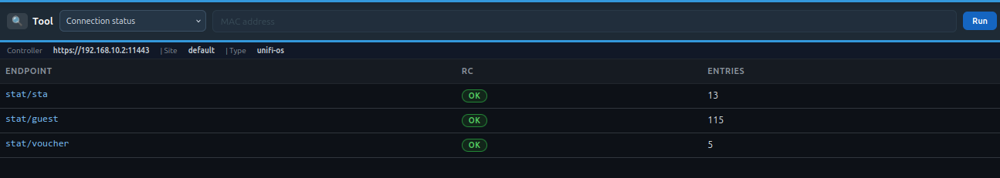
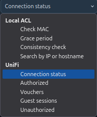
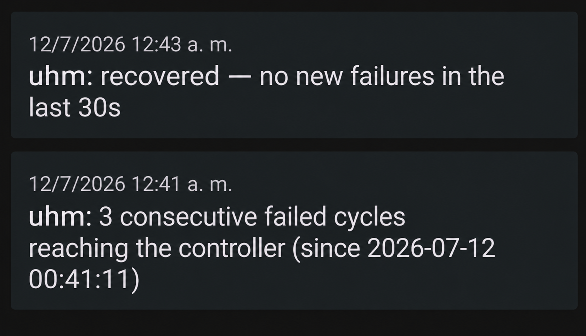

# [UHM](https://github.com/maravento) — UniFi Hotspot Manager

[](https://github.com/maravento/uhm)
[](https://github.com/maravento/uhm)
[](https://github.com/maravento/uhm/stargazers)
[](https://twitter.com/maraventostudio)

<!-- markdownlint-disable MD033 -->

<table>
  <tr>
    <td style="width: 50%; vertical-align: top;">
      <p>Many businesses, institutions, and other environments use Ubiquiti UniFi networks with access points, switches, and gateways. UniFi provides tools to manage the network, authenticate users, and control access.</p>
      <p>In some environments, more specific access rules, finer filtering, usage limits, or services that the gateway does not provide or only provides in a limited way are needed. The need lies in the available level of control and customization, not necessarily in the hardware or its cost.</p>
      <p><strong>UHM</strong> runs <strong>UniFi Network self-hosted</strong> on Linux and configures the UniFi gateway in <strong>Third-Party Gateway</strong> mode. UniFi keeps its native network functions, while Linux applies policies and provides additional services.</p>
      <p>Users first authenticate through the UniFi captive portal with a voucher. After the voucher is redeemed, UHM applies the policies and controls configured in Linux to the connection.</p>
      <p>These functions include DHCP, MAC-to-IP mapping, access control lists (ACLs), firewall rules with <code>iptables/ipset</code>, and client management.</p>
      <p>Because it is built on Linux, UHM can integrate whatever additional services the environment requires, such as Unbound, Squid, Suricata, Samba, among others.</p>
      <p>UniFi provides the wireless network, captive portal, and voucher authentication. UHM adds Linux-based controls that let administrators tailor the network to their environment.</p>
      <p>With <a href="https://github.com/maravento/proxymon">Proxymon</a>, traffic can also be monitored and data usage limited on connections with a data allowance.</p>
      <p>UHM is not intended to replace UniFi. It <strong>extends its capabilities with a Linux platform for more detailed, customizable, and extensible network and security policies.</strong></p>
    </td>
    <td style="width: 50%; vertical-align: top;">
      <p>Muchas empresas, instituciones y otros entornos usan redes Ubiquiti UniFi con puntos de acceso, switches y gateways. UniFi ofrece herramientas para administrar la red, autenticar usuarios y controlar el acceso.</p>
      <p>En algunos entornos se necesitan reglas de acceso más específicas, filtros más detallados, límites de consumo o servicios que el gateway no ofrece o solo ofrece de forma limitada. La necesidad está en el nivel de control y personalización disponible, no necesariamente en el hardware ni en su costo.</p>
      <p><strong>UHM</strong> propone ejecutar <strong>UniFi Network self-hosted</strong> en Linux y configurar el gateway UniFi en modo <strong>Third-Party Gateway</strong>. UniFi conserva las funciones nativas de la red, mientras Linux aplica las políticas y presta servicios adicionales.</p>
      <p>La autenticación inicial se realiza en el portal cautivo de UniFi mediante vouchers. Después de canjear uno, UHM aplica a la conexión las políticas y los controles configurados en Linux.</p>
      <p>Entre esas funciones están DHCP, la asociación de direcciones MAC e IP, las listas de control de acceso (ACL), las reglas de firewall con <code>iptables/ipset</code> y la gestión de clientes.</p>
      <p>Como se basa en Linux, UHM puede integrar los servicios adicionales que requiera cada entorno, por ejemplo, Unbound, Squid, Suricata, Samba, entre otros.</p>
      <p>UniFi mantiene la red inalámbrica, el portal cautivo y la autenticación mediante vouchers. UHM añade controles desde Linux para adaptar la red a las necesidades del entorno.</p>
      <p>Al integrar <a href="https://github.com/maravento/proxymon">Proxymon</a>, también es posible supervisar el tráfico y limitar el consumo de datos en conexiones con cuota de datos.</p>
      <p>UHM no pretende sustituir a UniFi, sino <strong>ampliar sus capacidades con una plataforma Linux que permite aplicar políticas de red y seguridad más detalladas, personalizadas y extensibles</strong>.</p>
    </td>
  </tr>
</table>

## UNIFI HARDWARE VS UHM

---

**UniFi gateway alone:**

| Stage | Description | Descripción |
|---|---|---|
| **Joins the SSID** | DHCP lease from the gateway | Concesión DHCP del gateway |
| **Before redeeming a voucher** | Held at the captive portal by the AP. Tracked only as an unauthorized guest session | Retenido en el portal cautivo por el AP. Solo se rastrea como sesión de invitado no autorizada |
| **Redeems a valid voucher** | Marked authorized; keeps whatever IP it already had | Queda autorizado; conserva la IP que ya tenía |
| **While authorized** | Full access until the voucher expires | Acceso completo hasta que expire el voucher |
| **Voucher expires** | Back to the captive portal; must redeem another one | Vuelve al portal cautivo; debe canjear otro |
| **Never redeems a voucher** | Remains at the portal and keeps a DHCP lease while retrying | Permanece en el portal y conserva una concesión DHCP mientras vuelve a intentarlo |
| **Admin unauthorizes / deletes the voucher** | Client returns to the portal | El cliente vuelve al portal |
| **Corporate / infrastructure devices** | Need a separate SSID, VLAN or manual per-client authorization | Requieren un SSID aparte, una VLAN o autorización manual por cliente |
| **Durable record of voucher activity** | `stat/voucher` drops a voucher once it expires or its quota runs out | `stat/voucher` descarta un voucher cuando expira o se agota su cuota |
| **Hardware required** | UDM, UDM-Pro, Cloud Key or equivalent gateway | UDM, UDM-Pro, Cloud Key o gateway equivalente |

**Unifi Hotspot Manager - UHM:**

| Stage | Description | Descripción |
|---|---|---|
| **Joins the SSID** | DHCP lease from `pydhcpd`, assigned from the block pool range (`SERV_INI_RANGE_BLOCK`-`SERV_END_RANGE_BLOCK`) | Concesión DHCP de `pydhcpd`, asignada desde el rango de bloqueo (`SERV_INI_RANGE_BLOCK`-`SERV_END_RANGE_BLOCK`) |
| **Before redeeming a voucher** | Added to `uhm-grace.txt` with the time of first contact. The `macgrace` ipset limits access to the portal ports and DNS to the configured resolvers | Se añade a `uhm-grace.txt` con la hora del primer contacto. El ipset `macgrace` limita el acceso a los puertos del portal y al DNS de los resolvers configurados |
| **Redeems a valid voucher** | Added to `uhm-auth.txt`, assigned a **fixed IP** in the hotspot range, DHCP lease released, and disconnected so it reconnects with the new IP | Se añade a `uhm-auth.txt`, recibe una **IP fija** del rango del hotspot, se libera su concesión DHCP y se desconecta al cliente para que vuelva a conectarse con la IP nueva |
| **While authorized** | Same, plus firewall enforcement via the `machotspot` ipset and optional Squid/proxy routing | Igual, más la aplicación de firewall vía el ipset `machotspot` y el enrutamiento opcional por Squid/proxy |
| **Voucher expires** | Removed from `uhm-auth.txt`, lease released, re-enters `uhm-grace.txt` with a **fresh** grace timer — same as a brand-new client | Se elimina de `uhm-auth.txt`, se libera su lease y vuelve a entrar a `uhm-grace.txt` con un temporizador de gracia **nuevo** — igual que un cliente recién llegado |
| **Never redeems a voucher** | After `BLOCKDHCP_GRACE_SECONDS` (default 24h) it moves permanently to `blockdhcp.txt` and `pydhcpd` **stops assigning it an IP address** | Tras `BLOCKDHCP_GRACE_SECONDS` (default 24h) pasa permanentemente a `blockdhcp.txt` y `pydhcpd` **deja de asignarle una dirección IP** |
| **Admin unauthorizes / deletes the voucher** | Removed from `uhm-auth.txt` and sent back through the grace cycle. The stale UniFi session it leaves behind cannot re-authorize it — only a new voucher can | Se elimina de `uhm-auth.txt` y vuelve al ciclo de gracia. La sesión residual que UniFi deja atrás no puede reautorizarlo: solo un voucher nuevo puede |
| **Corporate / infrastructure devices** | Listed in `mac-*.txt`: fixed address and no timer at the DHCP level, plus automatic `authorize-guest` in UniFi every cycle so the AP never holds them at the portal on a Guest/Hotspot LAN | Se listan en `mac-*.txt`: dirección fija y sin temporizador a nivel DHCP, más `authorize-guest` automático en UniFi cada ciclo para que el AP nunca los retenga en el portal en una WLAN Guest/Hotspot |
| **Durable record of voucher activity** | `/var/log/uhm.log` keeps the full history, and `uhmunifi.sh` cross-references it against the live controller | `/var/log/uhm.log` conserva el historial completo, y `uhmunifi.sh` lo cruza contra el controlador en vivo |
| **Hardware required** | One UniFi AP plus a Linux host running the self-hosted controller | Un AP UniFi más un host Linux corriendo el controlador self-hosted |

## REQUIREMENTS

---

### ⚠️ WARNING

| Description | Descripción |
|-------------|-------------|
| Tested on Ubuntu 24.04/26.04 LTS. Use on other versions or distributions at your own risk. | Probado en Ubuntu 24.04/26.04 LTS. El uso en otras versiones o distribuciones queda bajo tu responsabilidad. |
| Install UHM on a clean system. `uhmsetup.sh` installs `pydhcp` as the DHCP server and `apache2` for the web panel and WPAD (optional); it also configures the firewall. If the panel or WPAD is enabled, the installer modifies `/etc/apache2/ports.conf`, creates a VirtualHost under `sites-available/`, and adds a rule under `sudoers.d/`. | Se recomienda instalar UHM en un sistema limpio. `uhmsetup.sh` instala `pydhcp` como servidor DHCP y `apache2` para el panel web y WPAD (opcional); también configura el firewall. Al habilitar el panel o WPAD, el instalador modifica `/etc/apache2/ports.conf`, crea un VirtualHost en `sites-available/` y añade una regla en `sudoers.d/`. |
| Before installing, the script checks for conflicting software. It stops if it finds another DHCP or web server (`isc-dhcp-server`, `kea-dhcp4-server`, `udhcpd`, `nginx`, `lighttpd`, or `caddy`), `firewalld`, or an active `ufw`. It only warns about `dnsmasq`. `apache2` and `squid` are not conflicts: UHM installs `apache2`, and the reference firewall rules expect `squid`. | Antes de instalar, el script busca programas que podrían entrar en conflicto. Si encuentra otro servidor DHCP o web (`isc-dhcp-server`, `kea-dhcp4-server`, `udhcpd`, `nginx`, `lighttpd` o `caddy`), `firewalld` o un `ufw` activo, detiene la instalación. Si encuentra `dnsmasq`, solo muestra una advertencia. `apache2` y `squid` no se consideran conflictos: UHM instala el primero y las reglas de firewall de referencia contemplan el segundo. |

### Hardware

| Resource | Minimum |
|----------|---------|
| CPU | 2 cores |
| RAM | 4 GB |
| Disk | 8 GB |

> These are approximate values. UniFi Network self-hosted accounts for most of the resource use, which varies by version, number of managed devices, and environment. UHM itself (`uhmd.sh`, `uhmleases.sh`, and `pydhcpd.py`) adds little overhead.
>
> Son valores aproximados: UniFi Network self-hosted determina la mayor parte del consumo, que puede variar según la versión, la cantidad de dispositivos y el entorno. UHM (`uhmd.sh`, `uhmleases.sh` y `pydhcpd.py`) añade una carga mínima.

### Software

| Component | Tested Version |
|-----------|-----------------|
| UniFi OS Server | 5.1.15 |
| UniFi Network (self-hosted) | 10.4.57 |
| `iptables` | 1.8.10 |
| `ipset` | 7.19 |
| `pydhcpd` | latest |

> `UHM` only checks whether UniFi Network self-hosted or UniFi OS Server is installed; it does not install either one. If neither is installed, first use [`unifisetup.sh`](https://raw.githubusercontent.com/maravento/vault/refs/heads/master/scripts/bash/unifisetup.sh) to install the controller, then run `uhmsetup.sh`.
>
> `UHM` solo comprueba si UniFi Network self-hosted o UniFi OS Server está instalado; no instala ninguno. Si aún no hay un controlador instalado, primero se instala con [`unifisetup.sh`](https://raw.githubusercontent.com/maravento/vault/refs/heads/master/scripts/bash/unifisetup.sh) y luego se ejecuta `uhmsetup.sh`.

### Instance

<table>
  <tr>
    <td style="width: 50%; vertical-align: top;">
      <code>UHM</code> is designed to manage one guest network. Each installation supports:
      <ul>
        <li>1 UniFi Network, for example <code>Default</code>.</li>
        <li>1 ESSID associated with that Network, with Hotspot enabled.</li>
        <li>1 private IPv4 subnet for <code>pydhcp</code> and UHM's firewall and network controls.</li>
      </ul>
      This is a design limitation, not a configuration option: <code>pydhcp</code> and UHM manage only one Network and one IPv4 subnet. <br>
      <br>
      The UniFi controller may contain other Networks, VLANs, or ESSIDs. They can operate normally, but they are outside UHM's scope and need their own DHCP, routing, and firewall services. <br>
      <br>
      A controller can therefore host the Network managed by UHM alongside other Networks managed by separate infrastructure, but UHM manages only one Network.
    </td>
    <td style="width: 50%; vertical-align: top;">
      <code>UHM</code> está diseñado para administrar una sola red de invitados. Cada instalación admite:
      <ul>
        <li>1 Network de UniFi, por ejemplo <code>Default</code>.</li>
        <li>1 ESSID asociado a esa Network y con Hotspot activado.</li>
        <li>1 subred IPv4 privada para <code>pydhcp</code> y las funciones de firewall y control de red de UHM.</li>
      </ul>
      Es una limitación del diseño, no una opción de configuración: <code>pydhcp</code> y UHM solo administran una Network y una subred IPv4. <br>
      <br>
      El controlador UniFi puede incluir otras Networks, VLAN o ESSID. Pueden funcionar con normalidad, pero quedan fuera del alcance de UHM y necesitan sus propios servicios de DHCP, enrutamiento y firewall. <br>
      <br>
      Así, un mismo controlador puede alojar la Network que administra UHM y otras redes gestionadas por una infraestructura independiente, pero UHM solo administra una Network.
    </td>
  </tr>
</table>

```text
                     UniFi Controller
                             |
               +-------------+--------------+
               |                            |
       Network: Default              Other Networks
      Third-Party Gateway           VLANs / Networks
               |                            |
            Hotspot                         |
               |                            |
          Guest ESSID                       |
               |                            |
               v                            v
     +-------------------+        +-------------------+
     |        UHM        |        |    Third-party    |
     |                   |        |  infrastructure   |
     |     1 Network     |        |                   |
     |      1 ESSID      |        |  DHCP / Routing   |
     |     1 Hotspot     |        |  Firewall / etc.  |
     |   1 IPv4 range    |        |                   |
     +-------------------+        +-------------------+
               |
               v
     ├── DHCP
     ├── Firewall
     ├── Guest management
     └── Optional:
         ├── Squid Proxy
           ├── Suricata
         └── Unbound...
```

### Mandatory

| Component | Used by | Purpose | Propósito |
|-----------|---------|---------|-----------|
| **UniFi Network (self-hosted)** | `uhmd`, `uhmunifi.sh` | Captive portal SSID, vouchers, and the API Site must be **Third-Party Gateway**. Local admin account. See Instance above for the single-Network limitation | SSID de portal cautivo, vouchers, y el Site de la API debe ser **Third-Party Gateway**. Cuenta de admin local. Ver Instance arriba para la limitación de Network única |
| **pydhcp** | `uhmd` (verified at startup) | `uhmsetup.sh` clones `pydhcp` and runs its interactive installer, `pysetup.sh`, which asks for the network settings and saves them to `pydhcp.env`. Installation is skipped if `pydhcpd` is already active. Only one DHCP server may be active | `uhmsetup.sh` clona `pydhcp` y ejecuta su instalador interactivo, `pysetup.sh`, que solicita la configuración de red y la guarda en `pydhcp.env`. Si `pydhcpd` ya está activo, UHM omite la instalación. Solo debe haber un servidor DHCP activo |
| **apache2** | panel, WPAD/PAC | Installed by `uhmsetup.sh` together with `libapache2-mod-php`. Serves the web panel on port 4048 and the PAC file on `WPAD_PORT` when the optional WPAD feature is enabled | Lo instala `uhmsetup.sh` junto con `libapache2-mod-php`. Sirve el panel web en el puerto 4048 y el archivo PAC en `WPAD_PORT` cuando se activa la función opcional WPAD |
| **git** | `uhmsetup.sh` (install time only) | Clones the pydhcp repository | Clona el repositorio de pydhcp |
| **iptables** + **ipset** | `uhmiptables.sh` | `uhmsetup.sh` installs an initial configuration with IPv4 forwarding and NAT. This configuration does not include the firewall rules that enforce ACLs; the reference rules must be adapted and copied to `uhmiptables.sh` | `uhmsetup.sh` instala una configuración inicial con reenvío IPv4 y NAT. Esta configuración no incluye las reglas de firewall que aplican las ACL; las reglas de referencia deben adaptarse y copiarse a `uhmiptables.sh` |
| **bash**, **curl**, **jq** | `uhmd`, `uhmunifi.sh`, `uhmleases.sh` | Script execution, UniFi API access, JSON reading | Ejecución de scripts, acceso a la API de UniFi y lectura de datos JSON |
| **openssl** | `uhmsetup.sh` (install time only) | Computes `UNIFI_CERT_PIN` from the controller's TLS certificate | Calcula `UNIFI_CERT_PIN` a partir del certificado TLS del controlador |
| **python3** | `uhmleases.sh` (runtime), `uhmsetup.sh` (install time) | Range arithmetic: checks that `SERVER_IP` does not fall inside the block pool or the hotspot range, and that the hotspot range is inside the network and does not overlap pydhcp's pool | Aritmética de rangos: verifica que `SERVER_IP` no caiga dentro del pool de bloqueo ni del rango del hotspot, y que el rango del hotspot esté dentro de la red y no se solape con el pool de pydhcp |
| **coreutils**, **grep** | all bash scripts in the project | Text/field parsing (MAC/IP/ACL lines, DHCP config, logs) | Parseo de texto/campos (líneas MAC/IP/ACL, config DHCP, logs) |
| **sed** | `uhmd.sh`, `uhmleases.sh`, `uhmwatch.sh`, `uhmunifi.sh` | Direct edits to ACL and configuration files | Edición directa de archivos ACL y de configuración |
| **util-linux** (`flock`) | all bash scripts in the project | Prevents overlapping runs of the same script | Evita que se solapen dos ejecuciones del mismo script |
| **iproute2** (`ip`, `ss`) | `uhmsetup.sh` (install time), `uhmiptables.sh` | `ss` checks whether a port is already in use; `ip link show` verifies that `WAN_IFACE` exists before the NAT rule names it | `ss` comprueba si un puerto ya está en uso; `ip link show` verifica que `WAN_IFACE` exista antes de que la regla NAT la nombre |
| **libc-bin** (`getent`) | `uhmleases.sh` | Checks that the `pydhcpd` user and group exist | Verifica que el usuario y grupo `pydhcpd` existan |
| **findutils** (`find`) | `uhmsetup.sh` | Clears the install directory on uninstall, preserving `bak/` | Vacía el directorio de instalación al desinstalar, conservando `bak/` |
| **procps** (`sysctl`) | `uhmiptables.sh` | Enables IPv4 forwarding | Habilita el forwarding IPv4 |
| **systemd** (`systemctl`) | `uhmd`, `uhmreload.sh`, `uhmwatch.sh`, `uhmleases.sh`, `uhmalert.sh`, `uhmtool.sh` | Manages/checks the `uhmd`/`pydhcpd`/UniFi services | Gestiona/verifica los servicios `uhmd`/`pydhcpd`/UniFi |
| **cron** | `uhmwatch.sh` (mandatory, installed automatically) | Runs the service supervisor every minute | Ejecuta cada minuto el supervisor de servicios |
| **logrotate** | `uhmsetup.sh` (writes `/etc/logrotate.d/uhm`) | Rotates `/var/log/uhm.log` daily; without it the shared log grows without limit | Rota `/var/log/uhm.log` a diario; sin él el log compartido crece sin límite |
| **zip** | `tools/uhmbk.sh` | Creates a monthly compressed configuration archive under `/etc/bak/uhm` | Crea cada mes un archivo comprimido con la configuración en `/etc/bak/uhm` |

### Optional components

| Component | Requirements | Purpose | Propósito |
|-----------|--------------|---------|-----------|
| **WPAD/PAC** | `apache2` (installed by UHM) and `pydhcpd` with DHCP option 252 support | Optional proxy auto-configuration feature. The installer offers to enable it; when enabled, it publishes the PAC file through Apache and configures DHCP option 252 | Función opcional de configuración automática del proxy. El instalador ofrece activarla; al hacerlo, publica el archivo PAC mediante Apache y configura la opción DHCP 252 |

```bash
# Required packages -- uhmsetup.sh aborts if any is missing
sudo apt update
sudo apt install -y bash curl jq iptables ipset cron python3 openssl coreutils util-linux iproute2 grep sed systemd libc-bin findutils procps logrotate git zip

# Installed by uhmsetup.sh, not by hand:
#   • pydhcp (DHCP backend) — https://github.com/maravento/pydhcp
#   • apache2, libapache2-mod-php (panel and WPAD)
```

> **squid is not a dependency of UHM** and is not installed as part of the project. As a complement to UHM, integrating Squid and Proxymon is recommended for monitoring and controlling LAN traffic. When WPAD is accepted, `uhmsetup.sh` looks for `squid`, `squid-openssl` or `squid3`, reads the first `http_port` from `/etc/squid/squid.conf` and checks that something is listening on it. If it responds, the generated `wpad.pac` points to that proxy; otherwise, the PAC returns `DIRECT` and nothing else changes. The reference firewall ruleset (`tools/uhmiptables_example.txt`) assumes a proxy, which is one reason it is not deployed as-is.
>
> **squid no es una dependencia de UHM** y no se instala como parte del proyecto. Como complemento de UHM, se recomienda integrar Squid y Proxymon para supervisar y controlar el tráfico de la LAN. Cuando se acepta WPAD, `uhmsetup.sh` busca `squid`, `squid-openssl` o `squid3`, lee el primer `http_port` de `/etc/squid/squid.conf` y comprueba que algo escuche en ese puerto. Si responde, el `wpad.pac` generado apunta a ese proxy; si no, el PAC devuelve `DIRECT` y nada más cambia. El ruleset de firewall de referencia (`tools/uhmiptables_example.txt`) sí asume un proxy, y esa es una de las razones por las que no se despliega tal cual.

> To start, UHM must be able to log in to the UniFi controller, and `pydhcpd` must be active. If either remains unavailable after the grace period, `uhmd` exits. UHM also needs to find `uhmreload.sh` to start. If `uhmiptables.sh` is missing, the reload logs a warning and continues without applying firewall rules. If the script exists but fails when run, the reload stops and the firewall may be incomplete; the daemon can still run and classify clients.
>
> Para iniciar, UHM necesita que el controlador UniFi permita iniciar sesión y que `pydhcpd` esté activo. Si alguno sigue sin estar disponible al terminar el período de gracia, `uhmd` termina. También necesita encontrar `uhmreload.sh` para arrancar. Si falta `uhmiptables.sh`, la recarga registra una advertencia y continúa sin aplicar las reglas del firewall. Si el script existe pero falla al ejecutarse, la recarga se interrumpe y el firewall puede quedar incompleto; aun así, el daemon puede seguir funcionando y clasificando clientes.

## SCOPE

---

<table>
  <tr>
    <td style="width: 50%; vertical-align: top;">
      <b>What UHM does</b>
      <ul>
        <li>Queries the UniFi controller API through a local account.</li>
        <li>Reads <code>UNIFI_TYPE</code> from <code>uhm.env</code>. During installation, <code>uhmsetup.sh</code> detects a <code>unifi-os</code> or <code>classic</code> controller on ports <code>8443</code> and <code>11443</code> of the same server. If neither responds, installation stops. UHM supports one controller installed on this server, so the installer detects its URL instead of asking you to enter it. <br>
          <code>uhmd.sh</code> supports both types:
          <ul>
            <li><code>unifi-os</code> — UDM, UDM-Pro, UDR and Cloud Key Gen2+: <code>/api/auth/login</code>, <code>TOKEN</code> cookie and CSRF token taken from the JWT contents.</li>
            <li><code>classic</code> — self-hosted UniFi Network Application: <code>/api/login</code>, <code>unifises</code> cookie and CSRF taken from the response header.</li>
          </ul>
        </li>
        <li>Classifies the clients of the guest SSID into three states:
          <ul>
            <li>grace — timer running and no voucher;</li>
            <li>authorized — active voucher;</li>
            <li>blocked — grace period expired and no voucher.</li>
          </ul>
        </li>
        <li>Checks that <code>pydhcpd</code> is active at startup. If it is not available yet, it retries silently for <code>STARTUP_GRACE_SECONDS</code> before aborting. This is the same grace window used for the UniFi login.</li>
        <li>Queues the removals from <code>pydhcpd.leases</code> that correspond to managed MACs. <code>uhmleases.sh</code> consumes that queue during its safe stop → modify → start cycle of the DHCP service.</li>
        <li>Runs <code>UHM_RELOAD</code>, defined by the user, when the ACLs have actually changed, determined through an MD5 comparison, or when the periodic safety-net reload is due.</li>
        <li>Runs as a <code>systemd</code> service through <code>uhmd.service</code>, installed by <code>uhmsetup.sh</code>. The daemon performs its own safety-net reload every <code>RELOAD_SAFETY_INTERVAL_SECONDS</code> —one hour by default— so that the promotion from grace to blocked continues even on idle networks, with no external cron.</li>
        <li>Handles the MACs listed in <code>mac-*.txt</code> independently from the normal guest flow. The daemon checks the managed MAC lists directly in their files. It never adds those devices to <code>uhm-auth.txt</code> or treats them as voucher sessions. This prevents an old session or an authorization made outside the daemon from turning a managed device into a normal hotspot client. <br>
          <code>uhmleases.sh</code> handles only the fixed address and the DHCP bypass of those MACs during each reload. On a WLAN configured as Guest/Hotspot, that alone is not enough to skip the UniFi captive portal: the AP keeps the client at the portal according to its <code>authorized</code> state in <code>stat/sta</code>, regardless of the DHCP or firewall state. <br>
          To keep the captive portal from holding these devices, the daemon uses UniFi's <code>authorize-guest</code> when an active managed MAC appears as unauthorized. It checks and renews the authorization every cycle; its duration is calculated from <code>AUTHORIZED_LEASE_TIME / 60</code> (30 days by default). This is the only operation through which UHM authorizes a managed MAC in UniFi, and it modifies neither <code>uhm-auth.txt</code> nor any local ACL.</li>
        <li>Uses the <code>logrotate</code> configuration in <code>/etc/logrotate.d/uhm</code>, created by <code>uhmsetup.sh</code> through <code>install_logrotate()</code>: daily rotation, 7 copies and compression. All the output is centralized in <code>/var/log/uhm.log</code>.</li>
        <li>Reads its configuration from <code>/etc/uhm/uhm.env</code>, generated by <code>uhmsetup.sh</code> with owner <code>root:root</code> and mode <code>600</code>. This file contains the UniFi password. Before reading it, each component checks that it belongs to <code>root:root</code> and has mode <code>600</code>; if not, it restores the expected permissions and logs a <code>WARNING</code>. The same mechanism applies to the ACL lists (<code>root:root</code>, <code>600</code>), to the scripts (<code>755</code>, and <code>750</code> for <code>uhmiptables.sh</code>) and to <code>/var/log/uhm.log</code> (<code>root:adm</code>, <code>640</code>).</li>
        <li>Validates the integrity of the installation before each run through <code>verify_installation()</code>.</li>
        <li>Obtains the client state exclusively through the UniFi API: <code>stat/sta</code>, <code>stat/guest</code> and <code>stat/voucher</code>. It does not use the UniFi web interface, which may show delays or different information without affecting the real state provided by the API.</li>
        <li>Detects new clients by reading <code>pydhcpd.leases</code> directly on every cycle, not through <code>stat/sta</code>. Normally, a new client is detected within one <code>POLL_INTERVAL</code> cycle.</li>
        <li>Requires <code>uhmreload.sh</code> and <code>uhmleases.sh</code>, both located in <code>core/</code>, to reconcile the ACLs and the leases. Without those components, UHM cannot work properly.</li>
        <li>Works with IPv4 only.</li>
        <li>Uses the UniFi controller installed on this same host. <code>discover_unifi_controller()</code> probes <code>https://CFG_SERVER_IP:8443</code> and <code>https://CFG_SERVER_IP:11443</code>, using the host's own LAN IP.</li>
      </ul>
      <b>Out of scope (not implemented)</b>
      <ul>
        <li>It does not support other DHCP backends. The only supported backend is <code>pydhcpd</code>; it does not support <code>dnsmasq</code>, <code>isc-dhcp-server</code> or other DHCP servers.</li>
        <li>It does not modify <code>iptables</code> or <code>ipset</code> directly. Those operations are delegated to <code>UHM_RELOAD</code>.</li>
        <li>It does not support IPv6.</li>
        <li>It does not support several guest ESSIDs at the same time. UHM supports exactly one guest ESSID bound to the captive portal. During the installation, <code>uhmsetup.sh</code> obtains the available SSIDs from the controller and, if it finds more than one, forces exactly one to be selected.</li>
        <li>It does not support a UniFi controller on a remote host. <code>discover_unifi_controller()</code> probes only the host itself and does not look for controllers at other addresses. It does not support more than one self-hosted UniFi installation on the same host either: UHM uses a single <code>UNIFI_CONTROLLER_URL</code> / <code>UNIFI_TYPE</code> pair in <code>uhm.env</code>. If <code>uhmsetup.sh</code> fails to detect the controller, the installation aborts and no manual URL is requested.</li>
        <li>It does not integrate with UniFi Teleport. Teleport is a feature of the UniFi gateway consoles, such as the UDM, and falls outside the scope of UHM, which operates against a self-hosted UniFi Network Application.</li>
      </ul>
    </td>
    <td style="width: 50%; vertical-align: top;">
      <b>Lo que UHM hace</b>
      <ul>
        <li>Consulta la API del controlador UniFi mediante una cuenta local.</li>
        <li>Lee <code>UNIFI_TYPE</code> desde <code>uhm.env</code>. Durante la instalación, <code>uhmsetup.sh</code> detecta un controlador <code>unifi-os</code> o <code>classic</code> en los puertos <code>8443</code> y <code>11443</code> de este mismo servidor. Si ninguno responde, la instalación se detiene. UHM admite un solo controlador, instalado en este servidor; por eso el instalador detecta la URL en lugar de pedirte que la escribas. <br>
          <code>uhmd.sh</code> admite ambos tipos:
          <ul>
            <li><code>unifi-os</code> — UDM, UDM-Pro, UDR y Cloud Key Gen2+: <code>/api/auth/login</code>, cookie <code>TOKEN</code> y token CSRF obtenido del contenido del JWT.</li>
            <li><code>classic</code> — UniFi Network Application autohospedado: <code>/api/login</code>, cookie <code>unifises</code> y CSRF obtenido del encabezado de la respuesta.</li>
          </ul>
        </li>
        <li>Clasifica los clientes del SSID de invitados en tres estados:
          <ul>
            <li>gracia — contador activo y sin voucher;</li>
            <li>autorizados — voucher activo;</li>
            <li>bloqueados — periodo de gracia expirado y sin voucher.</li>
          </ul>
        </li>
        <li>Verifica que <code>pydhcpd</code> esté activo al arrancar. Si todavía no está disponible, reintenta silenciosamente durante <code>STARTUP_GRACE_SECONDS</code> antes de abortar. Esta es la misma ventana de gracia utilizada para el inicio de sesión en UniFi.</li>
        <li>Encola las remociones de <code>pydhcpd.leases</code> correspondientes a las MAC gestionadas. <code>uhmleases.sh</code> consume esta cola durante su ciclo seguro de detener → modificar → arrancar el servicio DHCP.</li>
        <li>Ejecuta <code>UHM_RELOAD</code>, definido por el usuario, cuando las ACL realmente han cambiado, determinado mediante una comparación MD5, o cuando corresponde el reload periódico de seguridad.</li>
        <li>Funciona como servicio <code>systemd</code> mediante <code>uhmd.service</code>, instalado por <code>uhmsetup.sh</code>. El daemon realiza su propio reload de seguridad cada <code>RELOAD_SAFETY_INTERVAL_SECONDS</code> —una hora por defecto— para que la promoción de gracia a bloqueo continúe incluso en redes sin actividad, sin necesidad de un cron externo.</li>
        <li>Gestiona las MAC incluidas en <code>mac-*.txt</code> de forma independiente del flujo normal de invitados. El daemon consulta directamente en los archivos las MAC de los dispositivos gestionados. No las añade a <code>uhm-auth.txt</code> ni las trata como sesiones de voucher. Así evita que una sesión antigua o una autorización externa las convierta en clientes normales del hotspot. <br>
          <code>uhmleases.sh</code> gestiona exclusivamente la dirección fija y el bypass de DHCP de estas MAC durante cada reload. En una WLAN configurada como Guest/Hotspot, esto no basta por sí solo para evitar el portal cautivo de UniFi: el AP mantiene al cliente en el portal según su estado <code>authorized</code> en <code>stat/sta</code>, independientemente del estado de DHCP o del firewall. <br>
          Para evitar que el portal cautivo retenga estos dispositivos, el daemon utiliza <code>authorize-guest</code> de UniFi cuando una MAC gestionada activa aparece como no autorizada. Comprueba y renueva la autorización en cada ciclo; su duración se calcula a partir de <code>AUTHORIZED_LEASE_TIME / 60</code> (30 días por defecto). Esta es la única operación mediante la cual UHM autoriza una MAC gestionada en UniFi y no modifica <code>uhm-auth.txt</code> ni ninguna ACL local.</li>
        <li>Utiliza la configuración de <code>logrotate</code> en <code>/etc/logrotate.d/uhm</code>, creada por <code>uhmsetup.sh</code> mediante <code>install_logrotate()</code>: rotación diaria, 7 copias y compresión. Toda la salida se centraliza en <code>/var/log/uhm.log</code>.</li>
        <li>Lee su configuración desde <code>/etc/uhm/uhm.env</code>, generado por <code>uhmsetup.sh</code> con propietario <code>root:root</code> y modo <code>600</code>. El archivo contiene la contraseña de UniFi. Antes de leerlo, cada componente comprueba que pertenezca a <code>root:root</code> y tenga permisos <code>600</code>; si no, corrige los permisos y registra un <code>WARNING</code>. El mismo mecanismo se aplica a las listas ACL (<code>root:root</code>, <code>600</code>), a los scripts (<code>755</code>, y <code>750</code> para <code>uhmiptables.sh</code>) y a <code>/var/log/uhm.log</code> (<code>root:adm</code>, <code>640</code>).</li>
        <li>Valida la integridad de la instalación antes de cada ejecución mediante <code>verify_installation()</code>.</li>
        <li>Obtiene el estado de los clientes exclusivamente mediante la API de UniFi: <code>stat/sta</code>, <code>stat/guest</code> y <code>stat/voucher</code>. No utiliza la interfaz web de UniFi, que puede presentar retrasos o información diferente sin afectar el estado real proporcionado por la API.</li>
        <li>Detecta clientes nuevos leyendo directamente <code>pydhcpd.leases</code> en cada ciclo, no mediante <code>stat/sta</code>. Normalmente, un cliente nuevo se detecta dentro de un ciclo de <code>POLL_INTERVAL</code>.</li>
        <li>UHM necesita <code>uhmreload.sh</code> y <code>uhmleases.sh</code>, ubicados en <code>core/</code>, para sincronizar las ACL y las concesiones DHCP.</li>
        <li>Trabaja únicamente con IPv4.</li>
        <li>Utiliza el controlador UniFi instalado en este mismo host. <code>discover_unifi_controller()</code> sondea <code>https://CFG_SERVER_IP:8443</code> y <code>https://CFG_SERVER_IP:11443</code>, utilizando la IP LAN del propio host.</li>
      </ul>
      <b>Fuera de alcance (no implementado)</b>
      <ul>
        <li>UHM no admite otros servidores DHCP. El único compatible es <code>pydhcpd</code>; no admite <code>dnsmasq</code>, <code>isc-dhcp-server</code> ni otros.</li>
        <li>No modifica <code>iptables</code> ni <code>ipset</code> directamente. Estas operaciones se delegan a <code>UHM_RELOAD</code>.</li>
        <li>No soporta IPv6.</li>
        <li>UHM no admite varios ESSID de invitados a la vez. Solo admite uno vinculado al portal cautivo. Durante la instalación, <code>uhmsetup.sh</code> obtiene los SSID disponibles del controlador y, si encuentra más de uno, obliga a seleccionar exactamente uno.</li>
        <li>UHM no admite un controlador UniFi instalado en otro equipo. <code>discover_unifi_controller()</code> solo sondea el propio host y no busca controladores en otras direcciones. Tampoco admite más de una instalación UniFi self-hosted en el mismo host: UHM utiliza un único par <code>UNIFI_CONTROLLER_URL</code> / <code>UNIFI_TYPE</code> en <code>uhm.env</code>. Si <code>uhmsetup.sh</code> no consigue detectar el controlador, la instalación se aborta y no se solicita una URL manual.</li>
        <li>No se integra con UniFi Teleport. Teleport es una función de las consolas gateway de UniFi, como UDM, y queda fuera del alcance de UHM, que opera contra UniFi Network Application self-hosted.</li>
      </ul>
    </td>
  </tr>
</table>

## REPOSITORY STRUCTURE

---

<table width="100%">
  <tr>
    <td style="width: 50%; vertical-align: top;">
      This is the structure of the repository after cloning it with <code>git clone ... && cd uhm</code>. <b>It does not correspond to the structure of the installation.</b> <br>
      <br>
      <code>uhmsetup.sh</code> is used only from the clone and <b>is never deployed to the installed system</b>. <br>
      <br>
      The files under <code>core/</code> and <code>tools/</code> are deployed by <code>uhmsetup.sh</code> into their respective subdirectories inside <code>/etc/uhm/</code>. That includes <code>tools/uhmiptables_example.txt</code>, deployed read-only and never executed, so the administrator can copy it over the placeholder without the clone. <br>
      <br>
      The files under <code>config/</code> go to their system locations instead, not to <code>/etc/uhm/</code>: the unit to <code>/etc/systemd/system/</code>, the two vhosts to <code>/etc/apache2/sites-available/</code> and the sudo rule to <code>/etc/sudoers.d/</code>. And <code>web/</code> goes to <code>/var/www/uhm</code>, only if the panel is accepted. <br>
      <br>
      In other words, the clone holds the files needed to perform the installation, while <code>/etc/uhm/</code> holds the files used by the running installation.
    </td>
    <td style="width: 50%; vertical-align: top;">
      Esta es la estructura del repositorio después de clonarlo con <code>git clone ... && cd uhm</code>. <b>No es la estructura del sistema instalado.</b> <br>
      <br>
      <code>uhmsetup.sh</code> se utiliza únicamente desde el clon y <b>nunca se despliega en el sistema instalado</b>. <br>
      <br>
      El instalador copia los archivos de <code>core/</code> y <code>tools/</code> en sus respectivos subdirectorios de <code>/etc/uhm/</code>. También copia <code>tools/uhmiptables_example.txt</code> como archivo de solo lectura; no lo ejecuta. Así, puedes copiarlo sobre la configuración inicial del firewall sin conservar el clon. <br>
      <br>
      Los archivos de <code>config/</code> se instalan en sus rutas del sistema, no en <code>/etc/uhm/</code>: la unidad de servicio en <code>/etc/systemd/system/</code>, los VirtualHost en <code>/etc/apache2/sites-available/</code> y la regla de <code>sudo</code> en <code>/etc/sudoers.d/</code>. Los archivos de <code>web/</code> se copian a <code>/var/www/uhm</code> solo si aceptas instalar el panel. <br>
      <br>
      En resumen, el clon contiene los archivos del instalador; <code>/etc/uhm/</code> contiene los archivos que usa UHM una vez instalado.
    </td>
  </tr>
</table>

```
uhm/                      # as cloned -- see note above
├── acl/                     # UHM's own data files -- empty templates in the repo,
│                            # deployed once by uhmsetup.sh and never overwritten again
│   ├── uhm-auth.txt              # authenticated clients, each with a voucher (fixed hotspot IP)
│   ├── uhm-grace.txt             # clients still in the grace period, no voucher yet
│   └── uhm-queue.txt             # MACs queued for lease removal, drained on the next run
│
├── config/                  # server configuration, one directory per component --
│                            # none of it is ever published under a web root
│   ├── service/
│   │   └── uhmd.service          # systemd unit for uhmd
│   ├── uhmweb/
│   │   ├── uhmweb.conf           # Apache vhost on port 4048
│   │   └── uhmweb.sudoers        # sudo rule that lets www-data reach uhmtool.sh
│   └── wpad/
│       └── wpad.conf             # Apache vhost on WPAD_PORT (default 18100)
│
├── core/                    # the reload mechanism, plus uhmwatch -- UHM cannot
│                            # function correctly without any of these four
│   ├── uhmd.sh                   # main daemon: polls the UniFi API and manages ACLs (systemd)
│   ├── uhmleases.sh              # rebuilds pydhcpd.conf and manages DHCP leases/ACLs,
│   │                             # with UniFi Hotspot support built in
│   ├── uhmreload.sh              # helper called by uhmd after an ACL change -- runs
│   │                             # uhmleases.sh, then reloads the affected services
│   └── uhmwatch.sh               # mandatory service supervisor for uhmd, pydhcpd and the UniFi
│                                 # backend -- installed automatically by uhmsetup.sh
│                                 # with its own cron entry; lives here, not in tools/,
│                                 # because it's mandatory
│
├── tools/                   # independent, optional utilities -- UHM runs
│                            # fine without any of these
│   ├── uhmalert.sh               # optional tool that monitors the log and sends
│   │                             # notifications via ntfy.sh
│   ├── uhmbk.sh                  # backs up uhm's own files into /etc/bak/uhm,
│   │                             # run monthly through cron
│   ├── uhmiptables.sh            # firewall placeholder (IPv4 forwarding + NAT only)
│   │                             # -- deployed only if missing, never overwritten
│   ├── uhmiptables_example.txt   # full reference ruleset (ipsets, iptables, redirects)
│   │                             # -- deployed read-only next to the placeholder;
│   │                             # copy it over uhmiptables.sh and adapt it
│   ├── uhmtool.sh                # JSON backend for the web interface -- reads the log,
│   │                             # the ACL files and the UniFi API, and writes back an
│   │                             # ACL file after validating it
│   └── uhmunifi.sh               # audits UniFi clients and vouchers, and checks one
│                                 # MAC's live UniFi state
│
├── web/                     # web interface -- deployed to /var/www/uhm only when
│                            # the panel is accepted during install
│   ├── aclview/index.php         # ACL tab: editor for the ACL lists
│   ├── logview/index.php         # LogView tab: real-time viewer for uhmd
│   ├── toolview/index.php        # Tool tab: local ACL and UniFi reports
│   ├── api.php                   # single endpoint, calls uhmtool.sh through sudo
│   └── index.html                # panel shell: three tabs, light and dark theme
│
└── uhmsetup.sh              # installer / updater / uninstaller (interactive);
                             # run from here, never deployed to /etc/uhm/
```

### ACL / data files — path ownership

<table width="100%">
  <tr>
    <td style="width: 50%; vertical-align: top;">
      <code>UHM</code> integrates three independent components: <b>UniFi</b>, <code>pydhcp</code> and the <code>iptables</code>/<code>ipset</code> configuration defined by the administrator. Each one keeps its own ACLs and its own location. <br>
      <br>
      <code>UHM</code> reads and writes the ACLs in their respective locations and never moves, renames or relocates files belonging to another component.
    </td>
    <td style="width: 50%; vertical-align: top;">
      <code>UHM</code> integra tres componentes independientes: <b>UniFi</b>, <code>pydhcp</code> y la configuración de <code>iptables</code>/<code>ipset</code> definida por el administrador. Cada uno mantiene sus propias ACL y su propia ubicación. <br>
      <br>
      <code>UHM</code> lee y escribe las ACL en sus respectivas ubicaciones y nunca mueve, renombra ni reubica archivos que pertenecen a otro componente.
    </td>
  </tr>
</table>

```
/etc/uhm/acl/                # UHM's OWN data files (generated by this project;
                             # shipped as empty templates in the repo's acl/ folder,
                             # deployed once by uhmsetup.sh, never overwritten again)
├── uhm-auth.txt                  # voucher-authorized clients (fixed hotspot IP)
├── uhm-queue.txt                 # internal working file (uhmd.sh / uhmleases.sh only)
└── uhm-grace.txt                 # grace-period clients (no voucher yet)

/etc/acl/mac/                # pydhcp's namespace -- NOT generated by UHM
├── mac-limited.txt               # user-maintained; UHM only reads it
└── mac-unlimited.txt             # user-maintained; UHM only reads it

/etc/pydhcp/acl/             # pydhcp's own namespace -- NOT generated by UHM
└── blockdhcp.txt                 # permanently blocked MACs; pydhcp/pyleases.sh concept,
                                  # reused (not owned) by uhmleases.sh
```

<table width="100%">
  <tr>
    <td style="width: 50%; vertical-align: top;">
      <code>UHM</code> works with ACLs belonging to three independent components: UHM, <code>pydhcp</code> and the administrator's <code>iptables</code>/<code>ipset</code> configuration. <br>
      <br>
      The paths <code>ACL_MAC_PATH</code> (<code>/etc/acl/mac</code>) and <code>ACL_DHCP_PATH</code> (<code>/etc/pydhcp/acl</code>), as well as the variables naming the files they contain, are configurable in <code>uhm.env</code>. This lets <code>UHM</code> respect the paths the administrator already uses for <code>pydhcp</code> and <code>iptables</code>, without imposing its own. <br>
      <br>
      <code>uhm.env</code> is located directly in <code>/etc/uhm/</code>. It is not inside <code>/etc/uhm/acl/</code> because it is a configuration file, not a data list. <br>
      <br>
      The only ACL path that belongs to UHM is: <br>
      <code>/etc/uhm/acl/</code> <br>
      <br>
      That path is part of the installation and is kept or removed along with UHM, as applies during an update or an uninstall. <br>
      <br>
      <b>Variable names</b> <br>
      <br>
      The variables pointing at UHM's own three lists are named after the file they refer to and use the <code>UHM_</code> prefix:
      <ul>
        <li><code>UHM_MACAUTH</code></li>
        <li><code>UHM_GRACE</code></li>
        <li><code>UHM_QUEUE</code></li>
      </ul>
      The variables pointing at files belonging to other projects keep the <code>ACL_</code> prefix:
      <ul>
        <li><code>ACL_MAC_LIMITED</code></li>
        <li><code>ACL_MAC_UNLIMITED</code></li>
        <li><code>ACL_BLOCK_FILE</code></li>
        <li><code>ACL_MAC_PATH</code></li>
        <li><code>ACL_DHCP_PATH</code></li>
        <li><code>ACL_PATH</code></li>
      </ul>
      The prefix identifies who owns the file and therefore determines whether UHM may create it. <br>
      <br>
      <code>uhmd.sh</code> and <code>uhmleases.sh</code> can create UHM's own three lists empty when they do not exist. UHM never creates <code>blockdhcp.txt</code> nor any <code>mac-*.txt</code> file, because those files belong to other components. <br>
      <br>
      If <code>blockdhcp.txt</code> does not exist, <code>uhmd.sh</code> aborts and states that it must be created through <code>pysetup.sh</code>, the installer of <code>pydhcp</code>.
    </td>
    <td style="width: 50%; vertical-align: top;">
      <code>UHM</code> trabaja con ACL pertenecientes a tres componentes independientes: UHM, <code>pydhcp</code> y la configuración de <code>iptables</code>/<code>ipset</code> del administrador. <br>
      <br>
      Las rutas <code>ACL_MAC_PATH</code> (<code>/etc/acl/mac</code>) y <code>ACL_DHCP_PATH</code> (<code>/etc/pydhcp/acl</code>), así como las variables que indican los archivos que contienen, son configurables en <code>uhm.env</code>. Esto permite que <code>UHM</code> respete las rutas que el administrador ya utiliza para <code>pydhcp</code> e <code>iptables</code>, sin imponer rutas propias. <br>
      <br>
      <code>uhm.env</code> se encuentra directamente en <code>/etc/uhm/</code>. No está dentro de <code>/etc/uhm/acl/</code> porque es un archivo de configuración, no una lista de datos. <br>
      <br>
      La única ruta de ACL que pertenece a UHM es: <br>
      <code>/etc/uhm/acl/</code> <br>
      <br>
      Esta ruta forma parte de la instalación y se conserva o elimina junto con UHM, según corresponda durante una actualización o desinstalación. <br>
      <br>
      <b>Nombres de las variables</b> <br>
      <br>
      Las variables que apuntan a las tres listas propias de UHM se nombran según el archivo al que hacen referencia y utilizan el prefijo <code>UHM_</code>:
      <ul>
        <li><code>UHM_MACAUTH</code></li>
        <li><code>UHM_GRACE</code></li>
        <li><code>UHM_QUEUE</code></li>
      </ul>
      Las variables que apuntan a archivos pertenecientes a otros proyectos conservan el prefijo <code>ACL_</code>:
      <ul>
        <li><code>ACL_MAC_LIMITED</code></li>
        <li><code>ACL_MAC_UNLIMITED</code></li>
        <li><code>ACL_BLOCK_FILE</code></li>
        <li><code>ACL_MAC_PATH</code></li>
        <li><code>ACL_DHCP_PATH</code></li>
        <li><code>ACL_PATH</code></li>
      </ul>
      El prefijo identifica la propiedad del archivo y, por tanto, determina si UHM puede crearlo. <br>
      <br>
      <code>uhmd.sh</code> y <code>uhmleases.sh</code> pueden crear vacías las tres listas propias de UHM cuando no existen. En cambio, UHM nunca crea <code>blockdhcp.txt</code> ni ningún archivo <code>mac-*.txt</code>, porque esos archivos pertenecen a otros componentes. <br>
      <br>
      Si <code>blockdhcp.txt</code> no existe, <code>uhmd.sh</code> aborta e indica que debe ser creado mediante <code>pysetup.sh</code>, el instalador de <code>pydhcp</code>.
    </td>
  </tr>
</table>

### ACL priority order

| ACL | Priority Level | Description | Descripción |
|---|---|---|---|
| `mac-unlimited.txt` | 1 | List maintained by hand by the administrator. Designed for communications hardware, servers and other essential equipment, not subject to firewall restrictions. A malformed line aborts with `ERROR`. | Lista mantenida manualmente por el administrador. Está diseñada para hardware de comunicaciones, servidores y otros equipos esenciales, no sujetos a restricciones del firewall. Una línea malformada aborta con `ERROR`. |
| `mac-limited.txt` | 2 | List maintained by hand by the administrator. Designed for equipment joining the local network. May be subject to firewall, proxy and other restrictions. A malformed line aborts with `ERROR`. | Lista mantenida manualmente por el administrador. Está diseñada para los equipos que se integran a una red local. Puede estar sujeta a restricciones de firewall, proxy, etc. Una línea malformada aborta con `ERROR`. |
| `uhm-auth.txt` | 3 | List operated by the `UHM` daemon. Designed for clients that entered with a valid UniFi voucher. May be subject to firewall, proxy and other restrictions. A malformed line aborts with `ERROR`. | Lista operada por el demonio `UHM`. Está diseñada para los clientes que ingresan con voucher válido de UniFi. Puede estar sujeta a restricciones de firewall, proxy, etc. Una línea malformada aborta con `ERROR`. |
| `uhm-grace.txt` | 0 | List operated by the `UHM` daemon. Designed for clients seen on the network that have not entered a voucher yet, during their grace period. Authorizes nothing on its own. A malformed line is dropped with `INFO` and the reload continues. | Lista operada por el demonio `UHM`. Está diseñada para los clientes vistos en la red que aún no ingresan un voucher, durante su período de gracia. No autoriza nada por sí sola. Una línea malformada se elimina con `INFO` y el reload continúa. |
| `blockdhcp.txt` | 0 | List managed by the `pydhcp` daemon and written by `uhmleases.sh`. It identifies clients that must not receive a DHCP lease. It grants no access by itself. A malformed line is logged and removed; the reload continues. | Lista gestionada por el demonio `pydhcp` y escrita por `uhmleases.sh`. Identifica a los clientes que no deben recibir una concesión DHCP. No concede acceso por sí sola. Si una línea no tiene el formato esperado, se registra y elimina; la recarga continúa. |
| `uhm-queue.txt` | 0 | Internal list used by the `UHM` daemon to hold MAC addresses whose DHCP leases must be removed during the next reload. The list is cleared after processing. It grants no access. A malformed line is logged and removed; the reload continues. | Lista interna que usa el daemon de `UHM` para guardar las direcciones MAC cuyas concesiones DHCP deben retirarse en la próxima recarga. Se vacía después de procesarlas. No concede acceso. Si una línea no tiene el formato esperado, se registra y elimina; la recarga continúa. |

> Lines starting with `#` are treated as deactivated and get blocked. Only applies to the ACLs with Priority Level 1, 2 and 3.
>
> Las líneas que comienzan con `#` se consideran desactivadas y serán bloqueadas. Solo aplica a las ACL con Priority Level 1, 2 y 3.

## UNIFI PRE-CONFIGURATION

---

<table>
  <tr>
    <td style="width: 50%; vertical-align: top;">
      Before running <code>uhmd</code>, in the UniFi Network controller:
      <ol>
        <li><b>Guest SSID</b>: enable Hotspot / Captive Portal.</li>
        <li><b>SSID name and admin password</b>: there is not enough information on this subject to establish UniFi's password policy with any certainty, so what follows is set by <code>UHM</code> itself for <code>UNIFI_PASSWORD</code> and for the SSID, independently of what the controller accepts or rejects. The only limit that is UniFi's own is the SSID length (1-32 bytes, 31 on some versions). This is what <code>UHM</code> can handle when it receives them through the API:
          <ul>
            <li><b>Key path:</b> <code>/etc/uhm/uhm.env</code></li>
            <li><b>Format:</b> <code>KEY=value</code> lines with no quoting. Letters, digits, accents, spaces between words (<code>PCR ALCALDIA</code>) and any punctuation are accepted, including <code>=</code>, <code>#</code>, <code>$</code>, <code>\</code> and quotes inside the text.</li>
            <li><b><code>uhm.env</code> condition:</b> the first and the last character of the value must be visible and other than a quote. A leading or trailing space, or a value wrapped in quotes, therefore makes the line malformed and every <code>UHM</code> script aborts on reading it. <code>uhmsetup.sh</code> rejects such a password at the prompt, so the condition is caught during install and not on the first daemon start.</li>
          </ul>
          <b>WARNING:</b> <code>UHM</code> neither creates nor modifies these values. The SSID and the administrator password must already exist in UniFi; <code>UHM</code> only obtains them through the controller API. The SSID is never typed during install -- it is read from the controller or picked from a menu -- and the administrator password is asked for in order to connect to the API.
        </li>
        <li><b>Landing Page</b>: select <i>Success Message</i> instead of a custom redirect URL — this is what allows iptables to capture the client's authentication chain. Do <b>not</b> enable <i>HTTPS Redirection Support</i>, <i>Encrypted URL</i>, <i>Secure Portal</i>, or <i>Domain</i> — the portal must be served over plain HTTP (e.g. <code>http://&lt;controller-ip&gt;:8880/guest/s/default/</code>).</li>
        <li>Do <b>not</b> use <i>Pre-Authorization Allowances</i> or <i>Post-Authorization Restrictions</i> — they interfere with iptables' redirect of the client's authentication flow.</li>
        <li><b>Administrator's choice</b>: <i>Client Device Isolation</i> blocks all device-to-device traffic on the SSID. That also blocks every discovery protocol clients use to find network printers and scanners, such as mDNS/Bonjour, WSD and SSDP. <br>
          Unicast to the device's IP keeps working. The symptom is therefore a printer that the "Add printer" wizard does not find, but that prints correctly when its IP is entered by hand. <br>
          Decide according to what the SSID must support:
          <ul>
            <li>Keep it enabled when clients only need internet access, with no Samba shares and no network printers. It is the safer default for a pure guest network.</li>
            <li>Disable it when clients must reach Samba shares or network printers, since otherwise they cannot see each other.</li>
          </ul>
          This setting is independent of the captive portal. The portal page isolates nothing; the isolation comes from this setting.</li>
        <li><b>Optional, best practice</b>: configure <i>UAPSD</i> according to the network's needs.
          <ul>
            <li>Advantages: reduces battery consumption on compatible Wi-Fi clients via WMM Power Save.</li>
            <li>Disadvantages: some clients may experience delays or issues with multicast/broadcast traffic during power-save mode, affecting discovery services like mDNS and SSDP.</li>
          </ul>
          Does not affect <code>UHM</code>'s MAC-based tracking.
        </li>
        <li><b>Optional, best practice</b>: enable <i>Proxy ARP</i> — improves wireless efficiency (the AP answers ARP/NDP requests on behalf of known clients instead of broadcasting them over the air). Does not affect <code>UHM</code>'s MAC-based tracking.</li>
        <li>Do <b>not</b> enable 2FA on the account — otherwise <code>uhmd</code> cannot authenticate against the UniFi API.</li>
        <li><b>Site name</b>: if your admin renamed the UniFi site from <code>default</code>, you must update <code>UNIFI_SITE</code> in <code>/etc/uhm/uhm.env</code> accordingly.</li>
        <li><b>If the controller host has two NICs</b> (WAN + LAN), set <code>system_ip</code> in <code>/var/lib/unifi/system.properties</code> to the LAN IP and restart UniFi.</li>
        <li><b>Wi-Fi 7 APs</b>: disable <i>MLO (Multi-Link Operation)</i> on the guest SSID. <br>
          IEEE 802.11be defines a Multi-Link Device (MLD) address separate from the MAC address of each physical link. <code>UHM</code> tracks and authorizes clients strictly by MAC, through DHCP static reservations, the UniFi API and iptables/ipset, so an MLO client could be seen inconsistently across those layers. <br>
          This is a characteristic of the Wi-Fi 7 standard, not a UniFi bug.</li>
        <li><b>If you use Squid Proxy with Proxymon</b>: there is no need to configure bandwidth or data limits on the vouchers issued by UniFi. Squid and <code>bandata</code> do that job more efficiently and with finer granularity. For more information visit <a href="https://github.com/maravento/proxymon#bandata">Proxymon: Bandata</a>.</li>
      </ol>
    </td>
    <td style="width: 50%; vertical-align: top;">
      Antes de ejecutar <code>uhmd</code>, en el controlador UniFi Network:
      <ol>
        <li><b>SSID de invitados</b>: habilitar Hotspot / Portal Cautivo.</li>
        <li><b>Nombre del SSID y contraseña del admin</b>: no hay información suficiente sobre este tema que permita establecer con claridad la política de contraseñas de UniFi, así que lo que sigue lo establece <code>UHM</code> para <code>UNIFI_PASSWORD</code> y para el SSID, con independencia de lo que el controlador acepte o rechace. El único límite propio de UniFi es la longitud del SSID (1-32 bytes, 31 en algunas versiones). Esto es lo que puede manejar <code>UHM</code> al recibirlos mediante la API:
          <ul>
            <li><b>Path de claves:</b> <code>/etc/uhm/uhm.env</code></li>
            <li><b>Formato:</b> líneas <code>CLAVE=valor</code> sin comillas. Se admiten letras, dígitos, tildes, espacios entre palabras (<code>PCR ALCALDIA</code>) y cualquier signo de puntuación, incluidos <code>=</code>, <code>#</code>, <code>$</code>, <code>\</code> y comillas dentro del texto.</li>
            <li><b>Condición de <code>uhm.env</code>:</b> el primer y el último carácter del valor deben ser visibles y distintos de una comilla. Por tanto, un espacio al inicio o al final, o un valor envuelto en comillas, deja la línea mal formada y provoca que los scripts de <code>UHM</code> aborten al leerla. <code>uhmsetup.sh</code> rechaza esa contraseña en el prompt, así que la condición se detecta durante la instalación y no en el primer arranque del demonio.</li>
          </ul>
          <b>WARNING:</b> <code>UHM</code> no crea ni modifica estos valores. El SSID y la contraseña del administrador deben existir previamente en UniFi; <code>UHM</code> únicamente los obtiene mediante la API del controlador. El SSID no se introduce durante la instalación -- se obtiene del controlador o se selecciona mediante un menú -- y la contraseña del administrador se solicita para realizar la conexión con la API.
        </li>
        <li><b>Landing Page</b>: seleccionar <i>Success Message</i> en lugar de una URL de redirección personalizada — esto es lo que le permite a iptables capturar la cadena de autenticación del cliente. <b>No</b> habilitar <i>HTTPS Redirection Support</i>, <i>Encrypted URL</i>, <i>Secure Portal</i> ni <i>Domain</i> — el portal debe servirse por HTTP plano (ej. <code>http://&lt;ip-controlador&gt;:8880/guest/s/default/</code>).</li>
        <li><b>No</b> usar <i>Pre-Authorization Allowances</i> ni <i>Post-Authorization Restrictions</i> — interfieren con la redirección de iptables del flujo de autenticación del cliente.</li>
        <li><b>Decisión del administrador</b>: <i>Client Device Isolation</i> bloquea todo el tráfico entre equipos del SSID. Con ello bloquea también todos los protocolos de descubrimiento que los clientes usan para encontrar impresoras y escáneres de red, como mDNS/Bonjour, WSD y SSDP. <br>
          El unicast a la IP del equipo sigue funcionando. Por eso el síntoma es una impresora que el asistente de "Agregar impresora" no encuentra, pero que imprime correctamente al introducir su IP a mano. <br>
          Decida según lo que el SSID deba soportar:
          <ul>
            <li>Manténgalo activo cuando los clientes solo necesiten acceso a internet, sin carpetas Samba ni impresoras de red. Es el valor por defecto más seguro para una red de invitados pura.</li>
            <li>Desactívelo cuando los clientes deban alcanzar carpetas Samba o impresoras de red, ya que de otro modo no pueden verse entre sí.</li>
          </ul>
          Este ajuste es independiente del portal cautivo. La página del portal no aísla nada; el aislamiento viene de este ajuste.</li>
        <li><b>Opcional, buena práctica</b>: configurar <i>UAPSD</i> según las necesidades de la red.
          <ul>
            <li>Ventajas: reduce el consumo de batería en clientes Wi-Fi compatibles mediante WMM Power Save.</li>
            <li>Desventajas: algunos clientes pueden presentar retrasos o problemas con tráfico multicast/broadcast durante el ahorro de energía, afectando servicios de descubrimiento como mDNS y SSDP.</li>
          </ul>
          No afecta el rastreo por MAC de <code>UHM</code>.
        </li>
        <li><b>Opcional, buena práctica</b>: activar <i>Proxy ARP</i> — mejora la eficiencia inalámbrica (el AP responde solicitudes ARP/NDP en nombre de clientes conocidos en vez de difundirlas por el aire). No afecta el rastreo por MAC de <code>UHM</code>.</li>
        <li><b>No</b> activar 2FA en la cuenta — de lo contrario <code>uhmd</code> no podrá autenticarse contra la API de UniFi.</li>
        <li><b>Nombre del sitio</b>: si el admin renombró el sitio UniFi desde <code>default</code>, debe actualizar <code>UNIFI_SITE</code> en <code>/etc/uhm/uhm.env</code>.</li>
        <li><b>Si el host del controlador tiene dos NICs</b> (WAN + LAN), defina <code>system_ip</code> en <code>/var/lib/unifi/system.properties</code> con la IP LAN y reinicie UniFi.</li>
        <li><b>APs Wi-Fi 7</b>: desactivar <i>MLO (Multi-Link Operation)</i> en el SSID de invitados. <br>
          El estándar IEEE 802.11be define una dirección Multi-Link Device (MLD) distinta de la MAC de cada enlace físico. <code>UHM</code> rastrea y autoriza clientes estrictamente por MAC, mediante reservas DHCP estáticas, la API de UniFi e iptables/ipset, así que un cliente MLO podría verse de forma inconsistente entre esas capas. <br>
          Es una característica del estándar Wi-Fi 7, no un bug de UniFi.</li>
        <li><b>Si usa Squid Proxy con Proxymon</b>: no es necesario configurar límites de ancho de banda o de datos en los vouchers expedidos por UniFi. Squid y <code>bandata</code> hacen ese trabajo de forma más eficiente y granular. Para mayor información visite <a href="https://github.com/maravento/proxymon#bandata">Proxymon: Bandata</a>.</li>
      </ol>
    </td>
  </tr>
</table>

### 2FA and Remote Access

---

<p align="center">
  <a href="https://github.com/maravento/uhm"></a>
</p>
<p align="center"><i>Remote Access via unifi.ui.com</i></p>
<p align="center"><i>Acceso remoto vía unifi.ui.com</i></p>

<table>
  <tr>
    <td style="width: 50%; vertical-align: top;">
      UHM can coexist with UniFi Remote Access. <br>
      <br>
      Remote Access can be enabled on a locally-administered self-hosted UniFi Network Server, by default Admin plus password, managed by UHM. The UniFi console is then available both locally and from <a href="https://unifi.ui.com">https://unifi.ui.com</a>, by default email plus password plus MFA Login Authentication, with no conflict for UHM. <br>
      <br>
      Enabling 2FA OTP, generated by an authenticator app, does break UHM's authentication against the UniFi API.
    </td>
    <td style="width: 50%; vertical-align: top;">
      UHM puede coexistir con UniFi Remote Access. <br>
      <br>
      Remote Access puede habilitarse en un UniFi Network self-hosted con administración local, por defecto Admin más contraseña, gestionado por UHM. La consola UniFi queda disponible tanto localmente como desde <a href="https://unifi.ui.com">https://unifi.ui.com</a>, por defecto correo más contraseña más MFA Login Authentication, sin conflicto con UHM. <br>
      <br>
      Activar 2FA OTP, generado por una aplicación autenticadora, sí rompe la autenticación de UHM contra la API de UniFi.
    </td>
  </tr>
</table>

> UHM also coexists without conflict with Multi-Site Management enabled on the same console.
>
> UHM también coexiste sin conflicto con Multi-Site Management activado en la misma consola.

## SETUP

---

### Install

<table>
  <tr>
    <td style="width: 50%; vertical-align: top;">
      Clone the repository with <code>git clone</code> and run <code>uhmsetup.sh</code>. <br>
      <br>
      The installer takes care of:
      <ul>
        <li>Verifying the required dependencies.</li>
        <li>Detecting the DHCP backend.</li>
        <li>Deploying the UHM files.</li>
        <li>Running the interactive wizard to configure:
          <ul>
            <li>WAN interface.</li>
            <li>Hotspot IP range, given as two full addresses.</li>
            <li>UniFi credentials.</li>
            <li>UniFi controller, auto-detected through the API.</li>
            <li>Guest SSID, auto-detected through the API.</li>
            <li>Optional managed MAC lists.</li>
          </ul>
        </li>
        <li>Configuring <code>logrotate</code>.</li>
        <li>Registering the <code>systemd</code> service.</li>
        <li>Removing any stale <code>@hourly</code> cron entry from earlier installations, since the daemon handles its own safety-net reload.</li>
        <li>Installing <code>uhmwatch</code>, a mandatory component.</li>
      </ul>
      Network values are not requested during the installation. <code>uhmsetup.sh</code> takes them from <code>/etc/pydhcp/pydhcp.env</code>. <br>
      <br>
      UHM supports a single UniFi controller and a single guest SSID. Both are auto-detected through the UniFi API. How each one is resolved is explained below. <br>
      <br>
      At the end of the installation, the installer offers three independent optional components. Each prompt defaults to No:
      <ul>
        <li><code>uhmalert</code> — optional component that can be installed straight from the installer.</li>
        <li>Web interface — optional component. If <code>apache2</code> or <code>libapache2-mod-php</code> is not installed, a message is shown and the web interface is skipped.</li>
        <li>WPAD/PAC — optional feature that publishes the proxy auto-configuration file and enables DHCP option 252.</li>
      </ul>
      Before running the installer, make sure every item in Requirements is met, especially the Mandatory dependencies. UHM does not install any dependency automatically. <br>
      <br>
      In addition, <code>pydhcp</code> must be installed and running, and <code>/etc/pydhcp/pydhcp.env</code> must exist and hold the required values. UHM uses that file to obtain the network configuration instead of asking for it again during the installation.
    </td>
    <td style="width: 50%; vertical-align: top;">
      Clona el repositorio con <code>git clone</code> y ejecuta <code>uhmsetup.sh</code>. <br>
      <br>
      El instalador se encarga de:
      <ul>
        <li>Verificar las dependencias requeridas.</li>
        <li>Detectar el servidor DHCP.</li>
        <li>Desplegar los archivos de UHM.</li>
        <li>Iniciar el asistente interactivo para configurar:
          <ul>
            <li>Interfaz WAN.</li>
            <li>Rango IP del hotspot, indicando las dos direcciones completas.</li>
            <li>Credenciales de UniFi.</li>
            <li>Controlador UniFi, autodetectado mediante la API.</li>
            <li>SSID de invitados, autodetectado mediante la API.</li>
            <li>Listas opcionales de MAC gestionadas.</li>
          </ul>
        </li>
        <li>Configurar <code>logrotate</code>.</li>
        <li>Registrar el servicio <code>systemd</code>.</li>
        <li>Eliminar las entradas <code>@hourly</code> que hayan quedado de instalaciones anteriores. El daemon realiza por sí mismo la recarga preventiva; <code>uhmwatch</code> conserva su tarea de cron para supervisar los servicios.</li>
        <li>Instalar <code>uhmwatch</code>, que es un componente obligatorio.</li>
      </ul>
      Los valores de red no se solicitan durante la instalación. <code>uhmsetup.sh</code> los obtiene de <code>/etc/pydhcp/pydhcp.env</code>. <br>
      <br>
      UHM admite un solo controlador UniFi y un solo SSID de invitados. Ambos se autodetectan mediante la API de UniFi. El detalle de cómo se determina cada uno se explica más abajo. <br>
      <br>
      Al final de la instalación, el instalador ofrece tres componentes opcionales. Cada pregunta tiene No como opción predeterminada:
      <ul>
        <li><code>uhmalert</code> — componente opcional que puede instalarse directamente desde el instalador.</li>
        <li>Interfaz web — componente opcional. Si <code>apache2</code> o <code>libapache2-mod-php</code> no están instalados, se muestra un mensaje y la instalación de la interfaz web se omite.</li>
        <li>WPAD/PAC — función opcional que publica el archivo de configuración automática del proxy y habilita la opción DHCP 252.</li>
      </ul>
      Antes de instalar, comprueba todos los requisitos, en especial las dependencias obligatorias. UHM no las instala automáticamente. <br>
      <br>
      Además, <code>pydhcp</code> debe estar instalado y funcionando, y <code>/etc/pydhcp/pydhcp.env</code> debe existir y contener los valores necesarios. UHM utiliza ese archivo para obtener la configuración de red en lugar de solicitarla nuevamente durante la instalación.
    </td>
  </tr>
</table>

```bash
git clone --depth=1 https://github.com/maravento/uhm.git
cd uhm
sudo bash uhmsetup.sh
```

<table>
  <tr>
    <td style="width: 50%; vertical-align: top;">
      The installer checks the required APT dependencies:
      <code>curl</code>, <code>jq</code>, <code>iptables</code>, <code>ipset</code>, <code>python3</code>, <code>openssl</code>, <code>coreutils</code>, <code>util-linux</code>, <code>iproute2</code>, <code>cron</code>, <code>grep</code>, <code>sed</code>, <code>systemd</code>, <code>libc-bin</code>, <code>findutils</code>, <code>procps</code> and <code>logrotate</code>. <br>
      <br>
      If any of them is missing, the installation aborts. No dependency is installed automatically. The installation also aborts if <code>pydhcp</code> is not active. <br>
      <br>
      <code>uhm.env</code> holds only UHM's own variables. The network configuration of <code>pydhcp</code> stays in <code>pydhcp.env</code>. Every UHM component reads <code>pydhcp.env</code> first and <code>uhm.env</code> afterwards. This way any change made in <code>pydhcp.env</code> reaches UHM without reinstalling it, and the same variable is never stored in both files. <br>
      <br>
      The installer deploys:
      <ul>
        <li><code>uhmd.sh</code>, <code>uhmreload.sh</code> and <code>uhmleases.sh</code> to <code>/etc/uhm/core/</code>.</li>
        <li><code>uhmwatch.sh</code>, which is mandatory, also to <code>/etc/uhm/core/</code>.</li>
        <li>The optional tools to <code>/etc/uhm/tools/</code>.</li>
        <li><code>uhmd.service</code> to <code>/etc/systemd/system/</code>.</li>
      </ul>
      It then enables and starts the service with <code>systemctl enable</code> and <code>systemctl restart uhmd</code>. <br>
      <br>
      No UHM file is copied to <code>/etc/pydhcp</code>.
    </td>
    <td style="width: 50%; vertical-align: top;">
      El instalador verifica las dependencias APT requeridas:
      <code>curl</code>, <code>jq</code>, <code>iptables</code>, <code>ipset</code>, <code>python3</code>, <code>openssl</code>, <code>coreutils</code>, <code>util-linux</code>, <code>iproute2</code>, <code>cron</code>, <code>grep</code>, <code>sed</code>, <code>systemd</code>, <code>libc-bin</code>, <code>findutils</code>, <code>procps</code> y <code>logrotate</code>. <br>
      <br>
      Si falta alguna, la instalación se aborta. Ninguna dependencia se instala automáticamente. También se aborta la instalación si <code>pydhcp</code> no está activo. <br>
      <br>
      <code>uhm.env</code> contiene únicamente las variables propias de UHM. La configuración de red de <code>pydhcp</code> permanece en <code>pydhcp.env</code>. Cada componente de UHM consulta primero <code>pydhcp.env</code> y después <code>uhm.env</code>. De esta forma, cualquier cambio realizado en <code>pydhcp.env</code> queda disponible para UHM sin necesidad de reinstalarlo, y una misma variable no se almacena en ambos archivos. <br>
      <br>
      El instalador despliega:
      <ul>
        <li><code>uhmd.sh</code>, <code>uhmreload.sh</code> y <code>uhmleases.sh</code> en <code>/etc/uhm/core/</code>.</li>
        <li><code>uhmwatch.sh</code>, que es obligatorio, también en <code>/etc/uhm/core/</code>.</li>
        <li>Las herramientas opcionales en <code>/etc/uhm/tools/</code>.</li>
        <li><code>uhmd.service</code> en <code>/etc/systemd/system/</code>.</li>
      </ul>
      Después habilita e inicia el servicio mediante <code>systemctl enable</code> y <code>systemctl restart uhmd</code>. <br>
      <br>
      No se copian archivos de UHM a <code>/etc/pydhcp</code>.
    </td>
  </tr>
  <tr>
    <td style="width: 50%; vertical-align: top;">
      <b>systemd service</b> <br>
      <br>
      <code>uhmd.service</code> runs UHM's main loop. The daemon performs a check every <code>POLL_INTERVAL</code> seconds, whose default value is 20 and is set in <code>uhm.env</code>. <br>
      <br>
      No crontab entry is registered. The daemon itself runs the safety-net reload when it applies.
    </td>
    <td style="width: 50%; vertical-align: top;">
      <b>Servicio systemd</b> <br>
      <br>
      <code>uhmd.service</code> ejecuta el ciclo principal de UHM. El daemon realiza una comprobación cada <code>POLL_INTERVAL</code> segundos, cuyo valor predeterminado es 20 y se configura en <code>uhm.env</code>. <br>
      <br>
      No se registra ninguna entrada de crontab. El propio daemon ejecuta internamente el reload de seguridad cuando corresponde.
    </td>
  </tr>
  <tr>
    <td style="width: 50%; vertical-align: top;">
      <b>Controller and SSID resolution</b> <br>
      <br>
      UHM supports exactly one UniFi controller and one guest SSID. For that reason, neither of them is entered by hand as free text. <br>
      <br>
      <b>UniFi controller</b> <br>
      <br>
      The installer uses <code>SERVER_IP</code>, taken from <code>pydhcp.env</code> and corresponding to the host's own LAN IP, to probe ports <code>8443</code> and <code>11443</code> with the UniFi credentials entered during the installation. <br>
      <br>
      If it finds the controller, it uses that connection directly. If it does not find it, the installation aborts. In that case, check the credentials and confirm that the UniFi controller is running on this same host before running the installation again. <br>
      <br>
      <b>Guest SSID</b> <br>
      <br>
      Once authenticated against the controller, the installer obtains the configured SSIDs through <code>rest/wlanconf</code>.
      <ul>
        <li>If there is a single SSID, it selects it automatically.</li>
        <li>If there are several, it shows a numbered menu so the administrator selects the one belonging to the captive portal.</li>
        <li>If there is no SSID at all, the installation aborts.</li>
      </ul>
      The SSID is not entered as free text. This prevents typing errors and guarantees that the value used by UHM matches exactly the one configured in UniFi.
    </td>
    <td style="width: 50%; vertical-align: top;">
      <b>Resolución del controlador y del SSID</b> <br>
      <br>
      UHM admite exactamente un controlador UniFi y un SSID de invitados. Por esta razón, ninguno de los dos se introduce manualmente como texto libre. <br>
      <br>
      <b>Controlador UniFi</b> <br>
      <br>
      El instalador utiliza <code>SERVER_IP</code>, obtenido de <code>pydhcp.env</code> y correspondiente a la IP LAN del propio host, para probar los puertos <code>8443</code> y <code>11443</code> con las credenciales de UniFi introducidas durante la instalación. <br>
      <br>
      Si encuentra el controlador, utiliza esa conexión directamente. Si no lo encuentra, la instalación se aborta. En ese caso, revise las credenciales y confirme que el controlador UniFi esté ejecutándose en este mismo host antes de volver a ejecutar la instalación. <br>
      <br>
      <b>SSID de invitados</b> <br>
      <br>
      Una vez autenticado en el controlador, el instalador obtiene los SSID configurados mediante <code>rest/wlanconf</code>.
      <ul>
        <li>Si existe un solo SSID, lo selecciona automáticamente.</li>
        <li>Si existen varios, muestra un menú numerado para que el administrador seleccione el SSID correspondiente al portal cautivo.</li>
        <li>Si no existe ningún SSID, la instalación se aborta.</li>
      </ul>
      El SSID no se introduce como texto libre. Esto evita errores de escritura y garantiza que el valor utilizado por UHM coincida exactamente con el configurado en UniFi.
    </td>
  </tr>
  <tr>
    <td style="width: 50%; vertical-align: top;">
      <b>Purpose of the daemon</b> <br>
      <br>
      The daemon keeps the ACL lists up to date and guarantees that the reload chain stays active even when no client is connected. <br>
      <br>
      On every cycle, <code>uhmd.sh</code> checks how much time has passed since the last reload. If more than <code>RELOAD_SAFETY_INTERVAL_SECONDS</code> have elapsed —3600 seconds by default, that is, one hour— it forces a reload even if no ACL has changed. <br>
      <br>
      This periodic reload lets the grace entries that have expired move to <code>blockdhcp.txt</code> even on an idle network, where no new client would normally trigger a reload. <br>
      <br>
      <code>uhmd.sh</code> is the only component that invokes <code>uhmreload.sh</code>. There is no external cron entry to run the reload. Therefore, there are no two independent callers that could compete for the instance lock of <code>uhmreload.sh</code>.
    </td>
    <td style="width: 50%; vertical-align: top;">
      <b>Propósito del daemon</b> <br>
      <br>
      El daemon mantiene actualizadas las listas ACL y garantiza que la cadena de reload continúe activa incluso cuando no hay clientes conectados. <br>
      <br>
      En cada ciclo, <code>uhmd.sh</code> comprueba cuánto tiempo ha pasado desde el último reload. Si han transcurrido más de <code>RELOAD_SAFETY_INTERVAL_SECONDS</code> —3600 segundos por defecto, es decir, una hora— fuerza un reload aunque ninguna ACL haya cambiado. <br>
      <br>
      Este reload periódico permite que las entradas de gracia que hayan expirado pasen a <code>blockdhcp.txt</code> incluso en una red sin actividad, donde ningún cliente nuevo provocaría normalmente un reload. <br>
      <br>
      <code>uhmd.sh</code> es el único componente que invoca <code>uhmreload.sh</code>. No existe ninguna entrada de cron externa para ejecutar el reload. Por tanto, no hay dos invocadores independientes que puedan competir por el lock de instancia de <code>uhmreload.sh</code>.
    </td>
  </tr>
</table>

<table>
  <tr>
    <td style="width: 50%; vertical-align: top;">
      Verify the daemon status with:
    </td>
    <td style="width: 50%; vertical-align: top;">
      Verifique el estado del daemon con:
    </td>
  </tr>
</table>

```bash
systemctl status uhmd
journalctl -u uhmd -f
```

### Update

<table>
  <tr>
    <td style="width: 50%; vertical-align: top;">
      The update replaces only the program files. It never modifies the existing configuration or the ACL data. <br>
      <br>
      Files that are updated:
      <ul>
        <li>The whole content of <code>core/</code>:
          <ul>
            <li><code>uhmd.sh</code></li>
            <li><code>uhmreload.sh</code></li>
            <li><code>uhmleases.sh</code></li>
            <li><code>uhmwatch.sh</code></li>
          </ul>
        </li>
        <li><code>service/uhmd.service</code></li>
        <li>All the scripts in <code>tools/</code>:
          <ul>
            <li><code>uhmunifi.sh</code></li>
            <li><code>uhmalert.sh</code></li>
            <li><code>uhmtool.sh</code></li>
          </ul>
        </li>
      </ul>
      <code>tools/uhmiptables_example.txt</code> is deployed read-only on every run: it is reference material, not customized data. <br>
      <code>tools/uhmiptables.sh</code> is deployed only when it does not exist in the installation. <br>
      <br>
      Files and data that are not overwritten:
      <ul>
        <li><code>uhm.env</code></li>
        <li><code>/etc/uhm/acl/</code>:
          <ul>
            <li><code>uhm-auth.txt</code></li>
            <li><code>uhm-queue.txt</code></li>
            <li><code>uhm-grace.txt</code></li>
          </ul>
        </li>
        <li><code>tools/uhmiptables.sh</code>, if it already exists.</li>
        <li>The <code>logrotate</code> configuration.</li>
      </ul>
      These files hold the administrator's configuration or custom data and stay exactly as they are. <br>
      <br>
      If the ACL files or the <code>logrotate</code> configuration are missing during an update, they are recreated empty and a <code>WARNING</code> is shown. If <code>uhmiptables.sh</code> is missing, the placeholder is deployed again. <br>
      <br>
      <code>uhm.env</code> gets a special treatment: with <code>--update</code> it is not created, not verified and not repaired. If it is missing, that situation is only detected during a fresh installation, without <code>--update</code>. <br>
      <br>
      <b>Services during the update</b> <br>
      <br>
      Before replacing the files, <code>uhmd.service</code> and <code>uhmalert.service</code> are stopped, if they are installed and active. At the end, only the services that were active before the update are started again. <br>
      <br>
      The cron entry used by <code>uhmwatch</code> is removed during that same window and registered again at the end. <code>uhmwatch</code> is not a <code>systemd</code> service. <br>
      <br>
      Nothing that was stopped or disabled before the update is started as a result of it. <br>
      <br>
      <code>pydhcpd</code> is neither stopped nor modified. <code>pydhcp</code> is an independent project and stopping it would interrupt the DHCP service of the whole LAN, not only the hotspot's. <br>
      <br>
      <b>uhmreload cron</b> <br>
      <br>
      The update removes any stale <code>@hourly</code> cron entry used to run <code>uhmreload.sh</code>. That external execution is no longer needed because the daemon performs the safety-net reload internally. <br>
      <br>
      <b>Backup beforehand</b> <br>
      <br>
      Before overwriting any file, the update runs <code>uhmbk.sh</code>. <br>
      <br>
      The backup writes a full ZIP of <code>/etc/uhm</code> to: <br>
      <code>/etc/bak/uhm/uhmbk_&lt;YYYYMMDD_HHMMSS&gt;.zip</code> <br>
      <br>
      If <code>uhmbk.sh</code> is not installed, a warning is shown and the update continues.
    </td>
    <td style="width: 50%; vertical-align: top;">
      La actualización reemplaza únicamente los archivos del programa. Nunca modifica la configuración ni los datos ACL existentes. <br>
      <br>
      Archivos que se actualizan:
      <ul>
        <li>Todo el contenido de <code>core/</code>:
          <ul>
            <li><code>uhmd.sh</code></li>
            <li><code>uhmreload.sh</code></li>
            <li><code>uhmleases.sh</code></li>
            <li><code>uhmwatch.sh</code></li>
          </ul>
        </li>
        <li><code>service/uhmd.service</code></li>
        <li>Todos los scripts de <code>tools/</code>:
          <ul>
            <li><code>uhmunifi.sh</code></li>
            <li><code>uhmalert.sh</code></li>
            <li><code>uhmtool.sh</code></li>
          </ul>
        </li>
      </ul>
      <code>tools/uhmiptables_example.txt</code> se despliega en solo lectura en cada ejecución: es material de referencia, no datos personalizados. <br>
      <code>tools/uhmiptables.sh</code> solo se despliega cuando no existe en la instalación. <br>
      <br>
      Archivos y datos que no se sobrescriben:
      <ul>
        <li><code>uhm.env</code></li>
        <li><code>/etc/uhm/acl/</code>:
          <ul>
            <li><code>uhm-auth.txt</code></li>
            <li><code>uhm-queue.txt</code></li>
            <li><code>uhm-grace.txt</code></li>
          </ul>
        </li>
        <li><code>tools/uhmiptables.sh</code>, si ya existe.</li>
        <li>La configuración de <code>logrotate</code>.</li>
      </ul>
      Estos archivos contienen configuración o datos personalizados del administrador y permanecen exactamente como están. <br>
      <br>
      Si durante una actualización faltan los archivos ACL o la configuración de <code>logrotate</code>, se recrean vacíos y se muestra un <code>WARNING</code>. Si falta <code>uhmiptables.sh</code>, se vuelve a desplegar el placeholder. <br>
      <br>
      <code>uhm.env</code> tiene un tratamiento especial: con <code>--update</code> no se crea, no se verifica y no se repara. Si falta, esta situación solo se detecta durante una instalación nueva, sin <code>--update</code>. <br>
      <br>
      <b>Servicios durante la actualización</b> <br>
      <br>
      Antes de reemplazar los archivos, se detienen <code>uhmd.service</code> y <code>uhmalert.service</code>, si están instalados y activos. Al finalizar, se vuelven a iniciar únicamente los servicios que estaban activos antes de la actualización. <br>
      <br>
      La entrada de cron utilizada por <code>uhmwatch</code> se elimina durante esta misma ventana y se vuelve a registrar al finalizar. <code>uhmwatch</code> no es un servicio <code>systemd</code>. <br>
      <br>
      Los servicios que estaban detenidos o deshabilitados antes de actualizar permanecen así. <br>
      <br>
      <code>pydhcpd</code> no se detiene ni se modifica. <code>pydhcp</code> es un proyecto independiente y detenerlo interrumpiría el servicio DHCP de toda la LAN, no únicamente el del hotspot. <br>
      <br>
      <b>Cron de uhmreload</b> <br>
      <br>
      La actualización elimina cualquier entrada de cron <code>@hourly</code> residual utilizada para ejecutar <code>uhmreload.sh</code>. Esa ejecución externa ya no es necesaria porque el daemon realiza internamente el reload de seguridad. <br>
      <br>
      <b>Copia de seguridad previa</b> <br>
      <br>
      Antes de sobrescribir cualquier archivo, la actualización ejecuta <code>uhmbk.sh</code>. <br>
      <br>
      La copia de seguridad genera un archivo ZIP completo de <code>/etc/uhm</code> en: <br>
      <code>/etc/bak/uhm/uhmbk_&lt;AAAAMMDD_HHMM&gt;.zip</code> <br>
      <br>
      Si <code>uhmbk.sh</code> no está instalado, se muestra un aviso y la actualización continúa.
    </td>
  </tr>
</table>

```bash
cd uhm
sudo bash uhmsetup.sh --update
```

### Remove

<table>
  <tr>
    <td style="width: 50%; vertical-align: top;">
      The installer also allows UHM to be uninstalled. <br>
      <br>
      Before starting, it shows a detailed warning with everything that will be removed and asks for <b>a single confirmation</b>. If the administrator confirms the uninstall, the operation runs to the end without further questions. That initial confirmation authorizes the complete removal of UHM. <br>
      <br>
      The uninstall removes every file, service, configuration and other component belonging to UHM. <br>
      <br>
      The APT dependencies used by UHM (<code>curl</code>, <code>jq</code>, <code>iptables</code>, <code>ipset</code>, etc.) are <b>not</b> uninstalled. <br>
      <br>
      The firewall rules and the ipsets created for UHM are <b>not</b> removed automatically either. They must be cleaned by hand, following the instructions included at the end of the removal summary.
    </td>
    <td style="width: 50%; vertical-align: top;">
      El instalador también permite desinstalar UHM. <br>
      <br>
      Antes de comenzar, muestra una advertencia detallada con todo lo que será eliminado y solicita <b>una única confirmación</b>. Si el administrador confirma la desinstalación, la operación continúa hasta el final sin realizar nuevas preguntas. La desinstalación comienza solo después de que confirmes la operación; entonces continúa hasta el final sin más preguntas. <br>
      <br>
      La desinstalación elimina todos los archivos, servicios, configuraciones y demás componentes propios de UHM. <br>
      <br>
      Las dependencias APT utilizadas por UHM (<code>curl</code>, <code>jq</code>, <code>iptables</code>, <code>ipset</code>, etc.) <b>no se desinstalan</b>. <br>
      <br>
      Las reglas de firewall y los ipsets creados para UHM <b>tampoco se eliminan automáticamente</b>. Deben limpiarse manualmente siguiendo las instrucciones incluidas al final del resumen de desinstalación.
    </td>
  </tr>
</table>

```bash
cd uhm
sudo bash uhmsetup.sh --remove
```

##### Uninstaller actions

| # | Description (two confirmations up front, then unconditional) | Descripción (dos confirmaciones al inicio, luego incondicional) |
|---|-----------------------------------------------------------|---------------------------------------------------------------|
| 1 | Stop and disable `uhmd.service` and remove `/etc/systemd/system/uhmd.service` | Detiene y deshabilita `uhmd.service` y elimina `/etc/systemd/system/uhmd.service` |
| 2 | Remove the `@hourly` cron entry for `/etc/uhm/core/uhmreload.sh` (or the pre-restructure `/etc/uhm/tools/uhmreload.sh` path, if upgrading from an older install) | Elimina la entrada de cron `@hourly` para `/etc/uhm/core/uhmreload.sh` (o la ruta previa a la reestructuración `/etc/uhm/tools/uhmreload.sh`, si se actualiza desde una instalación anterior) |
| 3 | Remove the `uhmwatch` cron entry, and stop/disable/remove `uhmalert.service` if installed | Elimina la entrada de cron de `uhmwatch`, y detiene/deshabilita/elimina `uhmalert.service` si está instalado |
| 4 | Remove the web interface: `/var/www/uhm`, its vhost, its sudo rule and its `Listen` directives, if installed | Elimina la interfaz web: `/var/www/uhm`, su vhost, su regla de sudo y sus directivas `Listen`, si está instalada |
| 5 | Remove `/etc/logrotate.d/uhm` | Elimina `/etc/logrotate.d/uhm` |
| 6 | Remove `/etc/uhm/` and **all its contents** including `uhm.env`, ACL files and your `uhmiptables.sh` | Elimina `/etc/uhm/` y **todo su contenido**, incluyendo `uhm.env`, archivos ACL y su `uhmiptables.sh` |
| 7 | Remove `/var/log/uhm.log`, rotated archives, `/var/log/uhmunifi.log`, `/var/log/uhmleases-failure.trace` and `/var/log/uhmiptables-failure.trace` | Elimina `/var/log/uhm.log`, los archivos rotados, `/var/log/uhmunifi.log`, `/var/log/uhmleases-failure.trace` y `/var/log/uhmiptables-failure.trace` |

### Files

| Path | Description | Descripción |
|---|---|---|
| `/etc/uhm/core/uhmd.sh` | Main daemon | Daemon principal |
| `/etc/systemd/system/uhmd.service` | Systemd service unit | Unidad de servicio systemd |
| `/etc/uhm/core/uhmreload.sh` | Reload coordinator | Script coordinador de recargas |
| `/etc/uhm/core/uhmleases.sh` | Hotspot-aware DHCP lease manager | Gestor de concesiones DHCP para el hotspot |
| `/etc/uhm/tools/uhmunifi.sh` | Audit tool | Herramienta de auditoría |
| `/etc/uhm/uhm.env` | Configuration (IPs, credentials, ports) | Configuración |
| `/etc/uhm/acl/uhm-grace.txt` | Grace-period clients (no voucher yet) — list operated by the daemon, not by the administrator; do not edit its contents manually | Clientes en período de gracia — lista operada por el daemon, no por el administrador; no debe editarse su contenido manualmente |
| `/etc/uhm/acl/uhm-auth.txt` | Authorized clients (active voucher) — list operated by the daemon, not by the administrator; do not edit its contents manually | Autorizados — lista operada por el daemon, no por el administrador; no debe editarse su contenido manualmente |
| `/etc/uhm/acl/uhm-queue.txt` | Lease removal queue — path set by the `UHM_QUEUE` config variable; internal working file for `uhmd.sh`/`uhmleases.sh`, not an ACL — do not edit its contents manually | Cola de remociones de leases — la ruta la fija la variable de configuración `UHM_QUEUE`; archivo de trabajo interno de `uhmd.sh`/`uhmleases.sh`, no es una ACL — no debe editarse su contenido manualmente |
| `/var/log/uhm.log` | Log file (unified) | Archivo de log (unificado) |
| `uhmsetup.log` | Installer log, written in the directory `uhmsetup.sh` is run from and rewritten on each run. Kept out of `/var/log/uhm.log` so install, update and remove runs never mix with daily operation — and so their `WARNING`/`ERROR` lines never reach `uhmalert.sh`, which pushes a notification for every one it finds in `uhm.log` | Log del instalador, escrito en el directorio desde el que se ejecuta `uhmsetup.sh` y reescrito en cada corrida. Se mantiene fuera de `/var/log/uhm.log` para que las corridas de instalación, actualización y desinstalación no se mezclen con la operación diaria — y para que sus líneas `WARNING`/`ERROR` nunca lleguen a `uhmalert.sh`, que envía una notificación por cada una que encuentra en `uhm.log` |
| `/etc/logrotate.d/uhm` | Logrotate config | Config de logrotate |
| `/etc/uhm/core/uhmwatch.sh` | Services watchdog (mandatory) | Supervisor de servicios (obligatorio) |
| `/run/uhmwatch/` | Watchdog recovery-attempt timestamps — cleared on reboot, not persistent | Marcas de tiempo de intentos de recuperación del vigilante — se limpian en cada reinicio, no persisten |
| `/etc/uhm/tools/uhmtool.sh` | JSON data provider for the web interface | Proveedor de datos JSON de la interfaz web |
| `/var/www/uhm/` | Web interface (optional) | Interfaz web (opcional) |
| `/etc/apache2/sites-available/uhmweb.conf` | Apache VirtualHost on port 4048 (optional) | VirtualHost de Apache en el puerto 4048 (opcional) |
| `/etc/sudoers.d/uhmweb` | Sudo rule for `www-data` (optional) | Regla de sudo para `www-data` (opcional) |
| `/etc/cron.d/uhm` | Every cron entry of the project, one file. Created by `uhmwatch.sh` when it registers its own per-minute entry; removed by `uhmsetup.sh --remove` | Todas las entradas de cron del proyecto, en un solo archivo. Lo crea `uhmwatch.sh` al registrar su entrada de cada minuto; lo elimina `uhmsetup.sh --remove` |
| `/etc/uhm/tools/uhmbk.sh` | Project backup tool, with its own monthly cron entry | Herramienta de respaldo del proyecto, con su propia entrada mensual de cron |
| `/etc/uhm/tools/uhmalert.sh` | Alert sender: watches `uhm.log` and pushes a notification per `WARNING`/`ERROR` | Emisor de alertas: vigila `uhm.log` y envía una notificación por cada `WARNING`/`ERROR` |
| `/etc/systemd/system/uhmalert.service` | Systemd unit for the alert sender. Created by `uhmalert.sh` itself, not by the installer; `uhmsetup.sh --remove` deletes it if present | Unidad systemd del emisor de alertas. La crea `uhmalert.sh`, no el instalador; `uhmsetup.sh --remove` la elimina si existe |
| `/etc/uhm/tools/uhmiptables.sh` | Firewall ruleset. Deployed only when absent, so a customized copy is never overwritten | Reglas de firewall. Se despliega solo si falta, para no sobrescribir una copia personalizada |
| `/etc/uhm/tools/uhmiptables_example.txt` | Reference ruleset, deployed read-only and never executed | Reglas de referencia, desplegadas como solo lectura y nunca ejecutadas |
| `/etc/apache2/sites-available/wpad.conf` | Apache VirtualHost serving `wpad.pac` on `WPAD_PORT` (optional, WPAD only) | VirtualHost de Apache que sirve `wpad.pac` en `WPAD_PORT` (opcional, solo WPAD) |

### Backups

<table width="100%">
  <tr>
    <td style="width: 50%; vertical-align: top;">
      UHM uses two kinds of backup, with different purposes and rules. <br>
      <br>
      <b>Project backup</b> <br>
      <br>
      It is a full copy of the UHM installation, intended for the administrator. It is stored in <code>/etc/bak/uhm</code>, its name carries a timestamp and up to 3 copies are kept. <br>
      <br>
      Only <code>uhmbk.sh</code> creates project backups. Run it by hand before applying changes, or let its monthly cron entry do it. Paths that do not exist are skipped with a notice. To restore, unzip the archive over <code>/</code>. <br>
      <br>
      <b>Routine-operation backup</b> <br>
      <br>
      It is a copy of one specific file that a script makes right before modifying it. Its purpose is to allow that change to be undone if needed. <br>
      <br>
      It is stored next to the original file, with the <code>.bak</code> extension: <br>
      <code>&lt;file&gt;.bak</code> <br>
      <br>
      Only one copy is kept. Every new run overwrites the previous copy. <br>
      <br>
      The difference between both kinds of backup is <b>not given by the number of copies nor by how long they are kept</b>, but by <b>what is backed up and why the backup is made</b>: the project backup copies the whole installation for the administrator; the routine-operation backup copies one specific file as a safety measure before modifying it.
    </td>
    <td style="width: 50%; vertical-align: top;">
      UHM crea dos tipos de copia de seguridad, cada una con un propósito distinto. <br>
      <br>
      <b>Copia de seguridad del proyecto</b> <br>
      <br>
      Es una copia completa de la instalación de UHM, destinada al administrador. Se guarda en <code>/etc/bak/uhm</code>, incluye una marca de tiempo en el nombre y se conservan hasta 3 copias. <br>
      <br>
      Solo <code>uhmbk.sh</code> crea copias de seguridad del proyecto. Ejecútelo a mano antes de aplicar cambios, o deje que lo haga su entrada mensual de cron. Las rutas que no existen se omiten con un aviso. Para restaurar, descomprima el archivo sobre <code>/</code>. <br>
      <br>
      <b>Copia previa a una modificación</b> <br>
      <br>
      Es una copia de un archivo concreto que un script realiza inmediatamente antes de modificarlo. Su finalidad es permitir deshacer ese cambio si fuera necesario. <br>
      <br>
      Se guarda junto al archivo original, con la extensión <code>.bak</code>: <br>
      <code>&lt;archivo&gt;.bak</code> <br>
      <br>
      Solo se conserva una copia. Cada nueva ejecución sobrescribe la copia anterior. <br>
      <br>
      La copia del proyecto conserva la instalación completa para el administrador. La copia previa a una modificación guarda un archivo específico para poder recuperarlo si el cambio causa problemas.
    </td>
  </tr>
</table>

| Path | Kind | Written by | Escrito por |
|---|---|---|---|
| `/etc/bak/uhm/uhmbk_<TIMESTAMP>.zip` | Project, up to 3 | `uhmbk.sh`, archiving `/etc/uhm` and `uhm`'s own systemd/Apache/logrotate files | `uhmbk.sh`, archivando `/etc/uhm` y los archivos propios de `uhm` en systemd/Apache/logrotate |
| `/etc/pydhcp/core/pydhcpd.conf.bak` | Routine, 1 copy | `uhmleases.sh`, before regenerating the config; restored automatically if `pydhcpd` then fails to start | `uhmleases.sh`, antes de regenerar la configuración; se restaura sola si `pydhcpd` no arranca después |

> `uhmbk.sh` ships with `uhm` and only archives `uhm`'s own files. `pydhcp`'s configuration has its own separate backup tool, `pydhcp/tools/pybk.sh`, writing to `/etc/bak/pydhcp`.
>
> `uhmbk.sh` viene con `uhm` y solo archiva los archivos propios de `uhm`. La configuración de `pydhcp` tiene su propia herramienta independiente para crear copias de seguridad, `pydhcp/tools/pybk.sh`, que escribe en `/etc/bak/pydhcp`.

### Config Reference (uhm.env)

| Variable | Description | Descripción |
|----------|--------------|-------------|
| `WAN_IFACE` | Not a `uhm.env` key. It is pydhcp's own shared key, written by `pysetup.sh` into `/etc/pydhcp/pydhcp.env` and read from there by every project that needs it. `tools/uhmiptables.sh` validates it with `KEY CHECK` and has no fallback for it; the reference ruleset keeps one | No es una clave de `uhm.env`. Es una clave compartida propia de pydhcp, escrita por `pysetup.sh` en `/etc/pydhcp/pydhcp.env` y leída desde ahí por cada proyecto que la necesite. `tools/uhmiptables.sh` la valida con `KEY CHECK` y no tiene fallback para ella; el ruleset de referencia sí lo mantiene |
| `INTERFACESv4` | pydhcp's own value -- the LAN interface `pydhcpd` listens on, read from `/etc/pydhcp/pydhcp.env` at runtime; read by `tools/uhmiptables_example.txt` as its LAN interface; the placeholder does not use it | Valor propio de pydhcp -- la interfaz LAN en la que escucha `pydhcpd`, leída desde `/etc/pydhcp/pydhcp.env` en cada ejecución; usada por `tools/uhmiptables_example.txt` como su interfaz LAN; el placeholder no la usa |
| `SERVER_IP` | This server's LAN IP, read from `/etc/pydhcp/pydhcp.env` at runtime. It is also the DHCP server address and is used by `uhmleases.sh` and `uhmiptables.sh`. | Dirección IP de este equipo en la LAN, leída desde `/etc/pydhcp/pydhcp.env` en cada ejecución. También es la dirección del servidor DHCP y la usan `uhmleases.sh` y `uhmiptables.sh`. |
| `UHM_INI_RANGE`, `UHM_END_RANGE` | First and last address of the fixed-IP range handed to voucher-authorized guests, as two complete IPv4 addresses -- same shape as pydhcp's own `SERV_INI_RANGE_BLOCK`/`SERV_END_RANGE_BLOCK`, so no netmask is assumed | Primera y última dirección del rango de IP fijas que se entrega a los invitados autorizados por voucher, como dos direcciones IPv4 completas -- misma forma que el propio `SERV_INI_RANGE_BLOCK`/`SERV_END_RANGE_BLOCK` de pydhcp, así que no se asume ninguna máscara |
| `UHM_ESSID` | Guest SSID name; must match UniFi exactly | Nombre del SSID de invitados; debe coincidir exactamente con UniFi |
| `UNIFI_CONTROLLER_URL` | e.g. `https://192.168.1.1:8443` | ej. `https://192.168.1.1:8443` |
| `UNIFI_USERNAME`, `UNIFI_PASSWORD` | Local UniFi admin | Admin local de UniFi |
| `UNIFI_SITE` | Defaults to `default`; update if the site was renamed | Por defecto `default`; actualizar si el sitio fue renombrado |
| `UNIFI_TYPE` | Either `unifi-os` or `classic` — sets the API path, login endpoint, session cookie name, and CSRF extraction method used by `uhmd.sh` | `unifi-os` o `classic` — define la ruta de la API, el endpoint de login, el nombre de la cookie de sesión y el método de extracción de CSRF que usa `uhmd.sh` |
| `UNIFI_CERT_PIN` | SHA-256 pin of the controller's TLS public key (format `sha256//<base64>`), computed by `uhmsetup.sh` at install time. Used by `uhmd.sh` with `curl --pinnedpubkey` to detect a swapped certificate; empty if `openssl` failed during setup, in which case the connection falls back to unpinned `-k` | Pin SHA-256 de la clave pública TLS del controlador (formato `sha256//<base64>`), calculado por `uhmsetup.sh` durante la instalación. Usado por `uhmd.sh` con `curl --pinnedpubkey` para detectar un certificado reemplazado; vacío si `openssl` falló durante la instalación, en cuyo caso la conexión cae a `-k` sin pin |
| `UHM_RELOAD` | Path to `uhmreload.sh` | Ruta a `uhmreload.sh` |
| `UHM_LEASES` | Path to `uhmleases.sh`, invoked by `uhmreload.sh` as its first step (default `/etc/uhm/core/uhmleases.sh`) | Ruta a `uhmleases.sh`, invocado por `uhmreload.sh` como su primer paso (default `/etc/uhm/core/uhmleases.sh`) |
| `UHM_IPTABLES` | Path to the administrator's firewall script, invoked by `uhmreload.sh` as its second step (default `/etc/uhm/tools/uhmiptables.sh`) | Ruta al script de firewall del administrador, invocado por `uhmreload.sh` como su segundo paso (default `/etc/uhm/tools/uhmiptables.sh`) |
| `UHM_LEASES_TIMEOUT_SECONDS` | Max seconds `uhmreload.sh` waits for `uhmleases.sh` before killing it (default `120`) | Segundos máximos que `uhmreload.sh` espera a `uhmleases.sh` antes de matarlo (default `120`) |
| `UHM_IPTABLES_TIMEOUT_SECONDS` | Max seconds `uhmreload.sh` waits for `uhmiptables.sh` before killing it (default `60`) | Segundos máximos que `uhmreload.sh` espera a `uhmiptables.sh` antes de matarlo (default `60`) |
| `SERV_MASK` | Network mask, read from `pydhcp.env` at runtime | Máscara de red, leída desde `pydhcp.env` en cada ejecución |
| `SERV_SUBNET` | Network address, read from `pydhcp.env` at runtime | Dirección de red, leída desde `pydhcp.env` en cada ejecución |
| `SERV_BROADCAST` | Broadcast address, read from `pydhcp.env` at runtime | Dirección de broadcast, leída desde `pydhcp.env` en cada ejecución |
| `SERV_DNS` | DNS servers for clients, read from `pydhcp.env` at runtime | Servidores DNS para clientes, leída desde `pydhcp.env` en cada ejecución |
| `SERV_INI_RANGE_BLOCK`, `SERV_END_RANGE_BLOCK` | DHCP pool range for new/unknown clients, read from `pydhcp.env` at runtime | Rango del pool DHCP para clientes nuevos/desconocidos, leída desde `pydhcp.env` en cada ejecución |
| `ACL_PATH` | Base ACL directory, read from `pydhcp.env` at runtime | Directorio base de ACL, leída desde `pydhcp.env` en cada ejecución |
| `ACL_MAC_PATH` | Managed MAC lists directory, read from `pydhcp.env` at runtime | Directorio de listas de MAC gestionadas, leída desde `pydhcp.env` en cada ejecución |
| `ACL_DHCP_PATH` | DHCP-related ACL files directory, read from `pydhcp.env` at runtime | Directorio de archivos ACL relacionados con DHCP, leída desde `pydhcp.env` en cada ejecución |
| `UHM_PATH` | UHM installation/data directory (default `/etc/uhm`) | Directorio de instalación/datos de UHM (default `/etc/uhm`) |
| `ACL_MAC_LIMITED` | List of managed device MAC addresses whose traffic must use the proxy, read from `pydhcp.env` at runtime | Lista de direcciones MAC de dispositivos gestionados cuyo tráfico debe pasar por el proxy, leída desde `pydhcp.env` en cada ejecución |
| `ACL_MAC_UNLIMITED` | Managed unrestricted MAC list, read from `pydhcp.env` at runtime | Lista de MAC gestionadas sin restricciones, leída desde `pydhcp.env` en cada ejecución |
| `UHM_MACAUTH` | Active hotspot-authorized MAC list -- UHM's own (default `/etc/uhm/acl/uhm-auth.txt`) | Lista de MAC autorizadas activas del hotspot -- propia de UHM (default `/etc/uhm/acl/uhm-auth.txt`) |
| `ACL_BLOCK_FILE` | Permanently blocked MAC list, read from `pydhcp.env` at runtime | Lista de MAC bloqueadas permanentemente, leída desde `pydhcp.env` en cada ejecución |
| `PYDHCPD_LEASES` | pydhcpd's own leases file path, read from `pydhcp.env` at runtime; read by `uhmd.sh` and `uhmleases.sh` (default `/etc/pydhcp/core/pydhcpd.leases`) | Ruta del archivo de leases de pydhcpd, leída desde `pydhcp.env` en cada ejecución; usada por `uhmd.sh` y `uhmleases.sh` (default `/etc/pydhcp/core/pydhcpd.leases`) |
| `UHM_GRACE` | Grace-period MAC list -- UHM's own (default `/etc/uhm/acl/uhm-grace.txt`) | Lista de MAC en período de gracia -- propia de UHM (default `/etc/uhm/acl/uhm-grace.txt`) |
| `UHM_QUEUE` | Path to the internal queue file that `uhmd.sh` prepares and `uhmleases.sh` processes to safely remove DHCP leases (default `/etc/uhm/acl/uhm-queue.txt`) | Ruta del archivo de cola que `uhmd.sh` prepara y `uhmleases.sh` procesa para retirar concesiones DHCP de forma segura (por defecto, `/etc/uhm/acl/uhm-queue.txt`) |
| `POLL_INTERVAL` | Daemon cycle interval in seconds (default `20`) | Intervalo del ciclo del daemon en segundos (default `20`) |
| `RELOAD_SAFETY_INTERVAL_SECONDS` | Maximum interval between safety-net reloads (default `3600` seconds = 1 hour). It must be at least three times the sum of `UHM_LEASES_TIMEOUT_SECONDS` and `UHM_IPTABLES_TIMEOUT_SECONDS`, and never below `600` seconds; `uhmd` stops if either minimum is not met. | Intervalo máximo entre recargas preventivas (por defecto, `3600` segundos = 1 hora). Debe ser al menos tres veces la suma de `UHM_LEASES_TIMEOUT_SECONDS` y `UHM_IPTABLES_TIMEOUT_SECONDS`, y nunca inferior a `600` segundos; `uhmd` detiene el inicio si no se cumplen ambos mínimos. |
| `STARTUP_GRACE_SECONDS` | Grace window (seconds) for `uhmd.sh`'s initial UniFi login retry and its wait for `pydhcpd` to come up (default `120`). Also read by `uhmwatch.sh` to give its own functional login check (`uosserver.service`/`unifi.service`) the same exemption during this window; `uhmalert.sh` has its own separate key, `UHM_ALERT_QUIET_PERIOD_SECONDS` | Ventana de gracia (segundos) para el reintento inicial de login a UniFi de `uhmd.sh` y su espera a que `pydhcpd` arranque (default `120`). También la lee `uhmwatch.sh` para darle a su propio chequeo funcional de login (`uosserver.service`/`unifi.service`) la misma excepción durante esta ventana; `uhmalert.sh` tiene su propia clave separada, `UHM_ALERT_QUIET_PERIOD_SECONDS` |
| `UHM_ALERT_QUIET_PERIOD_SECONDS` | Grace window (seconds) for suppressing `uhmalert.sh` connectivity alerts right after `uhmd.service` starts (default `120`) | Ventana de gracia (segundos) para suprimir alertas de conectividad de `uhmalert.sh` justo después de que arranca `uhmd.service` (default `120`) |
| `RECOVERY_COOLDOWN_SECONDS` | Minimum time between recovery attempts on the same service. The attempt is recorded before restarting the service, whether the recovery succeeds or fails (default `600` seconds = 10 minutes). | Tiempo mínimo entre intentos de recuperación del mismo servicio. El intento se registra antes de reiniciarlo, tanto si la recuperación funciona como si falla (por defecto, `600` segundos = 10 minutos). |
| `CLEANUP_INTERVAL` | pydhcp's own value -- DHCP pool lease time in seconds, read from `pydhcp.env` at runtime (default `60`) | Valor propio de pydhcp -- tiempo de lease del pool DHCP en segundos, leída desde `pydhcp.env` en cada ejecución (default `60`) |
| `AUTHORIZED_LEASE_TIME` | pydhcp's own value -- DHCP lease time for authorized clients in seconds, read from `pydhcp.env` at runtime (default `2592000` = 30 days) | Valor propio de pydhcp -- tiempo de lease DHCP para clientes autorizados en segundos, leída desde `pydhcp.env` en cada ejecución (default `2592000` = 30 días) |
| `QUARANTINE_DURATION` | pydhcp's own value -- seconds an IP is held out of the pool after a DHCPDECLINE or `ping-check` conflict, read from `pydhcp.env` at runtime; written into `pydhcpd.conf` as `abandon-lease-time` (default `60`) | Valor propio de pydhcp -- segundos que una IP se aparta del pool tras un DHCPDECLINE o un conflicto de `ping-check`, leída desde `pydhcp.env` en cada ejecución; escrito en `pydhcpd.conf` como `abandon-lease-time` (default `60`) |
| `BLOCKDHCP_GRACE_SECONDS` | Time a new MAC can remain in grace without redeeming a voucher (default `86400` seconds = 24 hours). When the timer expires, `uhmleases.sh` adds it to `blockdhcp.txt` on the next reload, triggered by an ACL change or by the safety-net interval. | Tiempo que una MAC nueva puede permanecer en el período de gracia sin canjear un voucher (por defecto, `86400` segundos = 24 horas). Al agotarse, `uhmleases.sh` la añade a `blockdhcp.txt` durante la siguiente recarga, que puede activarse por un cambio en las ACL o por el intervalo preventivo. |
| `WPAD_ENABLED` | pydhcp value: set to `true` to enable WPAD/PAC through DHCP option 252. Apache must serve `wpad.pac` on `WPAD_PORT`. Read from `pydhcp.env` at runtime (default `false`). | Valor propio de pydhcp: `true` activa WPAD/PAC mediante la opción DHCP 252. Requiere que Apache sirva `wpad.pac` en `WPAD_PORT`. Se lee desde `pydhcp.env` en cada ejecución (por defecto, `false`). |
| `WPAD_PORT` | pydhcp value: TCP port used by the Apache VirtualHost serving `wpad.pac` (default `18100`). The reference firewall rules also use this port to allow PAC access by ACL group. | Valor propio de pydhcp: puerto TCP del VirtualHost de Apache que sirve `wpad.pac` (por defecto, `18100`). Las reglas de firewall de referencia también usan este puerto para permitir el acceso al PAC según el grupo ACL. |
| `PING_CHECK_ENABLED` | pydhcp's own value -- `false` to disable pydhcpd ping-check before OFFER, set if ICMP is blocked, read from `pydhcp.env` at runtime (default `true`) | Valor propio de pydhcp -- `false` para deshabilitar el ping-check de pydhcpd antes del OFFER, usar si ICMP está bloqueado, leída desde `pydhcp.env` en cada ejecución (default `true`) |
| `PING_TIMEOUT_SECONDS` | pydhcp's own value -- seconds to wait for the ICMP reply before giving up and sending the OFFER, read from `pydhcp.env` at runtime; written into `pydhcpd.conf` as `ping-timeout` (default `1`) | Valor propio de pydhcp -- segundos a esperar la respuesta ICMP antes de desistir y enviar el OFFER, leída desde `pydhcp.env` en cada ejecución; escrito en `pydhcpd.conf` como `ping-timeout` (default `1`) |
| `UHM_NTFY_TOPIC` | ntfy.sh topic used by `uhmalert.sh` (optional component). Auto-generated by `uhmalert.sh install`; absent if uhmalert is not installed | Topic de ntfy.sh que usa `uhmalert.sh` (componente opcional). Lo autogenera `uhmalert.sh install`; ausente si uhmalert no está instalado |
| `UHM_API_FAIL_THRESHOLD` | Consecutive failing cycles `uhmalert.sh` requires before alerting (default `3`). Written by `uhmalert.sh install` | Ciclos fallidos consecutivos que `uhmalert.sh` exige antes de alertar (default `3`). Lo escribe `uhmalert.sh install` |

> Every variable above that isn't strictly required (network/UniFi credentials) falls back to the default shown if missing from `uhm.env` — scripts never fail silently or use an undocumented value.
>
> Toda variable de arriba que no sea estrictamente requerida (red/credenciales UniFi) usa el default mostrado si falta en `uhm.env` — los scripts nunca fallan en silencio ni usan un valor no documentado.

<table>
  <tr>
    <td style="width: 50%; vertical-align: top;">
      <b>Example <code>/etc/pydhcp/pydhcp.env</code></b> (written by pydhcp's own <code>pysetup.sh</code>). UHM reads these values from here at runtime and never copies them:
    </td>
    <td style="width: 50%; vertical-align: top;">
      <b>Ejemplo de <code>/etc/pydhcp/pydhcp.env</code></b> (lo escribe el propio <code>pysetup.sh</code> de pydhcp). UHM lee estos valores de aquí en cada ejecución y nunca los copia:
    </td>
  </tr>
</table>

```bash
# =============================================================================
# PYDHCP
# /etc/pydhcp/pydhcp.env
# =============================================================================
# -- Daemon defaults (pydhcpd.py / init.d/pydhcpd / pywebmin.sh) --------------
DHCPDv4_CONF=/etc/pydhcp/core/pydhcpd.conf
DHCPDv4_BIN=/usr/bin/python3
DHCPDv4_SCRIPT=/etc/pydhcp/core/pydhcpd.py
PYDHCPD_LEASES=/etc/pydhcp/core/pydhcpd.leases
INTERFACESv4=eth1
DAEMON_USER=pydhcpd
DAEMON_GROUP=pydhcpd
# -- Network values (chosen by the administrator during install) --------------
SERVER_IP=192.168.0.10
SERV_SUBNET=192.168.0.0
SERV_BROADCAST=192.168.0.255
SERV_MASK=255.255.255.0
SERV_INI_RANGE_BLOCK=192.168.0.230
SERV_END_RANGE_BLOCK=192.168.0.239
SERV_DNS=8.8.8.8,1.1.1.1
# -- ACL paths, administrator's own lists (edited by hand) --------------------
ACL_PATH=/etc/acl
ACL_MAC_PATH=/etc/acl/mac
ACL_MAC_LIMITED=/etc/acl/mac/mac-limited.txt
ACL_MAC_UNLIMITED=/etc/acl/mac/mac-unlimited.txt
# -- ACL paths, pydhcp's own list (written by pyleases.sh) --------------------
ACL_DHCP_PATH=/etc/pydhcp/acl
ACL_BLOCK_FILE=/etc/pydhcp/acl/blockdhcp.txt
# -- Lease timers (pyleases.sh -> pydhcpd.conf pool/subnet directives) --------
CLEANUP_INTERVAL=60
AUTHORIZED_LEASE_TIME=2592000
QUARANTINE_DURATION=60
# -- Optional features (pyleases.sh -> pydhcpd.conf wpad/ping-check) ----------
WPAD_ENABLED=false
WPAD_PORT=18100
PING_CHECK_ENABLED=true
PING_TIMEOUT_SECONDS=1
# -- pydhcp-only features (no isc-dhcp-server equivalent) ---------------------
PING_CACHE_TTL_SECONDS=120
RATE_LIMIT_WINDOW_SECONDS=60
RATE_LIMIT_MAX=5
RESERVATION_TTL_SECONDS=30
# =============================================================================

```

<table width="100%">
  <tr>
    <td style="width: 50%; vertical-align: top;">
      <b>Example <code>/etc/uhm/uhm.env</code></b> (as written by <code>uhmsetup.sh</code>). Holds only UHM's own keys; pydhcp's values stay in the file above. <code>uhmalert.sh install</code> appends the last block.
    </td>
    <td style="width: 50%; vertical-align: top;">
      <b>Ejemplo de <code>/etc/uhm/uhm.env</code></b> (como lo escribe <code>uhmsetup.sh</code>). Contiene solo las claves propias de UHM; los valores de pydhcp se quedan en el archivo de arriba. <code>uhmalert.sh install</code> agrega el último bloque.
    </td>
  </tr>
</table>

```bash
# =============================================================================
# UHM
# /etc/uhm/uhm.env
# =============================================================================
# -- UniFi keys ---------------------------------------------------------------
# Guest SSID
UHM_ESSID=EXAMPLE_SSID
# Unifi Access
UNIFI_CONTROLLER_URL=https://192.168.0.10:11443
UNIFI_USERNAME=admin
UNIFI_PASSWORD=mypass
UNIFI_SITE=default
# Unifi type (classic or unifi-os)
UNIFI_TYPE=unifi-os
# Cert
UNIFI_CERT_PIN=sha256//AbCdEfGhIjKlMnOpQrStUvWxYz0123456789ABCDE=
# -- Hotspot keys -------------------------------------------------------------
# Hotspot Range
UHM_INI_RANGE=192.168.0.180
UHM_END_RANGE=192.168.0.220
# Daemon timers (UHM's own)
POLL_INTERVAL=20
STARTUP_GRACE_SECONDS=120
RELOAD_SAFETY_INTERVAL_SECONDS=3600
BLOCKDHCP_GRACE_SECONDS=86400
RECOVERY_COOLDOWN_SECONDS=600
# -- Scripts ------------------------------------------------------------------
UHM_RELOAD=/etc/uhm/core/uhmreload.sh
UHM_LEASES=/etc/uhm/core/uhmleases.sh
UHM_IPTABLES=/etc/uhm/tools/uhmiptables.sh
# Timeouts (uhmd -> uhmreload -> uhmleases.sh/uhmiptables.sh)
UHM_LEASES_TIMEOUT_SECONDS=120
UHM_IPTABLES_TIMEOUT_SECONDS=60
# -- ACLs (UHM's own; read by uhmd.sh / uhmleases.sh) -------------------------
UHM_PATH=/etc/uhm
UHM_GRACE=/etc/uhm/acl/uhm-grace.txt
UHM_MACAUTH=/etc/uhm/acl/uhm-auth.txt
UHM_QUEUE=/etc/uhm/acl/uhm-queue.txt
# =============================================================================

# =============================================================================
# UHM ALERT
# =============================================================================
UHM_NTFY_TOPIC=uhm-alert-x7k2m9qv
UHM_API_FAIL_THRESHOLD=3
UHM_ALERT_QUIET_PERIOD_SECONDS=120
# =============================================================================
```

> New keys added later (e.g. by `uhmalert.sh install`, or a backfill from `pyleases.sh`/`pysetup.sh` on an older install) arrive as a complete block — its own `# =====...=====` opening and closing lines included — appended right after the last delimiter already in the file, so the file always ends on a delimiter.
>
> Las claves que se agregan después (por ejemplo con `uhmalert.sh install`, o un relleno de `pyleases.sh`/`pysetup.sh` en una instalación anterior) llegan como un bloque completo — con sus propias líneas `# =====...=====` de apertura y cierre — añadido justo después del último delimitador que ya haya en el archivo, de modo que el archivo siempre termina en un delimitador.

### Web Interface

<table width="100%">
  <tr>
    <td style="width: 50%; vertical-align: top;">
      The web interface is optional. The installer asks whether you want to install it. Apache publishes it through a VirtualHost on port <code>4048</code>. <br>
      <br>
      It is deployed to: <br>
      <code>/var/www/uhm</code> <br>
      <br>
      The interface has three tabs:
      <ul>
        <li>LogView</li>
        <li>ACLView</li>
        <li>ToolView</li>
      </ul>
      Apache runs the interface as <code>www-data</code>, which does not read or write root-owned files directly. <br>
      <br>
      The interface gets its data from <code>tools/uhmtool.sh</code>, which runs with limited privileges through the <code>sudo</code> rule at: <br>
      <code>/etc/sudoers.d/uhmweb</code> <br>
      <br>
      The interface is accessible only from the server itself or from an address in the LAN range.
    </td>
    <td style="width: 50%; vertical-align: top;">
      La interfaz web es opcional; el instalador te pregunta si quieres instalarla. Apache la publica mediante un VirtualHost en el puerto <code>4048</code>. <br>
      <br>
      Se despliega en: <br>
      <code>/var/www/uhm</code> <br>
      <br>
      La interfaz tiene tres pestañas:
      <ul>
        <li>LogView</li>
        <li>ACLView</li>
        <li>ToolView</li>
      </ul>
      Apache ejecuta la interfaz como <code>www-data</code>, un usuario que no lee ni escribe directamente archivos propiedad de <code>root</code>. <br>
      <br>
      La interfaz obtiene los datos mediante <code>tools/uhmtool.sh</code>, que se ejecuta con permisos controlados por la regla de <code>sudo</code> definida en: <br>
      <code>/etc/sudoers.d/uhmweb</code> <br>
      <br>
      Solo se puede acceder a la interfaz desde el propio servidor o desde una dirección del rango de la red local.
    </td>
  </tr>
</table>

<p align="center">
  <a href="https://github.com/maravento/uhm"></a>
</p>
<p align="center"><i>Panel header and tab bar</i></p>

<table width="100%">
  <tr>
    <td style="width: 50%; vertical-align: top;">
      You can open each view in two ways. The URLs <code>http://localhost:4048/?tab=logview</code>, <code>?tab=aclview</code>, and <code>?tab=toolview</code> show the selected tab inside the panel. The paths <code>http://localhost:4048/logview/</code>, <code>/aclview/</code>, and <code>/toolview/</code> open each module without the tab bar. Both options work.
    </td>
    <td style="width: 50%; vertical-align: top;">
      Puedes abrir cada vista de dos maneras. Las direcciones <code>http://localhost:4048/?tab=logview</code>, <code>?tab=aclview</code> y <code>?tab=toolview</code> muestran la pestaña dentro del panel. Las rutas <code>http://localhost:4048/logview/</code>, <code>/aclview/</code> y <code>/toolview/</code> abren cada módulo sin la barra de pestañas. Ambas opciones funcionan.
    </td>
  </tr>
</table>

<table>
  <tr>
    <td style="width: 50%; vertical-align: top;">
      <strong>Important</strong>
      <ul>
        <li>Requires <code>apache2</code> and <code>libapache2-mod-php</code>. No other service may be listening on the port.</li>
        <li>The web panel listens on port <code>4048</code>, registered by <a href="https://www.iana.org/assignments/service-names-port-numbers/service-names-port-numbers.txt">IANA</a> as Unassigned.</li>
        <li>The VirtualHost uses <code>192.168.0.0/24</code> as a safe initial value. During installation, it is replaced with the actual LAN range from <code>pydhcp.env</code>. Open it at <code>http://&lt;SERVER_IP&gt;:4048/</code></li>
      </ul>
    </td>
    <td style="width: 50%; vertical-align: top;">
      <strong>Importante</strong>
      <ul>
        <li>Requiere <code>apache2</code> y <code>libapache2-mod-php</code>. Ningún otro servicio puede estar escuchando en el puerto.</li>
        <li>El panel web escucha en el puerto <code>4048</code>, registrado por <a href="https://www.iana.org/assignments/service-names-port-numbers/service-names-port-numbers.txt">IANA</a> como Sin asignar.</li>
        <li>El VirtualHost incluye <code>192.168.0.0/24</code> como valor inicial seguro. Durante la instalación, se sustituye por el rango real de la LAN leído desde <code>pydhcp.env</code>. Accede en <code>http://&lt;SERVER_IP&gt;:4048/</code></li>
      </ul>
    </td>
  </tr>
</table>

##### LogView

<p align="center">
  <a href="https://github.com/maravento/uhm"></a>
</p>
<p align="center"><i>LogView — real-time viewer for uhmd</i></p>

<table width="100%">
  <tr>
    <td style="width: 50%; vertical-align: top;">
      LogView lets you follow <code>/var/log/uhm.log</code> in real time. At each polling interval, it requests only the bytes added since the previous query instead of reloading the whole file. It also detects log rotation.
    </td>
    <td style="width: 50%; vertical-align: top;">
      LogView permite consultar <code>/var/log/uhm.log</code> en tiempo real. En cada sondeo solicita por AJAX los bytes añadidos desde la consulta anterior, en lugar de volver a cargar todo el archivo. También detecta la rotación del registro.
    </td>
  </tr>
</table>

| Feature | Description | Descripción |
|---------|--------------|-------------|
| **Live polling** | AJAX polling by byte offset (1s–30s configurable). Never stalls on log rotation. | Polling AJAX por byte offset (1s–30s configurable). No se atasca con la rotación de logs. |
| **Level indicators** | Color-coded indicators, one distinct color per level: INFO (`#d1ecf1`/`#0c5460`), WARNING (`#fff3cd`/`#856404`), ERROR (`#f8d7da`/`#721c24`), STATUS (`#e2e3e5`/`#383d41`). | Indicadores con colores, uno distinto por nivel: INFO (`#d1ecf1`/`#0c5460`), WARNING (`#fff3cd`/`#856404`), ERROR (`#f8d7da`/`#721c24`), STATUS (`#e2e3e5`/`#383d41`). |
| **Cycle stats bar** | Reads the latest stats line and shows counts for vouchers, authorized clients, grace-period clients, new authorizations, and revocations. | Lee la última línea de estadísticas y muestra los contadores de vouchers, autorizados, en gracia, autorizaciones nuevas y revocaciones. |
| **Service status** | Shows the PID, uptime, and memory use reported by `systemctl status uhmd`. | Muestra el PID, el tiempo activo y el uso de memoria de `systemctl status uhmd`. |

###### Controls

<p align="center">
  <a href="https://github.com/maravento/uhm"></a>
</p>
<p align="center"><i>LogView toolbar — search box, Full log, filters, interval, Reload and LIVE indicator</i></p>

| Control | Description | Descripción |
|---------|-------------|-------------|
|  <br> **Dark / Light mode** | Toggle with moon/sun button in the panel header. Preference saved in `localStorage` and shared by the three tabs. | Alternancia con botón luna/sol en la cabecera del panel. Preferencia guardada en `localStorage` y compartida por las tres pestañas. |
|  **Search box** | Live filter on the rows already loaded. Plain substring match, case-insensitive. | Filtro en vivo sobre las filas ya cargadas. Coincidencia de subcadena literal, sin distinguir mayúsculas/minúsculas. |
|  <br> **Full log / Live mode** | Displays the complete log file. In **Live mode**, the viewer follows the latest lines. Enter a term and press the blue button to search the entire file with `grep -Fia`; results are highlighted. Press the orange button to return to Live mode. Search is disabled when the field is empty. | Muestra el archivo de registro completo. En modo **Live**, el visor sigue las líneas más recientes. Escribe un término en el campo de búsqueda y pulsa el botón azul para buscarlo en todo el archivo mediante `grep -Fia`; los resultados se resaltan. Pulsa el botón naranja para volver al modo Live. Si el campo está vacío, la búsqueda queda deshabilitada. |
|   **Level** | Filters by log level: All levels, INFO, WARNING, ERROR, STATUS. Default: All levels. | Filtra por nivel del registro: All levels, INFO, WARNING, ERROR, STATUS. Por defecto: All levels. |
|  **Last** | Number of lines read from the end of the log: 200, 500, 1000 or 2000. Default: 200. | Cantidad de líneas leídas desde el final del log: 200, 500, 1000 o 2000. Por defecto: 200. |
|  **Interval** | Polling interval for new bytes: 1s, 3s, 5s, 10s or 30s. Default: 1s. | Intervalo de sondeo de bytes nuevos: 1s, 3s, 5s, 10s o 30s. Por defecto: 1s. |
|  **Reload** | Discards what is on screen and reads the log again. | Descarta lo que hay en pantalla y vuelve a leer el log. |
|  **LIVE / PAUSED** | Click to pause the polling and click again to resume. Paused freezes the view; no line is lost. | Se pulsa para pausar el polling y se pulsa otra vez para reanudar. En pausa la vista se congela; no se pierde ninguna línea. |

##### ACLView

<p align="center">
  <a href="https://github.com/maravento/uhm"></a>
</p>
<p align="center"><i>ACLView — editor for the ACL lists</i></p>

<table width="100%">
  <tr>
    <td style="width: 50%; vertical-align: top;">
      Editor for the ACL lists. <br>
      <br>
      The selector lists the four files defined in <code>uhm.env</code> and <code>pydhcp.env</code> —<code>uhm-auth</code>, <code>uhm-grace</code>, <code>uhm-queue</code>, and <code>blockdhcp</code>— plus all <code>mac-*.txt</code> files in <code>ACL_MAC_PATH</code>. The editor cannot access other paths. <br>
      <br>
      Each line is validated against the format and IP requirements for its file. A malformed line rejects the whole save and reports its line number, preventing format errors that would abort the daemon's reload chain from reaching disk. <br>
      <br>
      The previous content is kept as <code>&lt;file&gt;.bak</code>. <br>
      <br>
      Editing is intended for the administrator-managed <code>mac-*.txt</code> lists. <code>blockdhcp</code> is pydhcp's block list; the administrator may remove a MAC from it to let that device reenter. The <code>uhm-*</code> lists are maintained by the daemon and <code>uhmleases.sh</code>; their contents may be rewritten or drained during normal operation. Avoid editing them by hand: any alteration may make the daemon abort the reload until the file is corrected. Conflicting active reservations in <code>uhm-auth.txt</code> — for example, one MAC assigned to different reservations or one IP assigned to different MACs — abort the reload before pydhcp is stopped, until the file is corrected.
    </td>
    <td style="width: 50%; vertical-align: top;">
      Editor de las listas ACL. <br>
      <br>
      El selector permite elegir los cuatro archivos definidos en <code>uhm.env</code> y <code>pydhcp.env</code> —<code>uhm-auth</code>, <code>uhm-grace</code>, <code>uhm-queue</code> y <code>blockdhcp</code>— y todos los archivos <code>mac-*.txt</code> de <code>ACL_MAC_PATH</code>. El editor no permite acceder a otras rutas. <br>
      <br>
      Cada línea se valida según el formato y los requisitos de IP de su archivo. Una línea malformada rechaza el guardado completo e informa su número, para evitar que errores de formato que abortarían la cadena de recarga del daemon lleguen al disco. <br>
      <br>
      El contenido anterior se conserva como <code>&lt;archivo&gt;.bak</code>. <br>
      <br>
      La edición está pensada para las listas <code>mac-*.txt</code>, que son propiedad del administrador. <code>blockdhcp</code> es la lista de bloqueo de pydhcp; el administrador puede quitar una MAC para levantar el bloqueo y permitir que vuelva a entrar al sistema. Las listas <code>uhm-*</code> son gestionadas exclusivamente por el daemon de UHM y <code>uhmleases.sh</code>. Su contenido puede reescribirse o drenarse durante la operación normal. Evite editarlas a mano: cualquier alteración puede provocar que el daemon aborte la recarga hasta que se corrija el archivo. Las reservas activas en conflicto dentro de <code>uhm-auth.txt</code> —por ejemplo, una MAC asignada a reservas distintas o una misma IP asignada a MAC diferentes— abortan la recarga antes de detener pydhcp, hasta que se corrija el archivo.
    </td>
  </tr>
</table>

##### ToolView

<p align="center">
  <a href="https://github.com/maravento/uhm"></a>
</p>
<p align="center"><i>ToolView — local ACL and UniFi reports</i></p>

<table width="100%">
  <tr>
    <td style="width: 50%; vertical-align: top;">
      All reports are read-only and generated by <code>tools/uhmtool.sh</code>. <br>
      <br>
      <b>Local ACL</b> — The <b>Check MAC</b>, <b>Grace period</b>, <b>Consistency check</b> and <b>Search by IP or hostname</b> options read the local DHCP and ACL files: <code>uhm-auth.txt</code>, <code>uhm-grace.txt</code>, <code>blockdhcp.txt</code>, <code>mac-*.txt</code> and <code>pydhcpd.leases</code>. <br>
      <br>
      <b>UniFi</b> — The <b>Connection status</b>, <b>Authorized</b>, <b>Vouchers</b>, <b>Guest sessions</b> and <b>Unauthorized</b> options query the UniFi controller directly. <br>
      <br>
      To check a MAC's current state from the terminal —including ESSID, authorization, <code>is_guest</code>, IP, hostname, and voucher code— run the <b>Check MAC</b> option in <code>uhmunifi.sh</code>. <br>
      <br>
      Operations that modify information, such as deleting or revoking vouchers, are performed from <code>uhmunifi.sh</code> in the terminal. This panel is for consultation only and makes no changes.
    </td>
    <td style="width: 50%; vertical-align: top;">
      Todos los reportes son de solo lectura y se generan mediante <code>tools/uhmtool.sh</code>. <br>
      <br>
      <b>ACL local</b> — Las opciones <b>Check MAC</b>, <b>Grace period</b>, <b>Consistency check</b> y <b>Search by IP or hostname</b> consultan los archivos locales de DHCP y ACL: <code>uhm-auth.txt</code>, <code>uhm-grace.txt</code>, <code>blockdhcp.txt</code>, <code>mac-*.txt</code> y <code>pydhcpd.leases</code>. <br>
      <br>
      <b>UniFi</b> — Las opciones <b>Connection status</b>, <b>Authorized</b>, <b>Vouchers</b>, <b>Guest sessions</b> y <b>Unauthorized</b> consultan directamente el controlador UniFi. <br>
      <br>
      Para consultar desde la terminal el estado actual de una MAC —ESSID, autorización, <code>is_guest</code>, IP, nombre del host y código del voucher— ejecuta la opción <b>Check MAC</b> de <code>uhmunifi.sh</code>. <br>
      <br>
      Las operaciones que modifican información, como borrar o revocar vouchers, se realizan desde <code>uhmunifi.sh</code> en la terminal. Este panel es exclusivamente de consulta y no realiza cambios.
    </td>
  </tr>
</table>

<p align="center">
  <a href="https://github.com/maravento/uhm"></a>
</p>
<p align="center"><i>Report selector</i></p>

### Reconfigure

<table>
  <tr>
    <td style="width: 50%; vertical-align: top;">
      To change the configuration, edit <code>/etc/uhm/uhm.env</code>. To start over, uninstall UHM with <code>uhmsetup.sh --remove</code> and then run the installer again. Deleting only the configuration file is not enough; the installer will not run again while the deployed scripts remain.
    </td>
    <td style="width: 50%; vertical-align: top;">
      Para cambiar la configuración, edita directamente <code>/etc/uhm/uhm.env</code>. Si quieres empezar de cero, primero desinstala UHM con <code>uhmsetup.sh --remove</code> y luego ejecuta de nuevo el instalador. Borrar solo el archivo de configuración no basta: el instalador no vuelve a ejecutarse mientras sigan instalados los scripts.
    </td>
  </tr>
</table>

```bash
# Edit any value (credentials, interfaces, range, ports, SSID, etc.)
sudo nano /etc/uhm/uhm.env

# Or: force a fresh interactive setup
cd uhm && sudo bash uhmsetup.sh --remove
sudo bash uhmsetup.sh
```

<table>
  <tr>
    <td style="width: 50%; vertical-align: top;">
      (For full uninstall, see the Remove section above.)
    </td>
    <td style="width: 50%; vertical-align: top;">
      (Para desinstalar por completo, vea la sección Remove más arriba.)
    </td>
  </tr>
</table>

## HOW IT WORKS

---

### Daemon Cycle

<table>
  <tr>
    <td style="width: 50%; vertical-align: top;">
      The daemon executes a full cycle every <code>POLL_INTERVAL</code> seconds (default 20, configured in <code>uhm.env</code>). Each cycle has 11 steps. Two additional mechanisms run within the cycle; see «Independent Mechanisms» below.
      <ol>
        <li><b>malformed</b> — before any other step opens an ACL list, each list is checked against its own line format. <br>
          In <code>uhm-grace.txt</code>, <code>blockdhcp.txt</code> and the lease removal queue, a bad line is deleted and the cycle continues. Those lists authorize nothing. <br>
          In <code>uhm-auth.txt</code> a bad line is only reported with a <code>WARNING</code> and left in place. Deleting it would revoke a guest's access with no record beyond its disappearance, so it is left for <code>uhmleases.sh</code> to abort on. <br>
          <code>mac-*.txt</code> is never touched in this step.</li>
        <li><b>vouchers</b> — loads the full voucher list from UniFi (<code>stat/voucher</code>) into an in-memory cache shared by the sessions step.</li>
        <li><b>snapshot</b> — saves MD5 fingerprints of the ACL files before any modification. Taken before <b>dedup</b> so the reload step detects any changes that dedup makes to <code>blockdhcp.txt</code>.</li>
        <li><b>dedup</b> — consistency check between <code>uhm-auth.txt</code> and <code>blockdhcp.txt</code> only. It removes from <code>blockdhcp.txt</code> any MAC that also appears in <code>uhm-auth.txt</code>. It also repairs malformed lines of <code>blockdhcp.txt</code> when the MAC, the IP and the hostname can still be recovered, for example when the trailing <code>;</code> is missing. <br>
          A line that cannot be recovered, because a required field is empty after parsing, is discarded and a WARNING is logged, instead of being written back malformed. Neither <code>blockdhcp.txt</code> nor <code>uhm-grace.txt</code> authorize anything, so discarding a broken entry only means that the MAC is treated as new again on its next lease. <br>
          This step never reads the content of <code>mac-*.txt</code>. See Managed MAC lists below.</li>
        <li><b>sort</b> — sorts and deduplicates <code>uhm-auth.txt</code> by IP.</li>
        <li><b>expire</b> — for each entry of <code>uhm-auth.txt</code> whose <code>END_TIME_EPOCH</code> is in the past, the step releases it: it queues a lease removal for <code>uhmleases.sh</code> and removes the entry from the file. <br>
          It applies whether the entry is active (<code>a;</code>) or deactivated (<code>#a;</code>). Unlike <code>mac-*.txt</code>, an entry of <code>uhm-auth.txt</code> is tied to a voucher's lifecycle and always has an expiry. Commenting it out does not pause that clock. <br>
          The MAC is not preserved anywhere else. On reconnecting it is treated as a new client and returns to <code>uhm-grace.txt</code> with a fresh grace timer.</li>
        <li><b>new leases</b> — reads <code>pydhcpd.leases</code> directly. If a MAC is absent from <code>uhm-auth.txt</code>, <code>blockdhcp.txt</code>, <code>uhm-grace.txt</code>, and all <code>mac-*.txt</code> files, the daemon adds it to <code>uhm-grace.txt</code> with the time it was first seen. It checks the managed-device files directly through <code>is_managed_mac</code>. <br>
          No fixed IP of the hotspot range is assigned and no lease removal is queued. The client keeps its existing DHCP lease from the pool. <br>
          This is the step that makes new clients visible. Writing <code>uhm-grace.txt</code> is what triggers the reload step below.</li>
        <li><b>sessions</b> — queries <code>stat/guest</code> and filters by <code>end &gt; now</code>, because the <code>expired==false</code> flag is unreliable in UniFi, and by <code>authorized_by == "voucher"</code>. <br>
          That second filter is what keeps this list a voucher list. <code>stat/guest</code> reports every guest authorization whatever its origin, and UniFi records that origin on each session: <code>voucher</code> for a redeemed voucher, and <code>api</code> for an <code>authorize-guest</code> call to <code>cmd/stamgr</code>, made by this daemon's own <code>authorize_managed_macs</code>, by the UniFi UI or by any external integration. <br>
          An <code>api</code> grant is backed by no voucher and expires on the duration that grant chose, so it must never be promoted. The flag is stored on the session itself, so it remains valid even after UniFi purges the voucher on quota exhaustion. <br>
          For each qualifying client that is not yet in <code>uhm-auth.txt</code>, this step assigns the next free IP of the hotspot range with hostname <code>guest{N}-{voucher_code}</code>. <br>
          Two cases are skipped:
          <ul>
            <li>Any MAC listed in <code>mac-*.txt</code>, active or commented, checked live against disk. This guards against a stale guest authorization, or one granted outside the daemon, for a managed device.</li>
            <li>A MAC revoked in an earlier cycle, while its <code>stat/guest</code> session is still the same one it had when it was revoked. Redeeming a voucher is the only way into <code>uhm-auth.txt</code>, and a session UniFi already invalidated must not reopen that door on its own.</li>
          </ul>
        </li>
        <li><b>revoke</b> — queries <code>stat/sta</code>. For each MAC of <code>uhm-auth.txt</code> that UniFi reports with <code>authorized=false</code>, it removes the entry from <code>uhm-auth.txt</code>, queues a lease removal and records the session's <code>end_time</code>, so that the sessions step above does not re-authorize it from that same session. <br>
          The record is dropped as soon as <code>stat/sta</code> stops reporting that MAC as <code>authorized=false</code>. Re-authorizing the client from the UniFi UI therefore takes effect on the next cycle. A genuinely new voucher carries a different <code>end_time</code> and is honoured immediately.</li>
        <li><b>reload</b> — compares the md5 of the ACLs against the baseline, including <code>uhm-grace.txt</code>, or takes a <code>mac-*.txt</code> change flagged by the independent watcher on the previous cycle. See Independent Mechanisms. <br>
          If something changed, or if more than <code>RELOAD_SAFETY_INTERVAL_SECONDS</code> have passed since the last reload, one hour by default, it invokes <code>UHM_RELOAD</code> and waits for it to finish without a time limit of its own. <code>uhmreload.sh</code> bounds each of its own steps separately. See uhmreload. A single invocation covers both triggers when they coincide. <br>
          The safety-net path is what promotes expired grace entries to <code>blockdhcp.txt</code> on idle networks, where no new client would trigger a reload. <br>
          If nothing is due, nothing is logged. The daemon stays silent on cycles without changes, by design. See the LOGS section below.</li>
        <li><b>kick</b> — for each MAC newly promoted to <code>uhm-auth.txt</code> this cycle that's still connected (checked against <code>stat/sta</code>), force a disassociation via <code>kick-sta</code> so the client reconnects immediately with its new fixed IP instead of racing its stale pool lease. Also skips any <code>mac-*.txt</code> MAC, as defense-in-depth (structurally unreachable here, since step 7 already excludes them).</li>
      </ol>
    </td>
    <td style="width: 50%; vertical-align: top;">
      El daemon ejecuta un ciclo completo cada <code>POLL_INTERVAL</code> segundos (default 20, configurado en <code>uhm.env</code>). Cada ciclo consta de 11 pasos. Además, dentro del ciclo operan dos mecanismos independientes, que se explican en la sección «Independent Mechanisms».
      <ol>
        <li><b>malformed</b> — Antes de procesar las listas ACL, el daemon comprueba que sus líneas respeten el formato correspondiente. <br>
          En <code>uhm-grace.txt</code>, <code>blockdhcp.txt</code> y la cola de concesiones, elimina las líneas inválidas y continúa, porque esas listas no conceden acceso. En <code>uhm-auth.txt</code>, registra una advertencia y conserva la línea para que <code>uhmleases.sh</code> detenga la recarga; eliminarla podría revocar el acceso sin dejar registro. Este paso no modifica los archivos <code>mac-*.txt</code>.</li>
        <li><b>vouchers</b> — carga la lista completa de vouchers desde UniFi (<code>stat/voucher</code>) en una caché en memoria compartida por el paso sessions.</li>
        <li><b>snapshot</b> — guarda huellas MD5 de los archivos ACL antes de cualquier modificación. Se toma antes de <b>dedup</b> para que el paso de recarga detecte como cambios las modificaciones que dedup haga en <code>blockdhcp.txt</code>.</li>
        <li><b>dedup</b> — compara <code>uhm-auth.txt</code> con <code>blockdhcp.txt</code> y elimina de la lista de bloqueo las MAC que ya están autorizadas. También repara las líneas de <code>blockdhcp.txt</code> cuando puede recuperar la MAC, la IP y el nombre del host, por ejemplo si falta el <code>;</code> final. <br>
          Una línea que no se puede recuperar, porque un campo obligatorio queda vacío tras el parseo, se descarta y se registra un WARNING, en vez de reescribirse malformada. Ni <code>blockdhcp.txt</code> ni <code>uhm-grace.txt</code> autorizan nada, así que descartar una entrada rota solo significa que esa MAC vuelve a tratarse como nueva en su próximo lease. <br>
          Este paso nunca lee el contenido de <code>mac-*.txt</code>. Ver Listas de MAC gestionadas más abajo.</li>
        <li><b>sort</b> — ordena y deduplica <code>uhm-auth.txt</code> por IP.</li>
        <li><b>expire</b> — para cada entrada de <code>uhm-auth.txt</code> cuyo <code>END_TIME_EPOCH</code> ya pasó, el paso la libera: encola una remoción de lease para <code>uhmleases.sh</code> y elimina la entrada del archivo. <br>
          Aplica tanto si la entrada está activa (<code>a;</code>) como desactivada (<code>#a;</code>). A diferencia de <code>mac-*.txt</code>, una entrada de <code>uhm-auth.txt</code> está atada al ciclo de vida de un voucher y siempre tiene vencimiento. Comentarla no detiene ese reloj. <br>
          La MAC no se conserva en ninguna otra ubicación. Al reconectarse se trata como un cliente nuevo y vuelve a <code>uhm-grace.txt</code> con un contador de gracia nuevo.</li>
        <li><b>clientes nuevos</b> — lee directamente <code>pydhcpd.leases</code>. Si una MAC no aparece en <code>uhm-auth.txt</code>, <code>blockdhcp.txt</code>, <code>uhm-grace.txt</code> ni en los archivos <code>mac-*.txt</code>, el daemon la añade a <code>uhm-grace.txt</code> con la hora del primer contacto. Para comprobar los dispositivos gestionados, consulta directamente esos archivos mediante <code>is_managed_mac</code>. <br>
          No se asigna IP fija del rango del hotspot ni se encola remoción de lease. El cliente conserva la concesión DHCP del grupo de direcciones que ya tenía. <br>
          Este es el paso que hace visibles a los clientes nuevos. Escribir <code>uhm-grace.txt</code> es lo que dispara el paso de reload más abajo.</li>
        <li><b>sessions</b> — consulta <code>stat/guest</code> y filtra por <code>end &gt; now</code>, porque el flag <code>expired==false</code> no es confiable en UniFi, y por <code>authorized_by == "voucher"</code>. <br>
          Ese segundo filtro es lo que mantiene esta lista como lista de vouchers. <code>stat/guest</code> reporta toda autorización de invitado sea cual sea su origen, y UniFi registra ese origen en cada sesión: <code>voucher</code> para un voucher canjeado, y <code>api</code> para una llamada <code>authorize-guest</code> a <code>cmd/stamgr</code>, hecha por el propio <code>authorize_managed_macs</code> de este daemon, por la UI de UniFi o por cualquier integración externa. <br>
          Una concesión <code>api</code> no está respaldada por ningún voucher y expira según la duración que eligiera esa concesión, así que nunca debe promoverse. El flag se guarda en la propia sesión, por lo que sigue siendo válido incluso después de que UniFi purgue el voucher al agotarse su cuota. <br>
          Para cada cliente que califique y no esté aún en <code>uhm-auth.txt</code>, este paso asigna la siguiente IP libre del rango del hotspot con hostname <code>guest{N}-{codigo_voucher}</code>. <br>
          Se omiten dos casos:
          <ul>
            <li>Cualquier MAC listada en <code>mac-*.txt</code>, activa o comentada, comprobada en vivo contra el disco. Esto protege frente a una autorización de invitado residual, o concedida fuera del daemon, para un dispositivo gestionado.</li>
            <li>Una MAC revocada en un ciclo anterior, mientras su sesión de <code>stat/guest</code> siga siendo la misma que tenía al ser revocada. Canjear un voucher es la única entrada a <code>uhm-auth.txt</code>, y una sesión que UniFi ya invalidó no debe reabrir esa puerta por su cuenta.</li>
          </ul>
        </li>
        <li><b>revoke</b> — consulta <code>stat/sta</code>. Para cada MAC de <code>uhm-auth.txt</code> que UniFi reporta con <code>authorized=false</code>, elimina la entrada de <code>uhm-auth.txt</code>, encola una remoción de lease y registra el <code>end_time</code> de la sesión, para que el paso sessions de arriba no la reautorice desde esa misma sesión. <br>
          El registro se descarta apenas <code>stat/sta</code> deja de reportar esa MAC como <code>authorized=false</code>. Por eso, reautorizar al cliente desde la UI de UniFi surte efecto en el ciclo siguiente. Un voucher realmente nuevo trae otro <code>end_time</code> y se respeta de inmediato.</li>
        <li><b>reload</b> — compara el md5 de las ACL contra la baseline, incluyendo <code>uhm-grace.txt</code>, o toma un cambio en <code>mac-*.txt</code> marcado por el watcher independiente en el ciclo anterior. Ver Independent Mechanisms. <br>
          Si algo cambió, o si pasó más de <code>RELOAD_SAFETY_INTERVAL_SECONDS</code> desde el último reload, una hora por defecto, invoca <code>UHM_RELOAD</code> y espera a que termine sin un límite de tiempo propio. <code>uhmreload.sh</code> acota cada uno de sus pasos por separado. Ver uhmreload. Una sola invocación cubre ambos disparadores cuando coinciden. <br>
          El camino de seguridad es el que promueve entradas de gracia expiradas a <code>blockdhcp.txt</code> en redes inactivas, donde ningún cliente nuevo dispararía un reload. <br>
          Si no hay nada pendiente, no se registra nada. El daemon permanece en silencio en los ciclos sin cambios, por diseño. Ver la sección LOGS más abajo.</li>
        <li><b>kick</b> — para cada MAC recién promovida a <code>uhm-auth.txt</code> en este ciclo que siga conectada (verificado contra <code>stat/sta</code>), fuerza una desasociación vía <code>kick-sta</code> para que el cliente se reconecte de inmediato con su nueva IP fija en vez de competir con su lease de pool ya vencido. También salta cualquier MAC de <code>mac-*.txt</code>, como defensa adicional (estructuralmente inalcanzable aquí, ya que el paso 7 ya las excluye).</li>
      </ol>
    </td>
  </tr>
</table>

### Independent Mechanisms

<table>
  <tr>
    <td style="width: 50%; vertical-align: top;">
      <b>mac-*.txt change watcher</b> (independent, not a numbered step): every cycle, right after <b>snapshot</b>, fingerprints all <code>mac-*.txt</code> files with a combined md5 (existence + content, no MAC/status parsing) and compares it to the previous cycle's. If it changed, the reload isn't triggered immediately — it's flagged for the <b>reload</b> step to pick up next cycle, so it never causes a second, separate <code>uhmreload.sh</code> invocation in the same run as one already triggered by the ACL files above.
      <br><br>
      An edit produces two log messages one cycle apart because they mark separate events, not a duplicate:
      <code>2026-07-23 22:01:28 INFO: mac-*.txt changed, reload next cycle</code><br>
      <code>2026-07-23 22:01:31 INFO: mac-*.txt changed, reloading now</code><br>
      <code>2026-07-23 22:01:31 INFO: invoking /etc/uhm/core/uhmreload.sh</code>
      <br><br>
      The first line is the watcher noticing the change (this cycle); the second is the reload step actually acting on it (next cycle), immediately followed by the actual invocation. Seeing only the first without a follow-up second line one cycle later would itself be a sign something is wrong.
      <br><br>
      <b>authorize_managed_macs</b> <br>
      <br>
      This independent mechanism runs immediately after <b>revoke</b> and reuses the <code>stat/sta</code> data already fetched for that cycle. <br>
      <br>
      For each active MAC of <code>mac-*.txt</code> that <code>stat/sta</code> currently reports as <code>authorized=false</code>, it calls UniFi's <code>authorize-guest</code>. The duration is derived from <code>AUTHORIZED_LEASE_TIME / 60</code>, that is, the same lease time pydhcp already gives those devices, 30 days by default. <br>
      <br>
      This exists because on a WLAN configured as Guest/Hotspot the AP keeps a client at the captive portal according to its own per-client <code>authorized</code> flag in UniFi. That happens regardless of the fixed-address DHCP bypass of <code>pydhcpd</code> and of the firewall rules of <code>uhmiptables.sh</code>. It was confirmed with direct queries to <code>stat/sta</code> showing <code>is_guest=true</code> and <code>authorized=false</code> for a <code>mac-*.txt</code> device with an otherwise correct fixed IP. <br>
      <br>
      It only touches UniFi's own state, never <code>uhm-auth.txt</code> nor any local ACL. It is self-repairing by design: it keeps no separate "already authorized" cache, so it authorizes the device again on its own if the UniFi state ever decays.
    </td>
    <td style="width: 50%; vertical-align: top;">
      <b>Vigilante de cambios en mac-*.txt</b> (mecanismo independiente, no es un paso numerado): después de <b>snapshot</b>, compara la existencia y el contenido de esos archivos con el ciclo anterior mediante una huella MD5 combinada. No interpreta las MAC ni sus estados. Si detecta un cambio, lo marca y el paso <b>reload</b> lo procesa en el ciclo siguiente; así evita iniciar una segunda recarga independiente en un mismo ciclo.
      <br><br>
      Una edición produce dos mensajes de registro, separados por un ciclo, porque indican eventos distintos:
      <code>2026-07-23 22:01:28 INFO: mac-*.txt changed, reload next cycle</code><br>
      <code>2026-07-23 22:01:31 INFO: mac-*.txt changed, reloading now</code><br>
      <code>2026-07-23 22:01:31 INFO: invoking /etc/uhm/core/uhmreload.sh</code>
      <br><br>
      La primera línea indica que el supervisor detectó el cambio. La segunda muestra que el paso de recarga lo procesó en el ciclo siguiente; después aparece la invocación de `uhmreload.sh`. Si no aparece ese segundo mensaje, puede haber un problema.
      <br><br>
      <b>authorize_managed_macs</b> <br>
      <br>
      Este mecanismo independiente se ejecuta justo después de <b>revoke</b> y reutiliza los datos de <code>stat/sta</code> que ya se obtuvieron en ese ciclo. <br>
      <br>
      Para cada MAC activa de <code>mac-*.txt</code> que <code>stat/sta</code> reporta como <code>authorized=false</code>, llama a <code>authorize-guest</code> de UniFi. La duración se deriva de <code>AUTHORIZED_LEASE_TIME / 60</code>, es decir, el mismo lease time que pydhcp ya da a esos dispositivos, 30 días por defecto. <br>
      <br>
      Esto existe porque en una WLAN configurada como Guest/Hotspot el AP mantiene al cliente en el portal cautivo según su propio flag <code>authorized</code> por cliente en UniFi. Ocurre con independencia del bypass DHCP de dirección fija de <code>pydhcpd</code> y de las reglas de firewall de <code>uhmiptables.sh</code>. Se confirmó con consultas directas a <code>stat/sta</code> que mostraban <code>is_guest=true</code> y <code>authorized=false</code> para un dispositivo de <code>mac-*.txt</code> con una IP fija por lo demás correcta. <br>
      <br>
      Solo toca el estado propio de UniFi, nunca <code>uhm-auth.txt</code> ni ninguna ACL local. Es autorreparable por diseño: no mantiene una caché aparte de "ya autorizado", así que vuelve a autorizar el dispositivo por su cuenta si el estado de UniFi decae.
    </td>
  </tr>
</table>

### Client Flow

<table>
  <tr>
    <td style="width: 50%; vertical-align: top;">
      <b>Client flow</b> <br>
      <br>
      A new client connecting to the SSID receives a DHCP lease from <code>pydhcpd</code>'s pool. <br>
      <br>
      On the new-clients step, which runs on every <code>POLL_INTERVAL</code> cycle, <code>uhmd</code> reads <code>pydhcpd.leases</code> directly and writes the MAC into <code>uhm-grace.txt</code> along with a timestamp. That write is what triggers the reload. The reload runs <code>uhmleases.sh</code>, which performs the classification, the expiration and the blocking. <br>
      <br>
      From there, the MAC can follow two paths:
      <ul>
        <li>If the client enters a voucher, <code>uhmd</code> promotes it to <code>uhm-auth.txt</code> and assigns it a fixed IP from the hotspot range.</li>
        <li>If <code>BLOCKDHCP_GRACE_SECONDS</code> elapse without a voucher, the MAC moves to <code>blockdhcp.txt</code>. Reconnections during that period do not reset the timer.</li>
      </ul>
      When a voucher expires, the MAC is removed from <code>uhm-auth.txt</code>. It is not kept in any other location. On reconnecting it is treated as a new client and goes back to <code>uhm-grace.txt</code> with a fresh grace timer. <br>
      <br>
      <code>blockdhcp.txt</code> has two exits: removing the entry by hand, or adding the MAC to a <code>mac-*.txt</code> file.
      <br><br>
      <br><br>
      <b>Record format</b> <br>
      <br>
      <code>a;MAC;IP;HOSTNAME;END_TIME_EPOCH;</code> in <code>uhm-auth.txt</code>. <br>
      <code>a;MAC;IP;HOSTNAME;FIRST_SEEN_EPOCH;</code> in <code>uhm-grace.txt</code>. <br>
      <br>
      The leading <code>a</code> means "active" and marks a well-formed entry. Any other leading character makes the line malformed. <br>
      <br>
      There is no opposite value. To deactivate an entry, comment out the whole line by adding <code>#</code> at the beginning. Do not edit the <code>a</code> itself. <br>
      <br>
      In <code>uhm-auth.txt</code>, commenting out a line only changes its treatment at the DHCP level: the client goes from a fixed address to the <code>blockdhcp</code> class, the same as a commented entry in <code>mac-*.txt</code>. <br>
      <br>
      Commenting out a line does not pause <code>END_TIME_EPOCH</code>. The expire step removes the line once the voucher's time is up, whether the line is active or commented.
      <br><br>
      <b>Malformed <code>uhm-grace.txt</code> lines</b>: <code>uhmleases.sh</code>'s <code>expire_grace_entries()</code> discards, rather than keeps, any line with a bad status/MAC/epoch field. This is intentional: the only writer of this file always writes a valid entry, so a dropped MAC is simply re-added correctly on its next DHCP lease renewal — keeping a malformed line instead would block that self-repair, since the file's own MAC-match check would treat it as already tracked and never write a fresh, valid entry for it.
      <br><br>
      <b>Auth resilience</b>: the CSRF token is extracted from the UniFi OS JWT payload (<code>csrfToken</code> field, <code>unifi-os</code>) or from the response header (<code>classic</code>) after login, and persisted to <code>/run/uhmd_session</code> so it survives across <code>$(...)</code> subshell boundaries. On HTTP 401 from any API call, the daemon re-authenticates once and retries automatically.
      <br><br>
      <b>Re-authorizing a client from the UniFi UI</b> <br>
      <br>
      After a client has been revoked, that is, after UniFi reported it as <code>authorized=false</code>, re-authorizing it from the UniFi UI takes one extra cycle to take effect. That is one <code>POLL_INTERVAL</code>, 20 seconds with the default value. <br>
      <br>
      This is not a delay in UniFi. It is the order of the daemon's own cycle. The sessions step (7) runs before <code>stat/sta</code> is queried for the revoke step (8). The record that blocks the re-authorization is therefore cleared only after sessions has already run, and the client is picked up on the following cycle. <br>
      <br>
      That order is deliberate and is documented in <code>run_cycle</code>. Querying <code>stat/sta</code> earlier would let a stale reading undo a voucher redeemed moments before. <br>
      <br>
      Redeeming a new voucher is not affected. It carries a different <code>end_time</code> and is honoured on the very next cycle.
    </td>
    <td style="width: 50%; vertical-align: top;">
      <b>Flujo del cliente</b> <br>
      <br>
      Un cliente nuevo que se conecta al SSID recibe un lease DHCP del pool de <code>pydhcpd</code>. <br>
      <br>
      En el paso de clientes nuevos, que se ejecuta en cada ciclo de <code>POLL_INTERVAL</code>, <code>uhmd</code> lee directamente <code>pydhcpd.leases</code> y escribe la MAC en <code>uhm-grace.txt</code> junto con una marca de tiempo. Esa escritura es la que dispara el reload. El reload ejecuta <code>uhmleases.sh</code>, que realiza la clasificación, la expiración y el bloqueo. <br>
      <br>
      A partir de ahí, la MAC puede seguir dos caminos:
      <ul>
        <li>Si el cliente introduce un voucher, <code>uhmd</code> la promueve a <code>uhm-auth.txt</code> y le asigna una IP fija del rango del hotspot.</li>
        <li>Si transcurre <code>BLOCKDHCP_GRACE_SECONDS</code> sin voucher, la MAC pasa a <code>blockdhcp.txt</code>. Las reconexiones durante ese periodo no reinician el contador.</li>
      </ul>
      Cuando un voucher expira, la MAC se elimina de <code>uhm-auth.txt</code>. No se conserva en ninguna otra ubicación. Al reconectarse se trata como un cliente nuevo y vuelve a <code>uhm-grace.txt</code> con un contador de gracia nuevo. <br>
      <br>
      <code>blockdhcp.txt</code> tiene dos salidas: eliminar la entrada manualmente, o incorporar la MAC a un archivo <code>mac-*.txt</code>.
      <br><br>
      <br><br>
      <b>Formato de registro</b> <br>
      <br>
      <code>a;MAC;IP;HOSTNAME;END_TIME_EPOCH;</code> en <code>uhm-auth.txt</code>. <br>
      <code>a;MAC;IP;HOSTNAME;FIRST_SEEN_EPOCH;</code> en <code>uhm-grace.txt</code>. <br>
      <br>
      La <code>a</code> inicial significa "active" y marca una entrada bien formada. Cualquier otro carácter inicial hace que la línea esté malformada. <br>
      <br>
      No existe un valor opuesto. Para desactivar una entrada, comente la línea completa agregando <code>#</code> al inicio. No edite la <code>a</code>. <br>
      <br>
      En <code>uhm-auth.txt</code>, comentar una línea solo cambia su tratamiento a nivel DHCP: el cliente pasa de dirección fija a la clase <code>blockdhcp</code>, igual que una entrada comentada de <code>mac-*.txt</code>. <br>
      <br>
      Comentar una línea no detiene <code>END_TIME_EPOCH</code>. El paso expire elimina la línea una vez cumplido el tiempo del voucher, esté activa o comentada.
      <br><br>
      <b>Líneas malformadas en <code>uhm-grace.txt</code></b>: <code>expire_grace_entries()</code> de <code>uhmleases.sh</code> descarta, en vez de conservar, cualquier línea con status/MAC/epoch inválido. Es intencional: el único proceso que escribe este archivo siempre escribe una entrada válida, así que una MAC descartada simplemente se vuelve a agregar correctamente en su siguiente renovación de lease DHCP — conservar la línea malformada en cambio bloquearía esa autoreparación, porque el chequeo de coincidencia por MAC del archivo la trataría como ya rastreada y nunca escribiría una entrada nueva y válida para ella.
      <br><br>
      <b>Resiliencia de auth</b>: el token CSRF se extrae del payload JWT de UniFi OS (campo <code>csrfToken</code>, <code>unifi-os</code>) o del header de respuesta (<code>classic</code>) tras el login, y se persiste en <code>/run/uhmd_session</code> para que sobreviva el límite de subshells <code>$(...)</code>. Ante HTTP 401 de cualquier llamada API, el daemon re-autentica una vez y reintenta automáticamente.
      <br><br>
      <b>Reautorizar un cliente desde la UI de UniFi</b> <br>
      <br>
      Después de que un cliente ha sido revocado, es decir, después de que UniFi lo reportó como <code>authorized=false</code>, reautorizarlo desde la UI de UniFi tarda un ciclo extra en surtir efecto. Ese ciclo es un <code>POLL_INTERVAL</code>, 20 segundos con el valor por defecto. <br>
      <br>
      No es una demora de UniFi. Es el orden del propio ciclo del daemon. El paso sessions (7) se ejecuta antes de que se consulte <code>stat/sta</code> para el paso revoke (8). Por eso el registro que bloquea la reautorización solo se descarta cuando sessions ya se ejecutó, y el cliente se recoge en el ciclo siguiente. <br>
      <br>
      Ese orden es deliberado y está documentado en <code>run_cycle</code>. Consultar <code>stat/sta</code> antes permitiría que una lectura obsoleta deshiciera un voucher canjeado instantes atrás. <br>
      <br>
      Canjear un voucher nuevo no se ve afectado. Trae otro <code>end_time</code> y se respeta en el ciclo inmediatamente siguiente.
    </td>
  </tr>
</table>

### Firewall Rules (user-provided)

<table>
  <tr>
    <td style="width: 50%; vertical-align: top;">
      The firewall is managed independently by the administrator via <code>/etc/uhm/tools/uhmiptables.sh</code> (see Scope), invoked by <code>uhmreload.sh</code> after every ACL change. The script flushes and rebuilds all ipsets and iptables rules from scratch on each run. Variables are loaded exclusively from <code>uhm.env</code> — no hardcoded network-specific values (interfaces, IPs, DNS). The UniFi ports listed below are fixed protocol requirements, not environment-specific, and are intentionally hardcoded.
      <br><br>
      The exact ipsets, rule order, and redirects are defined in <a href="tools/uhmiptables_example.txt"><code>tools/uhmiptables_example.txt</code></a> — read that file directly rather than a copy here, since it changes independently of this document and a duplicated excerpt would inevitably drift out of sync with the real rules.
      <br><br>
      <b>Note:</b> <code>uhmiptables.sh</code> is invoked automatically by <code>uhmreload.sh</code> — never run it manually during normal operation. The reference ruleset flushes ALL iptables rules and ipsets on every run; the placeholder touches only its own two chains. Keys are read at runtime from <code>/etc/pydhcp/pydhcp.env</code> first and <code>/etc/uhm/uhm.env</code> after, and validated by <code>KEY CHECK</code> before any rule is applied.
      <br><br>
      <b>Placeholder</b> <br>
      <br>
      <code>uhmsetup.sh</code> deploys <code>tools/uhmiptables.sh</code> as a placeholder: IPv4 forwarding and NAT, nothing else. Ubuntu does neither by default, and without them LAN clients get a lease but reach nothing. <br>
      <br>
      Its rules live in two dedicated chains, <code>UHM_NAT</code> and <code>UHM_FWD</code>, flushed and rebuilt on every run so they never pile up. <code>UHM_FWD</code> exists because enabling forwarding in the kernel is not enough when the <code>FORWARD</code> policy is <code>DROP</code>. Nothing outside those two chains is touched and no policy is changed, so a firewall managed by other means stays intact. <br>
      <br>
      The placeholder does not redirect to a proxy, does not filter ports, does not bind MAC to IP and does not build any ipset. Access control still applies: UHM enforces it at the DHCP layer, through the <code>blockdhcp</code> deny class <code>uhmleases.sh</code> writes into <code>pydhcpd.conf</code>. For firewall-level enforcement, copy <code>tools/uhmiptables_example.txt</code> over this file and adapt it: back up the placeholder as <code>uhmiptables.sh.bak</code>, copy the example over <code>uhmiptables.sh</code>, and restore mode <code>750</code>. Read it through before using it: it assumes a squid proxy on this host, and its rules for the limited and hotspot classes send traffic to it. <br>
      <br>
      The file is deployed only when it is missing and is never overwritten afterwards, since it becomes the administrator's own file once customized. <br>
      <br>
      Client classification into grace, authorized and blocked is done by <code>uhmd</code>. Blocked MACs are denied a lease by <code>pydhcpd</code>. The captive portal is enforced by UniFi's own per-client <code>authorized</code> flag. The three keep working independently of this file. <br>
      <br>
      If the file is missing, <code>uhmreload.sh</code> logs a warning and continues instead of treating it as a reload failure. See <code>uhmreload</code> in the CORE section for how the failure of this script, and of <code>uhmleases.sh</code>, is handled.
    </td>
    <td style="width: 50%; vertical-align: top;">
      El firewall es gestionado independientemente por el administrador vía <code>/etc/uhm/tools/uhmiptables.sh</code> (ver Scope), invocado por <code>uhmreload.sh</code> tras cada cambio de ACL. El script vacía y reconstruye todos los ipsets y reglas iptables desde cero en cada ejecución. Las variables se cargan exclusivamente desde <code>uhm.env</code> — sin valores hardcodeados específicos del entorno (interfaces, IPs, DNS). Los puertos de UniFi listados abajo son requisitos fijos de protocolo, no específicos del entorno, y están hardcodeados intencionalmente.
      <br><br>
      Los ipsets exactos, el orden de reglas y las redirecciones están definidos en <a href="tools/uhmiptables_example.txt"><code>tools/uhmiptables_example.txt</code></a> — consulte ese archivo directamente en vez de una copia aquí, ya que cambia independientemente de este documento y un extracto duplicado inevitablemente quedaría desincronizado de las reglas reales.
      <br><br>
      <b>Nota:</b> <code>uhmiptables.sh</code> es invocado automáticamente por <code>uhmreload.sh</code> — nunca ejecutarlo manualmente durante operación normal. El ruleset de referencia vacía TODAS las reglas iptables e ipsets en cada ejecución; el placeholder solo toca sus dos cadenas propias. Las claves se leen en tiempo de ejecución desde <code>/etc/pydhcp/pydhcp.env</code> primero y <code>/etc/uhm/uhm.env</code> después, y las valida <code>KEY CHECK</code> antes de aplicar ninguna regla.
      <br><br>
      <b>Placeholder</b> <br>
      <br>
      <code>uhmsetup.sh</code> despliega <code>tools/uhmiptables.sh</code> como un placeholder: reenvío IPv4 y NAT, nada más. Ubuntu no hace ninguna de las dos cosas por defecto, y sin ellas los clientes LAN obtienen lease pero no alcanzan nada. <br>
      <br>
      Sus reglas viven en dos cadenas dedicadas, <code>UHM_NAT</code> y <code>UHM_FWD</code>, vaciadas y reconstruidas en cada ejecución para que nunca se acumulen. <code>UHM_FWD</code> existe porque habilitar el reenvío en el kernel no basta si la política <code>FORWARD</code> es <code>DROP</code>. Nada fuera de esas dos cadenas se toca y ninguna política se cambia, así que un firewall gestionado por otra vía queda intacto. <br>
      <br>
      El placeholder no redirige al proxy, no filtra puertos, no ata MAC a IP y no construye ningún ipset. El control de acceso sigue aplicándose: UHM lo impone en la capa DHCP, mediante la clase de denegación <code>blockdhcp</code> que <code>uhmleases.sh</code> escribe en <code>pydhcpd.conf</code>. Para aplicación a nivel de firewall, copie <code>tools/uhmiptables_example.txt</code> sobre este archivo y adáptelo: respalde el placeholder como <code>uhmiptables.sh.bak</code>, copie el ejemplo sobre <code>uhmiptables.sh</code> y restaure el modo <code>750</code>. Léalo completo antes de usarlo: asume un proxy squid en este mismo host, y sus reglas para las clases limited y hotspot le envían el tráfico. <br>
      <br>
      El archivo se despliega solo cuando falta y nunca se sobrescribe después, ya que pasa a ser propiedad del administrador una vez personalizado. <br>
      <br>
      La clasificación de clientes en gracia, autorizados y bloqueados la hace <code>uhmd</code>. A las MAC bloqueadas <code>pydhcpd</code> les niega el lease. El portal cautivo lo aplica el propio flag <code>authorized</code> por cliente de UniFi. Las tres cosas siguen funcionando con independencia de este archivo. <br>
      <br>
      Si el archivo falta, <code>uhmreload.sh</code> registra un warning y continúa en vez de tratarlo como fallo de reload. Ver <code>uhmreload</code> en la sección CORE para saber cómo se maneja el fallo de este script y el de <code>uhmleases.sh</code>.
    </td>
  </tr>
</table>

> **⚠️ WARNING:** Keep large blocklists out of this script. Use `iptables` for this project's own purposes, such as allowing or denying traffic by MAC/IP and port, as well as the captive-portal redirects. Do not use `iptables` to manage large lists of domains, IP addresses, reputation or content. For that kind of filtering, specialized tools are recommended, such as `Fail2ban`, `Unbound`, `Squid`, `Suricata`, among others. Bear in mind that `uhmiptables.sh` runs in full on every *reload*, and every *reload* stops and starts `pydhcpd`. Large lists can slow those cycles down and increase the risk of collisions while they run.

> **⚠️ WARNING:** Mantenga las listas de bloqueo grandes fuera de este script. Use `iptables` para las funciones propias de este proyecto, como permitir o denegar tráfico por MAC/IP y puerto, así como las redirecciones del portal cautivo. No utilice `iptables` para gestionar grandes listas de dominios, direcciones IP, reputación o contenido. Para este tipo de filtrado se recomienda utilizar herramientas especializadas, como `Fail2ban`, `Unbound`, `Squid`, `Suricata`, entre otras. Tenga en cuenta que `uhmiptables.sh` se ejecuta completamente en cada *reload*, y cada *reload* detiene y vuelve a iniciar `pydhcpd`. La presencia de listas grandes puede ralentizar estos ciclos y aumentar el riesgo de colisiones durante su ejecución.

**Required UniFi ports (hardcoded in `uhmiptables.sh`):**

| Port | Proto | Direction | Purpose | Propósito |
|---|---|---|---|---|
| 8080 | TCP | LAN → controller | AP-to-controller communication | Comunicación AP-controlador |
| 8880 | TCP | LAN → controller | Captive portal HTTP | Portal cautivo HTTP |
| 8881 | TCP | LAN → controller | Captive portal HTTP alternate | Portal cautivo HTTP alternativo |
| 8882 | TCP | LAN → controller | Captive portal HTTP alternate | Portal cautivo HTTP alternativo |
| 8843 | — | not opened | Captive portal HTTPS -- **not used**: `UHM` only serves the captive portal over plain HTTP, never HTTPS (see UNIFI PRE-CONFIGURATION above) | No usado: `UHM` sirve el portal cautivo solo por HTTP plano, nunca HTTPS (ver UNIFI PRE-CONFIGURATION arriba) |
| 6789 | TCP | LAN → controller | UniFi speed test / throughput measurement | Prueba de velocidad UniFi / medición de throughput |
| 10001 | UDP | LAN ↔ APs | Device discovery | Descubrimiento de dispositivos |
| 3478 | UDP | LAN → WAN | STUN for APs behind NAT | STUN para APs detrás de NAT |
| 123 | UDP | LAN → WAN | NTP time sync | Sincronización NTP |

> For the full list of UniFi required ports see: [help.ui.com/hc/en-us/articles/218506997](https://help.ui.com/hc/en-us/articles/218506997-Required-Ports-Reference)
>
> Para la lista completa de puertos requeridos por UniFi, consulte: [help.ui.com/hc/en-us/articles/218506997](https://help.ui.com/hc/en-us/articles/218506997-Required-Ports-Reference)

## CORE

---

<table width="100%">
  <tr>
    <td style="width: 50%; vertical-align: top;">
      <code>core/</code> holds the reload mechanism itself. See Scope. <br>
      <br>
      <code>uhmd.sh</code> and <code>uhmd.service</code> run the daemon. Whenever an ACL changes, the daemon calls <code>uhmreload.sh</code>, which runs <code>uhmleases.sh</code> to synchronize the ACLs and DHCP leases. <br>
      <br>
      <code>tools/</code>, the next section, holds independent and optional utilities. <code>uhmiptables.sh</code> is the only exception living under <code>tools/</code>: it is needed to enforce the firewall, but its absence does not prevent <code>uhmd</code> from starting or from classifying clients correctly. See Failure handling under <code>uhmreload</code> below.
    </td>
    <td style="width: 50%; vertical-align: top;">
      <code>core/</code> contiene los componentes principales de UHM. Consulta la sección Scope. <br>
      <br>
      <code>uhmd.sh</code> y <code>uhmd.service</code> ejecutan el daemon. Cuando cambia una ACL, el daemon llama a <code>uhmreload.sh</code>, que ejecuta <code>uhmleases.sh</code> para sincronizar las ACL y las concesiones DHCP. <br>
      <br>
      <code>tools/</code>, la sección siguiente, contiene utilidades independientes y opcionales. <code>uhmiptables.sh</code> es la única excepción que vive bajo <code>tools/</code>: es necesario para aplicar el firewall, pero su ausencia no impide que <code>uhmd</code> arranque ni que clasifique clientes correctamente. Ver Failure handling bajo <code>uhmreload</code> más abajo.
    </td>
  </tr>
</table>

### uhmd

<table>
  <tr>
    <td style="width: 50%; vertical-align: top;">
      <code>uhmd.sh</code> is UHM's main background service. Every <code>POLL_INTERVAL</code> seconds (20 by default), it queries the UniFi controller and coordinates updates to the ACL files. See Daemon Cycle above for the full 11-step breakdown.
      <br><br>
      Installed at <code>/etc/uhm/core/uhmd.sh</code>.
    </td>
    <td style="width: 50%; vertical-align: top;">
      <code>uhmd.sh</code> es el proceso principal de UHM y se ejecuta como servicio en segundo plano. Cada <code>POLL_INTERVAL</code> segundos (20 por defecto), consulta el controlador UniFi y coordina la actualización de las ACL. Ver Daemon Cycle arriba para el detalle completo de los 11 pasos.
      <br><br>
      Instalado en <code>/etc/uhm/core/uhmd.sh</code>.
    </td>
  </tr>
</table>

#### Startup sequence (server or controller reboot)

<table>
  <tr>
    <td style="width: 50%; vertical-align: top;">
      After a server reboot, the login endpoint may respond before UniFi's data APIs (<code>stat/voucher</code>, <code>stat/guest</code>, and <code>stat/sta</code>) are ready. A successful login therefore does <b>not</b> mean the controller is fully operational; the log records both events separately:
    </td>
    <td style="width: 50%; vertical-align: top;">
      Después de reiniciar el servidor, el inicio de sesión puede responder antes de que las API de datos de UniFi (<code>stat/voucher</code>, <code>stat/guest</code> y <code>stat/sta</code>) estén listas. Por eso, iniciar sesión correctamente <b>no</b> significa que el controlador ya esté completamente operativo; el registro muestra ambos momentos por separado:
    </td>
  </tr>
</table>

```text
2026-07-12 21:41:10 INFO: UniFi login failed (HTTP 000) in grace -- skip
2026-07-12 21:41:20 INFO: UniFi login failed (HTTP 000) in grace -- skip
2026-07-12 21:41:30 INFO: UniFi login failed (HTTP 000) in grace -- skip
2026-07-12 21:41:50 INFO: UniFi login OK
2026-07-12 21:41:51 INFO: Could not load vouchers (rc=empty) -- skip
2026-07-12 21:41:56 INFO: sessions step, stat/guest unavailable -- skip
2026-07-12 21:41:56 INFO: revoke step, stat/sta unavailable -- skip
2026-07-12 21:42:11 INFO: Could not load vouchers (rc=empty) -- skip
2026-07-12 21:42:16 INFO: sessions step, stat/guest unavailable -- skip
2026-07-12 21:42:16 INFO: revoke step, stat/sta unavailable -- skip
2026-07-12 21:42:31 INFO: UniFi backend ready (voucher/guest/sta OK)
```

> Both parts are expected and self-resolving. The login retries are `uhmd.sh` waiting out `STARTUP_GRACE_SECONDS` while UniFi OS itself is still coming up. The couple of data-endpoint failures right after a successful login happen because UniFi OS brings its auth endpoint up slightly before the rest of its API is ready to serve — a few seconds of lag, not a real failure. `UniFi backend ready` logs exactly once, on the transition from any of `stat/voucher`/`stat/guest`/`stat/sta` failing to all three succeeding together — the single line to watch for "the daemon is now fully operational" instead of inferring it from the absence of further warnings.
>
> Ambas situaciones son temporales y suelen resolverse por sí solas. Los reintentos de inicio de sesión ocurren mientras `uhmd.sh` espera a que termine `STARTUP_GRACE_SECONDS` y UniFi OS completa su arranque. Los fallos de las API de datos justo después de iniciar sesión ocurren porque UniFi OS habilita el servicio de autenticación antes que el resto de la API. Suelen durar unos segundos. `UniFi backend ready` se registra exactamente una vez, en la transición de cualquiera de `stat/voucher`/`stat/guest`/`stat/sta` fallando a los tres respondiendo juntos — la línea que confirma que el daemon ya está completamente operativo; no hace falta inferirlo por la ausencia de advertencias.

#### Managed MAC lists are optional

<table>
  <tr>
    <td style="width: 50%; vertical-align: top;">
      <code>mac-*.txt</code> files are entirely optional. <code>uhmsetup.sh</code> only creates the empty <code>/etc/acl/mac</code> directory; it never creates any <code>mac-*.txt</code> file itself. <code>uhmleases.sh</code> does create <code>mac-limited.txt</code> and <code>mac-unlimited.txt</code> (empty) on its first run if they're missing, and leaving both files empty is a fully supported configuration: with no managed MACs, every client goes through the normal guest flow (grace → voucher → captive portal), with no exceptions. Nothing in <code>uhmd.sh</code> or <code>uhmleases.sh</code> requires a non-empty <code>mac-*.txt</code> to function — every place that reads them (a glob with <code>nullglob</code>, or a fixed path already guaranteed to exist) degrades cleanly to "nothing is managed" when they're empty or absent.
    </td>
    <td style="width: 50%; vertical-align: top;">
      Los archivos <code>mac-*.txt</code> son totalmente opcionales. <code>uhmsetup.sh</code> solo crea el directorio vacío <code>/etc/acl/mac</code>; nunca crea ningún archivo <code>mac-*.txt</code> por sí mismo. <code>uhmleases.sh</code> sí crea <code>mac-limited.txt</code> y <code>mac-unlimited.txt</code> (vacíos) en su primera ejecución si faltan, pero dejar ambos archivos vacíos es una configuración admitida: sin MACs gestionadas, todo cliente pasa por el flujo normal de invitados (gracia → voucher → portal cautivo), sin excepciones. UHM funciona aunque esos archivos estén vacíos o no existan: en ese caso, trata todos los clientes como no gestionados.
    </td>
  </tr>
</table>

<table>
  <tr>
    <td style="width: 50%; vertical-align: top;">
      <b>Recommendation:</b> infrastructure equipment that gets its DHCP lease from the same <code>pydhcpd</code> instance as the guest network (APs, switches, and similar communications gear on the same subnet) should be listed in <code>mac-unlimited.txt</code>. Without an entry, such a device is indistinguishable from any unknown guest client: it enters <code>uhm-grace.txt</code> on first lease, and once <code>BLOCKDHCP_GRACE_SECONDS</code> elapses without a voucher — which infrastructure gear has no way to redeem, since it never opens the captive portal itself — <code>uhmleases.sh</code> moves it to <code>blockdhcp.txt</code>, and <code>pydhcpd</code> denies it any further lease. That is a verified mechanism, not a guess; whether losing DHCP renewal actually degrades that specific device (reboot loop, lost management access, etc.) depends on the device itself and is outside what this project's code can determine — the safe default is simply not to let infrastructure gear go through the same unknown-client path guests do.
    </td>
    <td style="width: 50%; vertical-align: top;">
      <b>Recomendación:</b> añade a <code>mac-unlimited.txt</code> los puntos de acceso, switches y demás equipos de red que reciben DHCP de esta instancia de <code>pydhcpd</code>. Si no los incluyes, UHM puede tratarlos como clientes invitados y bloquearlos al terminar el período de gracia, ya que no pueden canjear un voucher.
    </td>
  </tr>
</table>

#### Managed MAC list edits (mac-*.txt)

<table>
  <tr>
    <td style="width: 50%; vertical-align: top;">
      The independent watcher in Daemon Cycle detects edits to any <code>mac-*.txt</code> file by comparing a combined MD5 fingerprint of the whole set across cycles. It does not determine which MAC or field changed. It marks the change in the cycle when detected; the reload runs on the <b>next</b> cycle:
    </td>
    <td style="width: 50%; vertical-align: top;">
      El supervisor independiente descrito en Daemon Cycle detecta cambios en cualquier archivo <code>mac-*.txt</code> comparando una huella MD5 combinada del conjunto entre ciclos. No identifica qué MAC o campo cambió. Marca el cambio cuando lo detecta y ejecuta la recarga en el ciclo <b>siguiente</b>:
    </td>
  </tr>
</table>

```text
2026-07-23 14:13:45 INFO: mac-*.txt changed, reload next cycle
2026-07-23 14:14:05 INFO: mac-*.txt changed, reloading now
2026-07-23 14:14:05 INFO: invoking /etc/uhm/core/uhmreload.sh
```

<table>
  <tr>
    <td style="width: 50%; vertical-align: top;">
      Whatever the edit actually was (block/reactivate/add/remove/IP change), <code>uhmleases.sh</code> is what interprets it on that reload: an active (<code>a;</code>) line gets a fixed-address DHCP entry; a commented (<code>#a;</code>) line joins the same <code>blockdhcp</code> deny class as <code>blockdhcp.txt</code>, so <code>pydhcpd</code> denies it a lease outright.
    </td>
    <td style="width: 50%; vertical-align: top;">
      Sea cual sea la edición real (bloqueo/reactivación/alta/baja/cambio de IP), <code>uhmleases.sh</code> es quien la interpreta en ese reload: una línea activa (<code>a;</code>) recibe una entrada DHCP de dirección fija; una línea comentada (<code>#a;</code>) entra en la misma clase de denegación <code>blockdhcp</code> que <code>blockdhcp.txt</code>, así que <code>pydhcpd</code> le niega el lease directamente.
    </td>
  </tr>
</table>

### uhmd.service

<table>
  <tr>
    <td style="width: 50%; vertical-align: top;">
      Systemd unit for <code>uhmd.sh</code>. <code>Restart=always</code> with <code>RestartSec=10</code> restarts the daemon on any crash; <code>StartLimitIntervalSec=300</code> / <code>StartLimitBurst=10</code> (in <code>[Unit]</code>) cap it at 10 restarts per 5 minutes before systemd marks it <code>start-limit-hit</code> and stops trying — a general crash-loop guard, not specific to any one failure mode. <code>After=network.target pydhcpd.service</code> / <code>Wants=pydhcpd.service</code> order startup after the DHCP backend, though <code>uhmd.sh</code> still tolerates <code>pydhcpd</code> coming up late via its own startup grace (see Daemon Cycle).
      <br><br>
      Installed at <code>/etc/systemd/system/uhmd.service</code>, deployed from the repo's <code>service/uhmd.service</code>.
      <br><br>
      <b>Note — sandboxing</b>: <code>PrivateTmp=yes</code>, <code>ProtectHome=read-only</code>, <code>ProtectControlGroups=yes</code>, <code>ProtectClock=yes</code>, <code>ProtectHostname=yes</code>, <code>ProtectKernelLogs=yes</code>, <code>LockPersonality=yes</code>, <code>RestrictRealtime=yes</code> and <code>RestrictSUIDSGID=yes</code> are applied — none of them intersect any path or syscall this daemon or its reload chain actually uses (<code>PrivateTmp</code> gives <code>uhmreload.sh</code>'s trace files and <code>uhmleases.sh</code>'s <code>mktemp</code> calls an isolated <code>/tmp</code>, with no downside since nothing outside the reload chain needs to see them). One more common hardening directive is intentionally <b>not</b> set, because it would break real functionality: <code>ProtectSystem=strict</code> would make <code>/etc</code> read-only, but <code>uhmleases.sh</code> rewrites <code>/etc/pydhcp/core/pydhcpd.conf</code> and <code>pydhcpd.leases</code> on every reload, and the admin-supplied <code>uhmiptables.sh</code> is arbitrary code that may need to write anywhere on the system (persistent ipset/iptables rule files, etc.) — a static <code>ReadWritePaths</code> allowlist can't be correct in general for a script the admin fully controls.
    </td>
    <td style="width: 50%; vertical-align: top;">
      Unit systemd para <code>uhmd.sh</code>. <code>Restart=always</code> con <code>RestartSec=10</code> reinicia el daemon ante cualquier caída; <code>StartLimitIntervalSec=300</code> / <code>StartLimitBurst=10</code> (en <code>[Unit]</code>) lo limitan a 10 reinicios cada 5 minutos antes de que systemd lo marque <code>start-limit-hit</code> y deje de intentarlo — una protección general contra crash-loops, no específica de un solo modo de fallo. <code>After=network.target pydhcpd.service</code> / <code>Wants=pydhcpd.service</code> ordenan el arranque después del servidor DHCP, aunque <code>uhmd.sh</code> igual tolera que <code>pydhcpd</code> arranque tarde gracias a su propio período de gracia al inicio (ver Daemon Cycle).
      <br><br>
      Instalado en <code>/etc/systemd/system/uhmd.service</code>, desplegado desde <code>service/uhmd.service</code> del repositorio.
      <br><br>
      <b>Nota — sandboxing</b>: se aplican <code>PrivateTmp=yes</code>, <code>ProtectHome=read-only</code>, <code>ProtectControlGroups=yes</code>, <code>ProtectClock=yes</code>, <code>ProtectHostname=yes</code>, <code>ProtectKernelLogs=yes</code>, <code>LockPersonality=yes</code>, <code>RestrictRealtime=yes</code> y <code>RestrictSUIDSGID=yes</code> — ninguna interseca con ninguna ruta o syscall que el daemon o su cadena de reload usen realmente (<code>PrivateTmp</code> le da a los trace files de <code>uhmreload.sh</code> y a los <code>mktemp</code> de <code>uhmleases.sh</code> un <code>/tmp</code> aislado, sin ninguna desventaja ya que nada fuera de la cadena de reload necesita verlos). Una directiva de hardening común se deja intencionalmente <b>fuera</b>, porque rompería funcionalidad real: <code>ProtectSystem=strict</code> dejaría <code>/etc</code> de solo lectura, pero <code>uhmleases.sh</code> reescribe <code>/etc/pydhcp/core/pydhcpd.conf</code> y <code>pydhcpd.leases</code> en cada reload, y el <code>uhmiptables.sh</code> que provee el administrador es código arbitrario que puede necesitar escribir en cualquier parte del sistema (archivos de persistencia de ipset/iptables, etc.) — una whitelist estática de <code>ReadWritePaths</code> no puede ser correcta en general para un script que el administrador controla por completo.
    </td>
  </tr>
</table>

### uhmreload

<table>
  <tr>
    <td style="width: 50%; vertical-align: top;">
      <code>uhmreload.sh</code> synchronizes the DHCP leases and firewall rules after an ACL change. <code>uhmd</code> also runs it periodically according to <code>RELOAD_SAFETY_INTERVAL_SECONDS</code> (one hour by default), even when no ACL has changed. This lets UHM promote expired grace entries and rebuild the firewall on idle networks. You can run the script manually for troubleshooting, but only while <code>uhmd.service</code> is active. It runs <code>uhmleases.sh</code> first and then <code>uhmiptables.sh</code>; the two scripts handle failures differently, as described below.
      <br><br>
      This asymmetry reflects what each script actually is: <code>uhmleases.sh</code> is the core ACL/lease reconciliation step — nothing downstream can be trusted without it. <code>uhmiptables.sh</code> only enforces at the firewall level, and ships as a working placeholder (see Firewall Rules) that a normal install always has in place. Only its absence is tolerated, with a warning; a genuine execution failure of <code>uhmiptables.sh</code> still aborts.
      <br><br>
      Installed at <code>/etc/uhm/core/uhmreload.sh</code>.
    </td>
    <td style="width: 50%; vertical-align: top;">
      <code>uhmreload.sh</code> sincroniza las concesiones DHCP y las reglas del firewall después de un cambio en las ACL. <code>uhmd</code> también lo ejecuta periódicamente según <code>RELOAD_SAFETY_INTERVAL_SECONDS</code> (una hora por defecto), aunque las ACL no hayan cambiado. Así, UHM puede pasar a bloqueo las entradas de gracia vencidas y reconstruir el firewall en redes sin actividad. Puedes ejecutar el script manualmente para diagnosticar problemas, pero solo mientras <code>uhmd.service</code> esté activo. Primero ejecuta <code>uhmleases.sh</code> y luego <code>uhmiptables.sh</code>; cada script gestiona los errores de forma distinta, como se explica abajo.
      <br><br>
      Esta asimetría refleja lo que cada script realmente es: <code>uhmleases.sh</code> es el paso central de reconciliación de ACLs/leases — nada aguas abajo es confiable sin él. <code>uhmiptables.sh</code> solo aplica a nivel de firewall, y se despliega como un placeholder funcional (ver Firewall Rules) que toda instalación normal tiene en su sitio. Solo su ausencia se tolera, con una advertencia; un fallo real de ejecución de <code>uhmiptables.sh</code> sigue abortando.
      <br><br>
      Instalado en <code>/etc/uhm/core/uhmreload.sh</code>.
    </td>
  </tr>
</table>

#### Reload triggers

Two separate triggers invoke `uhmreload.sh`, each logged differently so the reason is clear from the log alone: / Dos disparadores distintos invocan `uhmreload.sh`, cada uno con un log diferente para que la razón sea clara solo con leerlo:

| Trigger | Log line | Description | Descripción |
|--------|-----------|--------------|---------------|
| Cycle | `2026-07-23 22:01:31 INFO: invoking /etc/uhm/core/uhmreload.sh` | The normal case: an ACL file actually changed (or `RELOAD_SAFETY_INTERVAL_SECONDS` elapsed), detected in `check_and_reload_if_changed()` every `POLL_INTERVAL` | El caso normal: una ACL realmente cambió (o venció `RELOAD_SAFETY_INTERVAL_SECONDS`), detectado en `check_and_reload_if_changed()` en cada `POLL_INTERVAL` |
| Startup | `2026-08-11 07:53:05 INFO: startup, invoking uhmreload` | On every `uhmd.sh` start, regardless of ACL state: iptables/ipset rules don't survive a reboot even if the ACL files themselves didn't change, so this one fires unconditionally instead of waiting for a diff | En cada inicio de `uhmd.sh`, sin importar el estado de las ACLs: las reglas de iptables/ipset no sobreviven un reboot aunque los archivos ACL no hayan cambiado, así que esta se dispara sin condición en vez de esperar un diff |

#### Failure handling

| Script | Condition | Description | Descripción |
|--------|-----------|--------------|---------------|
| `uhmleases.sh` | Missing | Abort reload (`ERROR` + exit 1) | Aborta el reload (`ERROR` + exit 1) |
| `uhmleases.sh` | Fails during execution | Abort reload (`ERROR` + exit 1) | Aborta el reload (`ERROR` + exit 1) |
| `uhmiptables.sh` | Missing | Warn and continue -- reload still counts as done | Avisa y continúa -- el reload igual cuenta como hecho |
| `uhmiptables.sh` | Fails during execution | Abort reload (`ERROR` + exit 1) | Aborta el reload (`ERROR` + exit 1) |

#### Per-step timeouts

<table width="100%">
  <tr>
    <td style="width: 50%; vertical-align: top;">
      <code>uhmd.sh</code> waits for <code>uhmreload.sh</code> with no time limit of its own. <code>uhmreload.sh</code> bounds each step individually instead: <code>UHM_LEASES_TIMEOUT_SECONDS</code> (default 120) and <code>UHM_IPTABLES_TIMEOUT_SECONDS</code> (default 60), both adjustable in <code>uhm.env</code>. A step that exceeds its limit is killed, its trace saved to <code>/var/log/<step>-failure.trace</code>, and the reload aborts the same way as any other failure. This is a single fixed-name file per step (<code>uhmleases-failure.trace</code>, <code>uhmiptables-failure.trace</code>), overwritten on every new failure of that step -- not one file per attempt, so it never accumulates. A successful run leaves the previous trace (if any) untouched; the file only reflects the most recent failure.
    </td>
    <td style="width: 50%; vertical-align: top;">
      <code>uhmd.sh</code> espera a <code>uhmreload.sh</code> sin ningún límite de tiempo propio. <code>uhmreload.sh</code> acota cada paso por separado: <code>UHM_LEASES_TIMEOUT_SECONDS</code> (default 120) y <code>UHM_IPTABLES_TIMEOUT_SECONDS</code> (default 60), ambos ajustables en <code>uhm.env</code>. Un paso que excede su límite se mata, su trace se guarda en <code>/var/log/<paso>-failure.trace</code>, y el reload aborta igual que cualquier otro fallo. Es un único archivo de nombre fijo por paso (<code>uhmleases-failure.trace</code>, <code>uhmiptables-failure.trace</code>), sobrescrito en cada nueva falla de ese paso — no un archivo por intento, así que nunca se acumula. Una corrida exitosa deja el trace anterior (si existe) intacto; el archivo solo refleja la falla más reciente.
    </td>
  </tr>
</table>

### uhmleases

<table>
  <tr>
    <td style="width: 50%; vertical-align: top;">
      <b>uhmleases.sh</b> is a <b>reimplementation</b> of the <code>pyleases.sh</code> shipped by default with <a href="https://github.com/maravento/pydhcp">pydhcp</a>, with built-in UniFi Hotspot integration. The original version manages DHCP leases and ACLs but has no awareness of the UniFi captive portal. This version adds the <i>UniFi Hotspot Integration</i> module: uhmleases reads <code>/etc/uhm/acl/uhm-auth.txt</code> and <code>/etc/uhm/acl/uhm-grace.txt</code> as authoritative classification lists during lease processing, applies a grace period for unseen MACs (<code>BLOCKDHCP_GRACE_SECONDS</code>, default 24h), and synchronizes hotspot-related ACL entries.
      <br><br>
      The script runs from <code>/etc/uhm/core/uhmleases.sh</code> and detects the existence of <code>/etc/pydhcp</code> (required). Configuration is read exclusively from <code>/etc/uhm/uhm.env</code> (generated and managed by <code>uhmsetup.sh</code>). To reconfigure, edit <code>uhm.env</code> directly or re-run <code>uhmsetup.sh</code>.
      <br><br>
      <b>Two locks, two purposes.</b> <code>/var/lock/uhmleases.lock</code> only prevents a second copy of this same script: if it is already taken, the run aborts with an <code>ERROR</code>. <code>/var/lock/uhmd-cycle.lock</code> is the mechanism lock, shared with <code>uhmd.sh</code> and with the panel's ACL save. It is acquired unconditionally, whoever invoked the script — the daemon cycle, <code>uhmreload.sh</code>, or a manual run — because the guard belongs to the script that writes, not to its caller. The wait is bounded to 10 seconds; if the lock is still held, the run logs <code>INFO: mechanism busy -- skip</code> and exits 0, with no changes. Once taken, it is held for the rest of the execution, covering the whole stop/modify/start window of <code>pydhcpd</code>, and released on exit.
      <br><br>
    </td>
    <td style="width: 50%; vertical-align: top;">
      <b>uhmleases.sh</b> es una <b>reimplementación</b> del <code>pyleases.sh</code> que viene por defecto con <a href="https://github.com/maravento/pydhcp">pydhcp</a>, con integración UniFi Hotspot incorporada. La versión original gestiona leases DHCP y ACLs pero no sabe nada del portal cautivo de UniFi. Esta versión añade el módulo <i>UniFi Hotspot Integration</i>: uhmleases lee <code>/etc/uhm/acl/uhm-auth.txt</code> y <code>/etc/uhm/acl/uhm-grace.txt</code> como listas autoritativas de clasificación durante el procesamiento de leases, aplica un período de gracia para MACs nuevas (<code>BLOCKDHCP_GRACE_SECONDS</code>, default 24h), y sincroniza entradas ACL relacionadas con el hotspot.
      <br><br>
      El script se ejecuta desde <code>/etc/uhm/core/uhmleases.sh</code> y detecta la existencia de <code>/etc/pydhcp</code> (requerido). La configuración se lee exclusivamente desde <code>/etc/uhm/uhm.env</code> (generado y gestionado por <code>uhmsetup.sh</code>). Para reconfigurar, edite <code>uhm.env</code> directamente o vuelva a correr <code>uhmsetup.sh</code>.
      <br><br>
      <b>Dos locks, dos propósitos.</b> <code>/var/lock/uhmleases.lock</code> solo impide que se ejecute una segunda copia del mismo script: si ya está tomado, la corrida aborta con un <code>ERROR</code>. <code>/var/lock/uhmd-cycle.lock</code> es el lock del mecanismo, compartido con <code>uhmd.sh</code> y con el guardado de ACL del panel. Se toma siempre, sin importar quién invoque el script — el ciclo del daemon, <code>uhmreload.sh</code>, o una corrida manual — porque la protección le corresponde al script que escribe, no a quien lo llama. La espera está acotada a 10 segundos; si el lock sigue tomado, la corrida registra <code>INFO: mechanism busy -- skip</code> y sale con 0, sin hacer cambios. Una vez tomado, se conserva durante el resto de la ejecución, cubriendo toda la ventana de detención, modificación y arranque de <code>pydhcpd</code>, y se libera al salir.
      <br><br>
    </td>
  </tr>
</table>

> **⚠️ WARNING:** `uhmleases.sh` and `pyleases.sh` both fully rebuild the same `/etc/pydhcp/core/pydhcpd.conf` from ACL sources on every run. They are **mutually exclusive** on the same installation — running both (e.g. one from cron, the other via `uhmreload.sh`) makes each overwrite the other's rebuild, silently discarding whichever directives the other one doesn't know about (the UniFi Hotspot ACL entries from `uhmleases.sh`, or any change made through `pyleases.sh`). If you install `UHM`, use `uhmleases.sh` exclusively and do not run `pyleases.sh` on the same host. **Classes and pools:** the `pydhcpd` daemon supports several `pool { }` blocks and any number of `class`/`subclass` declarations, exactly as `isc-dhcp-server` does. `uhmleases.sh`, by design, only ever writes what this project documents: one pool with `deny members of "blockdhcp";`, plus the `fixed-address` reservations from the ACL lists. Any extra class or pool added by hand to `pydhcpd.conf` is discarded on the next run. This is not a hard limit: `uhmleases.sh` is a plain shell script, so anyone who needs extra classes or pools can edit the block that writes `pydhcpd.conf` and emit them there — the daemon will honour whatever the file ends up containing. Keep your own copy of any such change: `uhmsetup.sh --update` replaces the script with the shipped version, and although `uhmbk.sh` saves the previous one inside `/etc/bak/uhm/uhmbk_&lt;YYYYMMDD_HHMMSS&gt;.zip`, the edit has to be reapplied by hand after every update.
>
> **⚠️ WARNING:** `uhmleases.sh` y `pyleases.sh` reconstruyen completamente el mismo `/etc/pydhcp/core/pydhcpd.conf` a partir de fuentes ACL en cada ejecución. Son **mutuamente excluyentes** en la misma instalación — correr ambos (por ejemplo uno desde cron y el otro vía `uhmreload.sh`) hace que cada uno sobrescriba la reconstrucción del otro, descartando en silencio las directivas que el otro no conoce (las entradas ACL de UniFi Hotspot de `uhmleases.sh`, o cualquier cambio hecho mediante `pyleases.sh`). Si instala `UHM`, use exclusivamente `uhmleases.sh` y no ejecute `pyleases.sh` en el mismo host. **Clases y pools:** el demonio `pydhcpd` soporta varios bloques `pool { }` y cualquier cantidad de declaraciones `class`/`subclass`, igual que `isc-dhcp-server`. `uhmleases.sh`, por diseño, solo escribe lo que este proyecto documenta: un pool con `deny members of "blockdhcp";`, más las reservas `fixed-address` de las listas ACL. Cualquier clase o pool agregado a mano a `pydhcpd.conf` se descarta en la siguiente ejecución. No es una camisa de fuerza: `uhmleases.sh` es un script de shell corriente, así que quien necesite clases o pools adicionales puede editar el bloque que escribe `pydhcpd.conf` y emitirlos ahí — el demonio va a respetar lo que el archivo termine conteniendo. Guarde su propia copia de ese cambio: `uhmsetup.sh --update` reemplaza el script por la versión del repositorio y, aunque `uhmbk.sh` respalda el anterior dentro de `/etc/bak/uhm/uhmbk_&lt;AAAAMMDD_HHMM&gt;.zip`, la edición hay que volver a aplicarla a mano tras cada actualización.

**ACL sources consumed by uhmleases:**

| Path | Role | Rol |
|---|---|---|
| `/etc/acl/mac/mac-limited.txt` | Authorized — forced through Squid | Autorizados — forzados por Squid |
| `/etc/acl/mac/mac-unlimited.txt` | Authorized — bypass restrictions | Autorizados — sin restricciones |
| `/etc/pydhcp/acl/blockdhcp.txt` | Blocked clients | Clientes bloqueados |
| `/etc/uhm/acl/uhm-grace.txt` | Grace-period clients | Período de gracia |
| `/etc/uhm/acl/uhm-auth.txt` | Hotspot — voucher active | Hotspot — voucher activo |

**Entry format:**

```text
Standard      : a;MAC;IP;HOSTNAME;
Hotspot       : a;MAC;IP;HOSTNAME;END_TIME_EPOCH;
Grace         : a;MAC;IP;HOSTNAME;FIRST_SEEN_EPOCH;
```

#### Entry format notation

| Notation | Meaning | Significado |
|----------|---------|-------------|
| Leading `a` | Marks a well-formed, active entry -- any other leading character is treated as malformed (see ACL priority order). There is no opposite value (no `i`/`d`/etc.) | Marca una entrada activa y bien formada -- cualquier otro carácter inicial se trata como malformado (ver ACL priority order). No existe un valor opuesto (no hay `i`/`d`/etc.) |
| Leading `#` (comment out) | Deactivates an entry -- comment out the whole line (e.g. `#a;MAC;IP;HOSTNAME;`) instead of changing the `a` itself. Only valid in `mac-*.txt` and `uhm-auth.txt`, the only two lists that ever produce a fixed-address `host { }` block in `pydhcpd.conf`; a commented entry there loses its fixed address and joins the same `blockdhcp` deny class as `blockdhcp.txt`. In `uhm-auth.txt`, this only affects DHCP-level treatment -- it does NOT exempt the entry from expiring by `END_TIME_EPOCH` (see `clean_expired_macs`); `mac-*.txt` has no such field, so there's nothing to expire there | Desactiva una entrada -- comenta la línea completa (p.ej. `#a;MAC;IP;HOSTNAME;`) en vez de cambiar la `a` misma. Solo es válido en `mac-*.txt` y `uhm-auth.txt`, las únicas dos listas que producen un bloque `host { }` de dirección fija en `pydhcpd.conf`; una entrada comentada ahí pierde su dirección fija y entra en la misma clase de denegación `blockdhcp` que `blockdhcp.txt`. En `uhm-auth.txt`, esto solo afecta el tratamiento a nivel DHCP -- NO exime a la entrada de vencer por `END_TIME_EPOCH` (ver `clean_expired_macs`); `mac-*.txt` no tiene ese campo, así que ahí no hay nada que vencer |
| `#` in `blockdhcp.txt`, `uhm-grace.txt`, lease removal queue | Not supported -- these lists have no active/inactive concept (`blockdhcp.txt` is already a terminal deny state, `uhm-grace.txt` is purely temporary/self-expiring, and the lease removal queue is a working list with no `a;`/`#a;` syntax at all). A `#`-prefixed line in any of them is treated as malformed and dropped from the file, same as any other invalid line | No soportado -- estas listas no tienen concepto de activo/inactivo (`blockdhcp.txt` ya es un estado terminal de denegación, `uhm-grace.txt` es puramente temporal y autoexpira, y la cola de remoción de leases es una lista de trabajo sin sintaxis `a;`/`#a;` en absoluto). Una línea con `#` en cualquiera de ellas se trata como malformada y se elimina del archivo, igual que cualquier otra línea inválida |

> **⚠️ WARNING -- hand-editing an authorization list.** `mac-*.txt` and `uhm-auth.txt` are the two lists that grant access, and they are the only two where a malformed line **aborts the reload** instead of being dropped. That is deliberate: silently deleting a line there would revoke a device's access — or a paying guest's — with nothing on record but its disappearance. A typo while commenting or uncommenting an entry stops `uhmleases.sh` with an `ERROR` naming the file and the line number, `pydhcpd.conf` is not rebuilt, and the firewall keeps the previous state until you fix it. Check the log after editing either file by hand: `tail -f /var/log/uhm.log`. The remaining lists (`blockdhcp.txt`, `uhm-grace.txt`, the lease removal queue) are derived and transient — they authorize nothing, so a bad line there is dropped and the run continues.

> **⚠️ ADVERTENCIA -- editar a mano una lista de autorización.** `mac-*.txt` y `uhm-auth.txt` son las dos listas que conceden acceso, y las dos únicas donde una línea malformada **aborta el reload** en vez de eliminarse. Es deliberado: borrar en silencio una línea ahí le quitaría el acceso a un dispositivo — o a un invitado que pagó su voucher — sin más constancia que su desaparición. Un error de tecleo al comentar o descomentar una entrada detiene `uhmleases.sh` con un `ERROR` que nombra el archivo y el número de línea, `pydhcpd.conf` no se reconstruye, y el firewall conserva el estado anterior hasta que usted lo corrija. Revise el log después de editar a mano cualquiera de esos dos archivos: `tail -f /var/log/uhm.log`. Las demás listas (`blockdhcp.txt`, `uhm-grace.txt`, la cola de remoción de leases) son derivadas y transitorias — no autorizan nada, así que una línea mala ahí se elimina y la corrida sigue.

#### Malformed lines and duplicates

<table width="100%">
  <tr>
    <td style="width: 50%; vertical-align: top;">
      Both are covered per list in ACL priority order -- which list aborts the reload and which one drops the line and continues, and which side loses a duplicate. Not repeated here. Apart from that check, <code>uhmd.sh</code> makes its own pass every cycle, far more often than a reload:
    </td>
    <td style="width: 50%; vertical-align: top;">
      Ambos están cubiertos por lista en ACL priority order -- qué lista aborta el reload y cuál descarta la línea y continúa, y qué lado pierde un duplicado. No se repite aquí. Aparte de esa verificación, <code>uhmd.sh</code> hace su propia pasada en cada ciclo, mucho más frecuente que un reload:
    </td>
  </tr>
</table>

| File | Description | Descripción |
|---|---|---|
| `blockdhcp.txt` | The `dedup` step recovers a line if MAC/IP/hostname can still be parsed out validly (e.g. a missing trailing `;`); otherwise it discards it rather than writing it back broken. | El paso `dedup` recupera la línea si aún se pueden extraer MAC, IP y hostname válidos (ej. falta el `;` final); si no, la descarta en vez de reescribirla rota. |
| `uhm-auth.txt` | The `expire` step releases a line with a malformed `END_TIME_EPOCH` like an expired one. With no readable expiry the entry cannot be sustained, and keeping it would hold a hotspot IP forever if the client never reassociates. It repairs itself: a client whose voucher is still valid is promoted again next cycle, with an `END_TIME_EPOCH` from UniFi. | El paso `expire` libera una línea con `END_TIME_EPOCH` malformado igual que una vencida. Sin vencimiento legible la entrada no se puede sostener, y conservarla retendría una IP del hotspot para siempre si el cliente no vuelve a asociarse. Se autorrepara: un cliente cuyo voucher sigue vigente vuelve a promoverse en el ciclo siguiente, con un `END_TIME_EPOCH` que viene de UniFi. |
| `mac-*.txt`, `uhm-queue.txt` | Never rewritten by `uhmd.sh`. | `uhmd.sh` nunca las reescribe. |

#### Why uhmleases.sh stops/starts pydhcpd instead of reloading it

| Aspect | Description | Descripción |
|--------|--------------|-------------|
| Reason for stop/start | Stopping guarantees exclusive access to the leases file while it's rewritten, avoiding a race with a lease the daemon might be persisting at that instant | Detenerlo garantiza acceso exclusivo al archivo de leases mientras se reescribe, evitando una carrera con un lease que el daemon pudiera estar persistiendo en ese instante |
| Trade-off | Brief DHCP downtime on every ACL change, accepted for write safety | Breve corte de DHCP en cada cambio de ACL, aceptado a cambio de seguridad en la escritura |

**Install (already covered in the Install section above):**

```bash
# uhmleases.sh is deployed automatically by uhmsetup.sh to /etc/uhm/core/
# Configuration is read from /etc/uhm/uhm.env (managed by uhmsetup.sh)
# No manual setup required — run uhmsetup.sh to configure everything
```

**Configuration variables (in `uhm.env`):**

| Variable | Default | Description | Descripción |
|----------|---------|-------------|-------------|
| `SERVER_IP` | *(from pydhcp.env)* | DHCP server IP address | Dirección IP del servidor DHCP |
| `SERV_SUBNET` | *(from pydhcp.env)* | Network subnet | Subred de red |
| `SERV_BROADCAST` | *(from pydhcp.env)* | Broadcast address | Dirección de broadcast |
| `SERV_MASK` | *(from pydhcp.env)* | Netmask | Máscara de red |
| `SERV_INI_RANGE_BLOCK` | *(from pydhcp.env)* | Start of block pool IP range | Inicio del rango de IP del pool de bloqueo |
| `SERV_END_RANGE_BLOCK` | *(from pydhcp.env)* | End of block pool IP range | Fin del rango de IP del pool de bloqueo |
| `SERV_DNS` | *(from pydhcp.env)* | DNS servers (comma-separated) | Servidores DNS (separados por coma) |
| `ACL_PATH` | *(from pydhcp.env)* | Base path for ACL directories | Ruta base para los directorios ACL |
| `ACL_MAC_PATH` | *(from pydhcp.env)* | MAC-based ACL directory | Directorio ACL basado en MAC |
| `ACL_DHCP_PATH` | *(from pydhcp.env)* | DHCP ACL directory | Directorio ACL de DHCP |
| `UHM_PATH` | /etc/uhm | Hotspot working directory | Directorio de trabajo del hotspot |
| `ACL_MAC_LIMITED` | *(from pydhcp.env)* | Proxy-forced clients | Clientes forzados por proxy |
| `ACL_MAC_UNLIMITED` | *(from pydhcp.env)* | Unrestricted clients | Clientes sin restricciones |
| `UHM_MACAUTH` | /etc/uhm/acl/uhm-auth.txt | Hotspot authorized -- UHM's own | Autorizados del hotspot -- propia de UHM |
| `ACL_BLOCK_FILE` | *(from pydhcp.env)* | Blocked clients | Clientes bloqueados |
| `UHM_GRACE` | /etc/uhm/acl/uhm-grace.txt | Grace period clients -- UHM's own | Clientes en período de gracia -- propia de UHM |
| `BLOCKDHCP_GRACE_SECONDS` | 86400 | Grace period duration (seconds, 24h). On expiry the MAC moves to `blockdhcp.txt` on the next reload, not at the instant the timer runs out | Duración del período de gracia (segundos, 24h). Al expirar, la MAC pasa a `blockdhcp.txt` en el siguiente reload, no en el instante en que vence el contador |
| *(derived)* | `AUTHORIZED_LEASE_TIME` / 60 | `authorize-guest` duration in minutes for `mac-*.txt` MACs UniFi reports unauthorized -- taken from pydhcp's own lease time, not a separate UHM value | Duración de `authorize-guest` en minutos para MACs de `mac-*.txt` que UniFi reporta sin autorizar -- tomada del propio lease time de pydhcp, no es un valor aparte de UHM |
| `CLEANUP_INTERVAL` | *(from pydhcp.env)* | Cleanup frequency and pool lease time (seconds) | Frecuencia de limpieza y tiempo de lease del pool (segundos) |
| `AUTHORIZED_LEASE_TIME` | *(from pydhcp.env)* | Lease duration for authorized clients (30 days) | Duración del lease para clientes autorizados (30 días) |
| `QUARANTINE_DURATION` | *(from pydhcp.env)* | Seconds an IP is held out of the pool after a DHCPDECLINE or a `ping-check` conflict, written into `pydhcpd.conf` as `abandon-lease-time` (default `60`) | Segundos que una IP se aparta del pool tras un DHCPDECLINE o un conflicto de `ping-check`, escrito en `pydhcpd.conf` como `abandon-lease-time` (default `60`) |
| `WPAD_ENABLED` | *(from pydhcp.env)* | Enable WPAD/PAC via DHCP option 252. Only takes effect if the PAC URL actually answers HTTP `200` (see WPAD/PAC in Operational Details) | Habilitar WPAD/PAC vía la opción DHCP 252. Solo tiene efecto si la URL del PAC responde realmente HTTP `200` (ver WPAD/PAC en Operational Details) |
| `WPAD_PORT` | *(from pydhcp.env)* | TCP port of the Apache VirtualHost serving `wpad.pac` (default `18100`). Keep it in sync with the PAC port hardcoded in `uhmiptables.sh` | Puerto TCP del VirtualHost de Apache que sirve `wpad.pac` (default `18100`). Manténgalo sincronizado con el puerto del PAC que `uhmiptables.sh` lleva fijo |
| `PING_CHECK_ENABLED` | *(from pydhcp.env)* | Ping IP before OFFER to detect conflicts. Set to `false` in environments with strict ICMP firewall rules | Hacer ping a la IP antes del OFFER para detectar conflictos. Configurar en `false` en entornos con reglas de firewall ICMP estrictas |
| `PING_TIMEOUT_SECONDS` | *(from pydhcp.env)* | Seconds to wait for the ICMP reply before giving up and sending the OFFER, written into `pydhcpd.conf` as `ping-timeout` (default `1`) | Segundos a esperar la respuesta ICMP antes de desistir y enviar el OFFER, escrito en `pydhcpd.conf` como `ping-timeout` (default `1`) |

> Variables marked (from pydhcp.env) live in `/etc/pydhcp/pydhcp.env` and are read from there at runtime -- they are never copied into `uhm.env`, so a change in that file reaches uhm without a re-install. `uhmsetup.sh` never asks for them. Most other variables have sensible defaults and can be modified directly in `uhm.env`, but the ACL paths, the lease file and `BLOCKDHCP_GRACE_SECONDS` have none: `uhmtool.sh` aborts if any of them is missing.
>
> Las variables marcadas como (from pydhcp.env) viven en `/etc/pydhcp/pydhcp.env` y se leen de ahí en cada ejecución -- nunca se copian a `uhm.env`, así que un cambio en ese archivo llega a uhm sin reinstalar. `uhmsetup.sh` nunca las pregunta. La mayoría de las demás tienen valores predeterminados sensatos y pueden modificarse directamente en `uhm.env`, pero las rutas de ACL, el archivo de concesiones y `BLOCKDHCP_GRACE_SECONDS` no los tienen: `uhmtool.sh` aborta si falta alguna.

##### Supported directives

| Directive | Description | Descripción |
|-----------|-------------|-------------|
| `authoritative;` | Server sends NAK to clients with foreign leases | El servidor envía NAK a clientes con leases ajenos |
| `cleanup-interval N;` | How often (seconds) expired leases are removed from memory (controlled via `CLEANUP_INTERVAL` in `uhm.env`) | Frecuencia (segundos) con que se eliminan leases expirados de memoria (controlado via `CLEANUP_INTERVAL` en `uhm.env`) |
| `abandon-lease-time N;` | Seconds an IP is held out of the pool after a DHCPDECLINE or `ping-check` conflict (controlled via `QUARANTINE_DURATION` in `uhm.env`) | Segundos que una IP se aparta del pool tras un DHCPDECLINE o un conflicto de `ping-check` (controlado via `QUARANTINE_DURATION` en `uhm.env`) |
| `server-identifier IP;` | IP the server uses to identify itself in DHCP replies | IP con la que el servidor se identifica en las respuestas DHCP |
| `deny duplicates;` | Reject requests from a MAC that already holds a lease | Rechaza solicitudes de una MAC que ya tiene un lease |
| `deny declines;` | Ignore DHCPDECLINE messages | Ignora mensajes DHCPDECLINE |
| `ping-check true\|false;` | Ping IP before OFFER to detect conflicts (controlled via `PING_CHECK_ENABLED` in `uhm.env`) | Ping a la IP antes del OFFER para detectar conflictos (controlado via `PING_CHECK_ENABLED` en `uhm.env`) |
| `ping-timeout N;` | Seconds to wait for the ICMP reply before giving up and sending the OFFER (controlled via `PING_TIMEOUT_SECONDS` in `uhm.env`); default `1` | Segundos a esperar la respuesta ICMP antes de desistir y enviar el OFFER (controlado via `PING_TIMEOUT_SECONDS` en `uhm.env`); default `1` |
| `option wpad ...;` | WPAD/PAC proxy auto-configuration (controlled via `WPAD_ENABLED` in `uhm.env`) | Autoconfiguración de proxy WPAD/PAC (controlado via `WPAD_ENABLED` en `uhm.env`) |
| `subnet ... { pool { ... } }` | Subnet declaration with dynamic block pool | Declaración de subred con pool de bloqueo dinámico |
| `host NAME { hardware ethernet MAC; fixed-address IP; }` | Static host reservation from ACL files | Reserva estática de host desde archivos ACL |
| `class "blockdhcp" { ... }` / `subclass "blockdhcp" ...` | MAC-based DHCP block list | Lista de bloqueo DHCP por MAC |
| `min-lease-time`, `default-lease-time`, `max-lease-time` | Lease duration controls | Control de duración de leases |
| `option routers`, `option broadcast-address`, `option domain-name-servers` | Standard DHCP options | Opciones DHCP estándar |

##### ⚠️ WARNING

|  |  |
|---|---|
| `uhmleases.sh` fully rebuilds `/etc/pydhcp/core/pydhcpd.conf` on every run from its ACL files and `uhm.env`. Any manual edits to `pydhcpd.conf` — including custom lease times, pools, or directives — will be lost. If you manage `pydhcpd.conf` manually, do not use `uhmleases.sh`. | `uhmleases.sh` reconstruye completamente `/etc/pydhcp/core/pydhcpd.conf` en cada ejecución a partir de sus archivos ACL y `uhm.env`. Cualquier edición manual a `pydhcpd.conf` — incluyendo lease times, pools o directivas personalizadas — se perderá. Si gestiona `pydhcpd.conf` manualmente, no utilice `uhmleases.sh`. |
| **Deactivating a managed MAC**: commenting out a line in a `mac-*.txt` file (prefixing it with `#`) keeps it in place, IP included, but gives it the exact same treatment as a `blockdhcp.txt` entry — `uhmleases.sh` adds it to the `"blockdhcp"` DHCP class in `pydhcpd.conf`, so `pydhcpd` denies it a lease outright. It never physically enters `blockdhcp.txt`. | **Desactivar una MAC gestionada**: comentar una línea en un archivo `mac-*.txt` (agregando `#` al inicio) la deja en su lugar, con su IP incluida, pero recibe exactamente el mismo tratamiento que una entrada de `blockdhcp.txt` — `uhmleases.sh` la agrega a la clase DHCP `"blockdhcp"` en `pydhcpd.conf`, así que `pydhcpd` le niega la lease directamente. Nunca entra físicamente a `blockdhcp.txt`. |

##### Duplicate guard (`check_duplicate`)

| Aspect | Description | Descripción |
|---|---|---|
| Scope | `check_duplicate()` is the single guard against duplicate ACL entries in `uhmleases.sh` — no other function detects or removes one. | `check_duplicate()` es la única guarda contra entradas ACL duplicadas en `uhmleases.sh` — ninguna otra función detecta ni elimina una. |
| When it runs | Twice: right after normalization, to catch a hand-edited file before anything touches it, and again at the very end of the run, to catch a mistake made by the script's own processing in between. | Dos veces: justo después de la normalización, para atrapar un archivo editado a mano antes de que nada lo toque, y otra vez al final de la corrida, para atrapar un error del propio procesamiento del script. |
| Which list wins | See ACL priority order. | Ver ACL priority order. |
| Comparison | On the value alone — a commented (`#a;`) line counts the same as an active one. | Solo por el valor — una línea comentada (`#a;`) cuenta igual que una activa. |

```text
2026-09-25 13:43:38	INFO	trace: uhmleases-failure.trace
2026-09-25 13:43:38	WARNING	uhmreload failed (code 1), back off -- alert
2026-09-25 13:43:38	INFO	uhmleases.sh failed (exit 1)
2026-09-25 13:43:38	ERROR	trace: uhmleases-failure.trace -- abort
2026-09-25 13:43:38	ERROR	uhmleases.sh failed (exit 1)
2026-09-25 13:43:38	INFO	mac-*.txt duplicate entry
2026-09-25 13:43:38	INFO	duplicate hostname foo1
2026-09-25 13:43:38	ERROR	mac-*.txt duplicate entry -- abort
2026-09-25 13:43:38	ERROR	duplicate hostname P-10
2026-09-25 13:43:38	INFO	duplicate IP 192.168.0.166
2026-09-25 13:43:38	ERROR	duplicate IP 192.168.0.166
2026-09-25 13:43:38	INFO	duplicate MAC dc:62:79:d1:aa:bb
2026-09-25 13:43:38	ERROR	duplicate MAC dc:62:79:d1:aa:bb
```

```text
2026-08-25 10:00:00 INFO: dup MAC 'aa:bb:cc:dd:ee:01' removed from blockdhcp.txt
```

##### IP range guard (`check_mac_ip_ranges`)

<table>
  <tr>
    <td style="width: 50%; vertical-align: top;">
      A separate guard, unrelated to duplicate detection and never merged into <code>check_duplicate()</code> — each function has a single purpose. Called alongside <code>check_duplicate()</code>, at the same two points (beginning and end of the script). Checks that no <code>mac-*.txt</code> IP falls inside a range reserved for something else. <code>uhm.env</code> only defines two IP ranges — <code>UHM_INI_RANGE</code>/<code>UHM_END_RANGE</code> (for <code>uhm-auth.txt</code>) and <code>SERV_INI_RANGE_BLOCK</code>/<code>SERV_END_RANGE_BLOCK</code> (the pydhcp pool used by <code>uhm-grace.txt</code>/<code>blockdhcp.txt</code>). <code>mac-*.txt</code> files are administrator-created and administrator-addressed — nothing in <code>uhm.env</code> reserves a range for them, so an IP picked by hand can land outside the LAN subnet, on the network/broadcast address, on <code>SERVER_IP</code> itself, or inside either of the other two ranges. This is always a misconfiguration, whether or not a guest currently holds that exact IP -- reported with a precise <code>ERROR:</code> line, then <code>exit 1</code>.
      <br><br>
      If neither guard finds a problem on the first pass, the script proceeds into <code>is_pydhcp()</code> (the stop→modify→start pydhcpd cycle) as usual.
    </td>
    <td style="width: 50%; vertical-align: top;">
      Una guardia separada, sin relación con la detección de duplicados y nunca fusionada dentro de <code>check_duplicate()</code> — cada función cumple un solo propósito. Se llama junto a <code>check_duplicate()</code>, en los mismos dos puntos (comienzo y final del script). Verifica que ninguna IP de <code>mac-*.txt</code> caiga dentro de un rango reservado para otra cosa. <code>uhm.env</code> solo define dos rangos de IP — <code>UHM_INI_RANGE</code>/<code>UHM_END_RANGE</code> (para <code>uhm-auth.txt</code>) y <code>SERV_INI_RANGE_BLOCK</code>/<code>SERV_END_RANGE_BLOCK</code> (el pool de pydhcp usado por <code>uhm-grace.txt</code>/<code>blockdhcp.txt</code>). Los archivos <code>mac-*.txt</code> son creados y direccionados por el administrador — nada en <code>uhm.env</code> les reserva un rango, así que una IP elegida a mano puede caer fuera de la subred LAN, en la dirección de red/broadcast, sobre el propio <code>SERVER_IP</code>, o dentro de cualquiera de los otros dos rangos. Esto siempre es un error de configuración, sin importar si en ese momento un guest tiene o no esa IP exacta — se reporta con una línea <code>ERROR:</code> puntual, luego <code>exit 1</code>.
      <br><br>
      Si ninguna de las dos guardias encuentra un problema en la primera pasada, el script continúa directo a <code>is_pydhcp()</code> (el ciclo detener→modificar→arrancar de pydhcpd) normalmente.
    </td>
  </tr>
</table>

```text
2026-07-18 20:32:50 ERROR: aa:bb:cc:dd:ee:01: IP inside hotspot range
2026-07-18 20:32:50 ERROR: mac-*.txt IP conflict -- abort
```

```text
2026-07-18 20:32:50 ERROR: aa:bb:cc:dd:ee:02: IP inside blockdhcp pool
2026-07-18 20:32:50 ERROR: mac-*.txt IP conflict -- abort
```

## TOOLS

---

<table width="100%">
  <tr>
    <td style="width: 50%; vertical-align: top;">
      Independent, optional utilities.
    </td>
    <td style="width: 50%; vertical-align: top;">
      Utilidades independientes y opcionales.
    </td>
  </tr>
</table>

### uhmunifi

<table>
  <tr>
    <td style="width: 50%; vertical-align: top;">
      <b>uhmunifi.sh</b> — Authenticates directly against the UniFi controller. It uses UniFi OS (<code>/api/auth/login</code>) by default and, when <code>UNIFI_TYPE=classic</code>, Classic controllers (<code>/api/login</code>). <br>
      <br>
      It queries three UniFi datasets:
      <ul>
        <li><code>stat/sta</code>: clients currently connected.</li>
        <li><code>stat/guest</code>: guests with a redeemed voucher.</li>
        <li><code>stat/voucher</code>: full voucher inventory.</li>
      </ul>
      The script presents a menu with Check MAC and a submenu with six actions, described in the tables below. <br>
      <br>
      It logs to <code>/var/log/uhmunifi.log</code> only the summary of each login and query, plus every action performed. Check MAC runs from the terminal on demand only; it produces no continuous logging. The file is truncated at the start of every run, so it holds one session at a time: this is an interactive script, not a daemon, and it needs no rotation of its own. <br>
      <br>
      It reads the credentials and other parameters from <code>/etc/uhm/uhm.env</code>. <br>
      <br>
      Required variables:
      <ul>
        <li><code>UNIFI_CONTROLLER_URL</code></li>
        <li><code>UNIFI_USERNAME</code></li>
        <li><code>UNIFI_PASSWORD</code></li>
        <li><code>UHM_ESSID</code></li>
      </ul>
      Optional variable:
      <ul>
        <li><code>UNIFI_SITE</code> — defaults to <code>default</code>.</li>
      </ul>
    </td>
    <td style="width: 50%; vertical-align: top;">
      <b>uhmunifi.sh</b> — Se autentica directamente contra el controlador UniFi. Por defecto utiliza UniFi OS (<code>/api/auth/login</code>) y, cuando <code>UNIFI_TYPE=classic</code>, utiliza controladores Classic (<code>/api/login</code>). <br>
      <br>
      Consulta tres conjuntos de datos de UniFi:
      <ul>
        <li><code>stat/sta</code>: clientes conectados actualmente.</li>
        <li><code>stat/guest</code>: invitados con un voucher canjeado.</li>
        <li><code>stat/voucher</code>: inventario completo de vouchers.</li>
      </ul>
      El script presenta un menú con Check MAC y un submenú de acciones con seis opciones, que se explican en las tablas siguientes. <br>
      <br>
      Registra en <code>/var/log/uhmunifi.log</code> únicamente el resumen de cada inicio de sesión y consulta, así como cada acción ejecutada. Check MAC se ejecuta únicamente desde la terminal y bajo demanda; no genera registros continuos. El archivo se vacía al inicio de cada ejecución, así que conserva una sola sesión por vez: es un script interactivo, no un daemon, y no necesita rotación propia. <br>
      <br>
      Lee las credenciales y demás parámetros de <code>/etc/uhm/uhm.env</code>. <br>
      <br>
      Variables requeridas:
      <ul>
        <li><code>UNIFI_CONTROLLER_URL</code></li>
        <li><code>UNIFI_USERNAME</code></li>
        <li><code>UNIFI_PASSWORD</code></li>
        <li><code>UHM_ESSID</code></li>
      </ul>
      Variable opcional:
      <ul>
        <li><code>UNIFI_SITE</code> — por defecto, <code>default</code>.</li>
      </ul>
    </td>
  </tr>
</table>

#### Check MAC details

<table>
  <tr>
    <td style="width: 50%; vertical-align: top;">
      Check MAC asks UniFi directly for the current state of a MAC. It shows:
      <ul>
        <li><code>essid</code></li>
        <li><code>authorized</code></li>
        <li><code>is_guest</code></li>
        <li><code>ip</code></li>
        <li><code>hostname</code></li>
        <li><code>voucher_code</code>, when present, taken from <code>stat/guest</code>.</li>
      </ul>
      This query reflects the state UniFi currently holds for that client. It does not use the local ACL or DHCP files. <br>
      <br>
      The local files are queried separately through the Local ACL reports of <code>uhmtool.sh</code>, so Check MAC and Local ACL represent different sources of information.
    </td>
    <td style="width: 50%; vertical-align: top;">
      Check MAC consulta directamente a UniFi el estado actual de una MAC. Muestra:
      <ul>
        <li><code>essid</code></li>
        <li><code>authorized</code></li>
        <li><code>is_guest</code></li>
        <li><code>ip</code></li>
        <li><code>hostname</code></li>
        <li><code>voucher_code</code>, cuando existe, obtenido de <code>stat/guest</code>.</li>
      </ul>
      Esta consulta refleja el estado que UniFi tiene actualmente para ese cliente. No utiliza los archivos locales de ACL o DHCP. <br>
      <br>
      Los archivos locales se consultan por separado mediante los reportes Local ACL de <code>uhmtool.sh</code>, por lo que Check MAC y Local ACL representan fuentes de información diferentes.
    </td>
  </tr>
</table>

#### Action details

| Action | Description | Descripción |
|---|---|---|
| **[1] Delete unused vouchers** | Removes vouchers with `used=0` (never activated). Safe — no sessions to clean. | Elimina los vouchers con `used=0` (nunca activados). Es una acción segura porque no hay sesiones que limpiar. |
| **[2] Forget clients no voucher** | Forgets guests who connected to portal but never submitted a voucher. Only affects clients not currently on the SSID, with no voucher record, and not a `mac-*.txt` device. | Elimina de UniFi los invitados que llegaron al portal pero nunca canjearon un voucher. Solo afecta a clientes que no estén conectados al SSID, no tengan un registro de voucher y no aparezcan en `mac-*.txt`. |
| **[3] Delete expired vouchers** | Deletes vouchers whose `end_time` has passed, then unauthorizes active sessions and removes the clients' history linked to them. | Elimina los vouchers cuya `end_time` ya pasó, desautoriza las sesiones activas y borra el historial de los clientes vinculados. |
| **[4] Revoke by voucher code** | Revokes one voucher: deletes it if it still exists, unauthorizes active sessions, and removes the client history linked to that code. Addresses an observed UniFi inconsistency: when a voucher is manually deleted from the UniFi UI, `stat/guest` still retains session records with that `voucher_code`, allowing affected clients to reconnect without re-entering a code. Cleans everything regardless of whether the voucher still exists in `stat/voucher` or not. | Revoca un voucher específico: lo elimina si todavía existe, desautoriza las sesiones activas y borra el historial de clientes vinculado a ese código. Aborda una inconsistencia observada en UniFi: cuando se elimina manualmente un voucher desde la UI de UniFi, `stat/guest` retiene registros de sesión con ese `voucher_code`, permitiendo que los clientes afectados se reconecten sin volver a ingresar un código. Limpia todo independientemente de si el voucher aún existe en `stat/voucher` o no. |
| **[5] Forget sessions (!)** | Unauthorizes and forgets every active `stat/guest` session whose `authorized_by` is not `voucher` and is not a `mac-*.txt` device (the UNKNOWN category from ToolView's Guest sessions report). Independent of whether the entry ever reached `uhm-auth.txt`. | Desautoriza y olvida toda sesión activa de `stat/guest` cuyo `authorized_by` no sea `voucher` y no sea un dispositivo de `mac-*.txt` (la categoría UNKNOWN del reporte Guest sessions de ToolView). Independiente de si la entrada llegó a `uhm-auth.txt`. |
| **[6] Purge everything** | DESTROYS all vouchers, disconnects all active guests, erases all client history -- excluding `mac-*.txt` devices, always. Requires typing `YES` to confirm. Cannot be undone. | DESTRUYE todos los vouchers, desconecta todos los invitados activos, borra todo el historial de clientes -- excluyendo siempre los dispositivos de `mac-*.txt`. Requiere escribir `YES` para confirmar. No se puede deshacer. |

```bash
sudo bash /etc/uhm/tools/uhmunifi.sh
```

| Description | Descripción |
|---|---|
| Startup (login + fetch), then a short top-level menu: | Arranque (login + fetch), luego un menú principal corto: |

```text
2026-07-30 15:04:01 uhmunifi start...

============================================================================
AVAILABLE OPTIONS
============================================================================
[1] Check MAC
[2] Actions
[q] Quit

 Select option [q]:
```

<b>[1] Check MAC</b>

```text
 Select option [q]: 1

 Enter MAC address (XX:XX:XX:XX:XX:XX, empty to cancel): 02:00:00:aa:bb:03

connected
  essid=hotspot-example
  authorized=true
  is_guest=true
  ip=192.168.20.103
  hostname=guest3-0000000002
  voucher_code=0000000002
```

<b>[2] Actions</b>

```text
 Select option [q]: 2

============================================================================
ACTIONS
============================================================================
[1] Delete unused vouchers    - never activated
[2] Forget clients no voucher - never used, not connected now
[3] Delete expired vouchers   - remove + forget clients
[4] Revoke by voucher code    - invalidate one voucher
[5] Forget sessions (!)       - unauthorize + forget non-voucher
[6] Purge everything          - DELETE all vouchers + history
[b] Back

 Select option [b]:
```

| Description | Descripción |
|---|---|
| None of the six actions above ever touch a `mac-*.txt` MAC -- only the VOUCHER/UNKNOWN categories from ToolView's Guest sessions report are ever eligible. | Ninguna de las seis acciones de arriba toca jamás una MAC de `mac-*.txt` -- solo las categorías VOUCHER/UNKNOWN del reporte Guest sessions de ToolView son elegibles. |

### uhmalert

<table>
  <tr>
    <td style="width: 50%; vertical-align: top;">
      <b>uhmalert.sh</b> is an <b>optional</b>, standalone alert watcher. It tails <code>/var/log/uhm.log</code> in real time and sends a push notification via <a href="https://ntfy.sh">ntfy.sh</a> on two kinds of events: (1) loss of connectivity to the UniFi controller, after <code>UHM_API_FAIL_THRESHOLD</code> consecutive cycles (default 3), followed by a recovery notice once it's back; and (2) any other <code>ERROR</code> or <code>WARNING</code> line in the shared log (from <code>uhmd.sh</code> or the <code>uhmreload.sh</code>/<code>uhmleases.sh</code>/<code>uhmiptables.sh</code> chain) — fires immediately, no threshold.
      <br><br>
      <code>pydhcpd</code>, <code>uhm</code>'s DHCP backend, mirrors a single failure of its own into <code>/var/log/uhm.log</code>: being unable to open its own log file. This lets <code>uhmalert.sh</code> detect and notify it. This is necessary because <code>pydhcpd</code> is an essential component of <code>uhm</code> and has no push-notification system of its own, only log records.
      <br><br>
      Runs as its own systemd service (<code>uhmalert.service</code>), independent of <code>uhmd.sh</code> — it never reads or modifies the daemon or its source, only tails the log file it already writes. <code>uhmd.sh</code> stays byte-identical to upstream whether <code>uhmalert</code> is installed or not, and the daemon runs the same with or without it.
    </td>
    <td style="width: 50%; vertical-align: top;">
      <b>uhmalert.sh</b> es un supervisor opcional de alertas. Sigue <code>/var/log/uhm.log</code> en tiempo real y envía notificaciones mediante <a href="https://ntfy.sh">ntfy.sh</a> ante dos tipos de eventos: (1) pérdida de conexión con el controlador UniFi tras <code>UHM_API_FAIL_THRESHOLD</code> ciclos consecutivos (3 por defecto), y envía otro aviso cuando se recupera; y (2) cualquier otra línea <code>ERROR</code> o <code>WARNING</code> en el log compartido (de <code>uhmd.sh</code> o la cadena <code>uhmreload.sh</code>/<code>uhmleases.sh</code>/<code>uhmiptables.sh</code>) -- dispara de inmediato, sin umbral.
      <br><br>
      <code>pydhcpd</code>, el servidor DHCP de <code>uhm</code>, refleja en <code>/var/log/uhm.log</code> un único fallo propio: no poder abrir su propio log. De esta forma, <code>uhmalert.sh</code> puede detectarlo y notificarlo. Esto es necesario porque <code>pydhcpd</code> es un componente esencial de <code>uhm</code> y no dispone de un sistema propio de alertas para dispositivos móviles, sino únicamente de registro en log.
      <br><br>
      Se ejecuta como servicio independiente de systemd (<code>uhmalert.service</code>). No lee ni modifica <code>uhmd.sh</code>: solo sigue el registro que este ya escribe. El daemon funciona igual, esté instalado <code>uhmalert</code> o no.
    </td>
  </tr>
</table>

<p align="center">
  <a href="https://github.com/maravento/uhm"></a>
</p>
<p align="center"><i>Push notifications via ntfy.sh — See Real Example</i></p>
<p align="center"><i>Notificaciones push vía ntfy.sh — Ver sección Real Example</i></p>

**Install:**

```bash
sudo /etc/uhm/tools/uhmalert.sh install
```

```text
==================================
Installing uhmalert (UHM alert)
==================================

Added UHM_NTFY_TOPIC, UHM_API_FAIL_THRESHOLD and
UHM_ALERT_QUIET_PERIOD_SECONDS to /etc/uhm/uhm.env
Deploying script to /etc/uhm/tools/uhmalert.sh...
Writing systemd unit (/etc/systemd/system/uhmalert.service)...

Installed and started. Check with: systemctl status uhmalert

==================================
 ntfy topic: uhm-alert-x7k2m9qv
==================================
Install the free 'ntfy' app (Android/iOS) and subscribe to the
topic above to start receiving alerts on this device.
```

**Uninstall:**

```bash
sudo /etc/uhm/tools/uhmalert.sh uninstall
```

<table>
  <tr>
    <td style="width: 50%; vertical-align: top;">
      <b>Detection logic:</b> Successful <code>uhmd</code> cycles are silent (no log output), so there is no positive "cycle OK" line to anchor on. Instead, <code>uhmalert.sh</code> anchors on <code>"Could not load vouchers"</code> -- a line <code>load_all_vouchers()</code> logs exactly once per cycle when the controller is unreachable. Two such lines less than <code>GAP_LIMIT</code> apart count as consecutive failing cycles; a larger gap means cycles succeeded silently in between, and the streak resets (the same <code>GAP_LIMIT</code> is also the read timeout used to detect recovery). <code>GAP_LIMIT = POLL_INTERVAL + 3*API_MAX_TIME + MARGIN</code> (default <code>20 + 3*30 + 10 = 120s</code>) -- the <code>3*API_MAX_TIME</code> term covers the worst case of a failed cycle still making up to three 30s-capped API calls (vouchers, guest, sta) before it ends.
      <br><br>
      Any other line starting with <code>ERROR:</code> or <code>WARNING:</code> fires immediately, no threshold -- the log already classifies severity (<code>"TIMESTAMP LEVEL: message"</code>), shared by <code>uhmd.sh</code> and the <code>uhmreload.sh</code>/<code>uhmleases.sh</code>/<code>uhmiptables.sh</code> chain. Excludes lines already covered by the connectivity streak above (so it still waits for the threshold, not the first failure) and <code>"cycle lock held unexpectedly"</code> (expected, not a bug).
      <br><br>
      <b>Startup grace:</b> <code>uhmalert.sh</code> itself starts at boot (systemd). If the connectivity threshold is reached while <code>uhmd.service</code> has been active for less than <code>UHM_ALERT_QUIET_PERIOD_SECONDS</code>, the alert is suppressed — UniFi Network/UniFi OS can take a while to come back up after a reboot, and the daemon's very first cycles fail before the controller is even ready to answer. Checked against <code>uhmd</code>'s own start time (via systemd), not <code>uhmalert</code>'s — so this applies correctly whether the whole machine rebooted or just <code>uhmd</code> restarted on its own. A real outage later on still alerts at the normal threshold, unaffected.
      <br><br>
      This only covers the <code>run_cycle</code> connectivity streak. The daemon's own <em>initial</em> login (before the first cycle even runs) is handled separately inside <code>uhmd.sh</code> itself, using its own <code>STARTUP_GRACE_SECONDS</code> window — a distinct key from <code>uhmalert.sh</code>'s (same default value, 120, but tuning one never silently affects the other) — see the "Daemon Cycle" section below. Startup login retries log at <code>INFO</code>, not <code>ERROR</code>, so they never reach this catch-all in the first place.
      <br><br>
      <b>Recovery notice guard:</b> a "recovered" notice fires only if <code>uhmd.service</code> is still active when the <code>GAP_LIMIT</code> silence window elapses. Silence has two indistinguishable causes — cycles actually recovered, or the daemon stopped writing to the log entirely (manual stop, crash, start-limit-hit) — and without this check the second case would still send a false "recovered" notice while the controller could still be down and the daemon not even running.
    </td>
    <td style="width: 50%; vertical-align: top;">
      <b>Lógica de detección:</b> Los ciclos exitosos de <code>uhmd</code> no escriben en el registro. Por eso, <code>uhmalert.sh</code> detecta los fallos a partir de <code>"Could not load vouchers"</code> -- una linea que <code>load_all_vouchers()</code> registra exactamente una vez por ciclo cuando el controlador es inalcanzable. Dos de esas lineas separadas por menos de <code>GAP_LIMIT</code> cuentan como ciclos fallidos consecutivos; un salto mayor implica que hubo ciclos exitosos silenciosos en el medio, y la racha se reinicia (el mismo <code>GAP_LIMIT</code> es también el timeout de lectura usado para detectar la recuperación). <code>GAP_LIMIT = POLL_INTERVAL + 3*API_MAX_TIME + MARGIN</code> (default <code>20 + 3*30 + 10 = 120s</code>) -- el término <code>3*API_MAX_TIME</code> cubre el peor caso de un ciclo fallido que aún así hace hasta tres llamadas API con límite de 30s (vouchers, guest, sta) antes de terminar.
      <br><br>
      Cualquier otra línea que empiece con <code>ERROR:</code> o <code>WARNING:</code> genera una alerta inmediata, sin umbral -- el log ya clasifica la severidad (<code>"TIMESTAMP NIVEL: mensaje"</code>), compartido entre <code>uhmd.sh</code> y la cadena <code>uhmreload.sh</code>/<code>uhmleases.sh</code>/<code>uhmiptables.sh</code>. Excluye las lineas ya cubiertas por la racha de conectividad de arriba (para que siga esperando el umbral, no el primer fallo) y <code>"cycle lock held unexpectedly"</code> (esperado, no es un bug).
      <br><br>
      <b>Gracia de arranque:</b> <code>uhmalert.sh</code> arranca junto con el sistema (systemd). Si el umbral de conectividad se cumple mientras <code>uhmd.service</code> lleva menos de <code>UHM_ALERT_QUIET_PERIOD_SECONDS</code> activo, la alerta se suprime -- UniFi Network/UniFi OS puede tardar en volver a estar disponible tras un reinicio, y los primeros ciclos del daemon fallan antes de que el controlador siquiera esté listo para responder. Se verifica contra el propio inicio de <code>uhmd</code> (vía systemd), no el de <code>uhmalert</code> -- asi aplica correctamente ya sea que se haya reiniciado el equipo completo o solo <code>uhmd</code> por su cuenta. Un fallo real más adelante sigue alertando con el umbral normal, sin verse afectado.
      <br><br>
      Esto solo cubre la racha de conectividad de <code>run_cycle</code>. El login <em>inicial</em> del daemon (antes de que corra el primer ciclo) se maneja aparte, dentro del propio <code>uhmd.sh</code>, usando su propia ventana <code>STARTUP_GRACE_SECONDS</code> -- una clave distinta a la de <code>uhmalert.sh</code> (mismo valor por defecto, 120, pero ajustar una nunca afecta a la otra en silencio) -- ver la sección "Daemon Cycle" más abajo. Los reintentos de login de arranque quedan en nivel <code>INFO</code>, no <code>ERROR</code>, así que nunca llegan a este catch-all.
      <br><br>
      <b>Verificación antes del aviso de recuperación:</b> un aviso de "recovered" solo se envía si <code>uhmd.service</code> sigue activo cuando se cumple la ventana de silencio <code>GAP_LIMIT</code>. El silencio tiene dos causas indistinguibles -- los ciclos realmente se recuperaron, o el daemon dejó de escribir en el log por completo (detención manual, crash, start-limit-hit) -- y sin este chequeo el segundo caso igual mandaría un falso "recovered" mientras el controlador podría seguir caído y el daemon ni siquiera estar corriendo.
    </td>
  </tr>
</table>

#### Real Example

<table>
  <tr>
    <td style="width: 50%; vertical-align: top;">
      A brief controller outage (restart/update) triggers exactly the sequence shown in the screenshot above. The daemon degrades gracefully on every failed cycle — <code>sessions step ... -- skip</code>/<code>revoke step ... -- skip</code> — instead of acting on partial data, alerts once the 3-cycle threshold is hit, and re-authenticates automatically once the controller is reachable again:
    </td>
    <td style="width: 50%; vertical-align: top;">
      Una caída breve del controlador (reinicio/actualización) dispara exactamente la secuencia del pantallazo de arriba. El daemon se degrada de forma segura en cada ciclo fallido — <code>sessions step ... -- skip</code>/<code>revoke step ... -- skip</code> — en vez de actuar con datos parciales, alerta al llegar al umbral de 3 ciclos, y se re-autentica solo apenas el controlador vuelve a responder:
    </td>
  </tr>
</table>

```text
2026-07-12 00:40:26 INFO: API GET stat/voucher -> HTTP 502 -- skip
2026-07-12 00:40:26 INFO: Could not load vouchers (rc=empty) -- skip
2026-07-12 00:40:28 INFO: API GET stat/guest -> HTTP 000 -- skip
2026-07-12 00:40:28 INFO: sessions step, stat/guest unavailable -- skip
2026-07-12 00:40:29 INFO: API GET stat/sta -> HTTP 000 -- skip
2026-07-12 00:40:29 INFO: revoke step, stat/sta unavailable -- skip
[... cycles keep failing every ~POLL_INTERVAL, same pattern ...]
2026-07-12 00:41:11 INFO: Could not load vouchers (rc=empty) -- skip
2026-07-12 00:41:11 INFO: 3 consecutive cycle failures
2026-07-12 00:41:11 INFO: latest at 2026-07-12 00:41:11
[... failures continue while the controller is still down ...]
2026-07-12 00:43:13 INFO: recovery notice (no new failures)
2026-09-25 19:41:46	INFO	UniFi login OK
2026-09-25 19:41:46	INFO	session expired, re-authenticating
2026-09-25 19:33:20	STATUS	vouchers=6|auth=27|grace=8|newauth=0|revoked=0
2026-09-25 19:33:20	STATUS	uhmreload done at: 2026-09-25 19:33:20
2026-09-25 19:33:20	STATUS	uhmiptables done at: 2026-09-25 19:33:20
2026-09-25 19:33:11	STATUS	uhmiptables start...
2026-09-25 19:33:10	STATUS	uhmleases done at: 2026-09-25 19:33:10
2026-09-25 19:33:10	STATUS	blockdhcp=473|limited=97|unlimited=34|hotspot=27|grace=8
```

<table>
  <tr>
    <td style="width: 50%; vertical-align: top;">
      The first <code>HTTP 502</code> (proxy up, backend not yet) followed immediately by <code>HTTP 000</code> on every subsequent request (connection itself unreachable) is the fingerprint of a UniFi OS controller restart, not a network/firewall problem on the <code>UHM</code> side — worth checking the controller's own system log for that window if it happens outside a planned update.
      <br><br>
      A <b>server reboot</b> shows a different, unrelated-looking pattern instead — quiet <code>INFO</code>-level login retries while UniFi OS is still booting, followed by a login success, followed by a few data-endpoint failures before the backend settles — with no alert firing, since <code>uhmalert.sh</code> is also inside its own startup grace window at that point. See uhmd above for that log sequence in full.
    </td>
    <td style="width: 50%; vertical-align: top;">
      El primer <code>HTTP 502</code> (proxy activo, backend aún no) seguido de inmediato por <code>HTTP 000</code> en cada petición posterior (la conexión misma es inalcanzable) es la firma de un reinicio del controlador UniFi OS, no un problema de red/firewall del lado de <code>UHM</code> — vale la pena revisar el log propio del sistema del controlador en esa ventana si ocurre fuera de una actualización planificada.
      <br><br>
      Un <b>reinicio del servidor</b> muestra un patrón distinto y aparentemente no relacionado — reintentos de login silenciosos en nivel <code>INFO</code> mientras UniFi OS todavía está arrancando, seguidos de un login exitoso, seguidos de algunos fallos en los endpoints de datos antes de que el backend se asiente — sin que se dispare ninguna alerta, ya que <code>uhmalert.sh</code> también está dentro de su propia ventana de gracia de arranque en ese momento. Ver uhmd arriba para esa secuencia de log completa.
    </td>
  </tr>
</table>

**Configuration variables (in `uhm.env`, written automatically by `install`):**

| Variable | Default | Description | Descripción |
|----------|---------|-------------|-------------|
| `UHM_NTFY_TOPIC` | *(auto-generated)* | ntfy.sh topic name, e.g. `uhm-alert-x7k2m9qv`. Treat as a shared secret — anyone who knows it can publish to it. Never overwritten by a re-install. | Nombre del topic de ntfy.sh, ej. `uhm-alert-x7k2m9qv`. Trátelo como un secreto compartido — cualquiera que lo conozca puede publicar en él. Nunca se sobrescribe en una reinstalación. |
| `UHM_API_FAIL_THRESHOLD` | 3 | Consecutive failing cycles required before sending an alert | Ciclos fallidos consecutivos requeridos antes de enviar una alerta |
| `UHM_ALERT_QUIET_PERIOD_SECONDS` | 120 | Suppresses the connectivity alert while `uhmd.service` has been active for less than this long — UniFi Network/UniFi OS can take a while to come back up after a reboot, and this host often boots alongside it. Written to `uhm.env` by `uhmalert.sh install`. Separate from `uhmd.sh`'s own `STARTUP_GRACE_SECONDS` (same default, different key, tuning one never affects the other). This is an estimate, not a measured value: tune it to how long *your* UniFi Network/UniFi OS instance actually takes to come back up after a restart. Only the startup window is affected — a real outage later in the day still alerts at the normal threshold, undiminished. | Suprime la alerta de conectividad mientras `uhmd.service` ha estado activo por menos de este tiempo — UniFi Network/UniFi OS puede tardar en volver tras un reinicio, y este host suele arrancar junto con él. Escrito en `uhm.env` por `uhmalert.sh install`. Separada de la propia `STARTUP_GRACE_SECONDS` de `uhmd.sh` (mismo default, clave distinta, ajustar una nunca afecta a la otra). Esto es una estimación, no un valor medido: ajústelo a lo que realmente tarda *su* instancia de UniFi Network/UniFi OS en volver tras un reinicio. Solo afecta la ventana de arranque — un corte real más tarde en el día sigue alertando en el umbral normal, sin disminución. |

> `POLL_INTERVAL` is read from the same `uhm.env` used by `uhmd.sh` (falls back to 20 if unset) — no separate configuration needed.
>
> `POLL_INTERVAL` se lee del mismo `uhm.env` que usa `uhmd.sh` (default 20 si no esta definido) -- no requiere configuracion aparte.

### uhmwatch

<table>
  <tr>
    <td style="width: 50%; vertical-align: top;">
      <b>uhmwatch.sh</b> is a <b>mandatory</b>, standalone services watchdog — installed automatically by <code>uhmsetup.sh</code>, not offered as a yes/no prompt like <code>uhmalert</code> or the web interface. Every unit it watches already has its own systemd <code>Restart=</code> policy, but that alone gives up permanently once its <code>StartLimitBurst</code> is exhausted, with no further attempt and no alert of its own (see below). <code>uhmwatch</code> is the last line of defense against that — it runs every minute, independent of whatever state systemd itself gave up in, so <code>UHM</code>'s essential services don't stay down indefinitely just because systemd stopped trying. Checks every service <code>UHM</code> depends on, restarting whichever is down: <code>uhmd.service</code> (always), <code>uhmalert.service</code> (only if installed), <code>pydhcpd.service</code> (always -- external dependency UHM cannot function without, watched here since pydhcp's own <code>Restart=on-failure</code> gives up silently after its burst with no alerting of its own), and the UniFi backend (<code>uosserver.service</code> for <code>UNIFI_TYPE=unifi-os</code>, or <code>unifi.service</code> for <code>classic</code>). Each check is fully independent — one check's failure never skips or blocks the others in the same run. Each recovery attempt runs <code>systemctl reset-failed</code> right before <code>start</code>/<code>restart</code> — every unit already carries its own <code>Restart=</code> policy with a <code>StartLimitBurst</code>, and once that burst is exhausted systemd stops trying on its own and stays quiet about it, which would otherwise make this watchdog's own restart attempt fail silently right when it's needed most. To avoid then hammering a persistently broken service every single minute, each restart attempt (successful or not) is timestamped per-service under <code>/run/uhmwatch/</code> (cleared on reboot), and a new attempt is skipped — logged only, not acted on — until <code>RECOVERY_COOLDOWN_SECONDS</code> (default 600s / 10 min) has passed since the last one.
      <br><br>
      Standalone — never reads or modifies <code>uhmd.sh</code>, only manages services via <code>systemctl</code>. Writes to the same shared <code>/var/log/uhm.log</code> as the rest of <code>UHM</code> (no separate log file or logrotate of its own). Silent on a healthy run — nothing is logged unless a check finds a problem or takes a fix action.
      <br><br>
      The <code>pydhcpd.service</code> check specifically skips its "OFFLINE" verdict (no WARNING, no restart) if <code>uhmleases.sh</code> currently holds the same cycle lock <code>uhmd.sh</code> uses (<code>/var/lock/uhmd-cycle.lock</code>) — a normal reload stops/reconfigures/starts <code>pydhcpd</code> itself for a few seconds, and a cron tick landing in that window would otherwise "fix" a service that isn't actually broken, restarting it out from under <code>uhmleases.sh</code>'s own pending restart and aborting that reload.
      <br><br>
      <b>The UniFi backend gets a functional check, not just <code>is-active</code>.</b> The unit must be active first; if it is not, it is started. Then a real login runs against the API, the same mechanism <code>uhmd.sh</code> uses — credentials passed to <code>jq</code> through the environment and the payload to <code>curl</code> through stdin, never in <code>argv</code>. HTTP 200 means healthy. HTTP 000 or any 5xx means unresponsive and the service is restarted, except within <code>STARTUP_GRACE_SECONDS</code> of <code>uhmd.service</code>'s own start: there it is logged as <code>INFO</code> and nothing is restarted, because the controller is expected to still be booting after a reboot. HTTP 429 is logged as rate limiting, not a credentials problem. Any other 4xx means the credentials were rejected while the service itself is up and answering — logged as a <code>WARNING</code> with no restart, since a restart cannot fix a wrong password in <code>uhm.env</code>. If <code>UNIFI_USERNAME</code> or <code>UNIFI_PASSWORD</code> is not set, the login check is skipped and a listening-port check takes its place: port <code>11443</code> for <code>unifi-os</code>, ports <code>8443</code> or <code>8080</code> for <code>classic</code>. <code>pydhcpd</code> gets no functional check of this kind, because it exposes no HTTP API to probe.
    </td>
    <td style="width: 50%; vertical-align: top;">
      <b>uhmwatch.sh</b> es un vigilante de servicios <b>obligatorio</b> e independiente — se instala automáticamente con <code>uhmsetup.sh</code>, no se ofrece como pregunta sí/no como <code>uhmalert</code> o la interfaz web. Cada unidad vigilada tiene su propia política <code>Restart=</code> de systemd, pero systemd deja de reintentar cuando alcanza <code>StartLimitBurst</code>. <code>uhmwatch</code> es una capa adicional de recuperación: se ejecuta cada minuto e intenta iniciar de nuevo los servicios que encuentra detenidos. Revisa de forma independiente los servicios necesarios para UHM e intenta recuperar los que encuentra detenidos: <code>uhmd.service</code> (siempre), <code>uhmalert.service</code> (solo si está instalado), <code>pydhcpd.service</code> (siempre -- dependencia externa sin la cual UHM no puede funcionar, vigilada acá porque el propio <code>Restart=on-failure</code> de pydhcp se rinde en silencio tras agotar su cupo, sin ningún aviso propio), y el backend de UniFi (<code>uosserver.service</code> para <code>UNIFI_TYPE=unifi-os</code>, o <code>unifi.service</code> para <code>classic</code>). Cada intento ejecuta <code>systemctl reset-failed</code> antes de iniciar o reiniciar el servicio. Para evitar intentos repetidos contra una falla persistente, registra cada intento en <code>/run/uhmwatch/</code>, tanto si tiene éxito como si falla. Espera <code>RECOVERY_COOLDOWN_SECONDS</code> (600 segundos por defecto) antes de volver a intentarlo; las marcas se eliminan al reiniciar el servidor.
      <br><br>
      Independiente — nunca lee ni modifica <code>uhmd.sh</code>, solo gestiona servicios vía <code>systemctl</code>. Escribe al mismo <code>/var/log/uhm.log</code> compartido con el resto de <code>UHM</code> (sin log ni logrotate propio). Silencioso en una corrida sana — no registra nada salvo que un chequeo encuentre un problema o tome una acción de reparación.
      <br><br>
      El chequeo de <code>pydhcpd.service</code> específicamente se salta el veredicto "OFFLINE" (sin WARNING, sin restart) si <code>uhmleases.sh</code> tiene tomado en ese momento el mismo lock de ciclo que usa <code>uhmd.sh</code> (<code>/var/lock/uhmd-cycle.lock</code>) — un reload normal detiene/reconfigura/arranca <code>pydhcpd</code> él mismo durante unos segundos, y una corrida de cron que caiga en esa ventana de otro modo "arreglaría" un servicio que no está realmente roto, reiniciándolo por debajo del restart que <code>uhmleases.sh</code> ya tenía pendiente y abortando ese reload.
      <br><br>
      <b>El backend de UniFi recibe un chequeo funcional, no solo <code>is-active</code>.</b> Primero la unidad debe estar activa; si no lo está, se inicia. Después se ejecuta un login real contra la API, el mismo mecanismo que usa <code>uhmd.sh</code> — las credenciales llegan a <code>jq</code> por el entorno y el payload a <code>curl</code> por stdin, nunca en <code>argv</code>. HTTP 200 significa sano. HTTP 000 o cualquier 5xx significa que no responde y el servicio se reinicia, salvo dentro de <code>STARTUP_GRACE_SECONDS</code> desde el arranque de <code>uhmd.service</code>: ahí se registra como <code>INFO</code> y no se reinicia nada, porque se espera que el controlador todavía esté arrancando tras un reinicio. HTTP 429 se registra como límite de tasa, no como problema de credenciales. Cualquier otro 4xx significa que las credenciales fueron rechazadas mientras el servicio está arriba y respondiendo — se registra como <code>WARNING</code> sin reiniciar, porque un reinicio no corrige una contraseña equivocada en <code>uhm.env</code>. Si <code>UNIFI_USERNAME</code> o <code>UNIFI_PASSWORD</code> no están definidos, el chequeo de login se omite y en su lugar se verifica el puerto a la escucha: el <code>11443</code> para <code>unifi-os</code>, los puertos <code>8443</code> u <code>8080</code> para <code>classic</code>. <code>pydhcpd</code> no recibe un chequeo funcional de este tipo, porque no expone ninguna API HTTP que sondear.
    </td>
  </tr>
</table>

**Install:**

```bash
sudo /etc/uhm/core/uhmwatch.sh install
```

```text
==================================
Installing uhmwatch (UHM services watchdog)
==================================

Deploying script to /etc/uhm/core/uhmwatch.sh...
Cron entry registered: * * * * * /etc/uhm/core/uhmwatch.sh

Installed. First run happens on the next minute mark.
  Check the log with: tail -f /var/log/uhm.log
```

`uhmwatch.sh` is silent on a healthy run -- nothing is logged unless a check finds a problem. Example of what a detected-and-fixed failure looks like in `/var/log/uhm.log` / `uhmwatch.sh` es silencioso en una corrida sana -- no registra nada a menos que un chequeo encuentre un problema. Ejemplo de cómo se ve una falla detectada y corregida en `/var/log/uhm.log`:

```text
2026-07-29 21:18:18 WARNING: uhmd OFFLINE -- alert
2026-07-29 21:18:18 INFO: uhmd restarted
```

If `uhmalert.sh` is also installed, the `WARNING:` line reaches your phone as a push notification — the `INFO:` recovery line does not, `uhmalert.sh` only forwards `ERROR:`/`WARNING:` lines. `uhmwatch.sh` and `uhmalert.sh` are independent, but this is what having both installed together looks like in practice / Si `uhmalert.sh` también está instalado, la línea `WARNING:` te llega al teléfono como notificación push — la línea `INFO:` de recuperación no, `uhmalert.sh` solo reenvía líneas `ERROR:`/`WARNING:`. `uhmwatch.sh` y `uhmalert.sh` son independientes, pero así se ve en la práctica tenerlos instalados juntos:

> The notification app may not display messages in chronological order (it can group same-minute notifications arbitrarily). Since it's only a notification, the recommendation is to check `/var/log/uhm.log` for the actual event order.
>
> Es posible que la app de notificaciones no muestre los mensajes en orden cronológico (puede agrupar notificaciones del mismo minuto de forma arbitraria). Al ser solo una notificación, se recomienda revisar `/var/log/uhm.log` para ver el orden real de los eventos.

**Uninstall:**

```bash
sudo /etc/uhm/core/uhmwatch.sh uninstall
```

<table>
  <tr>
    <td style="width: 50%; vertical-align: top;">
      <b>UniFi backend check:</b> a plain <code>systemctl is-active</code> only proves the process is up, not that the application itself is healthy — the container's (or subprocess's) embedded MongoDB can fail to come up while the process keeps running, leaving every real API call broken. So once the service is confirmed active, <code>uhmwatch.sh</code> performs the same real login <code>uhmd.sh</code> itself relies on (<code>UNIFI_USERNAME</code>/<code>UNIFI_PASSWORD</code> from <code>uhm.env</code>, credentials via <code>jq</code> env and payload via <code>curl</code> stdin — never in argv). <code>HTTP 200</code> = healthy. <code>HTTP 000</code> (unreachable) or <code>5xx</code> (server error) = unresponsive, restarts the service. <code>HTTP 429</code> means the controller itself is rate-limiting login attempts — logged as a distinct warning, <b>no restart</b> (see <i>Controller lockout</i> below). Any other <code>4xx</code> means credentials rejected but service online — logged as a warning, <b>no restart</b>. Possible causes: wrong <code>UNIFI_USERNAME</code>/<code>UNIFI_PASSWORD</code> in <code>uhm.env</code>, or an account that is locked, expired, or has 2FA enabled (see <i>2FA and Remote Access</i> above). If <code>UNIFI_USERNAME</code>/<code>UNIFI_PASSWORD</code> aren't set, falls back to a process/port-only check instead of skipping it.
    </td>
    <td style="width: 50%; vertical-align: top;">
      <b>Chequeo del backend UniFi:</b> un simple <code>systemctl is-active</code> solo prueba que el proceso está arriba, no que la aplicación esté sana — el MongoDB embebido del contenedor (o subproceso) puede fallar al iniciar mientras el proceso sigue corriendo, dejando rota cualquier llamada real a la API. Por eso, una vez confirmado que el servicio está activo, <code>uhmwatch.sh</code> hace el mismo login real que usa <code>uhmd.sh</code> (<code>UNIFI_USERNAME</code>/<code>UNIFI_PASSWORD</code> de <code>uhm.env</code>, credenciales vía env de <code>jq</code> y payload vía stdin de <code>curl</code> — nunca en argv). <code>HTTP 200</code> = sano. <code>HTTP 000</code> (inalcanzable) o <code>5xx</code> (error de servidor) = no responde, reinicia el servicio. <code>HTTP 429</code> significa que el propio controlador está limitando la tasa de intentos de login — se registra como advertencia distinta, <b>sin reiniciar</b> (ver <i>Bloqueo del controlador</i> abajo). Cualquier otro <code>4xx</code> significa credenciales rechazadas pero servicio online — se registra como advertencia, <b>sin reiniciar</b>. Posibles causas: <code>UNIFI_USERNAME</code>/<code>UNIFI_PASSWORD</code> incorrecto en <code>uhm.env</code>, o cuenta bloqueada, caducada, o con 2FA activo (ver <i>2FA and Remote Access</i> arriba). Si <code>UNIFI_USERNAME</code>/<code>UNIFI_PASSWORD</code> no están configuradas, cae de vuelta a un chequeo de solo proceso/puerto en vez de omitirlo.
    </td>
  </tr>
</table>

**Wrong password / Contraseña incorrecta:**

```text
2026-07-15 17:21:03 WARNING: credentials rejected (HTTP 403)
2026-07-15 17:21:03 WARNING: check uhm.env, UOS is responding -- alert
```

**Controller lockout (HTTP 429) / Bloqueo del controlador (HTTP 429):**

```text
# from uhmd.sh, repeating every 10s during its own startup retry loop:
2026-07-31 23:57:13 INFO: UniFi login failed (HTTP 429) in grace -- skip
2026-07-31 23:57:23 INFO: UniFi login failed (HTTP 429) in grace -- skip
...
2026-07-31 23:59:04 INFO: UniFi login failed (HTTP 429) in grace -- skip
2026-07-31 23:59:04 ERROR: no UniFi login in 120s -- abort

# from uhmwatch.sh, on its next check:
2026-07-31 23:59:15 WARNING: rate limited (HTTP 429), not a credentials issue
2026-07-31 23:59:15 WARNING: stop uhmd and uhmwatch cron -- alert
```

<table>
  <tr>
    <td style="width: 50%; vertical-align: top;">
      <code>HTTP 429</code> means the controller is throttling login attempts -- it is not a wrong password, and restarting a service will not fix it, it can make it worse. It typically happens after several rapid failed login attempts in a short window (UniFi's own anti-brute-force protection), and it is self-sustaining: <code>uhmd.service</code> ships with <code>Restart=always</code>/<code>RestartSec=10</code>, and <code>uhmd.sh</code> itself retries login every 10s for up to <code>STARTUP_GRACE_SECONDS</code> (default 120s) before exiting -- if the controller is already rate-limiting, this loop keeps re-triggering the lockout indefinitely, and <code>uhmwatch.sh</code>'s own 1-minute restart of <code>uhmd.service</code> (if it finds it down) feeds the same loop.
      <br><br>
      <b>Recovery procedure:</b>
      <ol>
        <li>Stop everything that can attempt a login: <code>sudo systemctl stop uhmd</code>, then <code>sudo bash /etc/uhm/core/uhmwatch.sh uninstall</code> (removes the cron entry so it doesn't restart <code>uhmd</code> for you mid-recovery).</li>
        <li>Confirm it stays down: <code>sudo systemctl status uhmd</code> should show <code>inactive (dead)</code> and stay that way.</li>
        <li>Restart the controller (<code>sudo systemctl restart uosserver.service</code> for <code>unifi-os</code>, or <code>unifi.service</code> for <code>classic</code>).</li>
        <li>Wait -- give the controller a couple of minutes to fully come back up before trying anything against it again (<code>sleep 120</code>, or just wait and confirm via a manual browser login).</li>
        <li>Bring <code>uhmd</code> back up once: <code>sudo systemctl start uhmd</code>, and check <code>/var/log/uhm.log</code> for <code>UniFi login OK</code>.</li>
        <li>Once stable, reinstall the watchdog: <code>sudo bash /etc/uhm/core/uhmwatch.sh install</code>.</li>
      </ol>
    </td>
    <td style="width: 50%; vertical-align: top;">
      <code>HTTP 429</code> significa que el controlador está limitando la tasa de intentos de login -- no es una contraseña incorrecta, y reiniciar un servicio no lo arregla, puede empeorarlo. Suele ocurrir después de varios intentos fallidos rápidos en poco tiempo (protección anti-fuerza-bruta propia de UniFi), y es autosostenido: <code>uhmd.service</code> viene con <code>Restart=always</code>/<code>RestartSec=10</code>, y <code>uhmd.sh</code> reintenta el login cada 10s durante hasta <code>STARTUP_GRACE_SECONDS</code> (default 120s) antes de salir -- si el controlador ya está limitando la tasa, este loop sigue disparando el bloqueo indefinidamente, y el propio reinicio de <code>uhmd.service</code> que hace <code>uhmwatch.sh</code> cada minuto (si lo encuentra caído) alimenta el mismo loop.
      <br><br>
      <b>Procedimiento de recuperación:</b>
      <ol>
        <li>Detener todo lo que pueda intentar un login: <code>sudo systemctl stop uhmd</code>, luego <code>sudo bash /etc/uhm/core/uhmwatch.sh uninstall</code> (quita la entrada de cron para que no te reinicie <code>uhmd</code> a mitad de la recuperación).</li>
        <li>Confirmar que se queda detenido: <code>sudo systemctl status uhmd</code> debe mostrar <code>inactive (dead)</code> y quedarse así.</li>
        <li>Reiniciar el controlador (<code>sudo systemctl restart uosserver.service</code> para <code>unifi-os</code>, o <code>unifi.service</code> para <code>classic</code>).</li>
        <li>Esperar -- darle al controlador un par de minutos para terminar de arrancar antes de intentar algo contra él de nuevo (<code>sleep 120</code>, o simplemente esperar y confirmar con un login manual por navegador).</li>
        <li>Levantar <code>uhmd</code> una sola vez: <code>sudo systemctl start uhmd</code>, y revisar <code>/var/log/uhm.log</code> buscando <code>UniFi login OK</code>.</li>
        <li>Una vez estable, reinstalar el watchdog: <code>sudo bash /etc/uhm/core/uhmwatch.sh install</code>.</li>
      </ol>
    </td>
  </tr>
</table>

**Normal operation / Operación normal:**

```text
(nothing — a healthy run writes no log lines / nada — una corrida sana no escribe líneas de log)
```

## LOGS

---

<table>
  <tr>
    <td style="width: 50%; vertical-align: top;">
      <b>uhm.log</b> — All output from every component (<code>uhmd</code>, <code>uhmreload.sh</code>, <code>uhmleases.sh</code>, <code>uhmwatch.sh</code>, <code>uhmalert.sh</code>, <code>uhmiptables.sh</code>) is unified in <code>/var/log/uhm.log</code> and rotated via <code>/etc/logrotate.d/uhm</code> (daily, 7 rotations, compressed). The log stays silent during cycles with no changes. It records state changes, warnings, and errors with levels <code>INFO:</code>, <code>WARNING:</code>, or <code>ERROR:</code>. LogView groups unlabelled counters and start/end markers under <code>STATUS</code>. Before writing an active cycle, <code>uhmd</code> adds a separator line.
    </td>
    <td style="width: 50%; vertical-align: top;">
      <b>uhm.log</b> — Todos los componentes escriben en <code>/var/log/uhm.log</code>. El archivo se rota a diario y conserva siete copias comprimidas según <code>/etc/logrotate.d/uhm</code>. Los ciclos sin cambios no generan líneas; cuando hay cambios, advertencias o errores, el registro indica el nivel (<code>INFO:</code>, <code>WARNING:</code> o <code>ERROR:</code>). LogView agrupa los contadores y las marcas de inicio y fin, que no tienen nivel, bajo la etiqueta <code>STATUS</code>. <code>uhmd</code> añade una línea separadora antes de registrar un ciclo con actividad.
    </td>
  </tr>
</table>

#### Log levels

| Level | Description | Descripción |
|---|---|---|
| `ERROR:` | Exclusively for a message that aborts the current flow -- the script or the calling function stops right there, nothing after it runs. Always paired with the `-- abort` suffix. | Exclusivo para un mensaje que aborta el flujo actual -- el script o la función que lo invoca se detiene ahí mismo, nada después corre. Siempre acompañado del sufijo `-- abort`. |
| `WARNING:` | Something is seriously wrong and needs the administrator's immediate attention, but execution does not abort. Paired with `-- alert` (a live condition needing supervision, e.g. a possible attack or resource saturation) or `-- fallback` (the administrator supplied a bad/out-of-range value in the config, and the script used a built-in default instead -- the value must be corrected). | Algo anda mal y requiere atención inmediata del administrador, pero la ejecución no aborta. Acompañado de `-- alert` (una condición en vivo que amerita supervisión, ej. un posible ataque o saturación de recursos) o `-- fallback` (el administrador puso un valor malo o fuera de rango en la configuración, y el script usó un valor por defecto en su lugar -- ese valor debe corregirse). |
| `INFO:` | Routine state changes and notifications -- everything else, including anything skipped, defaulted, or self-healed without needing administrator attention. Flag is optional, used only when necessary: `-- skip`, `-- retry`, `-- fixed`, or none. | Cambios de estado rutinarios y notificaciones -- todo lo demás, incluyendo lo omitido, resuelto con un valor por defecto, o auto-reparado sin necesitar atención del administrador. El flag es opcional, solo cuando es necesario: `-- skip`, `-- retry`, `-- fixed`, o ninguno. |
| `STATUS` (no prefix) | Level-less lines: each script's own `"<name> start..."`/`"<name> done"` boundary markers, and the compact `field=value\|field=value` counters -- grouped under this generic label only by the LogView tab of the web interface, not written as `STATUS:` in the log itself. | Líneas sin nivel: las marcas de inicio/cierre `"<nombre> start..."`/`"<nombre> done"` de cada script, y los contadores compactos `campo=valor\|campo=valor` -- agrupadas bajo esta etiqueta genérica solo por la pestaña LogView de la interfaz web, no se escriben como `STATUS:` en el log real. |

> `uhmalert.sh` sends push notifications only for `ERROR:`/`WARNING:` lines. For pydhcp's own log format and levels, see [pydhcp -- Log levels](../pydhcp/README.md#log-levels).
>
> `uhmalert.sh` envía notificaciones push solo para líneas `ERROR:`/`WARNING:`. Para el formato y niveles de log propios de pydhcp, ver [pydhcp -- Log levels](../pydhcp/README.md#log-levels).

#### Message reference

| Level | What happens | Qué ocurre | Example |
|---|---|---|---|
| *(no level)* | Start/end markers and per-cycle totals | Marcas de inicio y fin, y totales por ciclo | `uhmleases start...` · `blockdhcp=67\|limited=105\|...` |
| `INFO:` | One line per state change | Una línea por cambio de estado | `new client X -> grace` · `Authorized X` · `kicked X` |
| `INFO: ... -- skip` | The step is skipped and retried next cycle | El paso se salta y se reintenta en el siguiente ciclo | `API GET stat/sta -> HTTP 000 -- skip` |
| `INFO:` | Logged once, when all three endpoints answer together | Se registra una vez, cuando los tres endpoints responden juntos | `UniFi backend ready (voucher/guest/sta OK)` |
| `WARNING: ... -- fallback` | The documented default is used | Se usa el valor por defecto documentado | `no CLEANUP_INTERVAL in pydhcp.env -- fallback` |
| `INFO: ... -- fixed` | Self-healed, nothing for the admin to do | Auto-reparado, nada que el administrador deba hacer | `uhm.env perms fixed -- fixed` |
| `WARNING: ... -- alert` | The MACs stay queued and are harmlessly reprocessed next cycle -- never a permissions issue (runs as root); check free space, a read-only mount, or the immutable attribute (`lsattr`, cleared with `chattr -i`) | Los MACs quedan en cola y se reprocesan sin efecto en el siguiente ciclo -- nunca es un problema de permisos (corre como root); revise espacio libre, montaje de solo lectura, o el atributo de inmodificable (`lsattr`, se quita con `chattr -i`) | `cannot empty uhm-queue.txt -- alert` |
| `WARNING: ... -- alert` | The previous config is restored; the next cycle retries | Se restaura la configuración anterior; el siguiente ciclo reintenta | `uhmreload failed (code 1), back off -- alert` |
| `WARNING: ... -- alert` | `uhmwatch.sh` found the service down | `uhmwatch.sh` encontró el servicio caído | `pydhcpd OFFLINE -- alert` · `uhmd restart FAILED -- alert` |
| `ERROR: ... -- abort` | The script stops before touching anything | El script se detiene antes de tocar nada | `missing dependency 'jq' -- abort` · `uhm.env not found, run uhmsetup.sh -- abort` |
| `ERROR: ... -- abort` | Every offending entry is listed before aborting | Se listan todas las entradas implicadas antes de abortar | `mac-*.txt IP conflict -- abort` |

```text
--------------------------------------------------------------------------------
2026-07-01 06:47:35 INFO: new client 02:00:00:aa:bb:10 -> grace
2026-07-01 06:47:35 INFO: ip=192.168.0.231 host=no_name_fde07d34be
2026-07-01 06:47:35 INFO: added 1 new client(s) to uhm-grace
2026-07-01 06:47:35 INFO: uhm-grace.txt changed
2026-07-01 06:47:35 INFO: invoking /etc/uhm/core/uhmreload.sh
2026-07-01 06:47:35 uhmreload start...
2026-07-01 06:47:35 uhmleases start...
2026-07-01 06:47:36 INFO: 02:00:00:aa:bb:11 expired (age=43346s)
2026-07-01 06:47:36 INFO: add 02:00:00:aa:bb:11 to blockdhcp
2026-07-01 06:47:36 INFO: queued removal for 02:00:00:aa:bb:11
2026-07-01 06:47:40 blockdhcp=67|limited=105|unlimited=35|hotspot=17|grace=8
2026-07-01 06:47:40 uhmleases done at: 2026-07-01 06:47:40
2026-07-01 06:47:40 uhmiptables start...
2026-07-01 06:47:42 uhmiptables done at: 2026-07-01 06:47:42
2026-07-01 06:47:42 uhmreload done at: 2026-07-01 06:47:42
2026-07-01 06:47:42 vouchers=3|auth=17|grace=8|newauth=0|revoked=0
```

> When no client connects, no voucher is redeemed, and no grace entry expires, the log between two cycles is simply empty -- nothing is written.
>
> Cuando no hay cliente conectado, ningún voucher canjeado, ni ninguna entrada de gracia expirada, el log entre dos ciclos queda simplemente vacío: no se escribe nada.

<table>
  <tr>
    <td style="width: 50%; vertical-align: top;">
      <b>Reload failure and backoff</b>
    </td>
    <td style="width: 50%; vertical-align: top;">
      <b>Fallo de reload y backoff</b>
    </td>
  </tr>
  <tr>
    <td style="width: 50%; vertical-align: top;">
      A safety backoff against an error in some line of the scripts <code>uhmreload.sh</code> invokes (especially <code>uhmiptables.sh</code>, which is outside the scope of this project). If <code>UHM_RELOAD</code> (<code>uhmreload.sh</code>) fails or times out, <code>uhmd</code> logs the failure and switches to <b>"backing off to safety-net cadence"</b>: it will not retry on the next cycle (every <code>POLL_INTERVAL</code>) — it waits the full <code>RELOAD_SAFETY_INTERVAL_SECONDS</code> (default 3600s = 1h) before invoking the reload chain again, so a persistent failure does not spam the log or re-alert every cycle. The same backoff also fires if <code>UHM_RELOAD</code> is missing. Any line prefixed <code>WARNING:</code> or <code>ERROR:</code> in <code>uhm.log</code> is picked up by <code>uhmalert.sh</code> (see uhmalert), which sends it as a push notification and writes its own <code>INFO:</code> line to the log, stripped of the original label and action, confirming it already notified you.
    </td>
    <td style="width: 50%; vertical-align: top;">
      Un backoff de seguridad ante un error en alguna línea de los scripts que invoca <code>uhmreload.sh</code> (especialmente <code>uhmiptables.sh</code>, que está fuera del alcance de este proyecto). Si <code>UHM_RELOAD</code> (<code>uhmreload.sh</code>) falla o hace timeout, <code>uhmd</code> registra el fallo y pasa a <b>"backing off to safety-net cadence"</b>: no reintenta en el siguiente ciclo (cada <code>POLL_INTERVAL</code>) — espera el <code>RELOAD_SAFETY_INTERVAL_SECONDS</code> completo (default 3600s = 1h) antes de invocar de nuevo la cadena de reload, para que un fallo persistente no sature el log ni vuelva a alertar en cada ciclo. El mismo backoff también ocurre si <code>UHM_RELOAD</code> falta. Cualquier línea con prefijo <code>WARNING:</code> o <code>ERROR:</code> en <code>uhm.log</code> es detectada por <code>uhmalert.sh</code> (ver uhmalert), que la envía como notificación push y escribe su propia línea <code>INFO:</code> en el log, sin la etiqueta ni la acción original, confirmando que ya te avisó.
    </td>
  </tr>
</table>

```text
2026-07-27 20:45:28 WARNING: uhmreload failed (code 1), back off -- alert
2026-07-27 20:45:29 INFO: uhmreload failed (code 1), back off
```

| Field | Type | Description | Descripción |
|---|---|---|---|
| `vouchers` | total | Vouchers currently in UniFi (`stat/voucher`) | Vouchers presentes en UniFi |
| `auth` | total | MACs in `uhm-auth.txt` at end of cycle | MACs en `uhm-auth.txt` al final del ciclo |
| `grace` | total | MACs in `uhm-grace.txt` at end of cycle | MACs en `uhm-grace.txt` al final del ciclo |
| `newauth` | delta | MACs processed by the sessions step this cycle: new promotions to `uhm-auth.txt` **and** voucher renewals of MACs already in it (only new promotions get kicked — see step 10) | MACs procesadas por el paso de sesiones en este ciclo: promociones nuevas a `uhm-auth.txt` **y** renovaciones de voucher de MACs ya presentes en él (solo las promociones nuevas reciben kick — ver paso 10) |
| `revoked` | delta | MACs removed from `uhm-auth.txt` this cycle (`authorized=false` in UniFi) | MACs eliminadas de `uhm-auth.txt` en este ciclo |

<table>
  <tr>
    <td style="width: 50%; vertical-align: top;">
      <b>uhmleases output</b> — Written to <code>/var/log/uhm.log</code> (unified log). Only real state changes on <code>uhm-grace.txt</code> are logged: a MAC added on first contact, one expired to <code>blockdhcp.txt</code> after <code>BLOCKDHCP_GRACE_SECONDS</code>, or one removed by <code>check_duplicate()</code> when found in another ACL list. Entries that are simply preserved during their grace period produce no output — nothing to log means nothing changed.
    </td>
    <td style="width: 50%; vertical-align: top;">
      <b>Salida de uhmleases</b> — Se escribe en <code>/var/log/uhm.log</code> (log unificado). Solo se registran cambios reales de estado sobre <code>uhm-grace.txt</code>: una MAC agregada al primer contacto, una expirada a <code>blockdhcp.txt</code> tras <code>BLOCKDHCP_GRACE_SECONDS</code>, o una removida por <code>check_duplicate()</code> al encontrarse en otra lista ACL. Las entradas que simplemente se preservan durante su período de gracia no producen ninguna salida — nada que registrar significa que nada cambió.
    </td>
  </tr>
</table>

```text
2026-07-01 06:47:36 INFO: 02:00:00:aa:bb:11 expired (age=43346s)
2026-07-01 06:47:36 INFO: add 02:00:00:aa:bb:11 to blockdhcp
2026-07-01 06:47:36 INFO: queued removal for 02:00:00:aa:bb:11
```

<table>
  <tr>
    <td style="width: 50%; vertical-align: top;">
      <b>UniFi controller access log</b>
    </td>
    <td style="width: 50%; vertical-align: top;">
      <b>Log de acceso del controlador UniFi</b>
    </td>
  </tr>
  <tr>
    <td style="width: 50%; vertical-align: top;">
      Separate from <code>/var/log/uhm.log</code>. UniFi OS Server runs inside a Podman container (<code>uosserver</code>), so its own portal access log lives at <code>/data/unifi/logs/access.log</code> <b>inside that container</b>, not on the host. Useful to confirm whether a client's captive-portal probe actually reached the AP's native redirect (look for <code>ap=</code>, <code>id=</code>, <code>ssid=</code> in the URL — their absence means the hit didn't come from the AP redirect). It's a binary-ish log file, so use <code>grep -a</code>.
    </td>
    <td style="width: 50%; vertical-align: top;">
      Distinto de <code>/var/log/uhm.log</code>. UniFi OS Server corre dentro de un contenedor Podman (<code>uosserver</code>), así que su propio log de acceso al portal vive en <code>/data/unifi/logs/access.log</code> <b>dentro de ese contenedor</b>, no en el host. Útil para confirmar si el sondeo de portal cautivo de un cliente realmente llegó al redirect nativo del AP (busque <code>ap=</code>, <code>id=</code>, <code>ssid=</code> en la URL — su ausencia significa que el hit no vino del redirect del AP). Es un archivo de log cuasi-binario, use <code>grep -a</code>.
    </td>
  </tr>
</table>

```bash
# Tail live, filtering only captive-portal hits (/guest/)
sudo -u uosserver podman exec uosserver tail -f /data/unifi/logs/access.log \
    | grep --line-buffered -a "/guest/"

# Example line this produces (302 = AP redirect worked, params present):
# [2026-07-04T15:02:33,854-05:00] [ 192.168.0.231 -> portal-82 ] GET 200 3ms \
#   /guest/s/default/?ap=02:00:00:aa:bb:12&id=02:00:00:aa:bb:13&t=1783195353&url=http://netcts.cdn-apple.com%2F&ssid=EXAMPLE_SSID

# Search the full history for a specific client MAC (not IP — IPs rotate every DHCP renewal)
sudo -u uosserver podman exec uosserver grep -a "id=02:00:00:aa:bb:13" /data/unifi/logs/access.log

# Confirm the portal itself is reachable and serving (run from the gateway host)
sudo -u uosserver podman exec uosserver curl -v http://192.168.0.10:8880/guest/s/default/
```

## IMPORTANT

---

| Note | Description | Descripción |
|------|-----|-----|
| **Synchronization** | `UHM` depends on correct synchronization between UniFi Network, the DHCP server, and the user-maintained firewall script. It is not guaranteed to work on every Linux system. | `UHM` depende de la correcta sincronización entre UniFi Network, el servidor DHCP y el script firewall que mantiene el usuario. No se garantiza su funcionamiento en todos los sistemas Linux. |
| **Lease queue** | The script queues lease removals for MACs it manages (via `uhm-queue.txt`). Actual removal is performed by `uhmleases.sh` during its safe DHCP stop→modify→start cycle. Leases for hotspot MACs are short-lived by design. `uhm-queue.txt`'s path comes from the `UHM_QUEUE` config variable; it is an internal working file consumed by both scripts, not an ACL — do not edit its contents manually. | El script encola remociones de leases para los MACs que gestiona (vía `uhm-queue.txt`). La remoción real la ejecuta `uhmleases.sh` durante su ciclo seguro de detener→modificar→arrancar DHCP. Los leases para MACs del hotspot son de corta vida por diseño. La ruta de `uhm-queue.txt` la fija la variable de configuración `UHM_QUEUE`; es un archivo de trabajo interno que consumen ambos scripts, no una ACL — no debe editarse su contenido manualmente. |
| **Firewall scope** | Both `uhm-grace.txt` and `uhm-auth.txt` clients must be reachable via your DHCP server. Only `uhm-auth.txt` clients should be granted full Internet by your firewall; grace-period clients (`macgrace` ipset) should only reach the captive portal ports. | Los clientes de `uhm-grace.txt` y `uhm-auth.txt` deben ser alcanzables por su servidor DHCP. Solo `uhm-auth.txt` debe tener Internet completo vía firewall; los clientes en período de gracia (ipset `macgrace`) solo deben llegar a los puertos del portal cautivo. |
| **Script header** | Read the script header before deploying — it documents the full flow and any newly added behavior. | Lea el header del script antes de desplegarlo — documenta el flujo completo y cualquier comportamiento recién añadido. |
| **Testing** | Always test in a non-production environment first. | Pruebe siempre en un entorno no productivo primero. |
| **WPAD/PAC** | `uhmleases.sh` generates `/etc/pydhcp/core/pydhcpd.conf` dynamically on every run. Set `WPAD_ENABLED=true` in `uhm.env` to enable WPAD/PAC via DHCP option 252, and `WPAD_PORT` to the port your Apache VirtualHost listens on (default `18100`). Prerequisites, to be in place **before** setting `true`: Apache2 installed, a VirtualHost listening on `WPAD_PORT` with that port declared in Apache's `ports.conf` as `Listen SERVER_IP:PORT`, and a valid `wpad.pac` in its document root. **Guard:** `uhmleases.sh` never trusts `WPAD_ENABLED=true` on its own — on every run it fetches `http://SERVER_IP:WPAD_PORT/wpad.pac` and writes the `option wpad` lines only on HTTP `200`; otherwise it logs a `WARNING`, leaves them commented out and continues. This prevents every WPAD-aware client on the LAN from stalling on an unreachable PAC URL, a fault that raises no server-side error and only shows up as "the network is slow" everywhere at once. Check it yourself with `curl -fsS --noproxy '*' --max-time 5 -o /dev/null "http://SERVER_IP:WPAD_PORT/wpad.pac"; echo $?` — `0` means it will be activated. | `uhmleases.sh` genera `/etc/pydhcp/core/pydhcpd.conf` dinámicamente en cada ejecución. Establezca `WPAD_ENABLED=true` en `uhm.env` para activar WPAD/PAC vía DHCP option 252, y `WPAD_PORT` al puerto en que escucha su VirtualHost de Apache (default `18100`). Requisitos, que deben estar listos **antes** de poner `true`: Apache2 instalado, un VirtualHost escuchando en `WPAD_PORT` con ese puerto declarado en el `ports.conf` de Apache como `Listen SERVER_IP:PORT`, y un `wpad.pac` válido en su document root. **Guarda:** `uhmleases.sh` nunca confía en `WPAD_ENABLED=true` por sí solo — en cada ejecución descarga `http://SERVER_IP:WPAD_PORT/wpad.pac` y escribe las líneas `option wpad` solo si obtiene HTTP `200`; si no, registra un `WARNING`, las deja comentadas y continúa. Esto evita que todos los clientes de la red que atienden WPAD se queden esperando una URL PAC inalcanzable, una avería que no genera ningún error en el servidor y que solo se manifiesta como "la red está lenta" en todas partes a la vez. Compruébelo con `curl -fsS --noproxy '*' --max-time 5 -o /dev/null "http://SERVER_IP:WPAD_PORT/wpad.pac"; echo $?` — un `0` significa que se activará. |
| **WPAD/PAC scope** | `pydhcpd` is ACL-agnostic — when `WPAD_ENABLED=true` it sends DHCP option 252 to every client, including `mac-unlimited`. Since unlimited devices must never go through the proxy, `uhmiptables.sh` blocks them from reaching port 18100 (the PAC file) at the firewall level; the PAC's own `; DIRECT` fallback makes the browser proceed without a proxy for them. | `pydhcpd` no distingue ACLs — cuando `WPAD_ENABLED=true` envía la opción DHCP 252 a todos los clientes, incluyendo `mac-unlimited`. Como los dispositivos unlimited nunca deben pasar por el proxy, `uhmiptables.sh` les bloquea el acceso al puerto 18100 (el archivo PAC) a nivel de firewall; el fallback `; DIRECT` del propio PAC hace que el navegador siga sin proxy para ellos. |
| **ping-check** | `ping-check true` is enabled by default in the `pydhcpd.conf` generated by `uhmleases.sh`, along with `ping-timeout` (default `1`s, controlled via `PING_TIMEOUT_SECONDS` in `uhm.env`). The daemon pings each IP before an OFFER to detect conflicts. In environments with strict ICMP firewall rules the ping will always time out silently and have no effect. Set `PING_CHECK_ENABLED=false` in `uhm.env` to disable it. | `ping-check true` está activado por defecto en el `pydhcpd.conf` generado por `uhmleases.sh`, junto con `ping-timeout` (default `1`s, controlado via `PING_TIMEOUT_SECONDS` en `uhm.env`). El demonio hace ping a cada IP antes del OFFER para detectar conflictos. En entornos con reglas de firewall estrictas que bloquean ICMP el ping siempre expirará sin efecto. Establezca `PING_CHECK_ENABLED=false` en `uhm.env` para desactivarlo. |
| **Preventive guards** | Checked unconditionally, every run, regardless of whether anything is actually wrong. Cheap when the scenario they guard against never happens (the normal case); their fallback behavior only activates *if* it does. Different in kind from reactive recovery (backup-config restore in `uhmleases`, the reload-failure backoff in `uhmd`) -- those only run *after* a failure is already detected, to recover from it. The guards below exist so a rare or unproven scenario degrades gracefully instead of cascading into a bigger failure (an aborted reload, a wrongly-promoted MAC, a silently corrupted ACL file). | Se revisan sin condición, en cada corrida, sin importar si realmente hay algo mal. No cuestan nada cuando el escenario que protegen nunca ocurre (el caso normal); su comportamiento de fallback solo se activa *si* ocurre. Son de otra naturaleza que la recuperación reactiva (restauración de config de respaldo en `uhmleases`, el backoff por fallo de reload en `uhmd`) -- esas solo corren *después* de que ya se detectó un fallo, para recuperarse de él. Las guardas de abajo existen para que un escenario raro o no comprobado degrade con gracia en vez de encadenar una falla mayor (un reload abortado, una MAC promovida por error, un archivo ACL corrompido en silencio). |
| **Voucher hostname length cap** | `process_sessions()` (`uhmd.sh`) checks whether `guestN-<voucher_code>` would exceed 63 chars (the limit `uhmleases.sh::_normalize_acl_file()` enforces on `uhm-auth.txt`) before writing it. `voucher_code` comes from UniFi's API with no length guarantee from our side -- no known UniFi version has ever been observed returning one long enough to trigger this (real codes are short and numeric), but nothing rules it out for good. If it ever happened without this guard, the oversized line would abort normalization for the *entire* `uhm-auth.txt` file, not just that one client. With the guard, the voucher code is simply omitted from that one hostname (kept as plain `guestN`) and a `WARNING` is logged -- everything else proceeds normally. | `process_sessions()` (`uhmd.sh`) revisa si `guestN-<voucher_code>` superaría los 63 caracteres (el límite que `uhmleases.sh::_normalize_acl_file()` exige en `uhm-auth.txt`) antes de escribirlo. `voucher_code` viene de la API de UniFi sin garantía de longitud de nuestro lado -- no se ha observado ninguna versión de UniFi que devuelva uno lo bastante largo como para disparar esto (los códigos reales son cortos y numéricos), pero nada lo descarta para siempre. Si pasara sin esta guarda, la línea de más de 63 caracteres abortaría la normalización de *todo* `uhm-auth.txt`, no solo la de ese cliente. Con la guarda, el código simplemente se omite de ese hostname puntual (queda como `guestN` plano) y se registra un `WARNING` -- todo lo demás sigue normal. |
| **`is_managed_mac()` live check** | Read fresh from disk on every call inside `process_sessions`/`kick_newly_authorized`/`process_new_leases` (`uhmd.sh`) -- guards against a stale or externally-granted UniFi guest session ever promoting a `mac-*.txt` device into `uhm-auth.txt`. In normal operation this never fires (managed devices don't go through the voucher flow at all); it only matters the day a residual session, a manual UniFi authorization, or a voucher redeemed before the device was added to `mac-*.txt` would otherwise slip through. | Se lee en vivo del disco en cada llamada dentro de `process_sessions`/`kick_newly_authorized`/`process_new_leases` (`uhmd.sh`) -- protege contra que una sesión de invitado de UniFi residual o concedida por fuera alguna vez promueva a un dispositivo de `mac-*.txt` a `uhm-auth.txt`. En operación normal nunca se activa (los dispositivos gestionados ni pasan por el flujo de voucher); solo importa el día que una sesión residual, una autorización manual en UniFi, o un voucher canjeado antes de agregar el dispositivo a `mac-*.txt` se colarían si no estuviera. |
| **`uhmwatch.sh` reload-in-progress check** | `_uhm_reload_in_progress()` probes `uhmd`'s cycle lock (non-blocking) before `check_pydhcpd()` declares the service OFFLINE. `uhmleases.sh` legitimately stops/reconfigures/starts `pydhcpd` for a few seconds on every real reload -- almost every cron tick (every minute) lands outside that window and never touches this guard's fallback path. It only matters the rare time a tick lands squarely inside it, where declaring OFFLINE and restarting would collide with `uhmleases.sh`'s own pending restart and abort that reload. | `_uhm_reload_in_progress()` prueba (sin bloquear) el lock de ciclo de `uhmd` antes de que `check_pydhcpd()` declare el servicio OFFLINE. `uhmleases.sh` legítimamente detiene/reconfigura/arranca `pydhcpd` por unos segundos en cada reload real -- casi todas las corridas de cron (cada minuto) caen fuera de esa ventana y nunca tocan el camino de fallback de esta guarda. Solo importa la rara vez que una corrida cae justo dentro, donde declarar OFFLINE y reiniciar chocaría con el restart que `uhmleases.sh` ya tenía pendiente y abortaría ese reload. |
| **`mac-*.txt` IP range conflict check** | `check_mac_ip_ranges()` (`uhmleases.sh`) validates, on every reload, that no admin-picked `mac-*.txt` IP falls inside `UHM_INI_RANGE`-`UHM_END_RANGE` or the block-pool range. Never fires as long as `mac-*.txt` IPs are chosen outside both ranges (the documented, expected setup); it only matters the day a typo or a copy-pasted IP lands inside one, where it aborts the reload with a specific `ERROR:` instead of silently corrupting DHCP behavior for both the conflicting device and whoever else was assigned that same range. | `check_mac_ip_ranges()` (`uhmleases.sh`) valida, en cada reload, que ninguna IP de `mac-*.txt` elegida por el admin caiga dentro de `UHM_INI_RANGE`-`UHM_END_RANGE` ni del rango del pool de bloqueo. Nunca se activa mientras las IPs de `mac-*.txt` se elijan fuera de ambos rangos (la configuración esperada y documentada); solo importa el día que un typo o una IP copiada y pegada caiga dentro de uno, donde aborta el reload con un `ERROR:` puntual en vez de corromper en silencio el comportamiento DHCP tanto del dispositivo en conflicto como de quien más tuviera asignado ese mismo rango. |
| **ACL file-swap count checks** | `clean_expired_macs()` (`uhmd.sh`) and `drain_lease_queue()` (`uhmleases.sh`) both count entries before and after rewriting a file, and refuse to commit the swap (keep the original, log an `ERROR`) if the counts don't reconcile with what was actually expired/removed. Never fires when the rewrite logic behaves as expected (the normal case, every cycle); it only matters the day a parsing edge case would otherwise silently drop entries during a file rewrite. | `clean_expired_macs()` (`uhmd.sh`) y `drain_lease_queue()` (`uhmleases.sh`) cuentan entradas antes y después de reescribir un archivo, y se niegan a confirmar el cambio (conservan el original, registran un `ERROR`) si los conteos no cuadran con lo que realmente se expiró/removió. Nunca se activa cuando la lógica de reescritura se comporta como se espera (el caso normal, en cada ciclo); solo importa el día que un caso límite de parseo, de no estar esto, descartaría entradas en silencio al reescribir un archivo. |

## LIMITATIONS

---

### Mobile Device

<table width="100%">
  <tr>
    <td style="width: 50%; vertical-align: top;">
      These are platform and device limitations, not defects in this project.
    </td>
    <td style="width: 50%; vertical-align: top;">
      Estas son limitaciones de plataforma y dispositivo, no defectos de este proyecto.
    </td>
  </tr>
</table>

| Limitation | Description | Limitación | Descripción |
|------------|------------|-----|-----|
| **WPAD not supported** | Android and iOS ignore DHCP option 252. The proxy must be configured manually on each device. | **WPAD no compatible** | Android e iOS ignoran la opción DHCP 252. El proxy debe configurarse manualmente en cada dispositivo. |
| **Captive portal probes** | Android probes `connectivitycheck.gstatic.com`; iOS probes `captive.apple.com`. If blocked or intercepted, the device reports *"connected without internet"* even when the proxy works. Whitelist these in Squid without auth. | **Sondas del portal cautivo** | Android sondea `connectivitycheck.gstatic.com`; iOS sondea `captive.apple.com`. Si están bloqueados o interceptados, el dispositivo reporta *"conectado sin internet"* aunque el proxy funcione. Agréguelos a la whitelist de Squid sin autenticación. |
| **App proxy bypass** | Most apps on Android and iOS bypass the system proxy and connect directly. Only browsers reliably honor a manual proxy. Without SSL bump, direct HTTPS traffic cannot be redirected. | **Apps que eluden el proxy** | La mayoría de las aplicaciones de Android e iOS eluden el proxy del sistema y se conectan directamente. Solo los navegadores suelen respetar un proxy manual. Sin inspección SSL (SSL bump), el tráfico HTTPS directo no se puede redirigir. |
| **MAC randomization** | Android 10+ and iOS 14+ randomize the MAC per network by default. A randomized MAC will never match an ACL entry and will appear as unauthorized on every connection. Users must disable MAC randomization for the SSID before connecting. | **Aleatorización de MAC** | Android 10+ e iOS 14+ aleatorizan la MAC por red por defecto. Una MAC aleatorizada nunca coincidirá con una entrada ACL y aparecerá como no autorizada en cada conexión. El usuario debe deshabilitar la aleatorización de MAC para el SSID antes de conectarse. |

### Windows Connectivity

<table width="100%">
  <tr>
    <td style="width: 50%; vertical-align: top;">
      This behavior applies only to the optional proxy architecture described in <code>uhmiptables_example.txt</code> (iptables HTTP redirection to Squid, optionally using PAC via DHCP Option 252). It is not a defect in this project.
    </td>
    <td style="width: 50%; vertical-align: top;">
      Este comportamiento aplica únicamente a la arquitectura opcional con proxy descrita en <code>uhmiptables_example.txt</code> (redirección HTTP mediante iptables hacia Squid, opcionalmente usando PAC mediante la Opción 252 de DHCP). No es un defecto de este proyecto.
    </td>
  </tr>
</table>

| Limitation | Description | Limitación | Descripción |
|------------|------------|-------------|-------------|
| **Windows NCSI probe** | Windows periodically requests `http://www.msftconnecttest.com/connecttest.txt` to determine Internet connectivity. When HTTP traffic is transparently redirected to Squid (`REDIRECT 80 → 3128`), NCSI may receive an **HTTP 404** response after successful voucher authentication. This does not affect normal Internet access. | **Sonda NCSI de Windows** | Windows consulta periódicamente `http://www.msftconnecttest.com/connecttest.txt` para determinar la conectividad a Internet. Cuando el tráfico HTTP se redirige transparentemente hacia Squid (`REDIRECT 80 → 3128`), NCSI puede recibir una respuesta **HTTP 404** después de una autenticación exitosa mediante voucher. Esto no afecta el acceso normal a Internet. |

### Access Control

<table width="100%">
  <tr>
    <td style="width: 50%; vertical-align: top;">
      This is a structural limitation of MAC-based classification, not a code defect — see mitigation below.
    </td>
    <td style="width: 50%; vertical-align: top;">
      Esta es una limitación estructural de la clasificación basada en MAC, no un defecto de código — ver mitigación abajo.
    </td>
  </tr>
</table>

| Limitation | Description | Limitación | Descripción |
|------------|------------|-----|-----|
| **`mac-*.txt` IP range is administrator-defined, not a config variable** | `uhm.env` only defines two IP ranges: `UHM_INI_RANGE`/`UHM_END_RANGE` for `uhm-auth.txt`, and `SERV_INI_RANGE_BLOCK`/`SERV_END_RANGE_BLOCK` for the pydhcp pool (`uhm-grace.txt`/`blockdhcp.txt`). `mac-*.txt` files (`mac-limited.txt`, `mac-unlimited.txt`) don't exist by default — `uhmsetup.sh` only creates the `/etc/acl/mac` directory; the administrator creates these files and picks their IPs manually, with no dedicated range enforced by `uhm.env` itself. `uhmleases.sh`'s `check_mac_ip_ranges()` validates this on every run: any `mac-*.txt` IP landing inside either reserved range aborts the reload with a specific `ERROR:` log line — see uhmleases below for examples — but the safest practice is keeping every `mac-*.txt` IP outside both ranges from the start. | **El rango de IP de `mac-*.txt` es decisión del administrador, no una variable de configuración** | `uhm.env` solo define dos rangos de IP: `UHM_INI_RANGE`/`UHM_END_RANGE` para `uhm-auth.txt`, y `SERV_INI_RANGE_BLOCK`/`SERV_END_RANGE_BLOCK` para el pool de pydhcp (`uhm-grace.txt`/`blockdhcp.txt`). Los archivos `mac-*.txt` (`mac-limited.txt`, `mac-unlimited.txt`) no existen por defecto — `uhmsetup.sh` solo crea el directorio `/etc/acl/mac`; el administrador crea estos archivos y elige sus IPs manualmente, sin rango dedicado impuesto por `uhm.env`. `check_mac_ip_ranges()` en `uhmleases.sh` valida esto en cada corrida: cualquier IP de `mac-*.txt` que caiga dentro de alguno de los dos rangos reservados aborta el reload con una línea `ERROR:` puntual — ver uhmleases más abajo para ejemplos — pero lo más seguro es mantener siempre las IPs de `mac-*.txt` fuera de ambos rangos desde el principio. |
| **Indefinite MAC rotation bypasses grace→block promotion** | `uhm-grace.txt` classification is keyed exclusively by MAC address (see *MAC randomization* above). A client that presents a new MAC on each reconnection is treated as a brand-new client every time: it receives a fresh `BLOCKDHCP_GRACE_SECONDS` timer and never accumulates enough grace-period age to be promoted to `blockdhcp.txt`. `pydhcpd`'s own DHCP rate-limiting (keyed per-MAC) does not mitigate this — it throttles request volume from a single identity, not the number of distinct identities a client can present, so the pattern is unaffected by any per-MAC threshold. DHCP client-hostname (option 12) cannot serve as a secondary identity signal either: it is client-supplied, unauthenticated (trivially spoofable), and not always present in `pydhcpd.leases` to begin with. There is no way to correlate rotated MACs to the same physical device from `pydhcpd.leases` alone; that would require device fingerprinting at the AP/802.11 layer, outside the scope of a DHCP-lease-based tool. <br><br>**Impact is bounded by firewall scope, not eliminated**: the `macgrace` ipset only grants DNS resolution and captive-portal ports — the same access any new, first-time client already receives — so rotating a MAC indefinitely does not grant more network access than a single legitimate connection would, *provided* the `macgrace` DNS rule is restricted to the configured resolvers (`SERV_DNS`), as in the reference `uhmiptables_example.txt`. If that rule instead accepts DNS to any destination, grace-state clients gain an unrestricted DNS channel that can be used for DNS tunneling — combined with indefinite MAC rotation, this becomes a persistent internet bypass that never requires redeeming a voucher. The residual cost of MAC rotation even with the DNS rule restricted is operational, not a security bypass: `uhm-grace.txt`/`blockdhcp.txt` accumulate entries for MACs that are never reused, and each rotation consumes a DHCP pool lease. | **Rotación indefinida de MAC evade la promoción grace→block** | La clasificación en `uhm-grace.txt` se basa exclusivamente en la dirección MAC (ver *Aleatorización de MAC* arriba). Un cliente que presenta una MAC nueva en cada reconexión es tratado como cliente completamente nuevo cada vez: recibe un temporizador `BLOCKDHCP_GRACE_SECONDS` fresco y nunca acumula suficiente antigüedad en gracia como para ser promovido a `blockdhcp.txt`. El propio rate-limiting DHCP de `pydhcpd` (por MAC) no mitiga esto — limita el volumen de solicitudes de una sola identidad, no la cantidad de identidades distintas que un cliente puede presentar, así que el patrón no se ve afectado por ningún umbral por-MAC. El hostname DHCP (opción 12) tampoco puede servir como señal secundaria de identidad: lo provee el cliente, no está autenticado (trivialmente falsificable), y ni siquiera está siempre presente en `pydhcpd.leases`. No hay forma de correlacionar MACs rotadas con el mismo dispositivo físico solo desde `pydhcpd.leases`; eso requeriría fingerprinting de dispositivo a nivel de AP/802.11, fuera del alcance de una herramienta basada en leases DHCP. <br><br>**El impacto está acotado por el alcance del firewall, no eliminado**: el ipset `macgrace` solo otorga resolución DNS y los puertos del portal cautivo — el mismo acceso que ya recibe cualquier cliente nuevo de primera vez — así que rotar la MAC indefinidamente no otorga más acceso de red del que ya tendría una sola conexión legítima, *siempre que* la regla DNS de `macgrace` esté restringida a los resolvers configurados (`SERV_DNS`), como en el `uhmiptables_example.txt` de referencia. Si esa regla en cambio acepta DNS a cualquier destino, los clientes en estado grace ganan un canal DNS sin restricción utilizable para DNS tunneling — combinado con rotación indefinida de MAC, esto se convierte en un bypass de internet persistente que nunca requiere canjear un voucher. El costo residual de la rotación de MAC incluso con la regla DNS restringida es operativo, no un bypass de seguridad: `uhm-grace.txt`/`blockdhcp.txt` acumulan entradas de MACs que nunca se reutilizan, y cada rotación consume un lease del pool DHCP. |

### Voucher Lifecycle (UniFi API)

<table width="100%">
  <tr>
    <td style="width: 50%; vertical-align: top;">
      These are UniFi platform/API behaviors, not defects in this project.
    </td>
    <td style="width: 50%; vertical-align: top;">
      Estos son comportamientos de la plataforma/API de UniFi, no defectos de este proyecto.
    </td>
  </tr>
</table>

| Limitation | Description | Limitación | Descripción |
|------------|------------|-----|-----|
| **`stat/guest` doesn't distinguish deleted vs. quota-exhausted vouchers** | When a voucher is deleted manually from the UniFi UI, `stat/guest` still retains session records tagged with that `voucher_code`, indistinguishable from a voucher whose quota simply ran out. This lets affected clients reconnect without re-entering a code. Reported to Ubiquiti: [community.ui.com/31faff3e](https://community.ui.com/questions/stat-guest-does-not-distinguish-manually-deleted-vouchers-from-quota-exhausted-vouchers/31faff3e-bade-4219-aa66-da8b26b73813). Mitigated in `uhmunifi.sh` by **Revoke by voucher code** (action 4), which cleans `stat/guest`/`stat/sta` directly instead of relying on `stat/voucher` state. | **`stat/guest` no distingue vouchers eliminados de vouchers con cuota agotada** | Cuando un voucher se elimina manualmente desde la UI de UniFi, `stat/guest` sigue reteniendo registros de sesión con ese `voucher_code`, indistinguibles de un voucher cuya cuota simplemente se agotó. Esto permite que los clientes afectados se reconecten sin volver a ingresar un código. Reportado a Ubiquiti: [community.ui.com/31faff3e](https://community.ui.com/questions/stat-guest-does-not-distinguish-manually-deleted-vouchers-from-quota-exhausted-vouchers/31faff3e-bade-4219-aa66-da8b26b73813). Mitigado en `uhmunifi.sh` mediante **Revoke by voucher code** (acción 4), que limpia `stat/guest`/`stat/sta` directamente sin depender del estado de `stat/voucher`. |
| **`stat/voucher` has no historical record of expired vouchers** | UniFi does not retain a voucher in `stat/voucher` once it expires or its quota is fully consumed; the entry disappears entirely instead of being marked expired. Verified directly against a live controller: five vouchers confirmed issued and consumed via `/var/log/uhm.log` (`Authorized`/`Expired` lines) returned zero matches when queried by code against `stat/voucher` after expiry. As a result, `uhmunifi.sh`'s Vouchers section and **Delete expired vouchers** (action 3) can only ever act on what the controller still tracks at query time — they cannot produce a historical report of all vouchers ever issued. The only durable record of past voucher activity is `/var/log/uhm.log`. | **`stat/voucher` no tiene registro histórico de vouchers expirados** | UniFi no retiene un voucher en `stat/voucher` una vez que expira o su cuota se consume por completo; la entrada desaparece por completo en vez de marcarse como expirada. Verificado directamente contra un controlador en vivo: cinco vouchers confirmados como emitidos y consumidos vía `/var/log/uhm.log` (líneas `Authorized`/`Expired`) devolvieron cero coincidencias al consultarlos por código contra `stat/voucher` después de expirar. Como consecuencia, la sección Vouchers de `uhmunifi.sh` y **Delete expired vouchers** (acción 3) solo pueden actuar sobre lo que el controlador todavía rastrea al momento de la consulta — no pueden producir un reporte histórico de todos los vouchers emitidos alguna vez. El único registro duradero de actividad histórica de vouchers es `/var/log/uhm.log`. |
| **`kick-sta` can fail with HTTP 400 right after a successful authorization** | The voucher redemption itself always succeeds independently of this: the client is already promoted to `uhm-auth.txt` with its fixed hotspot IP in step 7 (sessions), well before `kick_newly_authorized()` runs in step 10. The `kick-sta` call is a best-effort convenience against the UniFi API (`cmd/stamgr`) to force the client to re-associate immediately with its new IP; if UniFi rejects that specific request with HTTP 400 (typically a race between the just-granted authorization and what `stat/sta` still reports for that MAC at that instant), the client simply keeps its old pool-range IP until its own DHCP renewal timer fires, and the client-facing symptom can be an HTTP 400/404 from UniFi's own captive-portal web layer while the browser tries to continue on the stale IP — a separate HTTP exchange from the `kick-sta` call, on a different endpoint, that just happens to surface around the same time. Nothing in this project's ACLs or firewall rules is at fault; the log line is written by `kick_newly_authorized()` itself, not by `uhmleases.sh`/`uhmiptables.sh`. Example from `/var/log/uhm.log`: `INFO: failed to kick 02:00:00:aa:bb:20 (HTTP 400) -- skip`. The current code only logs the HTTP status code, not UniFi's response body, so the controller's exact rejection reason isn't recoverable from `uhm.log` alone. | **`kick-sta` puede fallar con HTTP 400 justo después de una autorización exitosa** | La redención del voucher en sí siempre tiene éxito de forma independiente a esto: el cliente ya quedó promovido a `uhm-auth.txt` con su IP fija de hotspot en el paso 7 (sessions), mucho antes de que `kick_newly_authorized()` se ejecute en el paso 10. La llamada a `kick-sta` es un intento de conveniencia (best-effort) contra la API de UniFi (`cmd/stamgr`) para forzar al cliente a reasociarse de inmediato con su nueva IP; si UniFi rechaza esa petición puntual con HTTP 400 (típicamente una condición de carrera entre la autorización recién otorgada y lo que `stat/sta` todavía reporta para ese MAC en ese instante), el cliente simplemente conserva su IP vieja del rango de pool hasta que su propio temporizador de renovación DHCP se cumpla, y el síntoma visible para el cliente puede ser un HTTP 400/404 de la propia capa web del portal cautivo de UniFi mientras el navegador intenta continuar con la IP vieja — un intercambio HTTP distinto al de `kick-sta`, sobre un endpoint diferente, que solo coincide en el tiempo. No hay ninguna falla en las ACLs ni en las reglas de firewall de este proyecto; la línea de log la escribe el propio `kick_newly_authorized()`, no `uhmleases.sh`/`uhmiptables.sh`. Ejemplo de `/var/log/uhm.log`: `INFO: failed to kick 02:00:00:aa:bb:20 (HTTP 400) -- skip`. El código actual solo registra el código HTTP, no el cuerpo de la respuesta de UniFi, así que el motivo exacto del rechazo del controlador no se puede recuperar solo con `uhm.log`. |

### MongoDB - UniFi Controller Database

<table width="100%">
  <tr>
    <td style="width: 50%; vertical-align: top;">
      Both <code>unifi-os</code> and <code>classic</code> run MongoDB embedded (container, or subprocess of <code>unifi.service</code> on port 27117). The standalone <code>mongod.service</code> in <code>classic</code> is <b>disabled by default</b>. The issue below only occurs if that instance is shared with another application.
    </td>
    <td style="width: 50%; vertical-align: top;">
      Tanto <code>unifi-os</code> como <code>classic</code> ejecutan MongoDB embebido (contenedor, o subproceso de <code>unifi.service</code> en el puerto 27117). La unidad independiente <code>mongod.service</code> de <code>classic</code> está <b>deshabilitada por defecto</b>. El problema descrito a continuación solo puede ocurrir si esa instancia se comparte con otra aplicación.
    </td>
  </tr>
</table>

| Issue | Description | Problema | Descripción |
|-------|----------|-------------|-------------|
| **MongoDB cannot write to its data directory** | Clients cannot reach the captive portal. MongoDB logs (`sudo journalctl -u mongod -f`) show `code=dumped`, `status=6/ABRT`, `code=exited`, or `status=14/n/a`, indicating that MongoDB cannot write to its data directory.<br><br>**Fix:**<br>`systemctl stop mongod`<br>`chown mongodb:mongodb /var/lib/mongodb/WiredTiger.turtle`<br>`chown mongodb:mongodb /var/lib/mongodb/WiredTiger.wt`<br>`chown -R mongodb:mongodb /var/lib/mongodb`<br>`systemctl start mongod`<br>Verify: `sudo systemctl status mongod` | **MongoDB no puede escribir en su directorio de datos** | Los clientes no pueden acceder al portal cautivo. Los registros de MongoDB (`sudo journalctl -u mongod -f`) muestran `code=dumped`, `status=6/ABRT`, `code=exited` o `status=14/n/a`, indicando que MongoDB no puede escribir en su directorio de datos.<br><br>**Solución:**<br>`systemctl stop mongod`<br>`chown mongodb:mongodb /var/lib/mongodb/WiredTiger.turtle`<br>`chown mongodb:mongodb /var/lib/mongodb/WiredTiger.wt`<br>`chown -R mongodb:mongodb /var/lib/mongodb`<br>`systemctl start mongod`<br>Verificar: `sudo systemctl status mongod` |

## ⚠️ WARNING: NETWORK ACCESS

---

<table>
  <tr>
    <td style="width: 50%; vertical-align: top;">
      This project is designed for use on a local network (LAN). It does not include the security hardening needed for direct exposure to the internet. If internet access is required, an on-demand tunnel is recommended instead of opening ports directly. This enables access when needed without leaving the server permanently exposed.
    </td>
    <td style="width: 50%; vertical-align: top;">
      Este proyecto está diseñado para usarse en una red local (LAN). No cuenta con las medidas de seguridad necesarias para exponerlo directamente a Internet. Si se requiere acceso desde Internet, se recomienda utilizar un túnel bajo demanda en lugar de abrir puertos directamente. Así, el acceso se habilita cuando hace falta y el servidor no queda expuesto permanentemente.
    </td>
  </tr>
</table>

**Optional tunnel:**
- [Cloudflare Tunnel with Zero Trust Recommended](https://raw.githubusercontent.com/maravento/vault/master/scripts/bash/cftunnel.sh)

## NOTICE

---

<table width="100%">
  <tr>
    <td style="width: 50%; vertical-align: top;">
      <strong>This repository</strong>
      <ul>
        <li>May include third-party components.</li>
        <li>Does not accept Pull Requests. Changes must be proposed via Issues.</li>
      </ul>
    </td>
    <td style="width: 50%; vertical-align: top;">
      <strong>Este repositorio</strong>
      <ul>
        <li>Puede incluir componentes de terceros.</li>
        <li>No acepta Pull Requests. Los cambios deben proponerse mediante Issues.</li>
      </ul>
    </td>
  </tr>
</table>

## SPONSOR THIS PROJECT

---

[](https://paypal.me/maravento)

## PROJECT LICENSES

---

<table width="100%">
  <tr>
    <td style="width: 50%; vertical-align: top;">
      This project uses a dual-licensing model to balance software freedom with content protection:
    </td>
    <td style="width: 50%; vertical-align: top;">
      Este proyecto utiliza un modelo de licencia dual para equilibrar la libertad del software con la protección del contenido:
    </td>
  </tr>
</table>

| Content | Licensed Under |
|---|---|
|Scripts, Binaries, Infrastructure|[](LICENSE)|
|RAG, Workers, Specialized Modules, Docs|[](docs/LICENSE-CC-BY-NC-ND-4.0.md)|

## DISCLAIMER

---

THE SOFTWARE IS PROVIDED "AS IS", WITHOUT WARRANTY OF ANY KIND, EXPRESS OR IMPLIED, INCLUDING BUT NOT LIMITED TO THE WARRANTIES OF MERCHANTABILITY, FITNESS FOR A PARTICULAR PURPOSE AND NONINFRINGEMENT. IN NO EVENT SHALL THE AUTHORS OR COPYRIGHT HOLDERS BE LIABLE FOR ANY CLAIM, DAMAGES OR OTHER LIABILITY, WHETHER IN AN ACTION OF CONTRACT, TORT OR OTHERWISE, ARISING FROM, OUT OF OR IN CONNECTION WITH THE SOFTWARE OR THE USE OR OTHER DEALINGS IN THE SOFTWARE.
